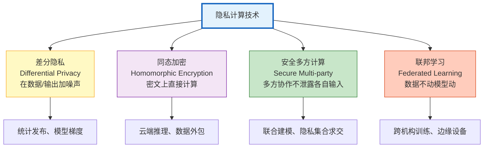

# 隐私计算与联邦学习指南

> 医院有病历数据但不能共享给 AI 公司训练模型、银行有风控数据但不能上传到云端推理。隐私计算让多方在不泄露原始数据的前提下共同训练或推理——数据可用不可见。本指南系统讲解差分隐私、同态加密、安全多方计算、联邦学习四大技术，以及它们在 LLM 场景中的应用。

---

## 1. 隐私计算技术全景

### 四大技术路线



### 技术对比

| 技术 | 原理 | 安全性 | 性能 | 适用场景 |
|------|------|--------|------|---------|
| 差分隐私 | 加噪声 | 统计级 | 快 | 数据发布 |
| 同态加密 | 密文计算 | 密码学级 | 慢 | 云端推理 |
| 安全多方计算 | 秘密分享 | 密码学级 | 中 | 联合建模 |
| 联邦学习 | 分布式训练 | 取决于协议 | 中 | 跨机构训练 |
| 可信执行环境 | 硬件隔离 | 硬件级 | 快 | 云端推理 |

---

## 2. 差分隐私

### 核心概念

```
差分隐私的核心思想：
  对于任何两条只差一条记录的数据集 D 和 D'，
  模型在 D 和 D' 上的输出分布几乎相同。

  → 攻击者无法判断某条记录是否在数据集中
  → 个人信息被"淹没"在噪声中

ε（epsilon）：
  隐私预算，越小越隐私但效用越低
  ε=0: 完全隐私，无用
  ε=∞: 无隐私，最大效用
  实践中：ε=1~10

机制：
  Laplace 机制：在数值输出上加 Laplace 噪声
  Gaussian 机制：加高斯噪声
  指数机制：从候选集中按概率选择
```

### 实践：差分隐私微调

```python
# pip install opacus (PyTorch 差分隐私)

from opacus import PrivacyEngine
from torch.utils.data import DataLoader
from transformers import AutoModelForCausalLM, AutoTokenizer
import torch

def dp_finetune():
    """差分隐私微调 LLM"""
    model = AutoModelForCausalLM.from_pretrained("Qwen/Qwen2.5-7B-Instruct")
    tokenizer = AutoTokenizer.from_pretrained("Qwen/Qwen2.5-7B-Instruct")

    # 准备数据
    optimizer = torch.optim.AdamW(model.parameters(), lr=1e-4)

    # 初始化差分隐私引擎
    privacy_engine = PrivacyEngine()

    model, optimizer, dataloader = privacy_engine.make_private(
        module=model,
        optimizer=optimizer,
        data_loader=DataLoader(train_dataset, batch_size=4),
        noise_multiplier=1.0,      # 噪声大小
        max_grad_norm=1.0,         # 梯度裁剪
        target_epsilon=8.0,        # 目标 ε
        target_delta=1e-5,         # 目标 δ
        epochs=3,
    )

    # 训练过程中每步消耗隐私预算
    for epoch in range(3):
        for batch in dataloader:
            optimizer.zero_grad()
            outputs = model(**batch)
            loss = outputs.loss
            loss.backward()
            optimizer.step()

        # 查看已消耗的隐私预算
        epsilon = privacy_engine.get_epsilon(delta=1e-5)
        print(f"Epoch &#123;epoch&#125;: ε = &#123;epsilon:.2f&#125;")
```

### 差分隐私 RAG

```python
@dataclass
class DPRetriever:
    """差分隐私检索：在检索结果上加噪声保护"""

    async def retrieve_with_dp(self, query: str, top_k: int = 5,
                                 epsilon: float = 2.0) -> list:
        """差分隐私检索"""
        # 1. 正常检索
        results = await vectorstore.similarity_search(query, k=top_k * 2)

        # 2. 对相似度分数加 Laplace 噪声
        noisy_results = []
        for doc, score in results:
            noise = np.random.laplace(0, 1.0 / epsilon)
            noisy_score = score + noise
            noisy_results.append((doc, noisy_score))

        # 3. 按加噪后的分数重新排序
        noisy_results.sort(key=lambda x: x[1], reverse=True)

        # 4. 返回 Top-K（加噪后排序的）
        return [doc for doc, _ in noisy_results[:top_k]]
```

---

## 3. 同态加密

### 概念

```
同态加密：在密文上直接计算，解密结果等于明文计算结果

加密: Enc(a) + Enc(b) = Enc(a + b)   # 加法同态
加密: Enc(a) × Enc(b) = Enc(a × b)   # 乘法同态

类型：
  部分同态（PHE）：只支持一种运算（如加法）
  些许同态（SHE）：支持有限次加法+乘法
  全同态（FHE）：支持任意次加法+乘法（但极慢）

LLM 场景：
  用户加密输入 → 云端在密文上推理 → 返回加密结果 → 用户解密
  云端全程看不到明文
```

### 实践：加密推理

```python
# pip install tenseal (微软同态加密库)

import tenseal as ts

def encrypted_inference_example():
    """同态加密推理示例"""

    # 1. 客户端：创建加密上下文
    context = ts.context(
        ts.SCHEME_TYPE.CKKS,
        poly_modulus_degree=8192,
        coeff_mod_bit_sizes=[60, 40, 40, 60],
    )
    context.generate_galois_keys()

    # 2. 客户端：加密输入数据
    original_data = [1.0, 2.0, 3.0, 4.0]
    encrypted_data = ts.ckks_vector(context, original_data)

    # 3. 发送密文到云端
    # 云端在密文上计算（看不到明文）
    # 例如：密文加法
    encrypted_result = encrypted_data + [1.0, 1.0, 1.0, 1.0]

    # 4. 返回加密结果给客户端
    # 客户端解密
    decrypted_result = encrypted_result.decrypt()
    # [2.0, 3.0, 4.0, 5.0]

    print(f"原始: &#123;original_data&#125;")
    print(f"加密后计算结果: &#123;decrypted_result&#125;")
    # 云端全程看不到 [1.0, 2.0, 3.0, 4.0]
```

### LLM 加密推理架构

```
用户设备：
  明文输入 → 加密 → 发送密文到云端

云端（不可信）：
  密文 → 同态加密推理 → 返回密文结果
  （云端无法看到用户输入或输出内容）

用户设备：
  密文结果 → 解密 → 得到明文回答

限制：
  - 只支持简单运算（矩阵乘法可以但很慢）
  - LLM 推理涉及非线性操作（Softmax/GELU），需要近似
  - 实际部署中通常用混合方案：加密部分运算+明文部分运算
```

---

## 4. 安全多方计算

### 场景：多方联合统计

```python
@dataclass
class SecureMultiParty:
    """安全多方计算：多方协作不泄露各自数据"""

    async def secure_average(self, parties: list, values: list) -> float:
        """安全求平均：各方不知道其他方的值"""
        # 使用秘密分享（Secret Sharing）

        n = len(parties)
        shares = []

        # 1. 每方将自己的值分成 n 份
        for value in values:
            # 生成 n-1 个随机数，最后一份 = 值 - 其他份之和
            random_shares = [np.random.uniform(-1000, 1000) for _ in range(n - 1)]
            last_share = value - sum(random_shares)
            shares.append(random_shares + [last_share])

        # 2. 每方收到所有方的一份，求和
        party_sums = [sum(share[i] for share in shares) for i in range(n)]

        # 3. 合并结果
        total = sum(party_sums)
        average = total / n

        return average

# 使用：三家医院求平均住院天数
smp = SecureMultiParty()
avg = await smp.secure_average(
    parties=["hospital_A", "hospital_B", "hospital_C"],
    values=[5.2, 7.8, 4.5],  # 各医院不知道其他医院的值
)
# avg = 5.83，但每家医院不知道其他医院的原始数据
```

---

## 5. 联邦学习

### 核心原理

```
传统训练：
  所有数据 → 中心服务器训练 → 模型
  问题：数据隐私、传输成本、数据主权

联邦学习：
  每个参与方在本地训练 → 只上传模型梯度 → 中心聚合梯度 → 更新全局模型
  数据不出本地，只共享梯度

类型：
  横向联邦：各方数据格式相同、样本不同（多家医院同类数据）
  纵向联邦：各方数据样本相同、特征不同（银行+电商，同一用户不同维度）
  联邦迁移：数据格式和样本都不同
```

### 联邦学习微调 LLM

```python
# pip install flower (联邦学习框架)

import flwr as fl
from transformers import AutoModelForCausalLM, AutoTokenizer
import torch

class LLMClient(fl.client.NumPyClient):
    """联邦学习 LLM 客户端"""

    def __init__(self, model_name, local_data):
        self.model = AutoModelForCausalLM.from_pretrained(model_name)
        self.tokenizer = AutoTokenizer.from_pretrained(model_name)
        self.local_data = local_data  # 本地私有数据
        self.optimizer = torch.optim.AdamW(self.model.parameters(), lr=1e-4)

    def get_parameters(self):
        """返回模型参数"""
        return [val.cpu().numpy() for val in self.model.state_dict().values()]

    def fit(self, parameters, config):
        """本地训练"""
        # 设置全局模型参数
        params_dict = zip(self.model.state_dict().keys(), parameters)
        state_dict = &#123;k: torch.tensor(v) for k, v in params_dict&#125;
        self.model.load_state_dict(state_dict)

        # 本地训练（数据不出本地）
        self.model.train()
        for epoch in range(config.get("epochs", 1)):
            for batch in self.local_data:
                self.optimizer.zero_grad()
                outputs = self.model(**batch)
                loss = outputs.loss
                loss.backward()
                self.optimizer.step()

        # 返回更新后的参数和样本数
        return self.get_parameters(), len(self.local_data), &#123;&#125;

    def evaluate(self, parameters, config):
        """本地评估"""
        params_dict = zip(self.model.state_dict().keys(), parameters)
        state_dict = &#123;k: torch.tensor(v) for k, v in params_dict&#125;
        self.model.load_state_dict(state_dict)

        self.model.eval()
        loss = 0
        with torch.no_grad():
            for batch in self.local_data:
                outputs = self.model(**batch)
                loss += outputs.loss.item()

        return float(loss), len(self.local_data), &#123;"loss": loss&#125;

# 启动客户端
fl.client.start_client(
    server_address="localhost:8080",
    client=LLMClient("Qwen/Qwen2.5-7B-Instruct", local_train_data).to_client(),
)
```

### 联邦学习聚合策略

```python
# 服务器端：聚合策略
class FedAvgStrategy(fl.server.strategy.FedAvg):
    """FedAvg：联邦平均"""

    def aggregate_fit(self, server_round, results, failures):
        """聚合各客户端的模型更新"""
        # 简单平均：按样本数加权
        total_samples = sum(r[1].num_examples for r in results)
        weighted_params = []

        for r in results:
            weight = r[1].num_examples / total_samples
            params = r[1].parameters
            if not weighted_params:
                weighted_params = [p * weight for p in params]
            else:
                weighted_params = [w + p * weight for w, p in zip(weighted_params, params)]

        return weighted_params, &#123;&#125;

# 安全聚合（Secure Aggregation）
# 客户端上传的梯度被加密，服务器只能看到聚合结果
# 防止服务器通过单个梯度反推用户数据
```

---

## 6. LLM 隐私计算场景

### 场景对比

| 场景 | 推荐技术 | 原因 |
|------|---------|------|
| 跨医院联合训练 | 联邦学习+差分隐私 | 数据不出院 |
| 金融数据云端推理 | 同态加密 | 数据加密后上云 |
| 多方联合统计 | 安全多方计算 | 不泄露各自数据 |
| 数据发布 | 差分隐私 | 防止记录重识别 |
| 边缘设备个性化 | 联邦学习 | 数据留在设备 |
| Agent 工具调用 | 差分隐私+加密 | 保护用户数据 |

### 在 Agent 中应用

```python
@dataclass
class PrivacyPreservingAgent:
    """隐私保护 Agent"""

    async def secure_search(self, query: str, user_context: dict):
        """隐私保护检索"""
        # 1. 对用户查询加差分隐私噪声
        noisy_query = self._add_dp_noise(query, epsilon=2.0)

        # 2. 检索
        results = await vectorstore.similarity_search(noisy_query, k=5)

        # 3. 对结果中的 PII 脱敏
        sanitized_results = [self._sanitize_pii(r.page_content) for r in results]

        return sanitized_results

    def _add_dp_noise(self, text: str, epsilon: float) -> str:
        """对文本查询加噪声（简化版）"""
        # 实际中用 embedding 加噪
        # 这里简化为关键词替换
        words = text.split()
        if len(words) > 3:
            # 随机替换一个非关键词
            replace_idx = np.random.randint(1, len(words) - 1)
            words[replace_idx] = "[REDACTED]"
        return " ".join(words)

    def _sanitize_pii(self, text: str) -> str:
        """PII 脱敏"""
        import re
        text = re.sub(r'\d&#123;11&#125;', '[手机号已隐藏]', text)
        text = re.sub(r'\d&#123;18&#125;', '[身份证已隐藏]', text)
        text = re.sub(r'[\w.-]+@[\w.-]+', '[邮箱已隐藏]', text)
        return text
```

---

## 7. 检查清单

| 检查项 | 状态 |
|--------|------|
| 理解四大隐私计算技术 | ☐ |
| 理解差分隐私 ε/δ 含义 | ☐ |
| 能用 Opacus 做差分隐私微调 | ☐ |
| 理解同态加密原理 | ☐ |
| 理解安全多方计算 | ☐ |
| 能用 Flower 做联邦学习 | ☐ |
| 知道 LLM 场景的隐私方案选型 | ☐ |
| 在 Agent 中实现了隐私保护 | ☐ |

---

## 8. 与其他知识库的关联

| 关联编号 | 文档 | 关系 |
|----------|------|------|
| 39 | 数据隐私与合规 | 隐私合规 |
| 119 | 数据隐私技术 | 隐私技术 |
| 151 | LLM 应用数据隐私技术 | 隐私技术 |
| 181 | 数据脱敏 | 数据脱敏 |
| 213 | LLM 应用数据脱敏与 PII 防护 | PII 防护 |
| 394 | 数据脱敏管道与隐私保护 | 脱敏管道 |
| 424 | 数据脱敏管道与隐私保护 | 脱敏管道 |
| 439 | PEFT 微调与 DPO 对齐 | 微调（可加差分隐私） |
| 447 | AI 伦理与偏见检测 | 伦理 |
