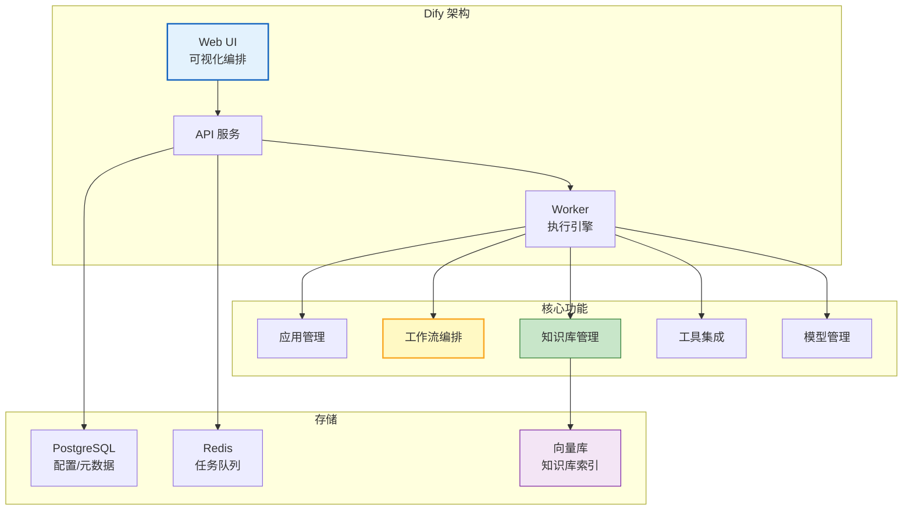

# 低代码 Agent 平台与 Dify/Coze 指南

> 不是每个 Agent 都需要从零写代码。Dify、Coze（扣子）、FastGPT 等低代码平台让产品经理和业务人员通过可视化拖拽就能搭建 Agent。它们和 LangChain/LangGraph 有什么关系？何时用低代码、何时写代码？本指南系统对比主流低代码平台、核心架构、与代码方案的选型。

---

## 1. 低代码 Agent 平台全景

### 为什么要低代码

```
纯代码方案（LangChain/LangGraph）：
  - 完全控制、灵活
  - 但需要 Python 工程师
  - 开发周期：1-2 周
  - 适合：复杂定制需求

低代码方案（Dify/Coze）：
  - 可视化编排、拖拽配置
  - 非技术人员可参与
  - 开发周期：1-2 天
  - 适合：快速原型、标准场景
  - 限制：灵活性受限、平台锁定
```

### 主流平台对比

| 平台 | 出品方 | 定位 | 优势 | 劣势 | 开源 |
|------|--------|------|------|------|------|
| Dify | Dify.AI | 开源 LLMOps | 可自托管、灵活 | 需运维 | ✅ |
| Coze（扣子） | 字节跳动 | 消费级 Agent | 易用、插件生态 | 平台锁定 | ❌ |
| FastGPT | Labring | 知识库 RAG | RAG 体验好 | 功能有限 | ✅ |
| Flowise | 开源 | LangChain 可视化 | 直接用 LangChain | 性能弱 | ✅ |
| n8n | 开源 | 通用自动化 | 集成丰富 | 非AI专用 | ✅ |
| LangFlow | DataStax | LangChain 可视化 | 开源、可自托管 | 较新 | ✅ |

### 选型决策

```
你的场景是什么？

快速搭建对话机器人 → Coze（最易用）
需要自托管 + 数据隐私 → Dify（开源可部署）
专注知识库问答 → FastGPT（RAG 体验好）
需要复杂工作流 → LangFlow / n8n
已有 LangChain 代码想可视化 → Flowise
需要完全定制 → LangChain/LangGraph（写代码）
```

---

## 2. Dify 深度指南

### 架构概览



### Dify 工作流编排

```
Dify Workflow 核心节点：

  开始节点 → LLM 节点 → 条件分支 → 工具节点 → 知识检索 → 结束

  支持的节点类型：
  - LLM：调用大模型
  - 知识检索：RAG 检索
  - 问题分类器：意图分类
  - 条件分支：IF/ELSE
  - 代码执行：Python 沙箱
  - 模板：变量填充
  - 变量聚合：多路输入合并
  - 工具调用：外部 API
  - HTTP 请求：调用任意 URL
  - 参数提取：LLM 提取结构化参数
```

### Dify 自托管部署

```yaml
# docker-compose.yml（简化版）
version: "3.9"
services:
  # Dify API
  api:
    image: langgenius/dify-api:latest
    environment:
      - DB_USERNAME=postgres
      - DB_PASSWORD=difyai
      - DB_HOST=postgres
      - DB_PORT=5432
      - REDIS_HOST=redis
      - SECRET_KEY=your-secret
    ports:
      - "5001:5001"
    depends_on: [postgres, redis]

  # Dify Worker
  worker:
    image: langgenius/dify-api:latest
    environment:
      - MODE=worker
      - DB_USERNAME=postgres
      - DB_PASSWORD=difyai
      - DB_HOST=postgres
      - REDIS_HOST=redis
    depends_on: [postgres, redis]

  # Web UI
  web:
    image: langgenius/dify-web:latest
    ports:
      - "3000:3000"
    depends_on: [api]

  # 向量库
  weaviate:
    image: semitechnologies/weaviate:latest
    environment:
      - AUTHENTICATION_ANONYMOUS_ACCESS_ENABLED=true
    ports:
      - "8080:8080"

  postgres:
    image: postgres:16
    environment:
      - POSTGRES_USER=postgres
      - POSTGRES_PASSWORD=difyai
      - POSTGRES_DB=dify

  redis:
    image: redis:7
```

### Dify 与 LangChain 的关系

```python
# Dify 底层其实用了 LangChain 的部分组件

# Dify 的优势：
# 1. 可视化界面编排（非技术人员可用）
# 2. 内置知识库管理（文档上传→分块→索引→检索 一体化）
# 3. 内置模型管理（多模型切换、负载均衡）
# 4. 内置 Prompt 模板管理
# 5. API 一键发布
# 6. 内置日志和监控

# LangChain/LangGraph 的优势：
# 1. 完全代码控制
# 2. 复杂条件逻辑（Dify 工作流有局限）
# 3. 自定义状态管理
# 4. 检查点/时间旅行
# 5. 人机交互 interrupt
# 6. 嵌入已有系统
```

---

## 3. Coze（扣子）指南

### 核心概念

```
Coze 的核心概念：

Bot（机器人）：
  你的 Agent 实例，配置人设、技能、知识库

Plugin（插件）：
  可调用的外部能力（搜索/天气/数据库/自定义API）
  类似 LangChain 的 Tool

Workflow（工作流）：
  可视化编排多步骤任务
  节点：LLM/代码/条件/数据库/HTTP

Knowledge（知识库）：
  上传文档→自动分块→向量化→RAG检索

Database（数据库）：
  内置表格数据库，Agent 可读写

Trigger（触发器）：
  定时触发/事件触发
```

### Bot 创建流程

```
1. 配置人设（Persona）
   "你是一个专业的产品顾问，帮用户选择合适的手机"

2. 添加技能（Skill）
   - 搜索插件：搜索产品信息
   - 比价插件：查询价格
   - 图片生成：生成产品图

3. 上传知识库（Knowledge）
   - 产品目录 PDF
   - 价格表 Excel
   - FAQ 文档

4. 配置工作流（Workflow）
   用户输入 → 意图识别 → 搜索产品 → 比价 → 推荐

5. 发布渠道
   - 飞书/钉钉
   - 微信公众号
   - 网页嵌入
   - API 调用
```

### Coze vs Dify 详细对比

| 维度 | Dify | Coze |
|------|------|------|
| 部署 | 可自托管 | 仅云端 |
| 开源 | ✅ | ❌ |
| 易用性 | 中 | 高 |
| 插件生态 | 中 | 丰富 |
| 知识库 | 强 | 中 |
| 工作流 | 灵活 | 直观 |
| 模型支持 | 多模型 | 字节系 |
| 发布渠道 | API/Web | 飞书/微信/网页 |
| 数据隐私 | 自托管可控 | 数据在字节 |
| 适合 | 企业自建 | 快速上线 |

---

## 4. 低代码 vs 代码：混合策略

### 何时用什么

| 场景 | 推荐方案 | 原因 |
|------|---------|------|
| 快速验证 POC | Coze/Dify | 1 天出原型 |
| 客服 FAQ 机器人 | Dify/FastGPT | 知识库 RAG 开箱即用 |
| 复杂多步骤推理 | LangGraph | 需要精确控制 |
| 人机交互审批 | LangGraph | interrupt 功能 |
| 多 Agent 协作 | LangGraph | 自定义协调 |
| 内部工具集成 | Dify | HTTP 节点+插件 |
| 对外发布 | Coze | 多渠道发布 |
| 数据敏感 | Dify 自托管 | 数据不离开 |

### 混合使用架构

```python
# Dify 做前端编排 + LangGraph 做后端引擎

"""
架构：
  用户 → Dify（知识库/界面/API管理）
            → HTTP 节点调用 LangGraph API
            → LangGraph 执行复杂逻辑
            → 返回结果给 Dify
            → Dify 格式化返回用户
"""

# Dify 工作流中的 HTTP 节点配置：
"""
节点: HTTP 请求
方法: POST
URL: http://your-langgraph-service:8000/chat
Body:
&#123;
  "query": "&#123;&#123;user_input&#125;&#125;",
  "session_id": "&#123;&#123;conversation_id&#125;&#125;"
&#125;
"""

# LangGraph 端提供 API
from fastapi import FastAPI
from fastapi.responses import StreamingResponse

app = FastAPI()

@app.post("/chat")
async def chat(request: dict):
    """供 Dify 调用的 LangGraph API"""
    async def stream():
        async for event in agent.astream_events(
            &#123;"messages": [&#123;"role": "user", "content": request["query"]&#125;]&#125;,
            version="v2",
        ):
            if event["event"] == "on_chat_model_stream":
                chunk = event["data"]["chunk"]
                if chunk.content:
                    yield f"data: &#123;chunk.content&#125;\n\n"

    return StreamingResponse(stream(), media_type="text/event-stream")
```

---

## 5. Dify API 调用

```python
# Dify 发布后可通过 API 调用
import requests

DIFY_API_URL = "http://localhost:5001/v1"
DIFY_API_KEY = "app-xxx"

# === 对话型应用 ===
response = requests.post(
    f"&#123;DIFY_API_URL&#125;/chat-messages",
    headers=&#123;
        "Authorization": f"Bearer &#123;DIFY_API_KEY&#125;",
        "Content-Type": "application/json",
    &#125;,
    json=&#123;
        "query": "什么是 LangChain？",
        "user": "user_001",
        "inputs": &#123;&#125;,  # 变量
    &#125;,
    stream=True,  # 流式
)

for line in response.iter_lines():
    if line:
        data = json.loads(line)
        if data.get("event") == "message":
            print(data["answer"], end="", flush=True)

# === 工作流型应用 ===
response = requests.post(
    f"&#123;DIFY_API_URL&#125;/workflows/run",
    headers=&#123;"Authorization": f"Bearer &#123;DIFY_API_KEY&#125;"&#125;,
    json=&#123;
        "inputs": &#123;
            "query": "分析这份合同的风险",
            "document": "合同内容..."
        &#125;,
        "user": "user_001",
    &#125;,
)
```

---

## 6. 检查清单

| 检查项 | 状态 |
|--------|------|
| 理解低代码 vs 代码的选型 | ☐ |
| 能区分 Dify/Coze/FastGPT 的定位 | ☐ |
| 能用 Docker 部署 Dify | ☐ |
| 能在 Dify 中编排工作流 | ☐ |
| 能在 Coze 中创建 Bot | ☐ |
| 能通过 API 调用 Dify 应用 | ☐ |
| 能实现 Dify+LangGraph 混合架构 | ☐ |
| 知道何时选哪个平台 | ☐ |

---

## 7. 与其他知识库的关联

| 关联编号 | 文档 | 关系 |
|----------|------|------|
| 02 | LangChain 入门 | 代码方案基础 |
| 09 | LangGraph 入门 | 代码方案进阶 |
| 120 | LangGraph 部署与 Studio | LangGraph 可视化 |
| 126 | LLM 框架竞品对比 | 框架对比 |
| 137 | LLM 网关与多模型 API 管理 | 模型管理 |
| 164 | LLM 应用架构模式全集 | 架构模式 |
| 189 | Agent 工作流引擎设计 | 工作流引擎 |
| 307 | 编排引擎 | 编排设计 |
| 441 | LangGraph Platform 部署 | Platform 部署 |
