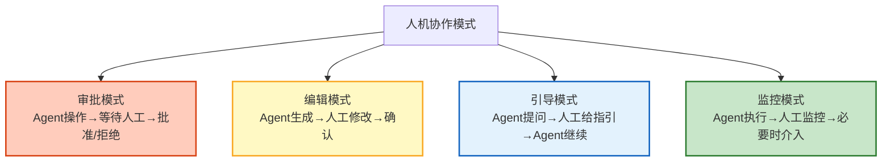

# 人机协作与 Human-in-the-Loop 深度指南

> Agent 自主性越强，越需要人类把关。发邮件前要人确认、大额转账要人审批、危险操作要人复核——这些都需要 Human-in-the-Loop（HITL）。本指南系统讲解 HITL 的四种模式、风险分级审批、多审批者协调、超时降级策略，以及 LangGraph interrupt 的完整实现。

---

## 1. HITL 的四种模式

### 模式分类



### 模式选择

| 模式 | 适用场景 | 人工负担 | 自动化程度 |
|------|---------|---------|-----------|
| 审批 | 危险操作（转账/删除/发布） | 高 | 低 |
| 编辑 | 内容生成（报告/邮件） | 中 | 中 |
| 引导 | 复杂决策（策略/方案） | 中 | 中 |
| 监控 | 常规自动化（数据处理） | 低 | 高 |

---

## 2. 风险分级审批

### 风险评估

```python
from dataclasses import dataclass
from enum import Enum

class RiskLevel(Enum):
    LOW = "low"         # 无需审批
    MEDIUM = "medium"   # 单人审批
    HIGH = "high"       # 双人审批
    CRITICAL = "critical" # 三人审批 + 超管

@dataclass
class RiskAssessor:
    """操作风险评估器"""

    def assess(self, action: str, target: str, impact: dict) -> RiskLevel:
        """评估操作风险等级"""
        score = 0

        # 操作类型权重
        high_risk_actions = ["delete", "transfer", "publish", "execute", "send"]
        if any(a in action.lower() for a in high_risk_actions):
            score += 3

        # 影响范围
        if impact.get("affected_users", 0) > 100:
            score += 3
        elif impact.get("affected_users", 0) > 10:
            score += 2

        # 金额影响
        amount = impact.get("amount", 0)
        if amount > 10000:
            score += 3
        elif amount > 1000:
            score += 2
        elif amount > 100:
            score += 1

        # 可逆性
        if not impact.get("reversible", True):
            score += 2

        if score >= 8:
            return RiskLevel.CRITICAL
        elif score >= 5:
            return RiskLevel.HIGH
        elif score >= 3:
            return RiskLevel.MEDIUM
        return RiskLevel.LOW

    def get_approval_config(self, risk: RiskLevel) -> dict:
        """获取审批配置"""
        configs = &#123;
            RiskLevel.LOW: &#123;"approvers": 0, "timeout": 0, "auto_approve": True&#125;,
            RiskLevel.MEDIUM: &#123;"approvers": 1, "timeout": 300, "auto_approve": False&#125;,
            RiskLevel.HIGH: &#123;"approvers": 2, "timeout": 600, "auto_approve": False&#125;,
            RiskLevel.CRITICAL: &#123;"approvers": 3, "timeout": 1800, "auto_approve": False&#125;,
        &#125;
        return configs[risk]
```

---

## 3. LangGraph interrupt 实现

### 基础 interrupt 模式

```python
from langgraph.graph import StateGraph, START, END
from langgraph.types import interrupt, Command
from typing import TypedDict

class HITLState(TypedDict):
    task: str
    draft: str              # Agent 生成的草稿
    risk_level: str          # 风险等级
    approval_status: str     # pending | approved | rejected
    approver: str            # 审批者
    approval_comment: str    # 审批意见
    final_result: str        # 最终结果

async def generate_node(state: HITLState):
    """Agent 生成草稿"""
    llm = ChatOpenAI(model="gpt-4o", temperature=0.7)
    response = await llm.ainvoke(
        f"根据以下任务生成执行方案：\n&#123;state['task']&#125;"
    )

    # 评估风险
    risk = RiskAssessor().assess(
        action="publish",
        target="external",
        impact=&#123;"affected_users": 50, "reversible": False&#125;
    )

    return &#123;
        "draft": response.content,
        "risk_level": risk.value,
        "approval_status": "pending",
    &#125;

async def human_review_node(state: HITLState):
    """人工审批节点"""
    if state["risk_level"] == "low":
        return &#123;"approval_status": "approved", "approver": "auto"&#125;

    # interrupt：暂停执行，等待人工输入
    review_result = interrupt(&#123;
        "type": "approval_required",
        "task": state["task"],
        "draft": state["draft"],
        "risk_level": state["risk_level"],
        "message": f"风险等级: &#123;state['risk_level']&#125;，请审批",
        "options": ["approve", "reject", "edit"],
    &#125;)

    # review_result 来自人工提交
    return &#123;
        "approval_status": review_result.get("decision", "rejected"),
        "approver": review_result.get("approver", ""),
        "approval_comment": review_result.get("comment", ""),
        "draft": review_result.get("modified_draft", state["draft"]),  # 可能被修改
    &#125;

async def execute_node(state: HITLState):
    """执行"""
    if state["approval_status"] != "approved":
        return &#123;"final_result": "操作被拒绝"&#125;

    # 执行操作
    result = await execute_action(state["draft"])
    return &#123;"final_result": result&#125;

def route_after_review(state: HITLState):
    if state["approval_status"] == "approved":
        return "execute"
    return END

# 构建图
graph = StateGraph(HITLState)
graph.add_node("generate", generate_node)
graph.add_node("review", human_review_node)
graph.add_node("execute", execute_node)

graph.add_edge(START, "generate")
graph.add_edge("generate", "review")
graph.add_conditional_edges("review", route_after_review, &#123;
    "execute": "execute",
    END: END,
&#125;)
graph.add_edge("execute", END)

hitl_app = graph.compile()
```

### 多审批者协调

```python
@dataclass
class MultiApprover:
    """多审批者协调"""

    async def require_approvals(self, draft: str, risk: str,
                                  required_count: int) -> dict:
        """需要多人审批"""
        if risk == "low" or required_count == 0:
            return &#123;"approved": True, "approvers": ["auto"]&#125;

        # 发起多轮审批
        approvals = []
        for i in range(required_count):
            result = interrupt(&#123;
                "type": "multi_approval",
                "round": i + 1,
                "total_rounds": required_count,
                "draft": draft,
                "previous_approvals": approvals,
                "message": f"第 &#123;i+1&#125;/&#123;required_count&#125; 位审批者请审核",
            &#125;)

            if result.get("decision") == "reject":
                return &#123;"approved": False, "reason": f"第&#123;i+1&#125;位审批者拒绝", "approver": result.get("approver")&#125;

            approvals.append(result.get("approver"))

        return &#123;"approved": True, "approvers": approvals&#125;
```

### 超时降级

```python
import asyncio

async def review_with_timeout(state: HITLState, timeout: int = 300):
    """带超时的审批"""
    try:
        # interrupt 会暂停执行
        # 外部需要在超时后自动提交
        review = interrupt(&#123;"type": "approval", "timeout": timeout&#125;)
        return review
    except Exception:
        pass

    # 超时处理逻辑
    if state["risk_level"] in ("medium", "high"):
        # 中高风险：超时自动拒绝
        return &#123;"decision": "reject", "reason": "审批超时自动拒绝"&#125;
    else:
        # 低风险：超时自动通过
        return &#123;"decision": "approve", "reason": "审批超时自动通过"&#125;


# 在 LangGraph 中配置超时
# 客户端调用时设置 timeout
"""
result = await app.ainvoke(
    input_state,
    config=&#123;"configurable": &#123;"thread_id": "task-001"&#125;,
            "recursion_limit": 10,
            "timeout": 300&#125;,  # 5分钟超时
)
"""
```

---

## 4. 编辑模式实现

```python
async def edit_and_confirm_node(state: HITLState):
    """编辑模式：Agent 生成 → 人工编辑 → 确认"""
    # Agent 生成初稿
    llm = ChatOpenAI(model="gpt-4o", temperature=0.7)
    draft = await llm.ainvoke(f"生成邮件：&#123;state['task']&#125;")

    # interrupt：让用户编辑
    edit_result = interrupt(&#123;
        "type": "edit_required",
        "draft": draft.content,
        "instruction": "请审阅并修改以下内容",
        "editable": True,
    &#125;)

    # 用户可能修改了内容
    final_content = edit_result.get("content", draft.content)
    confirmed = edit_result.get("confirmed", False)

    return &#123;
        "draft": final_content,
        "approval_status": "approved" if confirmed else "rejected",
    &#125;
```

---

## 5. 引导模式实现

```python
async def guided_decision_node(state: HITLState):
    """引导模式：Agent 遇到不确定时向人求助"""
    llm = ChatOpenAI(model="gpt-4o", temperature=0)

    # Agent 分析任务
    analysis = await llm.ainvoke(
        f"分析任务，识别需要人工决策的关键点：\n&#123;state['task']&#125;"
    )

    # 如果有不确定的关键点
    if "需要确认" in analysis.content or "不确定" in analysis.content:
        # interrupt：向人工请求指引
        guidance = interrupt(&#123;
            "type": "guidance_required",
            "task": state["task"],
            "analysis": analysis.content,
            "questions": ["应该优先考虑成本还是质量？", "时间限制是什么？"],
        &#125;)

        # 人工给了指引，Agent 继续
        state["guidance"] = guidance.get("answers", &#123;&#125;)

    # Agent 基于指引继续执行
    response = await llm.ainvoke(
        f"基于以下指引执行任务：\n任务: &#123;state['task']&#125;\n指引: &#123;state.get('guidance', &#123;&#125;)&#125;"
    )

    return &#123;"draft": response.content&#125;
```

---

## 6. 监控模式实现

```python
@dataclass
class MonitoringMode:
    """监控模式：Agent 执行，人工旁观，必要时介入"""

    async def monitored_execute(self, steps: list, monitor_interval: float = 2.0):
        """带监控的执行"""
        results = []

        for i, step in enumerate(steps):
            # 每步执行后报告
            result = await execute_step(step)
            results.append(&#123;"step": i, "result": result&#125;)

            # 检查是否需要人工介入
            if self._needs_intervention(result):
                # interrupt：请求人工检查
                intervention = interrupt(&#123;
                    "type": "monitoring_alert",
                    "step": i,
                    "result": str(result)[:500],
                    "message": "检测到异常，请确认是否继续",
                    "options": ["continue", "stop", "modify"],
                &#125;)

                if intervention.get("decision") == "stop":
                    break
                elif intervention.get("decision") == "modify":
                    # 修改后继续
                    step = intervention.get("modified_step", step)

            await asyncio.sleep(monitor_interval)

        return results

    def _needs_intervention(self, result) -> bool:
        """检查是否需要人工介入"""
        if isinstance(result, dict):
            if result.get("error"):
                return True
            if result.get("confidence", 1.0) < 0.5:
                return True
        return False
```

---

## 7. 审批通知

```python
@dataclass
class ApprovalNotifier:
    """审批通知系统"""

    async def notify(self, approval_request: dict, channels: list = None):
        """发送审批通知"""
        channels = channels or ["slack", "email"]

        message = f"""🔔 审批请求

任务: &#123;approval_request.get('task', '')&#125;
风险等级: &#123;approval_request.get('risk_level', 'unknown')&#125;
需要审批者: &#123;approval_request.get('required_count', 1)&#125; 人
超时: &#123;approval_request.get('timeout', 300)&#125;秒

草稿摘要:
&#123;approval_request.get('draft', '')[:200]&#125;...

请通过审批面板处理。"""

        if "slack" in channels:
            await self._send_slack(message)
        if "email" in channels:
            await self._send_email(approval_request.get("approvers", []), message)
        if "webhook" in channels:
            await self._send_webhook(approval_request)

    async def _send_slack(self, message: str):
        """发送 Slack 通知"""
        # 实际集成 Slack Webhook
        pass

    async def _send_email(self, recipients: list, message: str):
        """发送邮件通知"""
        pass
```

---

## 8. 检查清单

| 检查项 | 状态 |
|--------|------|
| 理解四种 HITL 模式 | ☐ |
| 实现了风险分级评估 | ☐ |
| 实现了 interrupt 审批流程 | ☐ |
| 实现了多审批者协调 | ☐ |
| 实现了超时降级策略 | ☐ |
| 实现了编辑模式 | ☐ |
| 实现了引导模式 | ☐ |
| 实现了监控模式 | ☐ |
| 配置了审批通知 | ☐ |

---

## 9. 与其他知识库的关联

| 关联编号 | 文档 | 关系 |
|----------|------|------|
| 03 | 代码审查助手 | HITL 案例 |
| 09 | 自动化工作流 Agent | interrupt 实战 |
| 09 | 自动化工作流 Agent 实战 | interrupt |
| 127 | LangGraph Command API | resume/goto |
| 127 | LangGraph Command API 与高级状态管理 | interrupt |
| 378 | LangGraph 中断与人机交互 | interrupt 基础 |
| 408 | LangGraph 中断与人机交互指南 | interrupt 深度 |
| 441 | LangGraph Platform 部署 | Platform HITL |
| 444 | Agent 可解释性与 XAI | 人类控制 |
