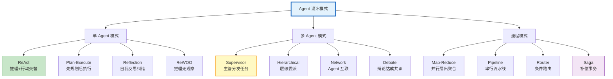

# Agent 设计模式与参考架构指南

> 建过几个 Agent 后你会发现：ReAct、Plan-Execute、Reflection、Supervisor 这些模式反复出现。它们就是 Agent 的"设计模式"——经过验证的架构套路。本指南系统梳理 12 种 Agent 设计模式、每种模式的适用场景与代码实现，以及如何组合使用。

---

## 1. Agent 设计模式全景

### 12 种核心模式



---

## 2. 单 Agent 模式

### ReAct（推理+行动）

```python
# ReAct: Thought → Action → Observation → Thought → ...

"""
循环：
  1. Thought: "用户问天气，我需要查天气工具"
  2. Action: 调用 get_weather("北京")
  3. Observation: "北京 25°C 晴"
  4. Thought: "有结果了，可以回答了"
  5. Final Answer: "北京今天25度晴"

适用：通用问答、工具调用
优势：简单、灵活、可观察推理过程
劣势：可能陷入循环、每步都调 LLM
"""

# LangGraph 中用 create_react_agent 直接实现
from langgraph.prebuilt import create_react_agent
agent = create_react_agent(model, tools)
```

### Plan-Execute（规划-执行）

```python
from langgraph.graph import StateGraph, START, END
from typing import TypedDict

class PlanExecuteState(TypedDict):
    query: str
    plan: list            # 步骤列表
    current_step: int
    results: dict
    final_answer: str

async def plan_node(state: PlanExecuteState):
    """规划阶段：分解任务为步骤"""
    llm = ChatOpenAI(model="o3-mini", reasoning_effort="medium")
    response = await llm.ainvoke(
        f"将以下任务分解为 3-7 个可执行步骤，返回 JSON 列表。\n任务: &#123;state['query']&#125;"
    )
    steps = json.loads(response.content)
    return &#123;"plan": steps, "current_step": 0&#125;

async def execute_step_node(state: PlanExecuteState):
    """执行单个步骤"""
    step_idx = state["current_step"]
    step = state["plan"][step_idx]

    llm = ChatOpenAI(model="gpt-4o-mini")
    response = await llm.ainvoke(f"执行步骤: &#123;step&#125;")

    results = state.get("results", &#123;&#125;)
    results[step_idx] = response.content

    return &#123;"results": results, "current_step": step_idx + 1&#125;

async def synthesize_node(state: PlanExecuteState):
    """综合所有步骤结果"""
    llm = ChatOpenAI(model="gpt-4o")
    all_results = "\n".join([f"步骤&#123;i&#125;: &#123;r&#125;" for i, r in state["results"].items()])
    response = await llm.ainvoke(
        f"基于以下步骤结果回答原始问题。\n问题: &#123;state['query']&#125;\n结果:\n&#123;all_results&#125;"
    )
    return &#123;"final_answer": response.content&#125;

def should_continue(state: PlanExecuteState):
    if state["current_step"] < len(state["plan"]):
        return "execute"
    return "synthesize"

graph = StateGraph(PlanExecuteState)
graph.add_node("plan", plan_node)
graph.add_node("execute", execute_step_node)
graph.add_node("synthesize", synthesize_node)
graph.add_edge(START, "plan")
graph.add_edge("plan", "execute")
graph.add_conditional_edges("execute", should_continue, &#123;
    "execute": "execute", "synthesize": "synthesize"
&#125;)
graph.add_edge("synthesize", END)
plan_execute_agent = graph.compile()

# 适用：复杂多步任务（研究报告、数据分析）
# 优势：结构化、可追踪
# 劣势：规划可能不准、步骤间可能依赖
```

### Reflection（反思纠错）

```python
class ReflectionState(TypedDict):
    query: str
    draft: str
    critique: str
    revised: str
    iterations: int

async def generate_node(state: ReflectionState):
    llm = ChatOpenAI(model="gpt-4o", temperature=0.7)
    response = await llm.ainvoke(state["query"])
    return &#123;"draft": response.content&#125;

async def critique_node(state: ReflectionState):
    llm = ChatOpenAI(model="gpt-4o", temperature=0)
    response = await llm.ainvoke(
        f"批评以下回答的不足之处，指出具体问题：\n\n&#123;state['draft']&#125;\n\n原始问题: &#123;state['query']&#125;"
    )
    return &#123;"critique": response.content&#125;

async def revise_node(state: ReflectionState):
    llm = ChatOpenAI(model="gpt-4o", temperature=0.7)
    response = await llm.ainvoke(
        f"根据批评意见修改回答。\n\n原回答: &#123;state['draft']&#125;\n批评: &#123;state['critique']&#125;\n原始问题: &#123;state['query']&#125;"
    )
    return &#123;"revised": response.content, "iterations": state.get("iterations", 0) + 1&#125;

def should_reflect(state: ReflectionState):
    if state.get("iterations", 0) < 2:
        return "continue"
    return "done"

# 适用：高质量写作、代码生成
# 优势：自我改进、质量提升
# 劣势：成本翻倍（多次 LLM 调用）
```

---

## 3. 多 Agent 模式

### Supervisor（主管模式）

```python
"""
架构：
  Supervisor（主管）→ 分发任务给 → 专业 Agent
  主管收集结果 → 综合 → 返回

适用：客服分诊、多角色协作
"""

@dataclass
class SupervisorPattern:
    """主管模式"""
    agents: dict  # &#123;"search": search_agent, "code": code_agent, "write": write_agent&#125;

    async def run(self, query: str) -> str:
        llm = ChatOpenAI(model="gpt-4o-mini", temperature=0)

        # 1. 主管判断该交给谁
        agent_names = list(self.agents.keys())
        response = await llm.ainvoke(
            f"选择处理以下问题的 Agent（&#123;agent_names&#125;）。只回答名称。\n问题: &#123;query&#125;"
        )
        agent_name = response.content.strip()

        # 2. 交给对应 Agent
        if agent_name in self.agents:
            result = await self.agents[agent_name].ainvoke(query)
        else:
            result = "无法处理"

        # 3. 主管综合
        final = await llm.ainvoke(f"整理以下结果给用户:\n&#123;result&#125;")
        return final.content
```

### Hierarchical（层级委派）

```python
"""
架构：
  CEO Agent → 部门主管 Agent → 执行 Agent

  例：
  CEO("规划产品") → 
    主管A("设计") → 设计师 Agent
    主管B("开发") → 开发者 Agent
    主管C("测试") → 测试员 Agent
"""

# 适用：大型项目、模拟组织
# 优势：层级清晰、可扩展
# 劣势：延迟高、成本高
```

### Debate（辩论模式）

```python
"""
架构：
  Agent A（正方）↔ Agent B（反方）→ 仲裁 Agent → 结论

适用：多角度分析、风险评估
"""

async def debate_pattern(topic: str, rounds: int = 3) -> str:
    pro_agent = ChatOpenAI(model="gpt-4o", temperature=0.7)
    con_agent = ChatOpenAI(model="gpt-4o", temperature=0.7)
    judge = ChatOpenAI(model="gpt-4o", temperature=0)

    pro_arg = f"请支持以下观点: &#123;topic&#125;"
    con_arg = ""

    for i in range(rounds):
        pro_response = await pro_agent.ainvoke(
            f"正方第&#123;i+1&#125;轮辩论。对方观点: &#123;con_arg&#125;\n请反驳并阐述你的论点。"
        )
        pro_arg = pro_response.content

        con_response = await con_agent.ainvoke(
            f"反方第&#123;i+1&#125;轮辩论。对方观点: &#123;pro_arg&#125;\n请反驳并阐述你的论点。"
        )
        con_arg = con_response.content

    # 仲裁
    verdict = await judge.ainvoke(
        f"仲裁以下辩论:\n正方: &#123;pro_arg&#125;\n反方: &#123;con_arg&#125;\n给出结论。"
    )
    return verdict.content
```

---

## 4. 流程模式

### Map-Reduce（并行扇出聚合）

```python
"""
架构：
  输入 → 拆分为 N 个子任务 → 并行执行 → 聚合结果

适用：批量处理、多文档分析
"""

async def map_reduce_pattern(documents: list, query: str) -> str:
    # Map: 并行处理每个文档
    llm = ChatOpenAI(model="gpt-4o-mini")
    tasks = [llm.ainvoke(f"分析文档:\n&#123;doc[:2000]&#125;\n问题: &#123;query&#125;") for doc in documents]
    results = await asyncio.gather(*tasks)

    # Reduce: 聚合
    combined = "\n---\n".join([r.content for r in results])
    final = await llm.ainvoke(f"综合以下分析结果:\n&#123;combined&#125;")
    return final.content
```

### Saga（补偿事务）

```python
"""
架构：
  Step1 → Step2 → Step3
  如果 Step3 失败 → 补偿 Step2 → 补偿 Step1

适用：多步骤事务性操作（预订/支付/审批）
已在知识库 429 中详细实现
"""

# 适用：需要原子性的多步操作
# 优势：保证最终一致性
# 劣势：补偿逻辑复杂
```

### Router（条件路由）

```python
"""
架构：
  输入 → 分类器 → 路由到不同处理分支

适用：多意图系统（客服/技术/销售分流）
"""

async def router_pattern(query: str) -> str:
    # 分类
    classifier = ChatOpenAI(model="gpt-4o-mini", temperature=0)
    result = await classifier.ainvoke(
        f"分类问题类型（tech/sales/support/general）: &#123;query&#125;"
    )
    category = result.content.strip()

    # 路由
    handlers = &#123;
        "tech": tech_agent,
        "sales": sales_agent,
        "support": support_agent,
        "general": general_agent,
    &#125;
    handler = handlers.get(category, general_agent)
    return await handler.ainvoke(query)
```

---

## 5. 模式选型矩阵

| 需求 | 推荐模式 | 备选 |
|------|---------|------|
| 通用问答+工具 | ReAct | Plan-Execute |
| 复杂多步任务 | Plan-Execute | ReWOO |
| 高质量输出 | Reflection | Debate |
| 多角色协作 | Supervisor | Hierarchical |
| 多角度分析 | Debate | Map-Reduce |
| 批量处理 | Map-Reduce | Pipeline |
| 多意图分流 | Router | Supervisor |
| 事务性操作 | Saga | Pipeline |
| 大型项目 | Hierarchical | Supervisor |

---

## 6. 模式组合

```python
# 常见组合：Plan-Execute + Reflection
# 规划→执行→反思→修正

# 常见组合：Supervisor + ReAct
# 主管分发→每个专员用 ReAct 执行

# 常见组合：Router + Map-Reduce
# 分类→拆分→并行处理→聚合

# 组合示例：Supervisor + Plan-Execute + Reflection
async def complex_agent(query: str):
    # 1. Supervisor 判断
    agent = supervisor.select_agent(query)

    # 2. Plan-Execute 分步执行
    plan = await planner.create_plan(query)
    results = []
    for step in plan:
        result = await agent.execute(step)
        results.append(result)

    # 3. Reflection 反思修正
    draft = synthesizer.combine(results)
    critique = reflector.critique(draft, query)
    final = reflector.revise(draft, critique)

    return final
```

---

## 7. 检查清单

| 检查项 | 状态 |
|--------|------|
| 理解 12 种设计模式 | ☐ |
| 能实现 ReAct 模式 | ☐ |
| 能实现 Plan-Execute 模式 | ☐ |
| 能实现 Reflection 模式 | ☐ |
| 能实现 Supervisor 模式 | ☐ |
| 能实现 Map-Reduce 模式 | ☐ |
| 能实现 Router 模式 | ☐ |
| 知道何时用哪种模式 | ☐ |
| 能组合多种模式 | ☐ |

---

## 8. 与其他知识库的关联

| 关联编号 | 文档 | 关系 |
|----------|------|------|
| 04 | Agent 工作原理 | Agent 基础 |
| 129 | Agent 工作流模式全集 | 工作流模式 |
| 157 | 多 Agent 协调模式与拓扑 | 协调模式 |
| 164 | LLM 应用架构模式全集 | 架构模式 |
| 194 | 设计模式图解 | 设计模式 |
| 226 | 设计模式全集 | 设计模式 |
| 243 | 工具链编排 | 工具编排 |
| 307 | 编排引擎 | 编排引擎 |
| 437 | OpenAI Agents SDK | Handoff 模式 |
