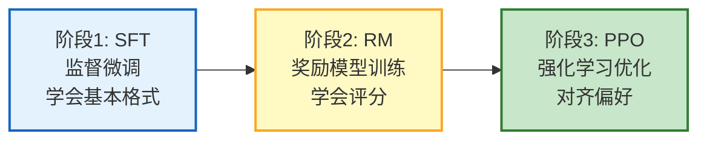

# 强化学习与 RLHF 对齐指南

> DPO 让你跳过了奖励模型，但理解 RLHF 的原理仍然重要——为什么模型会"幻觉"？为什么 RLHF 后模型变"安全"但有时过度拒绝？RLHF 的三个阶段（SFT→RM→PPO）到底做了什么？本指南系统讲解强化学习基础、RLHF 全流程、PPO/DPO/ORPO 对比，以及它们对 Agent 行为的影响。

---

## 1. 强化学习基础

### 核心概念

```
强化学习（RL）：
  Agent 在环境中通过试错学习，最大化累积奖励

关键概念：
  - 状态（State）：当前情况
  - 动作（Action）：Agent 的选择
  - 奖励（Reward）：环境反馈
  - 策略（Policy）：状态→动作的映射
  - 价值函数（Value）：长期预期收益

LLM 中的对应：
  - 状态 = Prompt + 已生成内容
  - 动作 = 下一个 Token
  - 奖励 = 人类偏好评分
  - 策略 = LLM 本身
```

### 为什么 LLM 需要 RL

```
SFT（监督微调）的问题：
  - 只学"应该说什么"（模仿标准答案）
  - 不知道"什么更好"（无法区分质量）
  - 可能学到训练数据中的坏模式

RL 解决的问题：
  - 通过奖励信号学习"什么更好"
  - 可以优化无法用损失函数表达的指标
  - 能让模型对齐人类偏好
```

---

## 2. RLHF 三阶段



### 阶段1：SFT（监督微调）

```
输入：instruction → 标准答案（output）
目标：让模型学会基本格式和领域知识

数据示例：
  &#123;"instruction": "写一首诗", "output": "春风拂面..."&#125;
  &#123;"instruction": "解释 RAG", "output": "RAG 是..."&#125;

结果：模型能回答了，但质量参差不齐
```

### 阶段2：RM（奖励模型）

```python
# 训练奖励模型：让模型学会给回答打分

"""
数据格式（偏好对）：
  prompt: "如何学 Python？"
  chosen: "建议从基础语法开始，配合项目练习..."  ← 更好的回答
  rejected: "看教程就行了。"  ← 较差的回答

奖励模型学习：
  RM(prompt, chosen) > RM(prompt, rejected)

损失函数（Bradley-Terry）：
  L = -log(sigmoid(RM(chosen) - RM(rejected)))
"""
```

### 阶段3：PPO（强化学习优化）

```python
# PPO: 用奖励模型指导原始模型优化

"""
流程：
  1. 原始模型生成回答
  2. 奖励模型评分
  3. 用评分更新原始模型策略
  4. KL 散度约束（防止偏离太远）

关键公式：
  目标 = 奖励 - β × KL(新策略 || 参考策略)
  β = KL 惩罚系数（防止模型为了高奖励"走捷径"）
"""
```

---

## 3. DPO 简化方案

### DPO 原理

```
DPO（Direct Preference Optimization）：
  跳过奖励模型和 PPO，直接用偏好数据优化模型

为什么能跳过：
  RLHF 的目标函数可以数学变换为一个无需奖励模型的等价形式
  → 直接用偏好对训练，不需要 RM 中间步骤

DPO 损失：
  L = -log(σ(β × (log π(chosen)/π_ref(chosen) - log π(rejected)/π_ref(rejected))))

  σ: sigmoid
  β: 温度参数
  π: 当前模型
  π_ref: 参考模型（SFT 后的原始模型）
```

### RLHF vs DPO 对比

| 维度 | RLHF (PPO) | DPO |
|------|-----------|-----|
| 需要奖励模型 | 是 | 否 |
| 需要强化学习 | 是 | 否 |
| 训练稳定性 | 较差（PPO 超参敏感） | 好 |
| 实现复杂度 | 高 | 低 |
| 显存需求 | 高（3 个模型同存） | 中（2 个模型） |
| 效果 | 略好 | 接近 |
| 在线/离线 | 在线（生成+评分） | 离线（只用已有数据） |
| 探索能力 | 有（能探索新策略） | 无（只在已有数据上优化） |

---

## 4. ORPO 与其他变体

```python
"""
ORPO（Odds Ratio Preference Optimization）：
  更新的方法，不需要参考模型
  将 SFT 和偏好对齐合为一步

优势：
  - 不需要参考模型（省一半显存）
  - SFT + 对齐一步完成
  - 训练更快

其他变体：
  KTO（Kahneman-Tversky Optimization）：
    不需要成对数据，只需要"好/坏"标签
  
  IPO（Identity Preference Optimization）：
    解决 DPO 过拟合问题
  
  SimPO（Simple Preference Optimization）：
    去除参考模型，用长度归一化
"""
```

### 方法选型

```
有偏好对数据（chosen/rejected）：
  → DPO（推荐，简单有效）
  → RLHF（追求极致效果且有资源）

只有好/坏标签：
  → KTO

想一步完成 SFT+对齐：
  → ORPO

追求简单：
  → SimPO
```

---

## 5. RLHF 对 Agent 的影响

### RLHF 的副作用

```
过度对齐（Over-alignment）：
  RLHF 后模型可能变得过于"安全"
  - 拒绝无害请求（"写一首关于战争的诗歌" → 拒绝）
  - 回答过于模板化
  - 失去创意

原因：
  - 标注者偏向"安全"选择
  - PPO 过度优化奖励
  - KL 惩罚不够

解决：
  - 增加多样性训练数据
  - 调整 KL 系数
  - DPO 通常比 PPO 过度对齐少
```

### Agent 场景的对齐

```python
@dataclass
class AgentAlignment:
    """Agent 对齐实践"""

    # Agent 特有的对齐维度
    alignment_dimensions = &#123;
        "helpfulness": "回答有帮助、切题",
        "harmlessness": "不产生有害内容",
        "honesty": "不编造、承认不确定",
        "tool_safety": "不执行危险操作",
        "boundary_respect": "不越权操作",
    &#125;

    async def collect_feedback(self, interaction: dict) -> dict:
        """收集 Agent 行为反馈"""
        return &#123;
            "prompt": interaction["query"],
            "response": interaction["response"],
            "tool_calls": interaction.get("tool_calls", []),
            "feedback": &#123;
                "helpful": interaction.get("rating", 3) >= 4,
                "safe": interaction.get("flagged", False) is False,
                "correct_tool": interaction.get("tool_correct", True),
            &#125;,
        &#125;

    async def create_preference_pair(self, good: dict, bad: dict) -> dict:
        """创建偏好对"""
        return &#123;
            "prompt": good["query"],
            "chosen": good["response"],
            "rejected": bad["response"],
            "metadata": &#123;
                "good_rating": good.get("rating"),
                "bad_rating": bad.get("rating"),
            &#125;,
        &#125;
```

---

## 6. 实践建议

### 什么时候需要 RLHF/DPO

```
不需要（Prompt 工程足够）：
  - 格式控制
  - 角色设定
  - 简单指令遵循

需要 SFT：
  - 领域知识
  - 固定输出格式
  - 风格学习

需要 DPO：
  - SFT 后仍有偏好问题
  - 需要控制输出风格
  - 减少幻觉

需要 RLHF：
  - 追求极致效果
  - 有在线交互数据
  - 有充足计算资源
```

### 数据质量比算法重要

```python
@dataclass
class PreferenceDataQuality:
    """偏好数据质量指南"""

    # 好的偏好对
    good_examples = [
        &#123;
            "prompt": "解释 RAG",
            "chosen": "RAG 通过检索外部文档增强生成，步骤包括分块、向量化、检索、生成...",
            "rejected": "RAG 就是搜索加生成。",
            "quality": "高：chosen 详细且准确，rejected 过于简短",
        &#125;,
        &#123;
            "prompt": "写 Python 快速排序",
            "chosen": "def quicksort(arr):\n    if len(arr) <= 1: return arr\n    ...",
            "rejected": "def sort(a): a.sort()  # 用内置排序",
            "quality": "高：chosen 实现了真正的快速排序",
        &#125;,
    ]

    # 坏的偏好对
    bad_examples = [
        &#123;
            "prompt": "你好",
            "chosen": "你好！有什么可以帮你的？",
            "rejected": "你好！有什么我可以帮助的吗？",
            "quality": "低：差异太小，模型学不到有意义的偏好",
        &#125;,
        &#123;
            "prompt": "写代码",
            "chosen": "def hello(): print('hi')",
            "rejected": "def hello(): print('hi')",
            "quality": "低：完全相同",
        &#125;,
    ]

    def quality_checklist(self) -> list:
        return [
            "chosen 和 rejected 有明确质量差异",
            "差异不在于长度（避免偏好长回答）",
            "差异在于内容质量（准确性/完整性/有用性）",
            "每个 prompt 至少 2 个不同质量的回答",
            "至少 500 对偏好数据",
            "覆盖多种任务类型",
        ]
```

---

## 7. 检查清单

| 检查项 | 状态 |
|--------|------|
| 理解强化学习基本概念 | ☐ |
| 理解 RLHF 三阶段 | ☐ |
| 理解 PPO 原理 | ☐ |
| 理解 DPO 为什么能跳过 RM | ☐ |
| 知道 RLHF vs DPO 选型 | ☐ |
| 了解 ORPO/KTO 等变体 | ☐ |
| 理解 RLHF 副作用 | ☐ |
| 知道偏好数据质量标准 | ☐ |

---

## 8. 与其他知识库的关联

| 关联编号 | 文档 | 关系 |
|----------|------|------|
| 34 | 微调 vs RAG 选型 | 微调选型 |
| 52 | 模型微调入门 | 微调基础 |
| 123 | 模型蒸馏与轻量化 | 蒸馏 |
| 155 | 模型蒸馏与轻量化部署 | 轻量化 |
| 393 | 反馈循环与自动调优 | 反馈 |
| 410 | Agent 对齐与价值约束 | 价值对齐 |
| 414 | 数据飞轮与持续学习 | 持续学习 |
| 423 | 反馈循环与自动调优 | 自动调优 |
| 439 | PEFT 微调与 DPO 对齐 | DPO 实践 |
| 447 | AI 伦理与偏见检测 | 伦理 |
