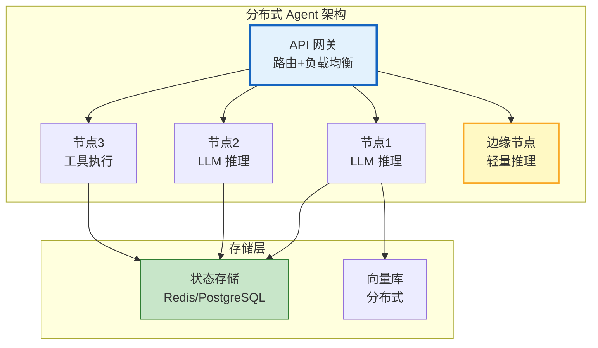

# 分布式 Agent 与边缘部署指南

> Agent 不一定运行在一个进程里——分布式 Agent 把不同节点的执行分布到多台机器上，边缘 Agent 把推理推到手机/IoT 设备上。本指南系统讲解分布式 Agent 架构、跨节点通信、边缘部署优化，以及与 LangGraph 分布式模式的集成。

---

## 1. 分布式 Agent 架构

### 为什么需要分布式

```
单机 Agent 的限制：
  - GPU 显存不够（72B 模型单卡装不下）
  - 计算不够快（单机吞吐量上限）
  - 延迟高（用户在美国，模型在北京）
  - 单点故障（机器宕机=服务中断）

分布式 Agent 解决：
  - 模型分片（张量并行/流水线并行）
  - 多副本负载均衡
  - 就近部署（边缘节点）
  - 高可用（多副本容灾）
```

### 架构模式



---

## 2. 跨节点通信

### 消息传递

```python
@dataclass
class DistributedAgentNode:
    """分布式 Agent 节点"""

    node_id: str
    role: str            # coordinator / worker / edge
    message_queue: object = None  # Redis/消息队列

    async def send_message(self, target_node: str, message: dict):
        """发送消息到目标节点"""
        await self.message_queue.publish(
            f"agent:&#123;target_node&#125;",
            json.dumps(&#123;
                "from": self.node_id,
                "to": target_node,
                "type": message.get("type", "task"),
                "payload": message,
                "timestamp": datetime.utcnow().isoformat(),
            &#125;)
        )

    async def receive_message(self, timeout: float = 30) -> dict:
        """接收消息"""
        raw = await self.message_queue.blpop(
            f"agent:&#123;self.node_id&#125;",
            timeout=int(timeout),
        )
        if raw:
            return json.loads(raw[1])
        return None

    async def run_worker(self):
        """Worker 节点运行循环"""
        while True:
            msg = await self.receive_message()
            if not msg:
                continue

            if msg["type"] == "task":
                # 执行任务
                result = await self.execute_task(msg["payload"])
                # 返回结果给协调者
                await self.send_message(msg["from"], &#123;
                    "type": "result",
                    "task_id": msg["payload"].get("task_id"),
                    "result": result,
                &#125;)

    async def execute_task(self, task: dict) -> dict:
        """执行任务"""
        llm = ChatOpenAI(model="gpt-4o-mini")
        response = await llm.ainvoke(task["prompt"])
        return &#123;"output": response.content, "node": self.node_id&#125;
```

### 协调者模式

```python
@dataclass
class DistributedCoordinator:
    """分布式协调者"""

    workers: list  # ["node1", "node2", "node3"]
    results: dict = field(default_factory=dict)
    pending: dict = field(default_factory=dict)

    async def distribute_task(self, task: str, strategy: str = "round_robin") -> dict:
        """分发任务"""
        if strategy == "round_robin":
            # 轮转分发
            worker = self.workers[len(self.pending) % len(self.workers)]
        elif strategy == "least_loaded":
            # 最少负载
            worker = self._find_least_loaded()
        elif strategy == "broadcast":
            # 广播（所有节点都执行，取最快）
            return await self._broadcast_and_race(task)

        # 发送任务
        task_id = str(uuid.uuid4())
        self.pending[task_id] = worker

        await self.send_message(worker, &#123;
            "type": "task",
            "task_id": task_id,
            "prompt": task,
        &#125;)

        # 等待结果
        return await self._wait_for_result(task_id)

    async def distribute_parallel(self, subtasks: list) -> list:
        """并行分发多个子任务"""
        tasks = []
        for i, subtask in enumerate(subtasks):
            worker = self.workers[i % len(self.workers)]
            tasks.append(self.send_message(worker, &#123;
                "type": "task",
                "task_id": str(uuid.uuid4()),
                "prompt": subtask,
            &#125;))

        # 并行发送
        await asyncio.gather(*tasks)

        # 等待所有结果
        results = []
        for _ in subtasks:
            result = await self._wait_for_any_result()
            results.append(result)

        return results

    async def _broadcast_and_race(self, task: str) -> dict:
        """广播+竞速：谁先返回就用谁"""
        task_id = str(uuid.uuid4())
        for worker in self.workers:
            await self.send_message(worker, &#123;"type": "task", "task_id": task_id, "prompt": task&#125;)

        # 等第一个返回
        return await self._wait_for_result(task_id)
```

---

## 3. 边缘部署

### 边缘 Agent 架构

```python
@dataclass
class EdgeAgent:
    """边缘 Agent：在设备端运行轻量推理"""

    def __init__(self):
        # 本地小模型（如 Qwen2.5-0.5B）
        self.local_model = None  # Ollama/vLLM 本地实例
        # 云端模型（降级/复杂任务）
        self.cloud_model = ChatOpenAI(model="gpt-4o-mini")

    async def smart_route(self, query: str, context: dict) -> dict:
        """智能路由：本地优先，复杂转云端"""
        # 1. 先用本地模型快速响应
        local_result = await self._local_inference(query)

        # 2. 评估本地结果质量
        confidence = self._estimate_confidence(local_result)

        if confidence > 0.8:
            # 本地结果足够好
            return &#123;"source": "edge", "result": local_result, "confidence": confidence&#125;

        # 3. 本地不够好，转云端
        cloud_result = await self.cloud_model.ainvoke(query)
        return &#123;"source": "cloud", "result": cloud_result.content, "confidence": 0.95&#125;

    async def _local_inference(self, query: str) -> str:
        """本地推理"""
        if self.local_model:
            response = await self.local_model.ainvoke(query)
            return response.content
        return ""

    def _estimate_confidence(self, result: str) -> float:
        """估算结果置信度"""
        if not result:
            return 0.0
        if len(result) < 10:
            return 0.3
        if "不确定" in result or "无法" in result:
            return 0.4
        return 0.85
```

### 边缘缓存

```python
@dataclass
class EdgeCache:
    """边缘缓存：常见问题本地缓存"""

    cache: dict = field(default_factory=dict)
    max_size: int = 1000

    async def get(self, query: str) -> str:
        """查询缓存"""
        # 精确匹配
        if query in self.cache:
            self.cache[query]["hits"] += 1
            return self.cache[query]["answer"]

        # 语义匹配（简化版：关键词重叠）
        for cached_q, cached in self.cache.items():
            if self._similarity(query, cached_q) > 0.8:
                cached["hits"] += 1
                return cached["answer"]

        return None

    async def put(self, query: str, answer: str):
        """缓存结果"""
        if len(self.cache) >= self.max_size:
            # LRU 淘汰
            oldest = min(self.cache.items(), key=lambda x: x[1]["hits"])
            del self.cache[oldest[0]]

        self.cache[query] = &#123;"answer": answer, "hits": 0, "timestamp": datetime.utcnow()&#125;

    def _similarity(self, q1: str, q2: str) -> float:
        words1 = set(q1.split())
        words2 = set(q2.split())
        if not words1 or not words2:
            return 0
        return len(words1 & words2) / len(words1 | words2)
```

---

## 4. 状态同步

### 分布式状态管理

```python
@dataclass
class DistributedStateManager:
    """分布式状态管理"""

    def __init__(self, redis_client):
        self.redis = redis_client

    async def save_state(self, thread_id: str, state: dict):
        """保存状态（所有节点共享）"""
        await self.redis.set(
            f"state:&#123;thread_id&#125;",
            json.dumps(state, default=str),
            ex=3600,  # 1小时过期
        )

    async def load_state(self, thread_id: str) -> dict:
        """加载状态"""
        raw = await self.redis.get(f"state:&#123;thread_id&#125;")
        if raw:
            return json.loads(raw)
        return &#123;&#125;

    async def acquire_lock(self, thread_id: str, node_id: str, ttl: int = 30) -> bool:
        """获取分布式锁（防止多节点同时修改同一会话）"""
        acquired = await self.redis.set(
            f"lock:&#123;thread_id&#125;",
            node_id,
            nx=True,  # 只在不存在时设置
            ex=ttl,
        )
        return bool(acquired)

    async def release_lock(self, thread_id: str, node_id: str):
        """释放锁"""
        # 用 Lua 脚本确保原子性
        lua_script = """
        if redis.call("get", KEYS[1]) == ARGV[1] then
            return redis.call("del", KEYS[1])
        else
            return 0
        end
        """
        await self.redis.eval(lua_script, 1, f"lock:&#123;thread_id&#125;", node_id)
```

---

## 5. 容灾与高可用

```python
@dataclass
class FailoverManager:
    """容灾管理器"""

    nodes: list  # [&#123;"id": "node1", "health": "healthy", "latency": 50&#125;, ...]

    async def get_healthy_node(self) -> dict:
        """获取健康节点"""
        healthy = [n for n in self.nodes if n["health"] == "healthy"]
        if not healthy:
            # 全部不健康，选延迟最低的
            self.nodes.sort(key=lambda n: n.get("latency", 9999))
            return self.nodes[0]

        # 选延迟最低的健康节点
        healthy.sort(key=lambda n: n.get("latency", 9999))
        return healthy[0]

    async def health_check(self):
        """健康检查所有节点"""
        for node in self.nodes:
            try:
                start = time.time()
                async with httpx.AsyncClient() as client:
                    response = await client.get(
                        f"http://&#123;node['id']&#125;:8000/health",
                        timeout=5,
                    )
                latency = (time.time() - start) * 1000
                node["latency"] = latency
                node["health"] = "healthy" if response.status_code == 200 else "unhealthy"
            except:
                node["health"] = "unhealthy"
                node["latency"] = 9999

    async def failover(self, failed_node: str) -> dict:
        """故障转移"""
        # 标记失败节点
        for n in self.nodes:
            if n["id"] == failed_node:
                n["health"] = "unhealthy"

        # 选新节点
        new_node = await self.get_healthy_node()
        return &#123;"failed": failed_node, "failover_to": new_node["id"]&#125;
```

---

## 6. 检查清单

| 检查项 | 状态 |
|--------|------|
| 理解分布式 Agent 架构 | ☐ |
| 实现了跨节点消息传递 | ☐ |
| 实现了协调者模式 | ☐ |
| 实现了边缘智能路由 | ☐ |
| 实现了边缘缓存 | ☐ |
| 实现了分布式状态管理 | ☐ |
| 实现了分布式锁 | ☐ |
| 配置了容灾与故障转移 | ☐ |

---

## 7. 与其他知识库的关联

| 关联编号 | 文档 | 关系 |
|----------|------|------|
| 13 | 生产架构设计 | 架构 |
| 16 | 生产架构图解 | 架构 |
| 63 | 容灾与高可用 | 容灾 |
| 110 | 多 Agent 状态同步 | 状态同步 |
| 188 | 容灾高可用 | 高可用 |
| 270 | 状态同步 | 同步 |
| 302 | 多区域部署 | 多区域 |
| 342 | 连接池 | 连接管理 |
| 361 | 云原生部署 | 云原生 |
| 391 | Agent 云原生部署与容器化 | 容器化 |
| 434 | 自托管 LLM | 自托管 |
| 466 | Agent 数据流与 DAG | DAG 编排 |
