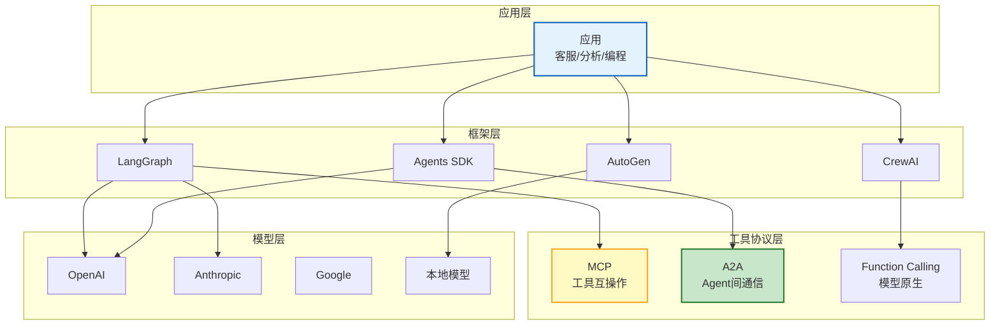

# Agent 生态系统与标准互操作指南

> LangChain Agent、OpenAI Agents SDK、CrewAI、AutoGen 各自为战，Agent 和工具不能跨框架复用。MCP 解决了工具层互操作，A2A 解决了 Agent 间通信，但完整的生态标准仍在形成中。本指南系统讲解当前 Agent 生态格局、互操作协议、跨框架迁移策略，以及未来标准化方向。

---

## 1. Agent 生态格局

### 四层生态



### 标准化现状

| 层级 | 标准 | 成熟度 | 采用情况 |
|------|------|--------|---------|
| 模型接口 | OpenAI Function Calling | 高 | 几乎所有模型 |
| 工具协议 | MCP (Model Context Protocol) | 中 | Anthropic/OpenAI |
| Agent 间通信 | A2A (Agent-to-Agent) | 早期 | Google 推动中 |
| Agent 描述 | Agent Card | 早期 | 研究阶段 |
| 评估标准 | 早期 | 无统一标准 | 各做各的 |
| 安全标准 | OWASP LLM Top10 | 中 | 社区共识 |

---

## 2. 互操作协议详解

### MCP：工具层互操作

```
MCP 解决的问题：
  LangChain 工具 ≠ Agents SDK 工具 ≠ CrewAI 工具
  每换一个框架就要重写工具

MCP 方案：
  工具封装为 MCP Server（独立进程）
  任何 MCP Client（LangChain/SDK/CrewAI）都能使用
  工具写一次，到处用
```

### A2A：Agent 间通信

```python
@dataclass
class A2AProtocol:
    """Agent-to-Agent 通信协议"""

    async def discover_agent(self, agent_url: str) -> dict:
        """发现 Agent（获取 Agent Card）"""
        async with httpx.AsyncClient() as client:
            response = await client.get(f"&#123;agent_url&#125;/.well-known/agent.json")

        agent_card = response.json()
        return &#123;
            "name": agent_card["name"],
            "description": agent_card["description"],
            "capabilities": agent_card.get("capabilities", []),
            "endpoints": agent_card.get("endpoints", &#123;&#125;),
            "version": agent_card.get("version", "1.0"),
        &#125;

    async def send_task(self, agent_url: str, task: dict) -> dict:
        """向另一个 Agent 发送任务"""
        async with httpx.AsyncClient() as client:
            response = await client.post(
                f"&#123;agent_url&#125;/tasks",
                json=&#123;
                    "task_id": str(uuid.uuid4()),
                    "type": task["type"],
                    "input": task["input"],
                    "callback": task.get("callback", ""),
                &#125;,
                timeout=60,
            )

        return response.json()

    async def get_task_status(self, agent_url: str, task_id: str) -> dict:
        """查询任务状态"""
        async with httpx.AsyncClient() as client:
            response = await client.get(f"&#123;agent_url&#125;/tasks/&#123;task_id&#125;")
        return response.json()
```

### Agent Card 规范

```python
@dataclass
class AgentCard:
    """Agent Card：Agent 的自描述文件"""

    def generate(self, name: str, description: str,
                 capabilities: list, endpoint: str) -> dict:
        return &#123;
            "name": name,
            "description": description,
            "version": "1.0",
            "capabilities": capabilities,  # ["search", "translate", "analyze"]
            "endpoints": &#123;
                "tasks": f"&#123;endpoint&#125;/tasks",
                "status": f"&#123;endpoint&#125;/tasks/&#123;&#123;task_id&#125;&#125;",
                "cancel": f"&#123;endpoint&#125;/tasks/&#123;&#123;task_id&#125;&#125;/cancel",
            &#125;,
            "authentication": &#123;
                "type": "bearer",
                "token_endpoint": f"&#123;endpoint&#125;/auth/token",
            &#125;,
            "limits": &#123;
                "max_concurrent_tasks": 10,
                "max_timeout_seconds": 300,
            &#125;,
            "pricing": &#123;
                "model": "per_task",
                "price_per_task": 0.01,
            &#125;,
        &#125;
```

---

## 3. 跨框架迁移

### 迁移决策

```
什么时候值得迁移框架？

从 LangChain → LangGraph：
  - 需要更精确的流程控制
  - 需要 Checkpoint/时间旅行
  - 需要人机交互

从 CrewAI → LangGraph：
  - 需要更灵活的 Agent 协作
  - 需要非 OpenAI 模型
  - 需要生产级部署

从 AutoGen → LangGraph：
  - 需要更稳定的流程
  - 需要更好的状态管理

不建议迁移的情况：
  - 当前框架满足需求
  - 已有大量代码积累
  - 团队熟悉当前框架
```

### 迁移策略

```python
@dataclass
class FrameworkMigration:
    """框架迁移策略"""

    # CrewAI → LangGraph 迁移示例
    async def migrate_crewai_to_langgraph(self, crew_config: dict):
        """把 CrewAI 配置迁移到 LangGraph"""
        # CrewAI: Agent(role, goal, backstory)
        # LangGraph: StateGraph + nodes

        agents = &#123;&#125;
        for agent_def in crew_config["agents"]:
            # 把 CrewAI Agent 转成 LangGraph 节点
            agents[agent_def["role"]] = &#123;
                "name": agent_def["role"],
                "system_prompt": f"""你是&#123;agent_def['role']&#125;。
目标: &#123;agent_def['goal']&#125;
背景: &#123;agent_def['backstory']&#125;""",
                "tools": agent_def.get("tools", []),
            &#125;

        # 把 CrewAI Tasks 转成 LangGraph 边
        edges = []
        for task_def in crew_config["tasks"]:
            agent_role = task_def["agent"]
            edges.append(&#123;
                "from": "start" if not edges else edges[-1]["agent"],
                "to": agent_role,
                "task": task_def["description"],
            &#125;)

        return &#123;"agents": agents, "edges": edges&#125;

    # 工具迁移：LangChain Tool → MCP Server
    async def migrate_tool_to_mcp(self, tool_func: callable, tool_name: str):
        """把 LangChain 工具迁移为 MCP Server"""
        # 原来的 LangChain @tool
        # 迁移后变成 MCP Server
        # 任何框架都能用

        mcp_server_code = f"""
from mcp.server import Server
from mcp.server.stdio import stdio_server

server = Server("&#123;tool_name&#125;")

@server.call_tool()
async def call_tool(name: str, arguments: dict):
    result = await &#123;tool_func.__name__&#125;(**arguments)
    return [&#123;&#123;"type": "text", "text": str(result)&#125;&#125;]
"""
        return mcp_server_code
```

---

## 4. Agent 注册中心

```python
@dataclass
class AgentRegistry:
    """Agent 注册中心：Agent 市场的基础设施"""

    agents: dict = field(default_factory=dict)

    async def register(self, agent_card: dict) -> str:
        """注册 Agent"""
        agent_id = str(uuid.uuid4())
        self.agents[agent_id] = &#123;
            **agent_card,
            "registered_at": datetime.utcnow().isoformat(),
            "status": "active",
            "health": "unknown",
        &#125;
        return agent_id

    async def discover(self, capability: str = "", tags: list = None) -> list:
        """发现 Agent"""
        results = []
        for agent_id, agent in self.agents.items():
            if capability and capability not in agent.get("capabilities", []):
                continue
            if tags and not any(t in agent.get("tags", []) for t in tags):
                continue
            results.append(&#123;"agent_id": agent_id, **agent&#125;)

        return results

    async def health_check_all(self):
        """健康检查所有注册的 Agent"""
        for agent_id, agent in self.agents.items():
            try:
                async with httpx.AsyncClient() as client:
                    response = await client.get(
                        f"&#123;agent['endpoints']['tasks']&#125;/health",
                        timeout=5,
                    )
                agent["health"] = "healthy" if response.status_code == 200 else "unhealthy"
            except:
                agent["health"] = "unhealthy"

    async def deregister(self, agent_id: str):
        """注销 Agent"""
        if agent_id in self.agents:
            del self.agents[agent_id]
```

---

## 5. 未来方向

### 标准化趋势

```
正在形成的标准：
  1. MCP → 工具层标准（已有落地）
  2. A2A → Agent 通信标准（Google 推动）
  3. Agent Card → Agent 描述标准
  4. OpenTelemetry → 可观测标准
  5. OWASP LLM Top10 → 安全标准

未解决的问题：
  - Agent 身份认证标准（谁授权 Agent 代表用户？）
  - Agent 责任归属标准（Agent 出错谁负责？）
  - Agent 评估标准（怎么比较不同框架的 Agent？）
  - Agent 计费标准（Agent 调用 Agent 怎么计费？）
```

### Agent 市场愿景

```
未来愿景：Agent 市场
  - Agent 开发者发布 Agent → 注册到市场
  - 用户搜索需要的 Agent → 按需调用
  - Agent 间自动协商 → 价格/SLA/能力
  - 标准化的安全/审计/计费
  类似：App Store → 但 Agent 可以互相调用
```

---

## 6. 检查清单

| 检查项 | 状态 |
|--------|------|
| 理解 Agent 生态四层架构 | ☐ |
| 理解 MCP 工具互操作 | ☐ |
| 理解 A2A Agent 通信 | ☐ |
| 能生成 Agent Card | ☐ |
| 知道跨框架迁移策略 | ☐ |
| 实现了 Agent 注册中心 | ☐ |
| 了解标准化趋势 | ☐ |

---

## 7. 与其他知识库的关联

| 关联编号 | 文档 | 关系 |
|----------|------|------|
| 115 | A2A 协议与 Agent 互联 | A2A |
| 126 | LLM 框架竞品对比 | 框架对比 |
| 199 | Agent 工具集成大全 | 工具集成 |
| 231 | Agent 工具集成大全 | 工具集成 |
| 390 | Agent 注册中心与服务发现 | 注册中心 |
| 395 | Agent 工具动态发现与绑定 | 动态发现 |
| 420 | Agent 注册中心与服务发现 | 注册中心 |
| 413 | Agent 通信协议 | 通信协议 |
| 425 | Agent 工具动态发现与绑定 | 动态发现 |
| 427 | MCP 协议 | MCP |
| 437 | OpenAI Agents SDK | SDK |
| 460 | Agent 协商与共识 | 协商 |
