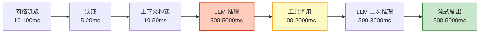

# Agent 性能调优与延迟优化指南

> 用户等 15 秒还没看到回答——走了。Agent 性能不只是"快"，而是"首 Token 快"（用户感知响应快）和"吞吐量高"（系统效率高）。本指南系统讲解 Agent 延迟拆解、各环节优化策略、并行化、缓存、预计算，以及性能瓶颈诊断。

---

## 1. 延迟拆解

### Agent 请求生命周期



### 延迟瓶颈分析

| 环节 | 典型延迟 | 占比 | 优化空间 |
|------|---------|------|---------|
| 网络传输 | 10-100ms | 5% | CDN/就近部署 |
| 上下文构建 | 10-50ms | 3% | 预计算/缓存 |
| LLM 推理（首Token） | 200-2000ms | 30% | 模型选择/上下文裁剪 |
| 工具调用 | 100-2000ms | 20% | 并行化/缓存/超时 |
| LLM 推理（生成） | 500-5000ms | 35% | 流式输出/推测解码 |
| 状态保存 | 5-20ms | 2% | 异步写入 |
| 序列化 | 5-10ms | 5% | 优化格式 |

---

## 2. 首 Token 延迟优化

### TTFT 优化策略

```python
@dataclass
class TTFTOptimizer:
    """首 Token 延迟优化器"""

    async def optimize_first_token(self, query: str) -> str:
        """优化首 Token 延迟"""
        # 策略1：用快模型做快速首响应
        fast_model = ChatOpenAI(model="gpt-4o-mini", temperature=0)
        fast_response = await fast_model.ainvoke(query)

        # 策略2：流式输出（立即开始输出）
        # 第一个 Token 出来就开始流式传输
        async for chunk in fast_model.astream(query):
            yield chunk.content  # 立即输出

    async def prefetch_context(self, query: str):
        """预取上下文（在 LLM 调用前并行检索）"""
        # 并行执行：检索+用户偏好+历史
        tasks = [
            self._retrieve_docs(query),
            self._load_user_prefs(query),
            self._load_recent_history(query),
        ]
        results = await asyncio.gather(*tasks)
        return results

    async def warm_cache(self):
        """预热缓存"""
        # 预加载热门查询的答案
        hot_queries = await self._get_hot_queries()
        for q in hot_queries:
            cached = await self._get_cache(q)
            if not cached:
                # 预计算并缓存
                result = await self._compute(q)
                await self._set_cache(q, result, ttl=3600)

    async def use_prompt_cache(self, system_prompt: str):
        """利用 Prompt Caching（Anthropic/OpenAI）"""
        # 固定的 System Prompt 部分会被缓存
        # 后续请求只付 10% 价格 + 更快
        pass
```

---

## 3. 并行化优化

### 并行工具调用

```python
@dataclass
class ParallelOptimizer:
    """并行化优化器"""

    async def parallel_tools(self, tool_calls: list) -> list:
        """并行执行工具调用"""
        # 如果 Agent 决定调用多个工具，并行执行
        tasks = [self._execute_tool(tc) for tc in tool_calls]
        results = await asyncio.gather(*tasks, return_exceptions=True)

        # 处理结果
        processed = []
        for i, result in enumerate(results):
            if isinstance(result, Exception):
                processed.append(&#123;
                    "tool": tool_calls[i]["name"],
                    "error": str(result),
                    "success": False,
                &#125;)
            else:
                processed.append(&#123;
                    "tool": tool_calls[i]["name"],
                    "result": result,
                    "success": True,
                &#125;)

        return processed

    async def parallel_retrieval(self, query: str):
        """并行多路检索"""
        # 向量检索 + 关键词检索 + 图谱检索 同时进行
        tasks = [
            self._vector_search(query, top_k=3),
            self._keyword_search(query, top_k=3),
            self._graph_search(query),
        ]
        results = await asyncio.gather(*tasks)

        # 合并去重
        merged = self._merge_and_dedupe(*results)
        return merged

    async def parallel_and_first(self, tasks: list):
        """并行执行取最快"""
        # 多个模型同时推理，用最快的
        done, pending = await asyncio.wait(
            tasks, return_when=asyncio.FIRST_COMPLETED
        )
        # 取消其他
        for t in pending:
            t.cancel()
        return done.pop().result()
```

### LangGraph 并行扇出

```python
from langgraph.graph import StateGraph, START, END

# LangGraph 自动并行化无依赖的节点
async def parallel_search_node(state):
    """并行搜索节点"""
    tasks = [search_api(query) for query in state["sub_queries"]]
    results = await asyncio.gather(*tasks)
    return &#123;"search_results": results&#125;

async def parallel_analysis_node(state):
    """并行分析节点"""
    docs = state["search_results"]
    tasks = [analyze_doc(doc) for doc in docs]
    results = await asyncio.gather(*tasks)
    return &#123;"analysis": results&#125;

# 两个节点如果有不同前置，会自动并行
```

---

## 4. 缓存策略

### 多级缓存

```python
@dataclass
class MultiLevelCache:
    """多级缓存"""

    # Level 1: 精确缓存（相同查询）
    exact_cache: dict = field(default_factory=dict)

    # Level 2: 语义缓存（相似查询）
    semantic_cache: object = None  # 向量缓存

    # Level 3: Prompt 前缀缓存（模型层）
    # Anthropic/OpenAI 自动处理

    async def get(self, query: str) -> str:
        """查询缓存"""
        # L1: 精确匹配
        if query in self.exact_cache:
            entry = self.exact_cache[query]
            if self._is_valid(entry):
                entry["hits"] += 1
                return entry["answer"]

        # L2: 语义匹配
        if self.semantic_cache:
            similar = await self.semantic_cache.search(query, threshold=0.9)
            if similar:
                return similar[0]["answer"]

        return None

    async def set(self, query: str, answer: str, ttl: int = 3600):
        """设置缓存"""
        self.exact_cache[query] = &#123;
            "answer": answer,
            "created_at": time.time(),
            "ttl": ttl,
            "hits": 0,
        &#125;

        # 同时存入语义缓存
        if self.semantic_cache:
            await self.semantic_cache.add(query, answer)

    def _is_valid(self, entry: dict) -> bool:
        """检查缓存是否有效"""
        age = time.time() - entry["created_at"]
        return age < entry.get("ttl", 3600)
```

---

## 5. 上下文优化

### 减少上下文 Token

```python
@dataclass
class ContextOptimizer:
    """上下文优化：减少 Token 加速推理"""

    async def optimize(self, messages: list) -> list:
        """优化上下文"""
        # 1. 裁剪冗余
        messages = self._remove_redundancy(messages)

        # 2. 压缩旧消息
        messages = await self._compress_old(messages)

        # 3. 工具结果截断
        messages = self._truncate_tool_results(messages)

        # 4. 去除空白
        messages = self._strip_whitespace(messages)

        return messages

    def _remove_redundancy(self, messages: list) -> list:
        """去除冗余消息"""
        # 如果连续多条用户消息内容相似，合并
        result = []
        for msg in messages:
            if result and result[-1]["role"] == msg["role"]:
                # 同角色连续消息合并
                result[-1]["content"] += "\n" + msg["content"]
            else:
                result.append(msg.copy())
        return result

    def _truncate_tool_results(self, messages: list) -> list:
        """截断工具结果"""
        for msg in messages:
            if msg["role"] == "tool" and len(msg["content"]) > 500:
                msg["content"] = msg["content"][:300] + "\n...[截断]" + msg["content"][-100:]
        return messages

    def _strip_whitespace(self, messages: list) -> list:
        """去除多余空白"""
        for msg in messages:
            msg["content"] = " ".join(msg["content"].split())
        return messages
```

---

## 6. 性能瓶颈诊断

```python
@dataclass
class PerformanceDiagnostician:
    """性能瓶颈诊断器"""

    async def diagnose(self, latency_data: dict) -> dict:
        """诊断性能瓶颈"""
        bottlenecks = []

        # 1. 检查首 Token 延迟
        ttft = latency_data.get("ttft_ms", 0)
        if ttft > 2000:
            bottlenecks.append(&#123;
                "component": "LLM 推理",
                "metric": "TTFT",
                "value": f"&#123;ttft&#125;ms",
                "target": "<2000ms",
                "suggestions": ["用更快模型", "减少上下文", "启用Prompt缓存"],
            &#125;)

        # 2. 检查工具调用延迟
        tool_latency = latency_data.get("tool_latency_ms", 0)
        if tool_latency > 3000:
            bottlenecks.append(&#123;
                "component": "工具调用",
                "metric": "工具延迟",
                "value": f"&#123;tool_latency&#125;ms",
                "target": "<3000ms",
                "suggestions": ["并行化工具调用", "缓存工具结果", "设置超时"],
            &#125;)

        # 3. 检查检索延迟
        retrieval_latency = latency_data.get("retrieval_latency_ms", 0)
        if retrieval_latency > 1000:
            bottlenecks.append(&#123;
                "component": "RAG 检索",
                "metric": "检索延迟",
                "value": f"&#123;retrieval_latency&#125;ms",
                "target": "<1000ms",
                "suggestions": ["优化向量索引", "减少 Top-K", "使用更快 Embedding"],
            &#125;)

        # 4. 检查上下文大小
        context_tokens = latency_data.get("context_tokens", 0)
        if context_tokens > 5000:
            bottlenecks.append(&#123;
                "component": "上下文",
                "metric": "Token数",
                "value": f"&#123;context_tokens&#125;",
                "target": "<5000",
                "suggestions": ["压缩对话历史", "截断工具结果", "减少检索文档"],
            &#125;)

        return &#123;
            "total_latency_ms": latency_data.get("total_ms", 0),
            "bottlenecks": bottlenecks,
            "primary_bottleneck": bottlenecks[0] if bottlenecks else None,
            "recommendations": self._prioritize_fixes(bottlenecks),
        &#125;

    def _prioritize_fixes(self, bottlenecks: list) -> list:
        """优先级排序修复建议"""
        # 按影响排序
        return sorted(bottlenecks, key=lambda b: b.get("value", "0"), reverse=True)
```

---

## 7. 检查清单

| 检查项 | 状态 |
|--------|------|
| 理解延迟拆解 | ☐ |
| 实现了 TTFT 优化 | ☐ |
| 实现了并行工具调用 | ☐ |
| 实现了并行多路检索 | ☐ |
| 实现了多级缓存 | ☐ |
| 实现了上下文优化 | ☐ |
| 能诊断性能瓶颈 | ☐ |
| 利用 Prompt Caching | ☐ |

---

## 8. 与其他知识库的关联

| 关联编号 | 文档 | 关系 |
|----------|------|------|
| 10 | 流式输出原理 | 流式 |
| 20 | 缓存策略 | 缓存 |
| 42 | 性能剖析 | 性能 |
| 59 | LLM 应用性能剖析 | 性能剖析 |
| 98 | 流式输出前端集成 | 前端 |
| 116 | 语义缓存层设计 | 语义缓存 |
| 128 | 性能调优系统 | 调优 |
| 129 | 工具结果缓存与去重 | 缓存 |
| 160 | 性能调优系统指南 | 调优 |
| 161 | 工具结果缓存 | 缓存 |
| 228 | 性能基准测试 | 基准 |
| 261 | 工具沙箱 | 沙箱 |
| 343 | 编译优化与延迟降低 | 编译优化 |
| 355 | 语义缓存 | 缓存 |
| 373 | 编译优化 | 优化 |
| 379 | Prompt 缓存 | 缓存 |
| 386 | Tool 缓存与结果复用 | 缓存 |
| 388 | 推理加速与批处理 | 加速 |
| 418 | LLM 推理加速 | 加速 |
| 454 | LLM 推理引擎深度优化 | 深度优化 |
| 474 | Agent 会话管理 | 上下文优化 |
