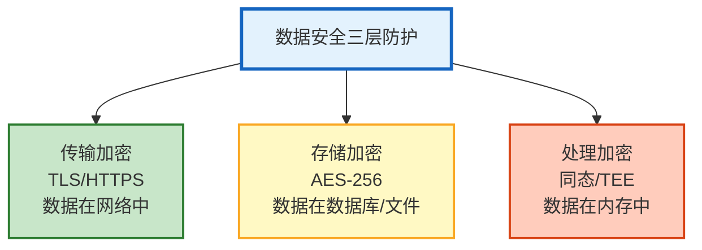

# Agent 数据安全与加密体系指南

> Agent 处理用户对话、查询数据库、调用 API——这些数据在传输中、存储中、处理中都需要保护。一次数据泄露可能导致用户隐私暴露、API Key 窃取、合规违规。本指南系统讲解数据加密三层防护（传输/存储/处理）、密钥管理、数据脱敏管道，以及安全审计。

---

## 1. 数据安全三层防护

### 防护体系



### 数据分类分级

| 等级 | 数据类型 | 示例 | 加密要求 |
|------|---------|------|---------|
| 机密 | 认证凭证 | API Key/密码 | AES-256 + KMS |
| 敏感 | 个人信息 | 手机号/身份证 | 脱敏+AES-128 |
| 内部 | 业务数据 | 订单/交易 | AES-128 |
| 公开 | 公开信息 | 产品说明 | 不加密 |

---

## 2. 传输加密

### TLS 配置

```python
@dataclass
class TransportSecurity:
    """传输安全"""

    def get_tls_config(self) -> dict:
        """TLS 配置"""
        return &#123;
            "min_version": "TLS 1.2",       # 最低 TLS 1.2
            "preferred_version": "TLS 1.3", # 优先 TLS 1.3
            "ciphers": [
                "TLS_AES_256_GCM_SHA384",
                "TLS_CHACHA20_POLY1305_SHA256",
                "TLS_AES_128_GCM_SHA256",
            ],
            "cert_rotation_days": 90,      # 证书 90 天轮换
            "hsts_max_age": 31536000,       # HSTS 1 年
        &#125;

    async def verify_endpoint_security(self, url: str) -> dict:
        """验证端点安全性"""
        import ssl
        import socket

        result = &#123;"url": url, "secure": False, "issues": []&#125;

        try:
            hostname = url.split("//")[1].split("/")[0]
            context = ssl.create_default_context()
            with socket.create_connection((hostname, 443), timeout=10) as sock:
                with context.wrap_socket(sock, server_hostname=hostname) as ssock:
                    cert = ssock.getpeercert()
                    tls_version = ssock.version()

                    result["tls_version"] = tls_version
                    result["cert_issuer"] = dict(x[0] for x in cert.get("issuer", []))
                    result["cert_expiry"] = cert.get("notAfter", "")
                    result["secure"] = True

                    if tls_version < "TLSv1.2":
                        result["issues"].append("TLS 版本过低")
        except Exception as e:
            result["issues"].append(f"连接失败: &#123;e&#125;")

        return result
```

### API 调用安全

```python
@dataclass
class SecureAPIClient:
    """安全的 API 客户端"""

    async def call_with_security(self, url: str, data: dict,
                                  api_key: str) -> dict:
        """安全调用 API"""
        # 1. 强制 HTTPS
        if not url.startswith("https://"):
            raise ValueError("必须使用 HTTPS")

        # 2. 添加认证头（不放在 URL 中）
        headers = &#123;
            "Authorization": f"Bearer &#123;api_key&#125;",
            "Content-Type": "application/json",
            "X-Request-ID": str(uuid.uuid4()),
            "X-Timestamp": str(int(time.time())),
        &#125;

        # 3. 请求签名（防篡改）
        signature = self._sign_request(data, api_key)
        headers["X-Signature"] = signature

        # 4. 发送请求
        async with httpx.AsyncClient(verify=True, timeout=30) as client:
            response = await client.post(url, json=data, headers=headers)

        # 5. 验证响应
        if response.status_code != 200:
            raise APIError(f"API 返回 &#123;response.status_code&#125;")

        return response.json()

    def _sign_request(self, data: dict, secret: str) -> str:
        """请求签名"""
        import hmac
        import hashlib
        import json

        body = json.dumps(data, sort_keys=True)
        signature = hmac.new(
            secret.encode(),
            body.encode(),
            hashlib.sha256,
        ).hexdigest()
        return signature
```

---

## 3. 存储加密

### 数据库加密

```python
from cryptography.fernet import Fernet

@dataclass
class StorageEncryption:
    """存储加密"""

    # 字段级加密密钥（从 KMS 获取）
    field_keys: dict = field(default_factory=dict)

    async def encrypt_field(self, value: str, field_name: str) -> str:
        """加密字段"""
        key = await self._get_field_key(field_name)
        fernet = Fernet(key)
        encrypted = fernet.encrypt(value.encode())
        return encrypted.decode()

    async def decrypt_field(self, encrypted_value: str, field_name: str) -> str:
        """解密字段"""
        key = await self._get_field_key(field_name)
        fernet = Fernet(key)
        decrypted = fernet.decrypt(encrypted_value.encode())
        return decrypted.decode()

    async def _get_field_key(self, field_name: str) -> bytes:
        """从 KMS 获取字段加密密钥"""
        if field_name not in self.field_keys:
            # 从 KMS/环境变量获取
            self.field_keys[field_name] = await self._fetch_from_kms(field_name)
        return self.field_keys[field_name]

    async def _fetch_from_kms(self, key_name: str) -> bytes:
        """从 KMS 获取密钥"""
        # AWS KMS / HashiCorp Vault / Azure Key Vault
        return Fernet.generate_key()  # 简化：实际从 KMS 获取

# 使用：对敏感字段加密后存储
async def save_user_data(user_data: dict):
    """安全存储用户数据"""
    encryptor = StorageEncryption()

    # 加密敏感字段
    if user_data.get("phone"):
        user_data["phone"] = await encryptor.encrypt_field(user_data["phone"], "phone")
    if user_data.get("email"):
        user_data["email"] = await encryptor.encrypt_field(user_data["email"], "email")
    if user_data.get("id_card"):
        user_data["id_card"] = await encryptor.encrypt_field(user_data["id_card"], "id_card")

    # 存入数据库（已加密）
    await db.users.insert(user_data)
```

### 向量库加密

```python
@dataclass
class VectorDBSecurity:
    """向量库安全"""

    async def secure_store(self, text: str, metadata: dict):
        """安全存储向量"""
        # 1. 对 metadata 中的敏感字段脱敏
        safe_metadata = self._sanitize_metadata(metadata)

        # 2. 对原文加密存储
        encrypted_text = await encryptor.encrypt_field(text, "document")

        # 3. 向量库存储（embedding 不加密，但 metadata 脱敏）
        await vectorstore.add_texts(
            texts=[text],  # 向量检索需要原文
            metadatas=[&#123;**safe_metadata, "encrypted_source": encrypted_text&#125;],
        )

    def _sanitize_metadata(self, metadata: dict) -> dict:
        """脱敏 metadata"""
        import re
        safe = metadata.copy()
        for key, value in safe.items():
            if isinstance(value, str):
                # 脱敏手机号
                value = re.sub(r'1[3-9]\d&#123;9&#125;', '[手机号已隐藏]', value)
                # 脱敏邮箱
                value = re.sub(r'[\w.-]+@[\w.-]+', '[邮箱已隐藏]', value)
                # 脱敏身份证
                value = re.sub(r'\d&#123;17&#125;[\dXx]', '[身份证已隐藏]', value)
                safe[key] = value
        return safe
```

---

## 4. 密钥管理

### 密钥生命周期

```python
@dataclass
class KeyManagementService:
    """密钥管理服务"""

    async def create_key(self, key_id: str, key_type: str = "AES-256") -> dict:
        """创建密钥"""
        return &#123;
            "key_id": key_id,
            "type": key_type,
            "created_at": datetime.utcnow().isoformat(),
            "status": "active",
            "rotation_period_days": 90,
            "next_rotation": (datetime.utcnow() + timedelta(days=90)).isoformat(),
        &#125;

    async def rotate_key(self, key_id: str) -> dict:
        """轮换密钥"""
        # 1. 生成新密钥
        new_key = Fernet.generate_key()

        # 2. 用新密钥重新加密数据
        # 实际中分批迁移

        # 3. 旧密钥标记为"仅解密"
        await self._mark_key_status(key_id, "decrypt_only")

        # 4. 激活新密钥
        await self._activate_key(key_id, new_key)

        return &#123;
            "key_id": key_id,
            "rotated_at": datetime.utcnow().isoformat(),
            "status": "active",
        &#125;

    async def revoke_key(self, key_id: str):
        """吊销密钥"""
        await self._mark_key_status(key_id, "revoked")

    async def list_keys(self) -> list:
        """列出所有密钥"""
        return [
            &#123;"key_id": "api_keys", "status": "active", "rotation": "90d"&#125;,
            &#123;"key_id": "user_data", "status": "active", "rotation": "90d"&#125;,
            &#123;"key_id": "vector_db", "status": "active", "rotation": "180d"&#125;,
        ]

    async def _mark_key_status(self, key_id: str, status: str):
        pass

    async def _activate_key(self, key_id: str, key: bytes):
        pass
```

---

## 5. 数据脱敏管道

```python
import re

@dataclass
class DataMaskingPipeline:
    """数据脱敏管道"""

    patterns = &#123;
        "phone": (r'1[3-9]\d&#123;9&#125;', '1**-****-****'),
        "email": (r'[\w.-]+@[\w.-]+\.\w+', '***@***.***'),
        "id_card": (r'\d&#123;17&#125;[\dXx]', '******************'),
        "bank_card": (r'\d&#123;16,19&#125;', '****-****-****-****'),
        "api_key": (r'sk-[a-zA-Z0-9]&#123;20,&#125;', 'sk-***'),
        "password": (r'password["\']?\s*[:=]\s*["\']?[^\s"\']+', 'password=***'),
        "ip_address": (r'\b\d&#123;1,3&#125;\.\d&#123;1,3&#125;\.\d&#123;1,3&#125;\.\d&#123;1,3&#125;\b', '***.***.***.***'),
        "url_credential": (r'(https?://)[^:]+:[^@]+@', r'\1***:***@'),
    &#125;

    def mask(self, text: str, fields: list = None) -> str:
        """脱敏文本"""
        fields = fields or list(self.patterns.keys())

        for field in fields:
            if field in self.patterns:
                pattern, replacement = self.patterns[field]
                text = re.sub(pattern, replacement, text, flags=re.IGNORECASE)

        return text

    def mask_log_entry(self, log_entry: str) -> str:
        """脱敏日志条目"""
        return self.mask(log_entry)

    def mask_tool_result(self, result: str) -> str:
        """脱敏工具返回结果"""
        return self.mask(result)

    def mask_llm_output(self, output: str) -> str:
        """脱敏 LLM 输出"""
        # 更严格：脱敏所有类型
        return self.mask(output)

    def audit_mask(self, data: str, level: str = "standard") -> str:
        """审计脱敏（不同级别）"""
        if level == "strict":
            # 严格模式：脱敏所有
            return self.mask(data)
        elif level == "standard":
            # 标准模式：脱敏敏感字段
            return self.mask(data, ["phone", "email", "id_card", "bank_card", "api_key", "password"])
        else:
            # 宽松模式：只脱敏最敏感的
            return self.mask(data, ["api_key", "password"])
```

---

## 6. 安全审计

```python
@dataclass
class SecurityAuditor:
    """安全审计"""

    async def audit_data_access(self, user_id: str, data_type: str,
                                 action: str, result: str):
        """审计数据访问"""
        # 链式哈希（防篡改）
        previous_hash = await self._get_last_hash()
        current_data = f"&#123;user_id&#125;:&#123;data_type&#125;:&#123;action&#125;:&#123;datetime.utcnow().isoformat()&#125;"
        current_hash = hashlib.sha256(
            (previous_hash + current_data).encode()
        ).hexdigest()

        audit_entry = &#123;
            "timestamp": datetime.utcnow().isoformat(),
            "user_id": user_id,
            "data_type": data_type,
            "action": action,             # read/write/delete
            "result": "success" if "error" not in result else "failed",
            "previous_hash": previous_hash,
            "current_hash": current_hash,
            # 不记录具体数据内容（防泄露）
        &#125;

        await db.audit_chain.insert(audit_entry)

    async def verify_audit_chain(self) -> dict:
        """验证审计链完整性"""
        entries = await db.audit_chain.find().sort("timestamp", 1).to_list(None)

        for i in range(1, len(entries)):
            expected = hashlib.sha256(
                (entries[i-1]["current_hash"] + f"&#123;entries[i]['user_id']&#125;:&#123;entries[i]['data_type']&#125;:&#123;entries[i]['action']&#125;:&#123;entries[i]['timestamp']&#125;").encode()
            ).hexdigest()

            if expected != entries[i]["current_hash"]:
                return &#123;"valid": False, "broken_at": entries[i]["timestamp"]&#125;

        return &#123;"valid": True, "total_entries": len(entries)&#125;

    async def _get_last_hash(self) -> str:
        """获取链中最后一个哈希"""
        last = await db.audit_chain.find().sort("timestamp", -1).limit(1).to_list(1)
        return last[0]["current_hash"] if last else "genesis"
```

---

## 7. 检查清单

| 检查项 | 状态 |
|--------|------|
| 理解三层防护体系 | ☐ |
| 配置了 TLS 传输加密 | ☐ |
| 实现了字段级存储加密 | ☐ |
| 配置了密钥管理+轮换 | ☐ |
| 实现了数据脱敏管道 | ☐ |
| 实现了安全审计链 | ☐ |
| 能验证审计链完整性 | ☐ |
| API 调用有签名验证 | ☐ |

---

## 8. 与其他知识库的关联

| 关联编号 | 文档 | 关系 |
|----------|------|------|
| 10 | 安全与合规指南 | 安全合规 |
| 39 | 数据隐私与合规 | 隐私 |
| 64 | Prompt 注入攻防 | 注入防护 |
| 109 | OWASP LLM Top10 | 安全风险 |
| 119 | 数据隐私技术 | 隐私技术 |
| 151 | LLM 应用数据隐私技术 | 隐私 |
| 181 | 数据脱敏 | 脱敏 |
| 213 | 数据脱敏与 PII 防护 | PII |
| 394 | 数据脱敏管道与隐私保护 | 脱敏管道 |
| 424 | 数据脱敏管道与隐私保护 | 脱敏 |
| 438 | NeMo Guardrails | 护栏 |
| 448 | Agent 红队测试 | 红队 |
| 449 | 隐私计算与联邦学习 | 隐私计算 |
| 451 | LLM 应用合规与法律 | 合规 |
