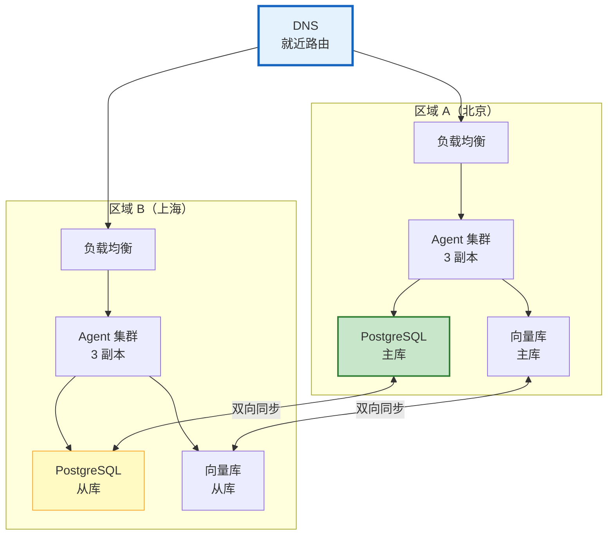

# Agent 异地多活与灾难恢复深度指南

> 单机房故障——整个 Agent 服务不可用。异地多活让 Agent 在多个地理区域同时运行，一个机房挂了另一个无缝接管。本指南系统讲解多活架构、数据同步、故障切换（Failover）、RTO/RPO 目标，以及实际灾备方案。

---

## 1. 灾备等级

### RTO/RPO 定义

```
RTO（Recovery Time Objective）：恢复时间目标
  从故障到恢复服务的时间
  RTO=0：无缝切换（用户无感知）
  RTO<1分钟：自动故障切换
  RTO<15分钟：人工介入恢复
  RTO<1小时：灾难恢复流程

RPO（Recovery Point Objective）：恢复点目标
  丢失多少数据可接受
  RPO=0：零数据丢失
  RPO<1分钟：丢失1分钟内数据
  RPO<15分钟：丢失15分钟内数据
```

### 灾备模式

| 模式 | RTO | RPO | 成本 | 适用 |
|------|-----|-----|------|------|
| 冷备 | 小时级 | 小时级 | 低 | 非核心 |
| 温备 | 分钟级 | 分钟级 | 中 | 一般业务 |
| 热备 | 秒级 | 秒级 | 高 | 重要业务 |
| 多活 | 0 | 0 | 最高 | 核心业务 |

---

## 2. 多活架构

### 双活架构



### 区域选择策略

```python
@dataclass
class MultiRegionManager:
    """多区域管理器"""

    regions = &#123;
        "beijing": &#123;"endpoint": "https://agent-bj.example.com", "latency": 20, "health": "healthy"&#125;,
        "shanghai": &#123;"endpoint": "https://agent-sh.example.com", "latency": 30, "health": "healthy"&#125;,
        "guangzhou": &#123;"endpoint": "https://agent-gz.example.com", "latency": 40, "health": "healthy"&#125;,
    &#125;

    async def route_request(self, user_location: str) -> dict:
        """路由请求到最优区域"""
        # 1. 按延迟选择
        healthy = &#123;r: info for r, info in self.regions.items() if info["health"] == "healthy"&#125;

        if not healthy:
            raise AllRegionsDownError("所有区域不可用")

        # 选择延迟最低的健康区域
        best = min(healthy.items(), key=lambda x: x[1]["latency"])
        return &#123;"region": best[0], "endpoint": best[1]["endpoint"]&#125;

    async def failover(self, failed_region: str) -> dict:
        """故障切换"""
        # 1. 标记故障区域
        self.regions[failed_region]["health"] = "unhealthy"

        # 2. 选择替代区域
        healthy = &#123;r: info for r, info in self.regions.items() if info["health"] == "healthy"&#125;

        if not healthy:
            return &#123;"success": False, "reason": "无可用区域"&#125;

        # 3. 更新 DNS 路由
        new_region = min(healthy.items(), key=lambda x: x[1]["latency"])
        await self._update_dns(failed_region, new_region[0])

        return &#123;
            "success": True,
            "failed_region": failed_region,
            "failover_to": new_region[0],
            "rto_seconds": 0,
        &#125;

    async def health_check_all(self):
        """检查所有区域健康"""
        for region, info in self.regions.items():
            try:
                start = time.time()
                async with httpx.AsyncClient() as client:
                    resp = await client.get(f"&#123;info['endpoint']&#125;/health", timeout=5)
                latency = (time.time() - start) * 1000
                info["latency"] = latency
                info["health"] = "healthy" if resp.status_code == 200 else "unhealthy"
            except:
                info["health"] = "unhealthy"

    async def _update_dns(self, from_region: str, to_region: str):
        """更新 DNS 路由"""
        # 实际中调用 Route53/CloudDNS API
        print(f"DNS 切换: &#123;from_region&#125; → &#123;to_region&#125;")


class AllRegionsDownError(Exception):
    pass
```

---

## 3. 数据同步

### PostgreSQL 双向同步

```python
@dataclass
class DatabaseSync:
    """数据库同步"""

    async def setup_bidirectional_sync(self, region_a: str, region_b: str):
        """设置双向同步"""
        # 方案1：PostgreSQL 逻辑复制
        config = f"""
        # 区域 A 配置
        wal_level = logical
        max_replication_slots = 10
        max_wal_senders = 10

        # 创建发布
        CREATE PUBLICATION pub_&#123;region_a&#125; FOR ALL TABLES;

        # 创建订阅（在区域 B 执行）
        CREATE SUBSCRIPTION sub_&#123;region_a&#125;
        CONNECTION 'host=&#123;region_a&#125; dbname=agent'
        PUBLICATION pub_&#123;region_a&#125;;
        """
        # 对称配置 B→A
        return &#123;"status": "configured", "regions": [region_a, region_b]&#125;

    async def handle_conflict(self, conflict: dict):
        """处理冲突"""
        # 冲突类型：同一记录在两个区域同时修改
        strategy = "last_write_wins"  # 或 "field_merge"

        if strategy == "last_write_wins":
            # 比较时间戳，新的覆盖旧的
            if conflict["a_timestamp"] > conflict["b_timestamp"]:
                await self._apply(conflict["region_b"], conflict["a_data"])
            else:
                await self._apply(conflict["region_a"], conflict["b_data"])

    async def _apply(self, region, data):
        pass
```

### 向量库同步

```python
@dataclass
class VectorDBSync:
    """向量库同步"""

    async def sync_incremental(self, source: str, target: str):
        """增量同步向量库"""
        # 1. 获取上次同步时间戳
        last_sync = await self._get_last_sync(source, target)

        # 2. 查询增量数据
        new_docs = await self._query_changes(source, last_sync)

        # 3. 写入目标
        for doc in new_docs:
            if doc["operation"] == "insert":
                await self._insert_to(target, doc)
            elif doc["operation"] == "delete":
                await self._delete_from(target, doc["id"])
            elif doc["operation"] == "update":
                await self._delete_from(target, doc["id"])
                await self._insert_to(target, doc)

        # 4. 更新同步时间戳
        await self._update_sync_time(source, target)

        return &#123;"synced": len(new_docs)&#125;
```

---

## 4. 灾备演练

```python
@dataclass
class DisasterRecoveryDrill:
    """灾备演练"""

    async def run_drill(self, scenario: str = "region_failure"):
        """运行灾备演练"""
        print(f"🧪 灾备演练: &#123;scenario&#125;")

        # 1. 记录演练前状态
        before = await self._capture_state()

        # 2. 注入故障（模拟区域宕机）
        test_region = "shanghai"
        await self._inject_failure(test_region)

        # 3. 等待故障切换
        start = time.time()
        await asyncio.sleep(5)  # 等待检测+切换

        # 4. 验证服务可用
        health = await self._check_service_health()
        rto = time.time() - start

        # 5. 恢复
        await self._restore_region(test_region)

        # 6. 验证数据一致性
        consistency = await self._check_data_consistency()
        rpo = consistency.get("data_loss_seconds", 0)

        # 7. 生成报告
        report = &#123;
            "scenario": scenario,
            "test_region": test_region,
            "rto_seconds": rto,
            "rpo_seconds": rpo,
            "service_restored": health["healthy"],
            "data_consistent": consistency["consistent"],
            "passed": rto < 60 and rpo < 10 and health["healthy"] and consistency["consistent"],
        &#125;

        print(f"  RTO: &#123;rto:.1f&#125;s")
        print(f"  RPO: &#123;rpo:.1f&#125;s")
        print(f"  通过: &#123;'✅' if report['passed'] else '❌'&#125;")

        return report

    async def _inject_failure(self, region: str):
        """注入故障"""
        # 模拟区域不可达
        print(f"  💉 注入故障: &#123;region&#125; 不可达")

    async def _capture_state(self) -> dict:
        return &#123;"timestamp": datetime.utcnow().isoformat()&#125;

    async def _check_service_health(self) -> dict:
        return &#123;"healthy": True&#125;

    async def _check_data_consistency(self) -> dict:
        return &#123;"consistent": True, "data_loss_seconds": 0&#125;

    async def _restore_region(self, region: str):
        print(f"  🔄 恢复区域: &#123;region&#125;")
```

---

## 5. 检查清单

| 检查项 | 状态 |
|--------|------|
| 理解 RTO/RPO | ☐ |
| 配置了多区域路由 | ☐ |
| 实现了故障切换 | ☐ |
| 配置了数据库双向同步 | ☐ |
| 配置了向量库增量同步 | ☐ |
| 处理了同步冲突 | ☐ |
| 定期灾备演练 | ☐ |
| DNS 自动切换 | ☐ |

---

## 6. 与其他知识库的关联

| 关联编号 | 文档 | 关系 |
|----------|------|------|
| 45 | 容灾设计 | 容灾 |
| 63 | 容灾与高可用 | 高可用 |
| 67 | 灾备演练 | 演练 |
| 145 | 灾难恢复 | 恢复 |
| 177 | 灾难恢复与备份 | 备份 |
| 188 | 容灾高可用 | 高可用 |
| 220 | 容灾高可用深度 | 深度 |
| 225 | 容灾高可用 | 高可用 |
| 255 | 灾备演练图解 | 演练 |
| 302 | 多区域部署 | 多区域 |
| 469 | 分布式 Agent | 分布式 |
| 473 | Agent 可靠性与韧性 | 韧性 |
| 489 | Agent 容器化部署 | 部署 |
