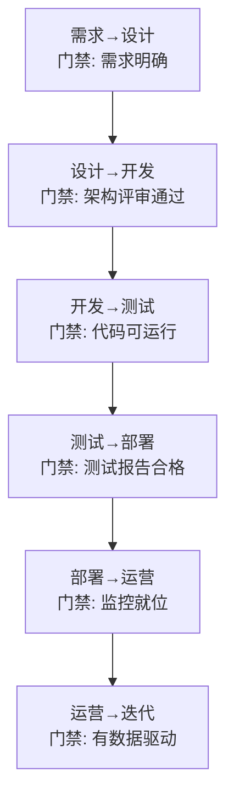

# LLM 应用全生命周期管理

> 从一个想法到上线运维的完整旅程：需求→设计→开发→测试→部署→监控→迭代。

---

## 一、全生命周期全景

```mermaid
graph LR
    subgraph 生命周期 &#123;"LLM应用全生命周期"&#125;
        S1["1.需求分析"] --> S2["2.架构设计"]
        S2 --> S3["3.开发实现"]
        S3 --> S4["4.测试评估"]
        S4 --> S5["5.部署上线"]
        S5 --> S6["6.监控运营"]
        S6 --> S7["7.反馈迭代"]
        S7 -->|"循环"| S3
    end

    style S1 fill:'#C8E6C9'
    style S4 fill:'#FFF9C4'
    style S6 fill:'#E3F2FD'
    style S7 fill:'#F3E5F5'
```

## 二、各阶段详解

### 2.1 需求分析

```mermaid
graph TB
    subgraph 需求分析 &#123;"需求分析阶段"&#125;
        R1["用户是谁？<br/>(内部员工/外部客户/开发者)"]
        R2["核心场景是什么？<br/>(问答/分析/生成/审核)"]
        R3["数据量级？<br/>(文档数/用户数/日调用量)"]
        R4["质量要求？<br/>(准确率/延迟/成本)"]
        R5["约束条件？<br/>(预算/隐私/合规/技术栈)"]
    end

    style 需求分析 fill:'#C8E6C9'
```

### 2.2 架构设计

| 决策点 | 选项 | 选型依据 |
|--------|------|---------|
| 模式 | Chain / Agent / Router / RAG | 任务特征 |
| 模型 | GPT-4o-mini / 通义千问 / Ollama | 预算+质量+隐私 |
| 向量库 | FAISS / Chroma / Milvus | 数据量级 |
| 部署 | 本地 / Docker / K8s | 规模+运维能力 |
| 监控 | LangSmith / 自建 | 可观测需求 |

### 2.3 开发实现

```python
# 推荐的开发顺序（渐进式）
# Step 1: 先用最简单的Chain跑通核心功能
chain = prompt | llm | StrOutputParser()
result = chain.invoke(&#123;"input": "测试"&#125;)

# Step 2: 添加RAG（如果需要知识库）
chain = (
    &#123;"context": retriever | format_docs, "question": RunnablePassthrough()&#125;
    | prompt | llm | StrOutputParser()
)

# Step 3: 添加Agent（如果需要工具）
agent = create_tool_calling_agent(llm, tools, prompt)

# Step 4: 用LangGraph编排（如果需要复杂流程）
app = graph.compile(checkpointer=MemorySaver())

# Step 5: 添加护栏（如果面向用户）
result = guarded_invoke(chain, user_input)

# Step 6: 封装为API（如果要上线）
# FastAPI + SSE流式
```

### 2.4 测试评估

```mermaid
graph TB
    subgraph 测试 &#123;"测试评估阶段"&#125;
        T1["准备测试集<br/>20-50个问答对"]
        T2["单元测试<br/>(非LLM逻辑)"]
        T3["LLM评估<br/>(关键词+语义)"]
        T4["人工抽检<br/>(10%抽样)"]
        T5["性能基准<br/>(延迟/Token/成本)"]
    end

    T1 --> T2 --> T3 --> T4 --> T5

    style T1 fill:'#E3F2FD'
    style T5 fill:'#C8E6C9'
```

### 2.5 部署上线

```python
# 部署检查清单
deployment_checklist = &#123;
    "代码": [
        "✅ .env 不在 git 中",
        "✅ requirements.txt 已更新",
        "✅ 敏感信息不在代码中",
    ],
    "模型": [
        "✅ API Key 已配置",
        "✅ 使用生产模型(非测试模型)",
        "✅ temperature 设为0(一致性)",
        "✅ max_tokens 已设置",
    ],
    "数据": [
        "✅ 向量库已构建",
        "✅ 对话历史持久化",
        "✅ 数据清理策略已设置",
    ],
    "安全": [
        "✅ 输入输出护栏",
        "✅ 速率限制",
        "✅ 用户鉴权",
        "✅ PII脱敏",
    ],
    "运维": [
        "✅ LangSmith追踪",
        "✅ 日志收集",
        "✅ 告警规则",
        "✅ 降级策略",
    ],
&#125;
```

### 2.6 监控运营

```mermaid
graph TB
    subgraph 监控 &#123;"生产监控指标"&#125;
        M1["业务指标<br/>QPS / 错误率 / 满意度"]
        M2["LLM指标<br/>Token消耗 / 成本 / 延迟P95"]
        M3["基础设施<br/>CPU / 内存 / 磁盘 / 网络"]
        M4["质量指标<br/>幻觉率 / 回归率 / 评分趋势"]
    end

    style M1 fill:'#E3F2FD'
    style M2 fill:'#FFF9C4'
    style M4 fill:'#C8E6C9'
```

### 2.7 反馈迭代

```mermaid
graph LR
    subgraph 迭代循环 &#123;"每周迭代循环"&#125;
        F1["收集反馈<br/>(点赞/点踩/BadCase)"] --> F2["分析根因<br/>(Prompt/RAG/Agent)"]
        F2 --> F3["实施改进<br/>(调参/补数据/改Prompt)"]
        F3 --> F4["测试验证<br/>(回归+AB)"]
        F4 --> F5["部署新版"]
    end

    F5 -->|"下周"| F1

    style F1 fill:'#E3F2FD'
    style F5 fill:'#C8E6C9'
```

## 三、各阶段的交付物

| 阶段 | 交付物 | 完成标准 |
|------|--------|---------|
| 需求分析 | 需求文档 | 明确场景/用户/约束 |
| 架构设计 | 架构图+技术选型 | 模式/模型/数据库确定 |
| 开发实现 | 可运行代码 | 核心功能跑通 |
| 测试评估 | 测试报告 | 准确率≥85% |
| 部署上线 | 运行中的服务 | 可访问+监控+告警 |
| 监控运营 | 监控面板 | 指标可视化 |
| 反馈迭代 | 改进记录 | 满意度提升 |

## 四、阶段间的门禁


