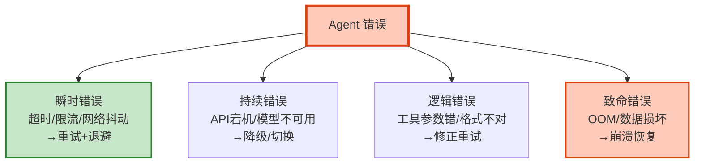

# Agent 错误处理与异常恢复工程化指南

> Agent 在生产中会遇到各种错误：LLM API 超时、工具调用失败、上下文超长、模型返回格式错误。怎么让 Agent 在错误发生后优雅恢复而不是直接崩溃？本指南系统讲解错误分类、恢复策略、重试模式、降级链、错误传播控制。

---

## 1. 错误分类体系

### 错误类型与恢复策略



### 错误分类表

| 错误类型 | 示例 | 可恢复 | 策略 | 超时 |
|---------|------|--------|------|------|
| 超时 | LLM 30秒无响应 | 是 | 重试+指数退避 | 30s |
| 限流 | 429 Too Many Requests | 是 | 等待+降速 | 5s |
| 网络 | ConnectionError | 是 | 重试 | 3s |
| 工具失败 | API 返回错误 | 部分 | 降级/跳过 | 10s |
| 上下文超长 | ContextWindowExceeded | 是 | 压缩后重试 | - |
| 格式错误 | JSON 解析失败 | 是 | 结构化输出重试 | - |
| 认证失败 | 401 Unauthorized | 否 | 刷新凭证 | - |
| OOM | 内存不足 | 否 | 重启+检查点恢复 | - |

---

## 2. 重试模式

### 指数退避重试

```python
from tenacity import retry, stop_after_attempt, wait_exponential, retry_if_exception_type
import asyncio
import time

class LLMTimeoutError(Exception):
    pass

class RateLimitError(Exception):
    pass

# === LLM 调用重试 ===
@retry(
    stop=stop_after_attempt(3),
    wait=wait_exponential(min=2, max=30, multiplier=1.5),
    retry=retry_if_exception_type((LLMTimeoutError, RateLimitError, asyncio.TimeoutError)),
    before_sleep=lambda rs: print(f"重试 &#123;rs.attempt_number&#125;/3，等待 &#123;rs.next_action.sleep:.1f&#125;s..."),
)
async def safe_llm_call(prompt: str, timeout: float = 30.0):
    """带重试的 LLM 调用"""
    try:
        response = await asyncio.wait_for(
            llm.ainvoke(prompt),
            timeout=timeout,
        )
        return response
    except asyncio.TimeoutError:
        raise LLMTimeoutError(f"LLM 超时 (&#123;timeout&#125;s)")

# === 工具调用重试 ===
@retry(
    stop=stop_after_attempt(2),
    wait=wait_exponential(min=1, max=10),
    retry=retry_if_exception_type((ConnectionError, TimeoutError)),
)
async def safe_tool_call(tool, input_data: dict):
    """带重试的工具调用"""
    return await tool.ainvoke(input_data)
```

### 重试策略选择

```python
@dataclass
class RetryStrategy:
    """重试策略选择器"""

    def get_strategy(self, error: Exception) -> dict:
        """根据错误类型选择重试策略"""
        error_type = type(error).__name__

        strategies = &#123;
            "TimeoutError": &#123;
                "max_attempts": 3,
                "backoff": "exponential",
                "min_wait": 2,
                "max_wait": 30,
                "jitter": True,  # 添加随机抖动
            &#125;,
            "RateLimitError": &#123;
                "max_attempts": 5,
                "backoff": "fixed",  # 限流用固定等待
                "min_wait": 5,
                "max_wait": 60,
                "respect_retry_after": True,  # 尊重 Retry-After 头
            &#125;,
            "ConnectionError": &#123;
                "max_attempts": 3,
                "backoff": "exponential",
                "min_wait": 1,
                "max_wait": 10,
            &#125;,
            "JSONDecodeError": &#123;
                "max_attempts": 2,
                "backoff": "none",
                "fix_action": "use_structured_output",  # 换结构化输出
            &#125;,
        &#125;

        return strategies.get(error_type, &#123;
            "max_attempts": 1,
            "backoff": "none",
            "action": "fallback",
        &#125;)
```

---

## 3. 降级链

### 多级降级

```python
@dataclass
class DegradationChain:
    """多级降级链"""

    async def invoke_with_fallback(self, prompt: str) -> str:
        """带降级链的调用"""
        # Level 1: 主模型 (GPT-4o, 30s 超时)
        try:
            return await self._call_model("gpt-4o", prompt, timeout=30)
        except Exception as e:
            print(f"⚠️ GPT-4o 失败: &#123;e&#125;")

        # Level 2: 便宜模型 (GPT-4o-mini, 15s)
        try:
            return await self._call_model("gpt-4o-mini", prompt, timeout=15)
        except Exception as e:
            print(f"⚠️ GPT-4o-mini 失败: &#123;e&#125;")

        # Level 3: 缓存
        cached = await self._check_cache(prompt)
        if cached:
            return cached + "\n[来源：缓存]"

        # Level 4: 简化回复
        return "抱歉，服务暂时不可用，请稍后重试。"

    async def tool_with_fallback(self, tool_name: str, args: dict) -> str:
        """工具降级链"""
        # Level 1: 主工具
        try:
            return await self._call_tool(tool_name, args)
        except Exception:
            pass

        # Level 2: 替代工具
        alternatives = &#123;
            "web_search": ["duckduckgo_search", "bing_search"],
            "calculator": ["python_eval"],
            "database_query": ["cached_query"],
        &#125;
        for alt in alternatives.get(tool_name, []):
            try:
                return await self._call_tool(alt, args)
            except Exception:
                continue

        # Level 3: LLM 兜底
        try:
            llm = ChatOpenAI(model="gpt-4o-mini")
            response = await llm.ainvoke(
                f"工具 &#123;tool_name&#125; 不可用，根据你的知识回答：&#123;args&#125;"
            )
            return response.content + "\n[注意：结果可能不准确]"
        except:
            pass

        # Level 4: 默认值
        return f"工具 &#123;tool_name&#125; 暂时不可用"

    async def _call_model(self, model: str, prompt: str, timeout: float) -> str:
        llm = ChatOpenAI(model=model, temperature=0)
        result = await asyncio.wait_for(llm.ainvoke(prompt), timeout=timeout)
        return result.content

    async def _check_cache(self, prompt: str) -> str:
        return None

    async def _call_tool(self, name: str, args: dict) -> str:
        return f"结果: &#123;args&#125;"
```

---

## 4. 错误传播控制

### LangGraph 中的错误处理

```python
from langgraph.graph import StateGraph, START, END
from typing import TypedDict

class ErrorAwareState(TypedDict):
    messages: list
    error: str
    error_type: str
    retry_count: int
    degraded: bool
    result: str

async def llm_node(state: ErrorAwareState):
    """带错误处理的 LLM 节点"""
    try:
        response = await safe_llm_call(state["messages"][-1].content)
        return &#123;"result": response.content, "error": "", "retry_count": 0&#125;
    except LLMTimeoutError:
        return &#123;"error": "timeout", "error_type": "transient", "retry_count": state.get("retry_count", 0) + 1&#125;
    except RateLimitError:
        return &#123;"error": "rate_limited", "error_type": "transient", "retry_count": state.get("retry_count", 0) + 1&#125;
    except Exception as e:
        return &#123;"error": str(e), "error_type": "persistent", "retry_count": state.get("retry_count", 0)&#125;

async def fallback_node(state: ErrorAwareState):
    """降级节点"""
    result = await DegradationChain().invoke_with_fallback(state["messages"][-1].content)
    return &#123;"result": result, "degraded": True, "error": ""&#125;

async def error_log_node(state: ErrorAwareState):
    """错误日志节点"""
    if state.get("error"):
        logger.error("agent.error",
            error=state["error"],
            error_type=state.get("error_type", "unknown"),
            retry_count=state.get("retry_count", 0),
            degraded=state.get("degraded", False),
        )
    return &#123;&#125;

def route_by_error(state: ErrorAwareState):
    """根据错误状态路由"""
    error = state.get("error", "")
    retry_count = state.get("retry_count", 0)

    if not error:
        return END  # 无错误，完成

    if state.get("error_type") == "transient" and retry_count < 3:
        return "retry"  # 瞬时错误，重试

    if not state.get("degraded"):
        return "fallback"  # 还没降级，尝试降级

    return END  # 已经降级，完成

# 构建错误感知的图
graph = StateGraph(ErrorAwareState)
graph.add_node("llm", llm_node)
graph.add_node("retry", llm_node)  # 重试就是再调 LLM
graph.add_node("fallback", fallback_node)
graph.add_node("error_log", error_log_node)

graph.add_edge(START, "llm")
graph.add_edge("llm", "error_log")
graph.add_conditional_edges("error_log", route_by_error, &#123;
    "retry": "retry",
    "fallback": "fallback",
    END: END,
&#125;)
graph.add_edge("retry", "error_log")
graph.add_edge("fallback", "error_log")

error_aware_agent = graph.compile()
```

---

## 5. 上下文超长处理

```python
async def handle_context_overflow(state: dict):
    """处理上下文超长错误"""
    try:
        return await llm.ainvoke(state["messages"])
    except Exception as e:
        if "context" in str(e).lower() or "token" in str(e).lower():
            # 上下文超长 → 压缩后重试
            compressor = ConversationCompressor()
            compressed = await compressor.compress_if_needed(
                state["messages"], max_tokens=4000
            )
            return await llm.ainvoke(compressed)
        raise  # 其他错误继续抛出
```

---

## 6. 检查清单

| 检查项 | 状态 |
|--------|------|
| 理解错误分类体系 | ☐ |
| 实现了指数退避重试 | ☐ |
| 实现了重试策略选择器 | ☐ |
| 实现了多级降级链 | ☐ |
| 实现了工具降级 | ☐ |
| 在 LangGraph 中集成了错误路由 | ☐ |
| 处理了上下文超长 | ☐ |
| 有错误日志记录 | ☐ |

---

## 7. 与其他知识库的关联

| 关联编号 | 文档 | 关系 |
|----------|------|------|
| 23 | 错误处理最佳实践 | 错误处理 |
| 25 | 反模式与陷阱 | 反模式 |
| 139 | Agent 错误恢复与重试策略 | 重试 |
| 171 | Agent 错误恢复 | 恢复 |
| 219 | 错误处理 | 处理 |
| 352 | 降级链断路器 | 降级 |
| 429 | Agent 可恢复性与容错编排 | 可恢复性 |
| 473 | Agent 可靠性与韧性工程 | 韧性 |
| 487 | Agent 最佳实践 | 最佳实践 |
