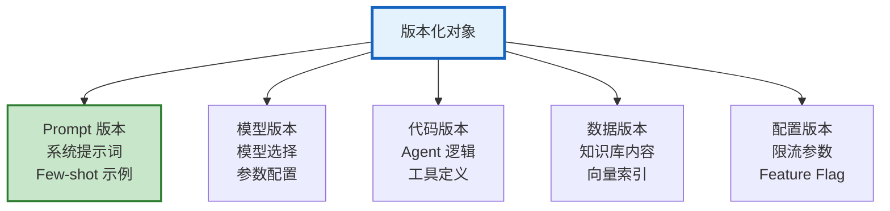

# Agent 回滚与版本管理工程化指南

> 新版 Prompt 上线后回答质量下降——怎么在 30 秒内回滚到旧版本？新模型切换后用户投诉——怎么一键切回？本指南系统讲解版本管理工程化、一键回滚机制、自动回滚触发、版本对比验证。

---

## 1. 版本管理工程化

### 版本化对象



### 版本注册中心

```python
from dataclasses import dataclass, field
from datetime import datetime
from enum import Enum

class VersionStatus(Enum):
    DRAFT = "draft"
    TESTING = "testing"
    PRODUCTION = "production"
    RETIRED = "retired"
    ROLLED_BACK = "rolled_back"

@dataclass
class VersionRegistry:
    """版本注册中心"""

    versions: dict = field(default_factory=dict)

    async def register(self, component: str, version: str, content: any,
                      author: str, description: str = "") -> dict:
        """注册新版本"""
        key = f"&#123;component&#125;:&#123;version&#125;"
        record = &#123;
            "component": component,  # prompt/model/code/data/config
            "version": version,
            "content": content,
            "author": author,
            "description": description,
            "status": VersionStatus.DRAFT.value,
            "created_at": datetime.utcnow().isoformat(),
            "deployed_at": None,
            "retired_at": None,
        &#125;
        self.versions[key] = record
        return record

    async def promote(self, component: str, version: str, status: str):
        """提升版本状态"""
        key = f"&#123;component&#125;:&#123;version&#125;"
        if key in self.versions:
            if status == "production":
                # 将其他生产版本降级
                for k, v in self.versions.items():
                    if v["component"] == component and v["status"] == "production":
                        v["status"] = VersionStatus.RETIRED.value
                        v["retired_at"] = datetime.utcnow().isoformat()
            self.versions[key]["status"] = status
            if status == "production":
                self.versions[key]["deployed_at"] = datetime.utcnow().isoformat()

    async def get_production(self, component: str) -> dict:
        """获取当前生产版本"""
        for k, v in self.versions.items():
            if v["component"] == component and v["status"] == "production":
                return v
        return None

    async def get_previous(self, component: str) -> dict:
        """获取上一个生产版本（用于回滚）"""
        retired = [
            v for v in self.versions.values()
            if v["component"] == component and v["status"] == "retired"
        ]
        if retired:
            retired.sort(key=lambda x: x.get("retired_at", ""), reverse=True)
            return retired[0]
        return None

    async def rollback(self, component: str) -> dict:
        """回滚到上一个版本"""
        current = await self.get_production(component)
        previous = await self.get_previous(component)

        if not previous:
            return &#123;"success": False, "reason": "无历史版本可回滚"&#125;

        # 当前版本标记为回滚
        if current:
            current["status"] = VersionStatus.ROLLED_BACK.value

        # 前一版本恢复为生产
        previous["status"] = VersionStatus.PRODUCTION.value
        previous["deployed_at"] = datetime.utcnow().isoformat()

        return &#123;
            "success": True,
            "rolled_back_from": current["version"] if current else None,
            "rolled_back_to": previous["version"],
            "component": component,
        &#125;
```

---

## 2. 一键回滚

```python
@dataclass
class OneClickRollback:
    """一键回滚"""

    registry: VersionRegistry = field(default_factory=VersionRegistry)

    async def rollback_all(self) -> dict:
        """一键回滚所有组件"""
        components = ["prompt", "model", "config", "code"]
        results = &#123;&#125;

        for component in components:
            result = await self.registry.rollback(component)
            results[component] = result

        all_success = all(r.get("success") for r in results.values())

        return &#123;
            "success": all_success,
            "results": results,
            "action": "全部回滚完成" if all_success else "部分回滚失败",
        &#125;

    async def rollback_prompt(self) -> dict:
        """只回滚 Prompt"""
        return await self.registry.rollback("prompt")

    async def rollback_model(self) -> dict:
        """只回滚模型"""
        return await self.registry.rollback("model")

    async def emergency_rollback(self) -> dict:
        """紧急回滚：一键全部回滚"""
        print("🚨 紧急回滚！")
        return await self.rollback_all()
```

---

## 3. 自动回滚触发

```python
@dataclass
class AutoRollbackTrigger:
    """自动回滚触发器"""

    thresholds = &#123;
        "error_rate": 0.10,        # 错误率 > 10%
        "quality_score": 0.6,      # 质量分 < 0.6
        "latency_p95_ms": 60000,   # P95 > 60 秒
        "user_complaint_rate": 0.05,  # 投诉率 > 5%
    &#125;

    async def monitor_and_rollback(self, metrics: dict) -> dict:
        """监控指标，达到阈值自动回滚"""
        triggers = []

        # 检查每个指标
        if metrics.get("error_rate", 0) > self.thresholds["error_rate"]:
            triggers.append(&#123;"metric": "error_rate", "value": metrics["error_rate"]&#125;)

        if metrics.get("quality_score", 1) < self.thresholds["quality_score"]:
            triggers.append(&#123;"metric": "quality_score", "value": metrics["quality_score"]&#125;)

        if metrics.get("latency_p95_ms", 0) > self.thresholds["latency_p95_ms"]:
            triggers.append(&#123;"metric": "latency_p95_ms", "value": metrics["latency_p95_ms"]&#125;)

        if triggers:
            print(f"⚠️ 触发自动回滚: &#123;triggers&#125;")
            rollback = OneClickRollback()
            result = await rollback.emergency_rollback()

            # 通知
            await self._notify_team(triggers, result)

            return &#123;"auto_rolled_back": True, "triggers": triggers, "result": result&#125;

        return &#123;"auto_rolled_back": False&#125;

    async def _notify_team(self, triggers: list, result: dict):
        """通知团队"""
        message = f"🚨 自动回滚已触发\n触发原因: &#123;triggers&#125;\n回滚结果: &#123;result&#125;"
        print(message)
```

---

## 4. 版本对比验证

```python
@dataclass
class VersionComparison:
    """版本对比验证"""

    async def compare(self, old_version: dict, new_version: dict,
                     test_cases: list) -> dict:
        """对比新旧版本"""
        results = &#123;
            "old": &#123;"passed": 0, "failed": 0, "scores": []&#125;,
            "new": &#123;"passed": 0, "failed": 0, "scores": []&#125;,
        &#125;

        for case in test_cases:
            # 用旧版本
            old_result = await self._run_version(old_version, case)
            old_score = self._score(old_result, case["expected"])
            results["old"]["scores"].append(old_score)

            # 用新版本
            new_result = await self._run_version(new_version, case)
            new_score = self._score(new_result, case["expected"])
            results["new"]["scores"].append(new_score)

        # 统计
        old_avg = sum(results["old"]["scores"]) / len(results["old"]["scores"])
        new_avg = sum(results["new"]["scores"]) / len(results["new"]["scores"])

        return &#123;
            "old_avg_score": old_avg,
            "new_avg_score": new_avg,
            "improvement": new_avg - old_avg,
            "verdict": "新版本更好" if new_avg > old_avg else "旧版本更好，建议不升级",
            "should_deploy": new_avg >= old_avg * 0.95,  # 新版本不低于旧的 95%
        &#125;

    async def _run_version(self, version: dict, case: dict):
        """用指定版本运行"""
        pass

    def _score(self, result, expected) -> float:
        return 0.8
```

---

## 5. 检查清单

| 检查项 | 状态 |
|--------|------|
| 实现了版本注册中心 | ☐ |
| 支持多组件版本管理 | ☐ |
| 实现了一键回滚 | ☐ |
| 实现了自动回滚触发 | ☐ |
| 实现了版本对比验证 | ☐ |
| 有紧急回滚预案 | ☐ |
| 有回滚通知机制 | ☐ |
| 有版本历史查询 | ☐ |

---

## 6. 与其他知识库的关联

| 关联编号 | 文档 | 关系 |
|----------|------|------|
| 30 | Prompt 版本管理 | 版本 |
| 91 | Agent 工具版本管理 | 版本 |
| 141 | 版本管理与灰度发布 | 灰度 |
| 161 | Prompt 版本管理 | 版本 |
| 173 | 版本管理与灰度发布 | 灰度 |
| 193 | Prompt 版本管理与实验 | 实验 |
| 221 | Agent 工具版本管理 | 版本 |
| 344 | 版本兼容 | 兼容 |
| 374 | 版本兼容与平滑迁移 | 迁移 |
| 481 | Agent 变更管理 | 变更 |
| 490 | Agent 版本兼容与升级 | 升级 |
| 510 | Agent 配置热更新 | 配置 |
