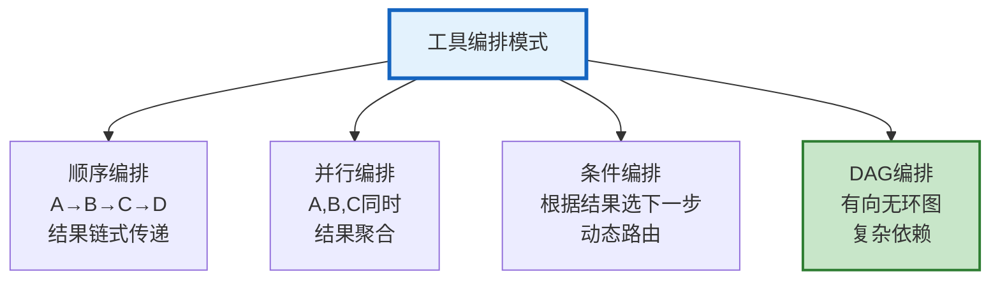

# Agent 工具编排与动态工具链指南

> Agent 不是随机调工具——需要按顺序编排：先搜索→再分析→最后生成报告。工具之间有依赖、有条件、有并行。本指南系统讲解工具链编排模式、动态工具发现、工具依赖图、工具结果传递。

---

## 1. 工具链编排模式

### 四种编排模式



---

## 2. 顺序编排

```python
from dataclasses import dataclass, field
from typing import Any

@dataclass
class ToolChainStep:
    """工具链步骤"""
    name: str
    tool_name: str
    input_mapping: dict     # 输入映射：&#123;参数名: 前一步输出键&#125;
    output_key: str         # 输出存储键
    condition: str = ""      # 执行条件

@dataclass
class SequentialOrchestrator:
    """顺序编排器"""

    async def execute(self, steps: list, initial_input: dict) -> dict:
        """按顺序执行工具链"""
        context = initial_input.copy()
        results = &#123;&#125;

        for step in steps:
            # 检查条件
            if step.condition and not self._check_condition(step.condition, context):
                print(f"⏭️ 跳过步骤 &#123;step.name&#125;（条件不满足）")
                continue

            # 映射输入
            input_data = self._map_input(step.input_mapping, context)

            # 执行工具
            print(f"🔧 执行 &#123;step.name&#125; (&#123;step.tool_name&#125;)...")
            try:
                result = await self._execute_tool(step.tool_name, input_data)
                results[step.output_key] = result
                context[step.output_key] = result
                print(f"  ✅ 完成")
            except Exception as e:
                print(f"  ❌ 失败: &#123;e&#125;")
                results[f"&#123;step.output_key&#125;_error"] = str(e)
                # 决定是否继续
                break

        return &#123;"results": results, "final_context": context&#125;

    def _map_input(self, mapping: dict, context: dict) -> dict:
        """从上下文映射输入"""
        input_data = &#123;&#125;
        for param, source_key in mapping.items():
            if source_key in context:
                input_data[param] = context[source_key]
        return input_data

    def _check_condition(self, condition: str, context: dict) -> bool:
        """检查条件"""
        # 简化：实际中用表达式引擎
        return True

    async def _execute_tool(self, tool_name: str, input_data: dict) -> Any:
        """执行工具"""
        # 实际中从工具注册表获取
        return f"&#123;tool_name&#125;的结果: &#123;input_data&#125;"

# 定义工具链
research_chain = [
    ToolChainStep(
        name="搜索", tool_name="web_search",
        input_mapping=&#123;"query": "user_query"&#125;,
        output_key="search_results",
    ),
    ToolChainStep(
        name="分析", tool_name="analyze",
        input_mapping=&#123;"data": "search_results"&#125;,
        output_key="analysis",
    ),
    ToolChainStep(
        name="生成报告", tool_name="generate_report",
        input_mapping=&#123;"analysis": "analysis", "sources": "search_results"&#125;,
        output_key="final_report",
    ),
]

# 执行
orchestrator = SequentialOrchestrator()
result = await orchestrator.execute(research_chain, &#123;"user_query": "AI发展趋势"&#125;)
```

---

## 3. 动态工具发现

```python
@dataclass
class DynamicToolDiscovery:
    """动态工具发现：运行时加载可用工具"""

    async def discover_tools(self, source: str = "mcp") -> dict:
        """发现可用工具"""
        if source == "mcp":
            return await self._discover_mcp_tools()
        elif source == "registry":
            return await self._discover_registry_tools()
        elif source == "config":
            return await self._discover_config_tools()

    async def _discover_mcp_tools(self):
        """从 MCP Server 发现工具"""
        from langchain_mcp_adapters.client import MultiServerMCPClient

        client = MultiServerMCPClient(&#123;
            "filesystem": &#123;
                "command": "npx",
                "args": ["-y", "@modelcontextprotocol/server-filesystem", "/data"],
                "transport": "stdio",
            &#125;,
        &#125;)

        tools = await client.get_tools()
        return &#123;
            "source": "mcp",
            "count": len(tools),
            "tools": [&#123;"name": t.name, "description": t.description[:80]&#125; for t in tools],
        &#125;

    async def select_tools_for_query(self, query: str, available_tools: list) -> list:
        """根据查询选择相关工具"""
        llm = ChatOpenAI(model="gpt-4o-mini", temperature=0)

        tool_list = "\n".join([
            f"- &#123;t.name&#125;: &#123;t.description[:80]&#125;" for t in available_tools
        ])

        response = await llm.ainvoke(
            f"""根据查询选择需要的工具（最多5个）。

可用工具:
&#123;tool_list&#125;

查询: &#123;query&#125;

只返回工具名称，逗号分隔。"""
        )

        selected_names = [n.strip() for n in response.content.split(",")]
        return [t for t in available_tools if t.name in selected_names]
```

---

## 4. 工具依赖图

```python
@dataclass
class ToolDependencyGraph:
    """工具依赖图"""

    async def build_graph(self, steps: list) -> dict:
        """构建依赖图"""
        nodes = &#123;&#125;
        edges = []

        for step in steps:
            nodes[step.name] = &#123;
                "tool": step.tool_name,
                "dependencies": [],
            &#125;

            # 分析输入依赖
            for param, source in step.input_mapping.items():
                # 找到产出这个数据的步骤
                for prev_step in steps:
                    if prev_step.output_key == source:
                        nodes[step.name]["dependencies"].append(prev_step.name)
                        edges.append((prev_step.name, step.name))

        return &#123;"nodes": nodes, "edges": edges&#125;

    async def topological_sort(self, graph: dict) -> list:
        """拓扑排序"""
        from collections import defaultdict, deque

        adj = defaultdict(list)
        in_degree = defaultdict(int)

        for from_node, to_node in graph["edges"]:
            adj[from_node].append(to_node)
            in_degree[to_node] += 1

        # 入度为 0 的节点
        queue = deque([n for n in graph["nodes"] if in_degree[n] == 0])
        sorted_nodes = []

        while queue:
            node = queue.popleft()
            sorted_nodes.append(node)
            for neighbor in adj[node]:
                in_degree[neighbor] -= 1
                if in_degree[neighbor] == 0:
                    queue.append(neighbor)

        return sorted_nodes
```

---

## 5. 工具结果传递

```python
@dataclass
class ToolResultPasser:
    """工具结果传递器"""

    async def pass_result(self, from_step: str, to_step: str,
                          result: Any, mapping: dict) -> dict:
        """传递结果到下一步"""
        passed = &#123;&#125;
        for param, source_key in mapping.items():
            if isinstance(result, dict):
                passed[param] = result.get(source_key, result)
            else:
                passed[param] = result
        return passed

    async def aggregate_parallel_results(self, results: list, strategy: str = "merge") -> Any:
        """聚合并行工具结果"""
        if strategy == "merge":
            merged = &#123;&#125;
            for r in results:
                if isinstance(r, dict):
                    merged.update(r)
            return merged
        elif strategy == "list":
            return results
        elif strategy == "best":
            # LLM 选最佳
            llm = ChatOpenAI(model="gpt-4o-mini")
            prompt = f"从以下结果中选择最好的：\n&#123;results&#125;\n只回答序号。"
            response = await llm.ainvoke(prompt)
            try:
                idx = int(response.content.strip())
                return results[idx]
            except:
                return results[0]
```

---

## 6. 检查清单

| 检查项 | 状态 |
|--------|------|
| 理解四种编排模式 | ☐ |
| 实现了顺序编排器 | ☐ |
| 实现了动态工具发现 | ☐ |
| 实现了工具依赖图 | ☐ |
| 实现了拓扑排序 | ☐ |
| 实现了结果传递 | ☐ |
| 实现了并行结果聚合 | ☐ |
| 实现了条件执行 | ☐ |

---

## 7. 与其他知识库的关联

| 关联编号 | 文档 | 关系 |
|----------|------|------|
| 15 | 工具调用全链路 | 全链路 |
| 54 | Agent 工具链设计 | 工具链 |
| 83 | Agent 工具链编排 | 编排 |
| 142 | Agent 工具链设计 | 设计 |
| 174 | Agent 工具链设计深度 | 深度 |
| 243 | 工具链编排 | 编排 |
| 316 | 工作流编排 | 工作流 |
| 395 | Agent 工具动态发现 | 动态发现 |
| 427 | MCP 协议 | MCP |
| 466 | Agent 数据流与 DAG | DAG |
| 495 | Agent 工具选择与智能编排 | 选择 |
