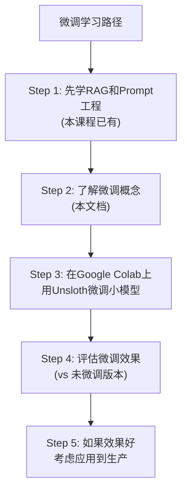

# 模型微调入门

> 当 RAG + Prompt 工程不够时，微调是下一步。这份指南覆盖微调的基本概念和入门路径。

---

## 一、微调的基本概念

```mermaid
graph TB
    subgraph 微调原理 &#123;"微调是什么"&#125;
        B["预训练模型<br/>(如Llama3/Qwen2)<br/>学过互联网通用知识"]
        B --> FT["+ 微调数据<br/>(你的领域数据)<br/>调整模型参数"]
        FT --> R["微调后模型<br/>在特定领域表现更好"]
        Note1["类比: 大学生(预训练)<br/>+ 岗位培训(微调)<br/>= 专业人才(微调模型)"]
    end

    style 微调原理 fill:'#E3F2FD'
    style Note1 fill:'#C8E6C9'
```

## 二、微调 vs RAG vs Prompt 工程

```mermaid
graph LR
    subgraph 渐进路径 &#123;"从简单到复杂的优化路径"&#125;
        S1["Step 1: Prompt工程<br/>调整System Prompt/Few-Shot<br/>成本: ★☆☆<br/>效果: 基线"]
        S1 --> S2["Step 2: RAG<br/>外挂知识库<br/>成本: ★★☆<br/>效果: +知识"]
        S2 --> S3["Step 3: 微调<br/>调整模型参数<br/>成本: ★★★★<br/>效果: +风格/术语"]
        S3 --> S4["Step 4: RAG+微调<br/>最佳效果<br/>成本: ★★★★★"]
    end

    style S1 fill:'#C8E6C9'
    style S2 fill:'#E3F2FD'
    style S3 fill:'#FFF9C4'
    style S4 fill:'#F3E5F5'
```

## 三、微调方法

### 3.1 全参数微调 vs LoRA

```mermaid
graph TB
    subgraph 全参数 &#123;"全参数微调"&#125;
        F1["调整模型所有参数<br/>效果好但成本极高<br/>需要: 多张GPU<br/>内存: 40GB+(7B模型)"]
    end

    subgraph LoRA &#123;"LoRA/QLoRA（推荐）"&#125;
        L1["只调整少量额外参数<br/>(低秩适配器)<br/>效果接近全参数<br/>需要: 单张GPU<br/>内存: 8-16GB(7B模型)"]
    end

    style 全参数 fill:'#FFCDD2'
    style LoRA fill:'#C8E6C9'
```

### 3.2 LoRA 的原理

```mermaid
graph LR
    subgraph LoRA原理 &#123;"LoRA 原理"&#125;
        O["原始权重矩阵<br/>(冻结不训练)"]
        A["低秩矩阵A<br/>(可训练)"]
        B["低秩矩阵B<br/>(可训练)"]
        R["结果 = 原始 + A×B<br/>(只用训练A和B)"]
        Note1["参数量: 原来的0.1-1%<br/>效果: 接近全参数微调"]
    end

    style LoRA原理 fill:'#E3F2FD'
    style Note1 fill:'#C8E6C9'
```

## 四、微调数据准备

### 4.1 数据格式

```json
// 对话微调数据格式（JSONL）
&#123;"messages": [
  &#123;"role": "system", "content": "你是专业客服"&#125;,
  &#123;"role": "user", "content": "退货流程是什么？"&#125;,
  &#123;"role": "assistant", "content": "7天内可在订单页面申请退货..."&#125;
]&#125;
```

### 4.2 数据质量要求

| 要求 | 说明 |
|------|------|
| 数量 | 至少100条，推荐500-5000条 |
| 质量 | 比GPT-4o-mini的零样本输出更好 |
| 多样性 | 覆盖各种输入类型 |
| 一致性 | 回答风格统一 |
| 准确性 | 答案必须正确 |

## 五、用 Ollama + Unsloth 微调（入门）

```bash
# 微调入门推荐路径
# 1. 用Unsloth框架（最简单的微调工具）
pip install unsloth

# 2. 用Google Colab（免费GPU）
# 3. 选择小模型（Qwen2-1.5B 或 Llama3-8B）
```

```python
# 微调代码示例（概念性）
from unsloth import FastLanguageModel

# 1. 加载模型
model, tokenizer = FastLanguageModel.from_pretrained(
    model_name = "unsloth/Qwen2-1.5B",
    max_seq_length = 2048,
)

# 2. 添加LoRA适配器
model = FastLanguageModel.get_peft_model(
    model,
    r = 16,  # LoRA秩
    target_modules = ["q_proj", "k_proj", "v_proj", "o_proj"],
)

# 3. 准备数据
# (需要格式化为模型要求的格式)

# 4. 训练
from trl import SFTTrainer
trainer = SFTTrainer(
    model = model,
    tokenizer = tokenizer,
    train_dataset = dataset,
    max_seq_length = 2048,
)
trainer.train()

# 5. 保存微调后的模型
model.save_pretrained("my_finetuned_model")

# 6. 用Ollama运行微调模型
# ollama create mymodel -f Modelfile
```

## 六、什么时候不要微调

```mermaid
graph TB
    subgraph 不微调 &#123;"❌ 以下情况不要微调"&#125;
        N1["数据量<100条<br/>(微调会过拟合)"]
        N2["知识频繁更新<br/>(微调后立即过时)"]
        N3["需要引用来源<br/>(微调无法追溯)"]
        N4["预算有限<br/>(微调需要GPU)"]
        N5["团队无ML经验<br/>(微调需要专业知识)"]
        N6["RAG够用<br/>(简单问题不需要微调)"]
    end

    style 不微调 fill:'#FFCDD2'
```

## 七、学习路径建议


