# LangGraph 持久化深度

> Checkpointer 不只是"保存进度"。本指南覆盖持久化后端选择、配置和高级用法。

---

## 一、持久化的价值

```mermaid
graph TB
    subgraph 持久化能力 &#123;"Checkpointer 的四项能力"&#125;
        C1["📦 持久化<br/>重启后恢复对话"]
        C2["⏸️ 中断恢复<br/>暂停后继续"]
        C3["⏪ 时间旅行<br/>回到历史状态"]
        C4["📜 审计追踪<br/>每步State可查"]
    end

    style C1 fill:'#C8E6C9'
    style C3 fill:'#F3E5F5'
```

## 二、后端选择

```python
# 1. MemorySaver（开发用）
from langgraph.checkpoint.memory import MemorySaver
app = graph.compile(checkpointer=MemorySaver())
# ✅ 最快 ✅ 零配置
# ❌ 重启丢失 ❌ 单进程

# 2. SqliteSaver（持久化）
from langgraph.checkpoint.sqlite import SqliteSaver
app = graph.compile(checkpointer=SqliteSaver.from_conn_string("checkpoints.db"))
# ✅ 持久化 ✅ 零配置
# ❌ 单机 ❌ 不支持高并发

# 3. PostgresSaver（生产级）
from langgraph.checkpoint.postgres import PostgresSaver
# app = graph.compile(checkpointer=PostgresSaver.from_conn_string(conn_str))
# ✅ 持久化 ✅ 多实例共享 ✅ 高并发
# ❌ 需要PostgreSQL
```

| 后端 | 持久化 | 多实例 | 性能 | 配置 | 场景 |
|------|--------|--------|------|------|------|
| MemorySaver | ❌ | ❌ | ★★★★★ | ★☆☆ | 开发/调试 |
| SqliteSaver | ✅ | ❌ | ★★★★ | ★★☆ | 单机应用 |
| PostgresSaver | ✅ | ✅ | ★★★☆ | ★★★ | 生产环境 |

## 三、thread_id 与多用户隔离

```python
app = graph.compile(checkpointer=MemorySaver())

# 用户A的对话
config_a = &#123;"configurable": &#123;"thread_id": "user_A"&#125;&#125;
app.invoke(&#123;"input": "我叫张三"&#125;, config=config_a)

# 用户B的对话（完全隔离）
config_b = &#123;"configurable": &#123;"thread_id": "user_B"&#125;&#125;
app.invoke(&#123;"input": "我叫李四"&#125;, config=config_b)

# 用户A恢复对话（记得叫张三）
result = app.invoke(&#123;"input": "我叫什么？"&#125;, config=config_a)
```

## 四、检查点与State操作

```python
# 查看当前State
state = app.get_state(config)
print(state.values)   # 当前State值
print(state.next)     # 下一个要执行的节点

# 查看State历史
for hist in app.get_state_history(config):
    checkpoint_id = hist.config["configurable"]["checkpoint_id"]
    print(f"Checkpoint: &#123;checkpoint_id[:16]&#125;...")
    print(f"  Values: &#123;str(hist.values)[:100]&#125;")
    print(f"  Next: &#123;hist.next&#125;")

# 从历史Checkpoint恢复
config_resume = &#123;"configurable": &#123;"thread_id": "user_A", "checkpoint_id": target_id&#125;&#125;
result = app.invoke(None, config=config_resume)
```

## 五、中断与恢复流程

```mermaid
sequenceDiagram
    participant U as 用户
    participant A as App
    participant C as Checkpointer

    U->>A: invoke(input, config)
    A->>C: 保存初始State
    Note over A: 执行到 interrupt_before
    A->>C: 保存当前State
    A-->>U: 返回当前State（暂停）

    U->>A: update_state(config, &#123;修改&#125;)
    A->>C: 更新State

    U->>A: invoke(None, config) 继续
    A->>C: 读取Checkpoint
    C-->>A: 恢复State
    Note over A: 从暂停处继续
    A-->>U: 返回最终结果
```


