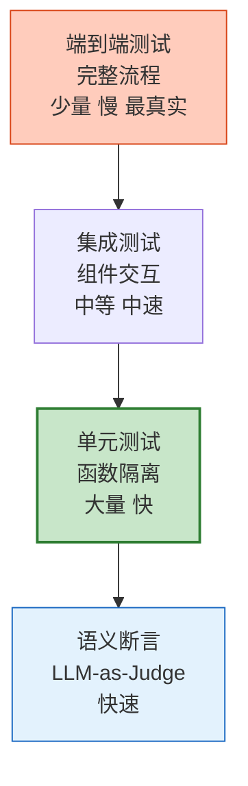

# Agent 自动化测试与质量保障体系指南

> Agent 测试不像传统软件——输入相同输出不同、涉及 LLM 调用、工具调用不确定。本指南深度讲解 Agent 测试金字塔、语义断言、轨迹测试、回归基线、CI/CD 门禁。

---

## 1. Agent 测试金字塔



---

## 2. 测试类型详解

| 类型 | 测什么 | 工具 | 速度 |
|------|--------|------|------|
| 语义断言 | 回答语义是否正确 | DeepEval | 快 |
| 单元测试 | 工具/Prompt/Parser | pytest | 快 |
| 集成测试 | Agent+工具+RAG 组合 | pytest+mock | 中 |
| 轨迹测试 | 工具调用顺序 | DeepEval | 中 |
| 端到端测试 | 完整用户流程 | Playwright | 慢 |
| 回归测试 | 新版本不退化 | 评估集对比 | 中 |
| 负载测试 | 并发和延迟 | Locust | 慢 |

---

## 3. 语义断言测试

```python
from deepeval import assert_test
from deepeval.test_case import LLMTestCase
from deepeval.metrics import AnswerRelevancyMetric, FaithfulnessMetric, GEval
import pytest

class TestAgentQuality:
    """Agent 质量测试套件"""

    @pytest.mark.asyncio
    async def test_answer_relevancy(self):
        """测试回答相关性"""
        response = await agent.ainvoke("什么是 LangChain？")

        test_case = LLMTestCase(
            input="什么是 LangChain？",
            actual_output=response.content,
            expected_output="LangChain 是构建 LLM 应用的框架",
        )
        assert_test(test_case, [AnswerRelevancyMetric(threshold=0.7)])

    @pytest.mark.asyncio
    async def test_faithfulness(self):
        """测试忠实度（无幻觉）"""
        response = await rag_agent.ainvoke(
            "RAG 的全称是什么？",
            retrieved_docs=["RAG 是 Retrieval-Augmented Generation"],
        )

        test_case = LLMTestCase(
            input="RAG 的全称是什么？",
            actual_output=response.content,
            retrieval_context=["RAG 是 Retrieval-Augmented Generation"],
        )
        assert_test(test_case, [FaithfulnessMetric(threshold=0.8)])

    @pytest.mark.asyncio
    async def test_tool_selection(self):
        """测试工具选择正确性"""
        from deepeval.test_case import ToolTestCase
        from deepeval.metrics import ToolCorrectnessMetric

        test_case = ToolTestCase(
            input="今天北京天气怎么样？",
            expected_tool="get_weather",
            actual_tool="get_weather",
        )
        assert_test(test_case, [ToolCorrectnessMetric()])

    @pytest.mark.asyncio
    async def test_custom_metric(self):
        """自定义指标"""
        response = await agent.ainvoke("解释 LCEL")

        test_case = LLMTestCase(
            input="解释 LCEL",
            actual_output=response.content,
            expected_output="LangChain Expression Language",
        )

        custom = GEval(
            name="准确性",
            criteria="判断回答是否准确、完整、无误导",
            evaluation_params=["actual_output", "expected_output"],
            threshold=0.75,
        )
        assert_test(test_case, [custom])
```

---

## 4. 回归测试

```python
@dataclass
class RegressionTester:
    """回归测试器"""

    async def run(self, test_cases: list, agent) -> dict:
        """运行回归测试"""
        results = []
        for case in test_cases:
            response = await agent.ainvoke(case["input"])
            score = await self._score(response.content, case["expected"])

            results.append(&#123;
                "input": case["input"][:50],
                "expected": case["expected"][:50],
                "actual": response.content[:50],
                "score": score,
                "passed": score >= 0.7,
            &#125;)

        passed = sum(1 for r in results if r["passed"])
        return &#123;
            "total": len(results),
            "passed": passed,
            "failed": len(results) - passed,
            "pass_rate": passed / len(results) if results else 0,
            "gate": "通过" if passed / len(results) >= 0.8 else "阻止部署",
        &#125;

    async def _score(self, actual: str, expected: str) -> float:
        llm = ChatOpenAI(model="gpt-4o-mini", temperature=0)
        response = await llm.ainvoke(
            f"评分(0-1)。只回答数字。\n期望: &#123;expected[:200]&#125;\n实际: &#123;actual[:200]&#125;"
        )
        try:
            return float(response.content.strip())
        except:
            return 0.5
```

---

## 5. CI/CD 门禁

```python
@dataclass
class QualityGate:
    """CI/CD 质量门禁"""

    thresholds = &#123;
        "pass_rate": 0.80,
        "avg_relevancy": 0.75,
        "faithfulness": 0.85,
        "tool_accuracy": 0.90,
        "max_latency_ms": 30000,
        "max_cost_per_request": 0.02,
    &#125;

    def check(self, results: dict) -> dict:
        checks = &#123;&#125;
        all_passed = True

        for metric, threshold in self.thresholds.items():
            actual = results.get(metric, 0)
            passed = actual >= threshold if "rate" in metric or "accuracy" in metric else actual <= threshold
            checks[metric] = &#123;"threshold": threshold, "actual": actual, "passed": passed&#125;
            if not passed:
                all_passed = False

        return &#123;"all_passed": all_passed, "checks": checks, "action": "可部署" if all_passed else "阻止部署"&#125;
```

---

## 6. 检查清单

| 检查项 | 状态 |
|--------|------|
| 理解 Agent 测试金字塔 | ☐ |
| 实现了语义断言测试 | ☐ |
| 实现了工具选择测试 | ☐ |
| 实现了回归测试 | ☐ |
| 配置了 CI/CD 质量门禁 | ☐ |

---

## 7. 与其他知识库的关联

| 关联编号 | 文档 | 关系 |
|----------|------|------|
| 143 | Agent 测试自动化与 CI | 测试 |
| 435 | LLM 评测工具链 | 评测 |
| 472 | Agent 质量度量 | 质量 |
| 499 | 性能压测 | 压测 |
| 504 | Agent DevOps | DevOps |
