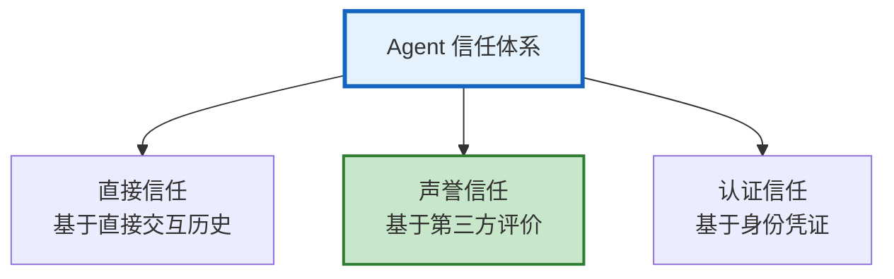

# Agent 信任与声誉系统指南

> 多 Agent 协作中，怎么知道该信任谁？声誉系统记录每个 Agent 的历史表现，让委托方做出明智选择。本指南讲解信任模型、声誉计算、可信度评估、防欺诈机制。

---

## 1. 信任模型



---

## 2. 声誉计算

```python
@dataclass
class ReputationSystem:
    """Agent 声誉系统"""

    interactions: dict = field(default_factory=dict)  # &#123;agent_id: [interactions]&#125;

    async def record(self, agent_id: str, task_result: dict):
        """记录交互结果"""
        self.interactions.setdefault(agent_id, []).append(&#123;
            "task": task_result.get("task", ""),
            "success": task_result.get("success", False),
            "quality": task_result.get("quality", 0.5),
            "timeliness": task_result.get("timeliness", 1.0),
            "timestamp": datetime.utcnow().isoformat(),
        &#125;)

    async def calculate_reputation(self, agent_id: str) -> dict:
        """计算声誉分数"""
        history = self.interactions.get(agent_id, [])
        if not history:
            return &#123;"agent_id": agent_id, "score": 0.5, "level": "新", "interactions": 0&#125;

        total = len(history)
        successes = sum(1 for h in history if h["success"])
        avg_quality = sum(h["quality"] for h in history) / total
        success_rate = successes / total

        # 时间衰减（近期更重要）
        recent = history[-10:]
        recent_quality = sum(h["quality"] for h in recent) / len(recent)

        score = (success_rate * 0.4 + avg_quality * 0.3 + recent_quality * 0.3)

        level = "优秀" if score > 0.85 else "良好" if score > 0.7 else "一般" if score > 0.5 else "差" if score > 0.3 else "不可信"

        return &#123;
            "agent_id": agent_id,
            "score": round(score, 2),
            "level": level,
            "total_interactions": total,
            "success_rate": f"&#123;success_rate:.0%&#125;",
            "avg_quality": round(avg_quality, 2),
            "recent_trend": "↑" if recent_quality > avg_quality else "↓" if recent_quality < avg_quality else "→",
        &#125;

    async def rank_agents(self) -> list:
        """Agent 排名"""
        scores = []
        for agent_id in self.interactions:
            rep = await self.calculate_reputation(agent_id)
            scores.append(rep)
        return sorted(scores, key=lambda x: -x["score"])

    async def recommend_agent(self, task_type: str, min_score: float = 0.7) -> dict:
        """推荐可信赖的 Agent"""
        ranked = await self.rank_agents()
        qualified = [r for r in ranked if r["score"] >= min_score]
        if qualified:
            best = qualified[0]
            return &#123;"recommended": best["agent_id"], "score": best["score"], "reason": f"声誉&#123;best['level']&#125;"&#125;
        return &#123;"recommended": None, "reason": "无可信赖 Agent"&#125;
```

---

## 3. 防欺诈

```python
@dataclass
class AntiFraud:
    """防声誉欺诈"""

    async def detect_collusion(self, ratings: dict) -> dict:
        """检测共谋评分"""
        # 检测多个 Agent 是否互相刷分
        suspicious = []
        for agent_a, ratings_a in ratings.items():
            for agent_b, ratings_b in ratings.items():
                if agent_a != agent_b:
                    mutual_high = sum(1 for r in ratings_a if r.get("target") == agent_b and r.get("score", 0) > 0.9)
                    if mutual_high > 5:
                        suspicious.append(&#123;"agents": [agent_a, agent_b], "mutual_high_ratings": mutual_high&#125;)
        return &#123;"collusion_detected": len(suspicious) > 0, "suspicious_pairs": suspicious&#125;

    async def detect_sybil(self, agent_id: str, network: dict) -> dict:
        """检测女巫攻击（一个实体创建多个身份）"""
        # 基于行为模式、IP、注册时间检测
        return &#123;"agent_id": agent_id, "sybil_risk": "low", "indicators": []&#125;
```

---

## 4. 检查清单

| 检查项 | 状态 |
|--------|------|
| 理解三种信任模型 | ☐ |
| 实现了声誉计算 | ☐ |
| 实现了 Agent 排名 | ☐ |
| 实现了防欺诈 | ☐ |
| 有推荐机制 | ☐ |

---

## 5. 与其他知识库的关联

| 关联编号 | 文档 | 关系 |
|----------|------|------|
| 420 | Agent 注册中心与服务发现 | 注册 |
| 450 | Agent 经济模型 | 经济 |
| 456 | 多 Agent 博弈 | 博弈 |
| 574 | 博弈论与机制设计 | 博弈 |
