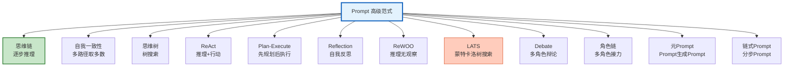

# Agent 提示工程高级模式与范式指南

> Prompt 不只是"请回答"——高级模式包括思维链、自我一致性、树搜索、ReAct、Plan-Execute。本指南深度讲解 12 种高级 Prompt 范式、组合策略、效果对比。

---

## 1. 12 种高级范式



---

## 2. 效果对比

| 范式 | 准确率 | 成本 | 延迟 | 适用 |
|------|--------|------|------|------|
| Zero-shot | 70% | 1x | 快 | 简单 |
| Few-shot | 78% | 1.2x | 快 | 特定领域 |
| CoT | 82% | 1.3x | 中 | 推理 |
| Self-Consistency | 88% | 3-5x | 慢 | 高准确 |
| ToT | 90% | 10x+ | 很慢 | 复杂搜索 |
| ReAct | 85% | 2x | 中 | 工具调用 |
| Plan-Execute | 87% | 2x | 中 | 复杂任务 |
| Reflection | 89% | 2.5x | 慢 | 质量提升 |
| LATS | 92% | 15x+ | 极慢 | 最优解 |
| Debate | 88% | 3x | 慢 | 多角度 |

---

## 3. 组合策略

```python
@dataclass
class PromptOrchestrator:
    """Prompt 范式编排器"""

    async def select_paradigm(self, query: str) -> dict:
        """根据问题特征选择最优范式"""
        llm = ChatOpenAI(model="gpt-4o-mini", temperature=0)

        response = await llm.ainvoke(f"""选择 Prompt 范式。

问题: &#123;query&#125;

输出 JSON:
&#123;&#123;
    "paradigm": "zeroshot/fewshot/cot/selfconsistency/tot/react/planexecute/reflection",
    "reasoning": "选择理由",
    "estimated_cost": "成本估算",
    "estimated_accuracy": "准确率估算"
&#125;&#125;""")

        return json.loads(response.content)

    async def combine_paradigms(self, query: str) -> str:
        """组合多种范式"""
        # Plan-Execute + Reflection + CoT
        llm = ChatOpenAI(model="gpt-4o", temperature=0.3)

        # Step 1: Plan
        plan = await llm.ainvoke(f"制定计划: &#123;query&#125;")

        # Step 2: Execute with CoT
        result = await llm.ainvoke(f"按计划执行(逐步推理):\n计划: &#123;plan.content&#125;\n\n&#123;query&#125;\n\n让我们一步一步思考。")

        # Step 3: Reflect
        refined = await llm.ainvoke(f"审查并改进:\n原始回答: &#123;result.content&#125;\n\n问题: &#123;query&#125;")

        return refined.content
```

---

## 4. 检查清单

| 检查项 | 状态 |
|--------|------|
| 理解 12 种范式 | ☐ |
| 有效果对比表 | ☐ |
| 实现了范式选择 | ☐ |
| 实现了组合策略 | ☐ |

---

## 5. 与其他知识库的关联

| 关联编号 | 文档 | 关系 |
|----------|------|------|
| 12 | Prompt 工程模式 | 模式 |
| 21 | 高级 Prompt 技巧 | 技巧 |
| 138 | Prompt 进阶模式 | 进阶 |
| 468 | 自动 Prompt 优化 | DSPy |
| 513 | 推理链优化 | 推理 |
