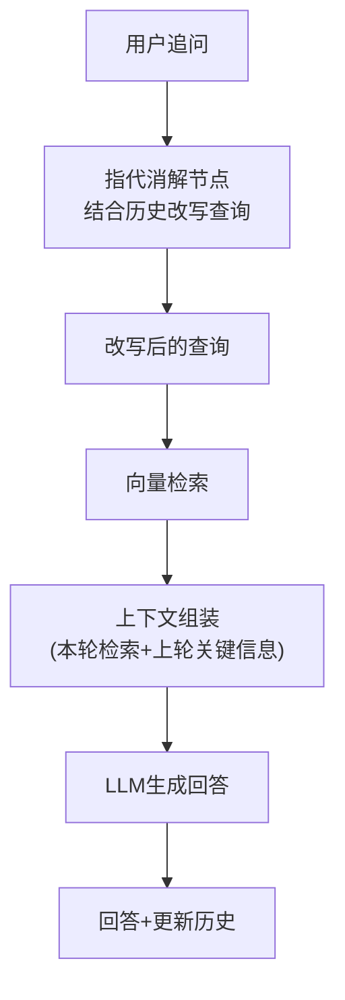

# RAG 多轮对话上下文管理

> 用户追问"那个产品的价格呢"时，RAG 需要理解"那个"指什么。这份指南解决多轮 RAG 的指代消解和上下文传递。

---

## 一、多轮 RAG 的挑战

```mermaid
graph TB
    subgraph 问题 &#123;"多轮RAG的三个核心挑战"&#125;
        C1["❓ 指代消解<br/>'那个'→具体实体"]
        C2["❓ 上下文衔接<br/>'还知道什么'→基于上轮检索"]
        C3["❓ 检索策略<br/>'价格呢'→用上下文扩展查询"]
    end

    style 问题 fill:'#E3F2FD'
```

### 问题示例

```
轮1: 用户: "蓝牙耳机的规格是什么？"
      → RAG检索"蓝牙耳机规格" → 回答"蓝牙5.3，续航32小时..."
轮2: 用户: "那个的价格呢？"
      → ❌ 直接检索"那个的价格" → 检索不到
      → ✅ 先消解: "那个"=蓝牙耳机 → 检索"蓝牙耳机价格" → 正确回答
```

## 二、多轮 RAG 架构



## 三、指代消解实现

```python
from langchain_openai import ChatOpenAI
from langchain_core.prompts import ChatPromptTemplate
from langchain_core.output_parsers import StrOutputParser

llm = ChatOpenAI(model="gpt-4o-mini", temperature=0)

def resolve_coreference(question: str, history: list) -> str:
    """指代消解：结合对话历史改写用户问题"""
    if not history:
        return question

    # 构建历史文本
    history_text = "\n".join(
        f"&#123;m.type&#125;: &#123;m.content[:200]&#125;" for m in history[-6:]  # 最近3轮
    )

    prompt = ChatPromptTemplate.from_template(
        """根据对话历史，将用户当前问题中的指代词替换为具体实体。

        对话历史：
        &#123;history&#125;

        当前问题：&#123;question&#125;

        改写后的问题（只输出问题，不要解释）：
        """
    )
    chain = prompt | llm | StrOutputParser()
    resolved = chain.invoke(&#123;"history": history_text, "question": question&#125;)

    # 如果改写后的查询和原始一样，说明没有指代
    if resolved.strip() == question.strip():
        return question
    return resolved.strip()

# 使用
from langchain_core.messages import HumanMessage, AIMessage

history = [
    HumanMessage(content="蓝牙耳机的规格是什么？"),
    AIMessage(content="蓝牙5.3，续航32小时，IPX5防水..."),
]

resolved = resolve_coreference("那个的价格呢？", history)
# "蓝牙耳机的价格是多少？"
```

## 四、上下文衔接

```python
class MultiTurnRAGState(TypedDict):
    messages: Annotated[list, add]
    current_question: str          # 原始问题
    resolved_question: str         # 消解后的问题
    retrieved_docs: list           # 本轮检索结果
    previous_context: str          # 上轮关键信息
    answer: str

def multi_turn_rag_node(state: MultiTurnRAGState) -> dict:
    """多轮RAG：指代消解→检索→组装→生成"""
    history = state.get("messages", [])
    question = state["current_question"]

    # Step 1: 指代消解
    resolved = resolve_coreference(question, history)

    # Step 2: 检索（用消解后的查询）
    docs = vectorstore.similarity_search(resolved, k=3)
    context = "\n".join(d.page_content for d in docs)

    # Step 3: 组装（加上上轮的关键信息）
    prev_ctx = state.get("previous_context", "")
    if prev_ctx:
        full_context = f"上轮相关：&#123;prev_ctx&#125;\n\n本轮检索：&#123;context&#125;"
    else:
        full_context = context

    # Step 4: 生成
    prompt = ChatPromptTemplate.from_template(
        "基于以下信息回答：\n&#123;context&#125;\n\n问题：&#123;question&#125;"
    )
    chain = prompt | llm | StrOutputParser()
    answer = chain.invoke(&#123;"context": full_context, "question": question&#125;)

    # Step 5: 提取本轮关键信息（供下轮使用）
    extract_prompt = ChatPromptTemplate.from_template(
        "提取以下回答中的关键实体和信息（不超过50字）：\n&#123;answer&#125;\n\n关键信息："
    )
    key_info = (extract_prompt | llm | StrOutputParser()).invoke(&#123;"answer": answer&#125;)

    return &#123;
        "resolved_question": resolved,
        "retrieved_docs": docs,
        "previous_context": key_info,
        "answer": answer,
    &#125;
```

## 五、检索策略对比

```mermaid
graph TB
    subgraph 策略对比 &#123;"三种多轮RAG检索策略"&#125;
        S1["策略1: 直接检索<br/>'那个价格呢'→检索<br/>❌ 检索不到"]
        S2["策略2: 消解后检索<br/>'蓝牙耳机价格'→检索<br/>✅ 正确但多1次LLM调用"]
        S3["策略3: 上下文拼接检索<br/>'蓝牙耳机 规格'+'那个价格'<br/>→拼接后检索 ✅ 省LLM调用"]
    end

    style S1 fill:'#FFCDD2'
    style S2 fill:'#C8E6C9'
    style S3 fill:'#E3F2FD'
```

```python
def context_concat_search(question: str, history: list, vectorstore) -> list:
    """策略3: 上下文拼接检索（省LLM调用）"""
    # 从历史中提取最近提到的实体
    entities = []
    for msg in history[-4:]:
        if hasattr(msg, 'content'):
            # 简单提取：取历史消息中的名词性内容
            entities.append(msg.content[:50])

    # 拼接查询
    context_query = " ".join(entities[-2:]) + " " + question
    return vectorstore.similarity_search(context_query, k=3)
```

## 六、策略选择

| 场景 | 推荐策略 | 原因 |
|------|---------|------|
| 简单FAQ | 直接检索 | 无需消解 |
| 追问频繁 | 指代消解 | 准确率高 |
| 追问简单 | 上下文拼接 | 省LLM调用 |
| 长对话 | 消解+历史截断 | 防Token溢出 |
