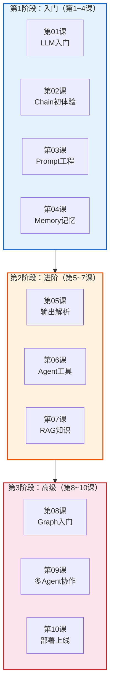

# 第01课：大语言模型应用开发入门

> **学习目标**：理解什么是大语言模型（LLM）、LLM 应用开发的核心挑战、以及 LangChain 如何解决这些挑战。本课结束后，你将对"为什么需要 LangChain"有清晰的认知。

---

## 本课导航

| 小节 | 主题 | 预计时间 |
|------|------|---------|
| 1 | 什么是大语言模型 | 10 分钟 |
| 2 | LLM 能做什么、不能做什么 | 10 分钟 |
| 3 | 直接调用 LLM 的痛点 | 15 分钟 |
| 4 | LangChain 是什么——用类比理解 | 15 分钟 |
| 5 | 学习路线图 | 10 分钟 |

---

## 1. 什么是大语言模型

### 生活类比

想象你有一个**读过全世界所有书的超级学霸朋友**——你问他任何问题，他都能根据记忆给出回答。但他有几个特点：

- **只会"说"，不会"做"**：他能告诉你怎么做菜，但不会替你下厨
- **记忆有截止日期**：他的知识只到某个时间点，不知道昨天发生的事
- **有时会"编"**：如果他不确定，可能编出一个看起来很合理的假答案
- **不了解你的私事**：他不知道你的公司文件、个人笔记

这个"超级学霸朋友"就是**大语言模型（LLM）**。

### 技术解释

大语言模型（Large Language Model，LLM）是一种基于深度学习的 AI 系统，通过阅读海量文本数据，学会理解和生成人类语言。

| 关键概念 | 说明 | 类比 |
|----------|------|------|
| 训练数据 | 海量互联网文本（网页、书籍、代码等） | 学霸读过的书 |
| 参数量 | 模型的"脑容量"（如 GPT-4 有超万亿参数） | 学霸的脑容量 |
| 上下文窗口 | 模型一次能"看到"的文字长度 | 学霸的短时记忆容量 |
| Token | 模型处理文字的最小单位（约 3/4 个英文单词） | 学霸认识的"字" |
| Temperature | 输出的随机性（0=确定，1=有创意） | 学霸回答有多"放飞" |

### 常见的 LLM

| 模型 | 公司 | 特点 | 你可能听过的方式 |
|------|------|------|----------------|
| GPT-4o | OpenAI | 综合能力最强 | ChatGPT |
| Claude 3.5 | Anthropic | 代码和推理强 | Claude.ai |
| Gemini | Google | 上下文超长 | Google AI |
| 文心一言 | 百度 | 中文优秀 | 文心一言 App |
| DeepSeek | 深度求索 | 性价比极高 | DeepSeek App |
| Llama 3 | Meta | 开源免费 | 本地部署 |

---

## 2. LLM 能做什么、不能做什么

### 能做什么

| 能力 | 举例 |
|------|------|
| 回答问题 | "什么是量子计算？" |
| 生成文本 | 写邮件、写文章、写代码 |
| 翻译 | 中英互译、多语言翻译 |
| 总结 | 将长文档浓缩为摘要 |
| 对话 | 多轮聊天、角色扮演 |
| 推理 | 数学题、逻辑推理 |
| 编程 | 写代码、解释代码、调试 |

### 不能做什么（裸 LLM 的局限）

| 局限 | 说明 | 生活类比 |
|------|------|---------|
| **知识过时** | 训练数据有截止日期 | 学霸不知道昨天的新闻 |
| **没有记忆** | 每次对话从头开始 | 每次见面都忘了你是谁 |
| **会"幻觉"** | 编造看似合理的事实 | 学霸不懂装懂 |
| **无法访问你的数据** | 不知道你的私人文件 | 学霸没看过你的笔记本 |
| **无法执行操作** | 只能生成文字 | 学霸只会说，不会帮你点外卖 |
| **无法精确计算** | 复杂计算可能出错 | 学霸心算偶尔翻车 |

> **关键认知**：这些"不能"正是 LangChain 要解决的问题。

---

## 3. 直接调用 LLM 的痛点

### 裸调用示例

假设不用任何框架，直接调用 OpenAI API：

```python
import openai

# 裸调用 OpenAI API
response = openai.chat.completions.create(
    model="gpt-4o-mini",
    messages=[
        {"role": "system", "content": "你是一个助手"},
        {"role": "user", "content": "什么是LangChain？"}
    ],
    temperature=0.7
)
print(response.choices[0].message.content)
```

看起来很简单？但当需求变复杂时，问题就来了：

### 痛点逐一展开

#### 痛点1：想换一个模型怎么办？

```python
# 用 OpenAI
response = openai.chat.completions.create(...)

# 想换成 Claude？整个代码都要改！
response = anthropic.messages.create(...)

# 想换成本地模型？又得改！
response = ollama.chat(...)
```

> **问题**：每家 API 格式不同，换模型=重写代码。

#### 痛点2：想记住对话历史怎么办？

```python
# 第一轮
response1 = openai.chat.completions.create(
    messages=[{"role": "user", "content": "我叫张三"}]
)

# 第二轮——模型已经忘了你叫什么！
response2 = openai.chat.completions.create(
    messages=[{"role": "user", "content": "我叫什么？"}]
    # 需要手动把前面的对话全部传进去...
)
```

> **问题**：模型本身没有记忆，需要手动管理对话历史。

#### 痛点3：想让 AI 查询你的文档怎么办？

```python
# 模型不知道你的公司手册
response = openai.chat.completions.create(
    messages=[{"role": "user", "content": "我们公司的报销流程是什么？"}]
)
# 模型：我不知道你们公司的流程。
```

> **问题**：模型只有训练数据，不知道你的私有信息。

#### 痛点4：想让 AI 执行操作（如搜索网络、查天气）怎么办？

```python
# 模型只会生成文字，不会"动手"
response = openai.chat.completions.create(
    messages=[{"role": "user", "content": "帮我查一下北京今天天气"}]
)
# 模型：我无法上网查询实时天气。
```

> **问题**：模型只能"说"，不能"做"。

### 痛点总结

| 痛点 | 裸 API | LangChain 解决 |
|------|--------|---------------|
| 模型切换 | 每家 API 不同，全重写 | 统一接口，一行切换 |
| 对话记忆 | 手动管理历史 | Memory 模块自动管理 |
| 私有数据 | 无法接入 | RAG 管道自动检索 |
| 执行操作 | 只能生成文字 | Agent + Tools 自主执行 |
| 提示词管理 | 硬编码字符串 | 模板化管理 |
| 流程编排 | 逻辑散落各处 | Chain / Graph 组件化 |

---

## 4. LangChain 是什么——用类比理解

### 厨房类比

想象你要开一家餐厅：

| 角色 | 类比 LangChain 中的 |
|------|-------------------|
| 食材（蔬菜、肉、调料） | LLM 模型（GPT、Claude 等） |
| 菜谱（做法步骤） | Prompt 模板 |
| 厨具（锅、刀、灶） | Tools（工具） |
| 厨师（决定怎么炒） | Agent（代理） |
| 订单管理系统 | Chain / LangGraph |
| 食材仓库 | 向量数据库 / 文档库 |
| 记住老顾客偏好 | Memory（记忆） |

**没有 LangChain**（自己从零搭建厨房）：
- 自己买砖砌灶台（手写 API 调用）
- 自己造锅碗瓢盆（手写各组件）
- 每换一个厨师就要重新装修（换模型要重写代码）

**有 LangChain**（拎包入住的精装厨房）：
- 灶台已经搭好（统一 API 接口）
- 厨具齐全（组件库丰富）
- 厨师可随时换（一行代码切模型）
- 有菜谱模板（Prompt Template）
- 有订单系统（Chain 编排）
- 有仓库管理（RAG 检索）

### 一句话定义

> **LangChain 是一个大语言模型（LLM）应用开发框架，帮你把 LLM 与数据源、工具、记忆等能力组合成完整应用。**

### LangChain 的核心价值

```
你的需求：做一个能查公司文档的智能问答机器人

不用 LangChain：
  自己写 API 调用 → 自己管理对话历史 → 自己做文档检索 
  → 自己写提示词 → 自己解析输出 → 自己处理错误...（累死）

用 LangChain：
  from langchain_openai import ChatOpenAI
  model = ChatOpenAI(model="gpt-4o-mini")
  
  # 10 行代码完成一个 RAG 问答系统
  chain = (
      {"context": retriever, "question": RunnablePassthrough()}
      | prompt
      | model
      | StrOutputParser()
  )
  answer = chain.invoke("公司的报销流程是什么？")
```

---

## 5. 学习路线图

### 总览



> **图解说明**：整个学习路线分三阶段递进——第1阶段（入门）学会调用 LLM、写简单链、管理提示词和记忆；第2阶段（进阶）掌握结构化输出、Agent 工具和 RAG 知识系统；第3阶段（高级）用 LangGraph 编排复杂工作流、多 Agent 协作并部署上线。

### 各阶段目标

| 阶段 | 课程 | 学完后能做什么 | 预计时间 |
|------|------|--------------|---------|
| 入门 | 第1~4课 | 调用 LLM、写简单链、管理提示词和记忆 | 1~2 周 |
| 进阶 | 第5~7课 | 结构化输出、让 AI 使用工具、构建 RAG 系统 | 2~3 周 |
| 高级 | 第8~10课 | 用 LangGraph 编排复杂工作流、多 Agent 协作、部署上线 | 2~3 周 |

### 学习建议

1. **按顺序学**：课程设计是循序渐进的，跳着看容易断档
2. **动手敲代码**：每课的代码示例都要自己运行一遍
3. **配套知识库**：每课都标注了对应的知识库文档，想深入看技术细节就去翻
4. **做小项目**：学完一个阶段后，尝试做一个综合小项目
5. **不要追求完美**：先理解概念，细节后面用到了再查

---

## 本课小结

| 你学到了什么 | 一句话总结 |
|-------------|-----------|
| LLM 是什么 | 读过全世界书的超级学霸，但只会"说"不会"做" |
| LLM 的局限 | 知识过时、没记忆、会幻觉、不了解你的数据、无法操作 |
| 为什么需要 LangChain | 解决裸调 LLM 的六大痛点 |
| LangChain 是什么 | LLM 应用的"精装厨房"，让你专注做菜不操心装修 |
| 学习路线 | 3 个阶段、10 节课，从入门到部署上线 |

### 课后准备

```bash
# 安装 LangChain
pip install langchain langchain-openai

# 配置 API Key（以 OpenAI 为例）
# 在终端设置环境变量
export OPENAI_API_KEY="sk-你的密钥"
```

### 配套知识库

- 📖 `知识库/01_LangChain核心架构技术参考.md` — 深入了解架构设计

### 下一课

➡️ **第02课：LangChain 初体验——写出你的第一个程序**——动手写出第一行 LangChain 代码！
