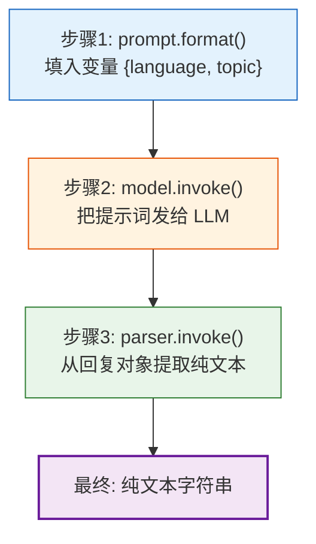
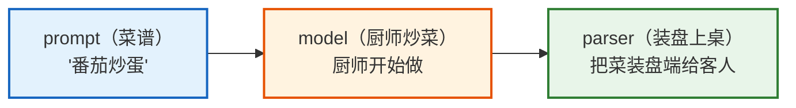
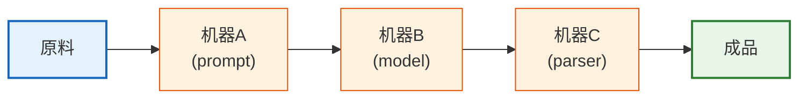

# 第02课：LangChain 初体验——写出你的第一个程序

> **学习目标**：亲手运行第一个 LangChain 程序，理解 LCEL（管道符语法），学会调用模型、构建链、获取输出。学完后你能写出可运行的 LangChain 代码。

---

## 本课导航

| 小节 | 主题 | 预计时间 |
|------|------|---------|
| 1 | 环境准备 | 10 分钟 |
| 2 | 你的第一个 LangChain 程序 | 15 分钟 |
| 3 | 理解 LCEL 管道语法 | 15 分钟 |
| 4 | 尝试不同的调用方式 | 15 分钟 |
| 5 | 小练习：做一个翻译器 | 15 分钟 |

---

## 1. 环境准备

### 1.1 安装

```bash
# 安装 LangChain 核心 + OpenAI 集成
pip install langchain langchain-openai

# 验证安装
python -c "import langchain; print(langchain.__version__)"
# 预期输出: 0.3.x
```

### 1.2 配置 API Key

```python
# 方法1：环境变量（推荐）
import os
os.environ["OPENAI_API_KEY"] = "sk-你的密钥"

# 方法2：在终端设置
# export OPENAI_API_KEY="sk-你的密钥"
```

> **没有 OpenAI Key？** 可以用其他模型替代，代码几乎一样：
> ```python
> # 使用 Ollama（本地免费，需要先安装 Ollama）
> pip install langchain-ollama
> from langchain_ollama import ChatOllama
> model = ChatOllama(model="llama3.1")
> ```

---

## 2. 你的第一个 LangChain 程序

### 2.1 最简版本：3 行代码

```python
from langchain_openai import ChatOpenAI

# 创建模型
model = ChatOpenAI(model="gpt-4o-mini", temperature=0)

# 调用
response = model.invoke("你好，请用一句话介绍你自己")

# 输出
print(response.content)
# 输出类似: 我是一个AI语言模型，专门帮助你回答问题和完成任务。
```

### 2.2 加上提示词模板

```python
from langchain_openai import ChatOpenAI
from langchain_core.prompts import ChatPromptTemplate
from langchain_core.output_parsers import StrOutputParser

# 三个零件
prompt = ChatPromptTemplate.from_template(
    "请用{language}语言解释什么是{topic}，用通俗易懂的方式。"
)

model = ChatOpenAI(model="gpt-4o-mini", temperature=0.7)

parser = StrOutputParser()

# 用管道符把它们连起来
chain = prompt | model | parser

# 运行！
result = chain.invoke({"language": "中文", "topic": "人工智能"})
print(result)
```

### 2.3 发生了什么？

让我们逐步拆解上面的代码：



用"做菜"来类比：



---

## 3. 理解 LCEL 管道语法

### 3.1 什么是 LCEL

LCEL（LangChain Expression Language）是 LangChain 的**声明式组合语法**，用管道符 `|` 连接组件。

### 生活类比

把 LCEL 想象成**工厂流水线**：



每个"机器"接收上一步的输出作为输入，处理后传给下一步。

### 3.2 为什么用管道符

| 对比 | 不用 LCEL（手动调用） | 用 LCEL（管道符） |
|------|---------------------|------------------|
| 代码 | 逐步手动调用 | 一行声明式连接 |
| 流式 | 需手动实现 | 自动支持 |
| 异步 | 需手动实现 | 自动支持 |
| 批量 | 需手动循环 | 自动并行 |
| 容错 | 需手动 try/except | `.with_fallbacks()` |
| 可读性 | 逻辑散落 | 一目了然 |

### 3.3 不用 LCEL 的写法（对比理解）

```python
# 不用 LCEL：手动一步步调用
prompt = ChatPromptTemplate.from_template("解释{topic}")
model = ChatOpenAI(model="gpt-4o-mini")
parser = StrOutputParser()

# 手动执行每一步
formatted = prompt.invoke({"topic": "量子计算"})  # 步骤1
response = model.invoke(formatted)                  # 步骤2
result = parser.invoke(response)                   # 步骤3
print(result)

# 用 LCEL：一行搞定
chain = prompt | model | parser
result = chain.invoke({"topic": "量子计算"})
print(result)

# 结果完全一样，但 LCEL 更简洁、更强大
```

### 3.4 管道符的核心规则

```
左边组件的输出类型  ===  右边组件的输入类型
```

| 左边 | 输出 | → | 右边 | 需要的输入 |
|------|------|---|------|-----------|
| `ChatPromptTemplate` | `ChatPromptValue` | → | `ChatModel` | `ChatPromptValue` ✅ |
| `ChatModel` | `AIMessage` | → | `StrOutputParser` | `AIMessage` ✅ |
| `ChatModel` | `AIMessage` | → | `ChatPromptTemplate` | `str/dict` ❌ 类型不匹配! |

> **就像拼积木**：凸出来的部分要和凹进去的部分匹配。

---

## 4. 尝试不同的调用方式

### 4.1 普通调用（invoke）

```python
# 最常用：一次性返回完整结果
result = chain.invoke({"topic": "机器学习"})
print(result)
```

### 4.2 流式输出（stream）

```python
# 像 ChatGPT 一样逐字输出
for chunk in chain.stream({"topic": "机器学习"}):
    print(chunk, end="", flush=True)
# 机器学习是人工智能的一个分支...
```

### 4.3 批量调用（batch）

```python
# 同时处理多个请求（自动并行）
results = chain.batch([
    {"topic": "机器学习"},
    {"topic": "深度学习"},
    {"topic": "自然语言处理"},
])
for r in results:
    print(r[:50])
    print("---")
```

### 4.4 异步调用（ainvoke）

```python
import asyncio

async def main():
    # 异步调用，不阻塞
    result = await chain.ainvoke({"topic": "机器学习"})
    print(result)

asyncio.run(main())
```

### 调用方式对比

| 方法 | 场景 | 好比 |
|------|------|------|
| `invoke()` | 日常使用 | 下单等菜端上来 |
| `stream()` | 聊天界面 | 看厨师做菜，做好了就端 |
| `batch()` | 批量处理 | 同时点好几道菜 |
| `ainvoke()` | 高并发服务 | 外卖系统并行处理 |

---

## 5. 小练习：做一个翻译器

### 5.1 需求

做一个可以指定源语言、目标语言和文本的翻译器。

### 5.2 实现

```python
from langchain_openai import ChatOpenAI
from langchain_core.prompts import ChatPromptTemplate
from langchain_core.output_parsers import StrOutputParser

# 创建翻译链
prompt = ChatPromptTemplate.from_messages([
    ("system", "你是一个专业翻译。请将用户提供的{text_language}文本翻译为{target_language}。只输出翻译结果，不加解释。"),
    ("human", "{text}"),
])

model = ChatOpenAI(model="gpt-4o-mini", temperature=0)
parser = StrOutputParser()

translator = prompt | model | parser

# 使用翻译器
result = translator.invoke({
    "text_language": "中文",
    "target_language": "英文",
    "text": "LangChain让AI应用开发变得简单又有趣。"
})
print(result)
# 输出: LangChain makes AI application development simple and fun.
```

### 5.3 加上流式输出

```python
# 流式翻译——边翻译边显示
print("翻译中: ", end="")
for chunk in translator.stream({
    "text_language": "中文",
    "target_language": "日文",
    "text": "LangChain让AI应用开发变得简单又有趣。"
}):
    print(chunk, end="", flush=True)
print()  # 换行
```

### 5.4 批量翻译

```python
# 同时翻译多段文本
texts = [
    {"text_language": "中文", "target_language": "英文", "text": "今天天气真好"},
    {"text_language": "中文", "target_language": "日文", "text": "今天天气真好"},
    {"text_language": "中文", "target_language": "法文", "text": "今天天气真好"},
]

results = translator.batch(texts)
for r in results:
    print(r)
```

---

## 本课小结

| 你学到了什么 | 一句话总结 |
|-------------|-----------|
| 环境准备 | 安装 langchain + 配置 API Key |
| 第一个程序 | prompt \| model \| parser 三步走 |
| LCEL 管道 | 用 `\|` 连接组件，像流水线一样 |
| 调用方式 | invoke/stream/batch/ainvoke 四种方式 |
| 实战练习 | 做了一个多语言翻译器 |

### 关键代码模板（记住这个！）

```python
# LangChain 最核心的代码模式——几乎每个程序都是这个结构
from langchain_openai import ChatOpenAI
from langchain_core.prompts import ChatPromptTemplate
from langchain_core.output_parsers import StrOutputParser

chain = (
    ChatPromptTemplate.from_template("你的提示词{变量}")
    | ChatOpenAI(model="gpt-4o-mini")
    | StrOutputParser()
)

result = chain.invoke({"变量": "值"})
```

### 配套知识库

- 📖 `知识库/01_LangChain核心架构技术参考.md` — LCEL 的底层原理
- 📖 `知识库/02_LangChain组件详解技术手册.md` — 组件参数详解

### 下一课

➡️ **第03课：Prompt 工程与模板化设计**——学会写出高效的提示词，让 AI 更听话。
