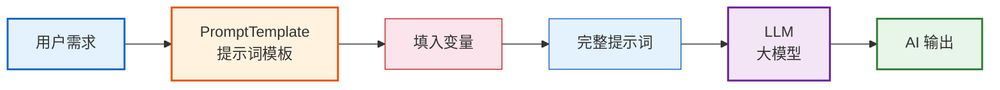

# 第03课：Prompt 工程与模板化设计

> **学习目标**：理解 Prompt Engineering 的核心原则，掌握 LangChain 的 PromptTemplate 和 ChatPromptTemplate，学会 Few-Shot 提示技巧。

---

## 本课导航

| 小节 | 主题 | 预计时间 |
|------|------|---------|
| 1 | 什么是 Prompt Engineering | 10 分钟 |
| 2 | 好提示词的原则 | 15 分钟 |
| 3 | PromptTemplate 基础 | 15 分钟 |
| 4 | ChatPromptTemplate 实战 | 15 分钟 |
| 5 | Few-Shot 少样本提示 | 15 分钟 |

---

## 1. 什么是 Prompt Engineering

### 生活类比

把 LLM 想象成一个**刚入职的实习生**——他很聪明，但不知道你具体要什么。你说"写个报告"，他可能写了一份 500 字的，但你想要的是 5000 字的。问题不在于他的能力，而在于你的**指令够不够清楚**。

**Prompt Engineering 就是"学会怎么跟 AI 下指令"的学问。**



> **图解说明**：Prompt Engineering 的核心流程——把用户需求填入提示词模板，生成完整的提示词后交给 LLM 处理，最终得到 AI 输出。模板化的好处是变量可复用、格式统一。

### 同一个问题，不同提示词的效果

```python
# ❌ 模糊的提示词
response = model.invoke("写一首诗")
# 可能写出任何主题、任何风格的诗

# ✅ 清晰的提示词
response = model.invoke("写一首关于秋天的七言绝句，主题是落叶，风格要含蓄委婉")
# 精准产出符合要求的诗
```

---

## 2. 好提示词的原则

### 2.1 五大原则

| 原则 | 说明 | 示例 |
|------|------|------|
| **角色明确** | 告诉 AI 它是谁 | "你是一位资深的 Python 开发者" |
| **任务清晰** | 具体说明要做什么 | "请审查以下代码的安全问题" |
| **格式指定** | 说明输出格式 | "以 JSON 格式输出，包含 issue 和 fix 字段" |
| **约束条件** | 说明限制和边界 | "不超过 200 字，不要使用专业术语" |
| **给出示例** | 用例子说明期望 | "例如：输入'高兴'→输出'😊'" |

### 2.2 好提示词 vs 坏提示词

| 维度 | 坏提示词 | 好提示词 |
|------|---------|---------|
| 角色 | 无 | "你是一个专业的文案编辑" |
| 任务 | "帮我改改这段话" | "请将以下文字润色为更正式的商务邮件风格" |
| 格式 | 无要求 | "输出格式：标题 + 正文 + 落款" |
| 约束 | 无限制 | "字数 200~300，语气礼貌但不卑微" |
| 示例 | 无 | "参考以下风格：[示例]" |

### 2.3 提示词结构模板

```
[角色设定]
你是一个___，擅长___。

[任务描述]
请帮我___。

[输入内容]
{user_input}

[格式要求]
请按以下格式输出：
- ___
- ___

[约束条件]
- 字数不超过___
- 不要___
```

---

## 3. PromptTemplate 基础

### 3.1 为什么需要模板

```python
# ❌ 不用模板：每次手动拼字符串
prompt1 = f"请用中文解释什么是{topic}，面向{audience}。"
prompt2 = f"请用中文解释什么是{topic2}，面向{audience2}。"
# 重复、难维护、容易出错

# ✅ 用模板：定义一次，反复使用
template = PromptTemplate.from_template(
    "请用{language}解释什么是{topic}，面向{audience}。"
)
prompt1 = template.format(language="中文", topic="量子计算", audience="高中生")
prompt2 = template.format(language="英文", topic="区块链", audience="程序员")
```

### 3.2 基本用法

```python
from langchain_core.prompts import PromptTemplate

# 创建模板
template = PromptTemplate.from_template(
    "请用{style}的风格，为{product}写一句广告语。"
)

# 使用模板
result = template.format(style="幽默", product="智能手表")
print(result)
# 输出: 请用幽默的风格，为智能手表写一句广告语。

# 部分填充（先固定一些变量）
partial = template.partial(style="温馨")
result = partial.format(product="保温杯")
print(result)
# 输出: 请用温馨的风格，为保温杯写一句广告语。
```

---

## 4. ChatPromptTemplate 实战

### 4.1 为什么用 ChatPromptTemplate

在对话模型中，一条消息有不同的"角色"：

| 角色 | 说明 | 类比 |
|------|------|------|
| `system` | 设定 AI 的行为规则 | 给实习生的"岗位说明书" |
| `human` | 用户的输入 | 你给实习生安排的任务 |
| `ai` | AI 之前的回复 | 实习生之前做过的东西 |
| `tool` | 工具返回的结果 | 实习生查到的资料 |

### 4.2 创建对话模板

```python
from langchain_core.prompts import ChatPromptTemplate

# 方式1：用元组列表（推荐，简洁）
prompt = ChatPromptTemplate.from_messages([
    ("system", "你是一位{role}，擅长{skill}。用{tone}的语气回答问题。"),
    ("human", "{question}"),
])

# 方式2：用消息对象（更灵活）
from langchain_core.messages import SystemMessage, HumanMessage
prompt = ChatPromptTemplate.from_messages([
    SystemMessage(content="你是一位Python老师"),
    HumanMessage(content="什么是装饰器？"),
])
```

### 4.3 完整示例：智能客服

```python
from langchain_openai import ChatOpenAI
from langchain_core.prompts import ChatPromptTemplate
from langchain_core.output_parsers import StrOutputParser

# 客服模板
prompt = ChatPromptTemplate.from_messages([
    ("system", """你是一位{company}的客服代表。
     
     回答规则：
     1. 语气礼貌、专业
     2. 如果不知道答案，说"我来帮您转接人工客服"
     3. 回答不超过 100 字
     """),
    ("human", "{customer_question}"),
])

model = ChatOpenAI(model="gpt-4o-mini", temperature=0)
parser = StrOutputParser()

# 构建链
customer_service = prompt | model | parser

# 使用
result = customer_service.invoke({
    "company": "某电商平台",
    "customer_question": "我买的手机三天就坏了，怎么办？"
})
print(result)
# 输出类似: 非常抱歉给您带来不便！您可以在"我的订单"中申请7天无理由退货...
```

### 4.4 部分填充技巧

```python
# 先固定公司名，后续只填问题
base_prompt = prompt.partial(company="某电商平台")

# 之后只需要提供问题
chain = base_prompt | model | parser
result = chain.invoke({"customer_question": "怎么退货？"})
```

---

## 5. Few-Shot 少样本提示

### 5.1 什么是 Few-Shot

**Few-Shot = 给 AI 看几个例子，让它照着做。**

就像教实习生：
- **Zero-Shot**（不给例子）："帮我分类情感"
- **One-Shot**（给一个例子）："帮我分类情感，比如'今天很开心'→'正面'"
- **Few-Shot**（给几个例子）：给 3~5 个例子，AI 就能照着做

### 5.2 效果对比

```python
# Zero-Shot（没有例子）
prompt1 = ChatPromptTemplate.from_messages([
    ("system", "请对用户输入的文字进行情感分类"),
    ("human", "这个产品太垃圾了"),
])
# AI 可能输出："这个评价表达了对产品的不满"（不是你想要的分类）

# Few-Shot（有例子）
prompt2 = ChatPromptTemplate.from_messages([
    ("system", "请对用户输入的文字进行情感分类"),
    ("human", "今天天气真好"),       # 示例1输入
    ("ai", "正面"),                  # 示例1输出
    ("human", "服务态度太差了"),       # 示例2输入
    ("ai", "负面"),                  # 示例2输出
    ("human", "今天周三"),           # 示例3输入
    ("ai", "中性"),                  # 示例3输出
    ("human", "这个产品太垃圾了"),    # 真正的问题
])
# AI 输出："负面" ✅
```

### 5.3 用 FewShotChatMessagePromptTemplate

```python
from langchain_core.prompts import (
    ChatPromptTemplate,
    FewShotChatMessagePromptTemplate,
)

# 定义示例
examples = [
    {"input": "今天心情很好", "output": "😊 正面"},
    {"input": "快递太慢了，等了一周", "output": "😠 负面"},
    {"input": "现在是下午三点", "output": "😐 中性"},
    {"input": "这个手机拍照真清晰", "output": "😊 正面"},
]

# 示例模板
example_prompt = ChatPromptTemplate.from_messages([
    ("human", "{input}"),
    ("ai", "{output}"),
])

# Few-Shot 模板
few_shot = FewShotChatMessagePromptTemplate(
    example_prompt=example_prompt,
    examples=examples,
)

# 完整提示词
final_prompt = ChatPromptTemplate.from_messages([
    ("system", "将用户输入转换为情感标签，格式：emoji 情感类别"),
    few_shot,
    ("human", "{input}"),
])

# 构建链
chain = final_prompt | ChatOpenAI(model="gpt-4o-mini", temperature=0) | StrOutputParser()

# 测试
result = chain.invoke({"input": "这部电影太好看了"})
print(result)  # 😊 正面
```

### 5.4 Few-Shot 的选择技巧

| 技巧 | 说明 |
|------|------|
| 示例数量 | 3~5 个通常最佳，太多反而干扰 |
| 示例多样性 | 覆盖不同类别和边界情况 |
| 示例顺序 | 可以打乱顺序避免偏见 |
| 边界示例 | 包含"看似 A 实则 B"的例子 |

---

## 实战练习：产品评论分析器

```python
from langchain_openai import ChatOpenAI
from langchain_core.prompts import ChatPromptTemplate, FewShotChatMessagePromptTemplate
from langchain_core.output_parsers import StrOutputParser

# Few-Shot 示例
examples = [
    {
        "review": "电池续航很强，一天不用充电，但拍照一般",
        "analysis": "优点：续航优秀\n缺点：拍照一般\n情感：中性偏正\n评分：3.5/5"
    },
    {
        "review": "屏幕色彩太棒了，玩游戏超流畅！",
        "analysis": "优点：屏幕优秀、性能强劲\n缺点：无\n情感：正面\n评分：5/5"
    },
]

example_prompt = ChatPromptTemplate.from_messages([
    ("human", "{review}"),
    ("ai", "{analysis}"),
])

few_shot = FewShotChatMessagePromptTemplate(
    example_prompt=example_prompt,
    examples=examples,
)

# 完整模板
prompt = ChatPromptTemplate.from_messages([
    ("system", "你是产品分析专家。分析用户评论，输出优缺点、情感倾向和评分。"),
    few_shot,
    ("human", "{review}"),
])

# 构建链
analyzer = prompt | ChatOpenAI(model="gpt-4o-mini", temperature=0) | StrOutputParser()

# 测试
result = analyzer.invoke({"review": "速度快但太贵了，而且发热严重"})
print(result)
```

---

## 本课小结

| 你学到了什么 | 一句话总结 |
|-------------|-----------|
| Prompt Engineering | 学会跟 AI 下清晰的指令 |
| 五大原则 | 角色、任务、格式、约束、示例 |
| PromptTemplate | 变量化提示词，一次定义反复使用 |
| ChatPromptTemplate | 按角色（system/human/ai）组织对话 |
| Few-Shot | 给 AI 看例子，让它照着做 |

### 核心代码模板

```python
# 标准对话模板
prompt = ChatPromptTemplate.from_messages([
    ("system", "你是{role}，擅长{skill}"),  # 角色 + 规则
    ("human", "{question}"),                  # 用户输入
])

chain = prompt | model | parser
```

### 配套知识库

- 📖 `知识库/02_LangChain组件详解技术手册.md` — Prompt 组件完整 API

### 下一课

➡️ **第04课：记忆机制——让 AI 记住对话历史**——让 AI 像人一样记住你们聊过什么。
