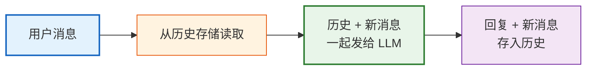
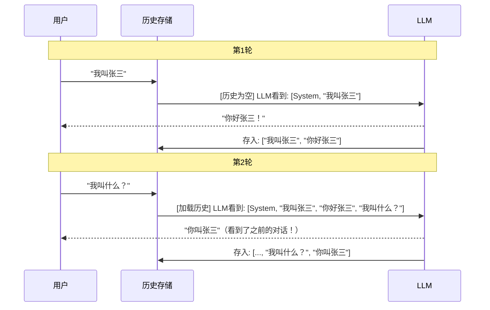

# 第04课：记忆机制——让 AI 记住对话历史

> **学习目标**：理解为什么 LLM 没有"记忆"、LangChain 如何实现对话记忆、掌握不同记忆策略的适用场景。

---

## 本课导航

| 小节 | 主题 | 预计时间 |
|------|------|---------|
| 1 | 为什么 AI 会"失忆" | 10 分钟 |
| 2 | LangChain 的记忆方案 | 15 分钟 |
| 3 | 实战：带记忆的聊天机器人 | 20 分钟 |
| 4 | 记忆策略选择 | 15 分钟 |

---

## 1. 为什么 AI 会"失忆"

### 生活类比

想象你有一个朋友，每次见面他都**完全不记得之前聊过什么**：

```
你: 我叫张三
朋友: 你好张三！

你: 我叫什么名字？
朋友: 抱歉，我不知道你叫什么。
```

这就是裸 LLM 的状态——**每次调用都是全新的，没有任何上下文记忆**。

### 技术原因

LLM 是"无状态"的——每次 API 调用都是独立的，模型不会保存任何历史信息。要让 AI "记住"对话，我们需要**手动把历史消息传给它**。

```python
# 没有记忆：模型不知道之前说了什么
response1 = model.invoke("我叫张三")
response2 = model.invoke("我叫什么？")  # 模型不知道！

# 手动传历史：把前面的对话都传进去
response2 = model.invoke([
    HumanMessage(content="我叫张三"),
    AIMessage(content="你好张三！"),
    HumanMessage(content="我叫什么？"),
])
# 模型: 你叫张三。✅
```

> **LangChain 的 Memory 模块就是帮你自动管理这个"历史消息列表"。**

---

## 2. LangChain 的记忆方案

### 2.1 新架构（v0.3 推荐）

LangChain v0.3 使用 `RunnableWithMessageHistory` + `BaseChatMessageHistory` 管理记忆：



> **图解说明**：每次用户发消息时，LangChain 会先从历史存储中取出之前的对话，把历史和新消息一起发给 LLM，然后把回复和新消息都存入历史存储。这样 AI 就"记住"了之前的对话。

### 2.2 核心组件

| 组件 | 作用 | 类比 |
|------|------|------|
| `ChatMessageHistory` | 存储对话消息 | 对话的"录音机" |
| `RunnableWithMessageHistory` | 自动把历史注入链 | 自动播放录音的助手 |
| `session_id` | 区分不同用户/对话 | 录音带编号 |

---

## 3. 实战：带记忆的聊天机器人

### 3.1 基础版

```python
from langchain_openai import ChatOpenAI
from langchain_core.prompts import ChatPromptTemplate
from langchain_core.output_parsers import StrOutputParser
from langchain_community.chat_message_histories import ChatMessageHistory
from langchain_core.runnables.history import RunnableWithMessageHistory

# 创建链
prompt = ChatPromptTemplate.from_messages([
    ("system", "你是一个友好的聊天助手"),
    ("placeholder", "{history}"),  # 历史消息占位符
    ("human", "{input}"),
])

model = ChatOpenAI(model="gpt-4o-mini", temperature=0.7)
chain = prompt | model | StrOutputParser()

# 创建历史存储
message_history = ChatMessageHistory()

# 包装为带历史的链
chain_with_history = RunnableWithMessageHistory(
    chain,
    lambda session_id: message_history,
    input_messages_key="input",
    history_messages_key="history",
)

# 第一次对话
response1 = chain_with_history.invoke(
    {"input": "我叫张三，我是一名Python开发者"},
    config={"configurable": {"session_id": "user_001"}},
)
print(f"AI: {response1}")
# AI: 你好张三！很高兴认识一位Python开发者...

# 第二次对话——AI 记住了！
response2 = chain_with_history.invoke(
    {"input": "我叫什么名字？我的职业是什么？"},
    config={"configurable": {"session_id": "user_001"}},
)
print(f"AI: {response2}")
# AI: 你叫张三，是一名Python开发者。

# 不同 session_id = 不同对话（互不干扰）
response3 = chain_with_history.invoke(
    {"input": "我叫什么？"},
    config={"configurable": {"session_id": "user_002"}},
)
print(f"AI: {response3}")
# AI: 抱歉，我还不知道你的名字。
```

### 3.2 发生了什么？



> **图解说明**：第1轮对话时历史为空，LLM 只看到当前消息。回复后，消息自动存入历史存储。第2轮对话时，历史存储中的所有消息被加载并发给 LLM，LLM 因此能"记住"之前说过的话。

### 3.3 多用户聊天

```python
# 每个用户用不同的 session_id，互不干扰
# user_001 的对话
chain_with_history.invoke(
    {"input": "我喜欢蓝色"},
    config={"configurable": {"session_id": "user_001"}},
)

# user_002 的对话
chain_with_history.invoke(
    {"input": "我喜欢红色"},
    config={"configurable": {"session_id": "user_002"}},
)

# user_001 的AI知道喜欢蓝色，user_002的AI知道喜欢红色
```

---

## 4. 记忆策略选择

### 4.1 为什么需要策略

当对话越来越长，历史消息越来越多，会**超过模型的上下文窗口**（token 限制）。需要策略来管理。

### 生活类比

| 策略 | 类比 | 场景 |
|------|------|------|
| 全量保留 | 把所有聊天记录都读一遍 | 短聊天 ✅ |
| 只记最近几轮 | 只看最后几条消息 | 日常聊天 |
| 定期总结 | 把旧消息总结成一段摘要 | 长期对话 |
| 总结 + 最近 | 摘要 + 最近几条 | 超长对话 |

### 4.2 策略对比

| 策略 | 效果 | Token 消耗 | 适用场景 |
|------|------|-----------|---------|
| **Buffer（全量）** | 记住所有细节 | 高（线性增长） | 短对话 |
| **Buffer Window** | 只记最近 N 轮 | 固定低 | 日常聊天 |
| **Summary** | 旧消息压缩为摘要 | 低 | 长期跟踪 |
| **Summary + Buffer** | 摘要 + 最近消息 | 中 | 最佳平衡 |

### 4.3 实现窗口策略

```python
from langchain_core.messages import trim_messages, SystemMessage, HumanMessage, AIMessage

# 保留最近 500 tokens 的消息
trimmer = trim_messages(
    max_tokens=500,
    strategy="last",          # 保留最后（最近的）消息
    token_counter=model,       # 用模型计算 token
    include_system=True,       # 保留 system 消息
    start_on="human",         # 从 human 消息开始
)

# 在链中使用
def trim_history(messages):
    return trimmer.invoke(messages)

# 应用到链
chain_with_trim = (
    RunnablePassthrough.assign(messages=trim_history)
    | prompt
    | model
    | StrOutputParser()
)
```

### 4.4 持久化存储

默认的 `ChatMessageHistory` 存在内存中，程序关闭就没了。生产环境需要持久化：

```python
# 文件存储（简单场景）
from langchain_community.chat_message_histories import FileChatMessageHistory
history = FileChatMessageHistory(file_path="chat_history/user_001.json")

# SQLite 存储（轻量生产）
from langchain_community.chat_message_histories import SQLChatMessageHistory
history = SQLChatMessageHistory(
    session_id="user_001",
    connection_string="sqlite:///chat.db"
)

# Redis 存储（高性能生产）
from langchain_community.chat_message_histories import RedisChatMessageHistory
history = RedisChatMessageHistory(
    session_id="user_001",
    url="redis://localhost:6379"
)
```

### 存储方式选择

| 方式 | 持久化 | 性能 | 适用场景 |
|------|--------|------|---------|
| 内存 | ❌ | 最快 | 开发测试 |
| 文件 | ✅ | 中 | 单机简单 |
| SQLite | ✅ | 快 | 轻量生产 |
| Redis | ✅ | 最快 | 高并发生产 |
| PostgreSQL | ✅ | 快 | 企业级生产 |

---

## 实战练习：个人助手机器人

```python
from langchain_openai import ChatOpenAI
from langchain_core.prompts import ChatPromptTemplate
from langchain_core.output_parsers import StrOutputParser
from langchain_community.chat_message_histories import ChatMessageHistory
from langchain_core.runnables.history import RunnableWithMessageHistory

# 带个性的助手
prompt = ChatPromptTemplate.from_messages([
    ("system", """你是用户的私人助手小智。
    - 记住用户告诉你的信息
    - 主动关心用户
    - 回答简洁友好（不超过3句话）
    """),
    ("placeholder", "{history}"),
    ("human", "{input}"),
])

chain = prompt | ChatOpenAI(model="gpt-4o-mini", temperature=0.7) | StrOutputParser()

# 多用户管理
histories = {}

def get_history(session_id):
    if session_id not in histories:
        histories[session_id] = ChatMessageHistory()
    return histories[session_id]

assistant = RunnableWithMessageHistory(
    chain, get_history,
    input_messages_key="input",
    history_messages_key="history",
)

# 模拟多轮对话
config = {"configurable": {"session_id": "me"}}

messages = [
    "我叫李四，在百度工作",
    "我主要负责AI产品",
    "帮我记住我的信息，然后介绍一下你自己",
    "我的工作和名字是什么？",
]

for msg in messages:
    response = assistant.invoke({"input": msg}, config=config)
    print(f"我: {msg}")
    print(f"小智: {response}\n")
```

---

## 本课小结

| 你学到了什么 | 一句话总结 |
|-------------|-----------|
| AI 为什么失忆 | LLM 无状态，每次调用都是新的 |
| LangChain 记忆方案 | RunnableWithMessageHistory 自动管理历史 |
| 多用户隔离 | 用 session_id 区分不同用户的对话 |
| 记忆策略 | 全量/窗口/总结/混合，按需选择 |
| 持久化存储 | 内存/文件/SQLite/Redis |

### 核心代码模板

```python
# 带记忆的链
chain_with_history = RunnableWithMessageHistory(
    chain,
    get_history_func,          # 历史存储
    input_messages_key="input",
    history_messages_key="history",
)

# 调用时指定 session_id
result = chain_with_history.invoke(
    {"input": "你好"},
    config={"configurable": {"session_id": "user_001"}},
)
```

### 配套知识库

- 📖 `知识库/02_LangChain组件详解技术手册.md` — Memory 模块完整 API

### 下一课

➡️ **第05课：输出解析与结构化数据**——让 AI 的输出变成你需要的格式。
