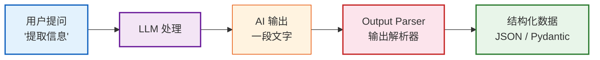

# 第05课：输出解析与结构化数据

> **学习目标**：让 AI 的输出从"一段文字"变成"结构化数据"，掌握 Output Parser 和结构化输出技术。

---

## 本课导航

| 小节 | 主题 | 预计时间 |
|------|------|---------|
| 1 | 为什么需要结构化输出 | 10 分钟 |
| 2 | StrOutputParser 字符串解析 | 10 分钟 |
| 3 | with_structured_output（推荐） | 20 分钟 |
| 4 | 实战：信息提取器 | 15 分钟 |

---

## 1. 为什么需要结构化输出

### 问题

LLM 默认输出的是**一串文字**，但你的程序需要的是**结构化数据**：

```python
# AI 返回的是一段纯文本
response = model.invoke("提取以下信息：张三，25岁，北京")
# 返回: "姓名：张三，年龄：25岁，城市：北京"
# 这是一个字符串，不是结构化数据

# 你想要的是
{
    "name": "张三",
    "age": 25,
    "city": "北京"
}
```

### 生活类比

AI 回复就像一封**手写信**——信息都在里面，但格式随意。结构化输出就是让 AI 按照你给的**表格模板**填写，每条信息都在固定的格子里。



> **图解说明**：结构化输出的核心——LLM 生成的文字经过 Output Parser 解析后，变成程序可直接使用的结构化数据（如 JSON 或 Pydantic 对象），无需手动正则提取。

---

## 2. StrOutputParser 字符串解析

最简单的解析器——从 AI 的回复对象中提取纯文本字符串：

```python
from langchain_openai import ChatOpenAI
from langchain_core.output_parsers import StrOutputParser

model = ChatOpenAI(model="gpt-4o-mini")

# 不用 parser
response = model.invoke("你好")
print(type(response))  # <class 'AIMessage'>
print(response.content) # 要用 .content 才能拿到文本

# 用 StrOutputParser
parser = StrOutputParser()
chain = model | parser
result = chain.invoke("你好")
print(type(result))  # <class 'str'>  直接就是字符串
print(result)        # 不需要 .content
```

---

## 3. with_structured_output（推荐）

### 3.1 什么是结构化输出

`with_structured_output()` 让模型**强制按你定义的格式输出**，直接返回 Python 对象。

### 3.2 用 Pydantic 定义格式

```python
from pydantic import BaseModel, Field
from langchain_openai import ChatOpenAI

# 定义你想要的输出格式
class PersonInfo(BaseModel):
    name: str = Field(description="姓名")
    age: int = Field(description="年龄")
    city: str = Field(description="所在城市")
    occupation: str = Field(description="职业")

# 让模型按这个格式输出
model = ChatOpenAI(model="gpt-4o-mini", temperature=0)
structured_model = model.with_structured_output(PersonInfo)

# 调用——直接返回 Pydantic 对象
result = structured_model.invoke("张三今年28岁，在北京当程序员")
print(type(result))       # <class 'PersonInfo'>
print(result.name)        # 张三
print(result.age)         # 28
print(result.city)        # 北京
print(result.occupation)  # 程序员
```

### 3.3 嵌套结构

```python
from typing import List

class Education(BaseModel):
    school: str = Field(description="学校名称")
    degree: str = Field(description="学位")
    year: int = Field(description="毕业年份")

class Resume(BaseModel):
    name: str = Field(description="姓名")
    email: str = Field(description="邮箱")
    educations: List[Education] = Field(description="教育经历列表")
    skills: List[str] = Field(description="技能列表")

structured_model = model.with_structured_output(Resume)

result = structured_model.invoke("""
李四，邮箱lisi@example.com。
本科毕业于北京大学计算机系，2020年毕业。
硕士毕业于清华大学人工智能专业，2023年毕业。
擅长Python、机器学习、深度学习、自然语言处理。
""")

print(result.name)                    # 李四
print(result.educations[0].school)    # 北京大学
print(result.educations[1].degree)   # 硕士
print(result.skills)                  # ['Python', '机器学习', ...]
```

### 3.4 用 TypedDict 定义格式

```python
from typing import TypedDict

class ArticleSummary(TypedDict):
    """文章摘要结构"""
    title: str
    summary: str
    keywords: list  # 关键词列表
    sentiment: str  # 正面/负面/中性

structured_model = model.with_structured_output(ArticleSummary)

result = structured_model.invoke("""
LangChain 0.3版本正式发布，带来了Pydantic 2.x支持、
性能提升和更完善的类型提示。开发者可以更高效地构建LLM应用。
社区反馈积极，认为这是迄今最稳定的版本。
""")

print(result["title"])      # LangChain 0.3 正式发布
print(result["keywords"])   # ['LangChain', 'Pydantic', 'LLM']
print(result["sentiment"])  # 正面
```

### 3.5 方式对比

| 方式 | 可靠性 | 易用性 | 推荐度 |
|------|--------|--------|--------|
| `with_structured_output(Pydantic)` | ★★★★★ | ★★★★★ | ⭐ 首选 |
| `with_structured_output(TypedDict)` | ★★★★☆ | ★★★★★ | 次选 |
| `PydanticOutputParser` | ★★★★☆ | ★★★☆☆ | 需要格式指令时 |
| 手动 `json.loads()` | ★☆☆☆☆ | ★☆☆☆☆ | 不推荐 |

---

## 4. 实战：信息提取器

```python
from pydantic import BaseModel, Field
from typing import List, Optional
from langchain_openai import ChatOpenAI
from langchain_core.prompts import ChatPromptTemplate

# 定义输出结构
class ProductInfo(BaseModel):
    """产品信息"""
    name: str = Field(description="产品名称")
    brand: str = Field(description="品牌")
    price: Optional[float] = Field(None, description="价格（元）")
    features: List[str] = Field(default_factory=list, description="特性列表")
    rating: Optional[float] = Field(None, description="评分(0-5)")
    sentiment: str = Field(description="评价倾向：正面/负面/中性")

# 创建提取链
prompt = ChatPromptTemplate.from_messages([
    ("system", "你是一个产品信息提取专家。从用户输入的产品评论中提取结构化信息。"),
    ("human", "{review}"),
])

model = ChatOpenAI(model="gpt-4o-mini", temperature=0)
structured_model = model.with_structured_output(ProductInfo)

chain = prompt | structured_model

# 测试
reviews = [
    "刚买了苹果iPhone 15 Pro，花了8999元。拍照特别清晰，A17芯片性能强劲，钛金属机身手感很好。非常满意，打5分！",
    "华为Mate 60 Pro，6999元入手。信号比之前好太多，卫星通信很实用。但是续航一般，打3.5分。",
]

for review in reviews:
    result = chain.invoke({"review": review})
    print(f"产品: {result.name}")
    print(f"品牌: {result.brand}")
    print(f"价格: ¥{result.price}")
    print(f"特性: {', '.join(result.features)}")
    print(f"评分: {result.rating}/5")
    print(f"评价: {result.sentiment}")
    print("---")
```

---

## 本课小结

| 你学到了什么 | 一句话总结 |
|-------------|-----------|
| 为什么需要结构化 | AI 输出的是文本，程序需要的是数据 |
| StrOutputParser | 最简单的解析——提取纯文本 |
| with_structured_output | 最强解析——直接返回 Pydantic 对象 |
| 嵌套结构 | 可以定义复杂的多层嵌套格式 |
| 实战练习 | 做了产品信息提取器 |

### 核心代码模板

```python
from pydantic import BaseModel, Field

# 定义格式
class MyOutput(BaseModel):
    field1: str = Field(description="字段说明")
    field2: int = Field(description="字段说明")

# 结构化输出
structured_model = model.with_structured_output(MyOutput)
result = structured_model.invoke("输入文本")
# result 是 MyOutput 对象，可以直接 .field1 访问
```

### 配套知识库

- 📖 `知识库/02_LangChain组件详解技术手册.md` — Output Parser 完整 API

### 下一课

➡️ **第06课：工具与代理 Agent——让 AI 行动起来**——让 AI 不仅能说，还能做！
