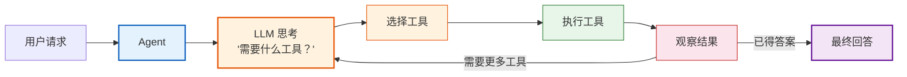

# 第06课：工具与代理 Agent——让 AI 行动起来

> **学习目标**：理解 Agent 的概念、学会定义和使用工具、构建能自主决策调用工具的 AI 代理。

---

## 本课导航

| 小节 | 主题 | 预计时间 |
|------|------|---------|
| 1 | 什么是 Agent | 10 分钟 |
| 2 | 定义工具（Tools） | 20 分钟 |
| 3 | 创建 Agent | 20 分钟 |
| 4 | 实战：智能助手 | 15 分钟 |

---

## 1. 什么是 Agent

### 生活类比

普通 LLM 链像一个**只会说不会做的顾问**：
```
你: "北京明天天气怎么样？"
顾问: "我无法查询实时天气，建议你看天气预报..."
```

Agent 像一个**能自己动手的私人助理**：
```
你: "北京明天天气怎么样？"
助理: (思考：需要查天气 → 调用天气工具 → 得到结果)
助理: "北京明天晴，最高温32°C，最低温22°C，适合外出。"
```

### Agent 的工作循环



> **图解说明**：Agent 的核心是"思考→行动→观察"的循环——LLM 根据用户请求决定调用哪个工具，执行后观察结果，再决定是否继续调用工具或给出最终回答。

### Agent vs Chain

| 维度 | Chain（链） | Agent（代理） |
|------|-----------|-------------|
| 执行路径 | 固定的，提前定好 | 动态的，LLM 自己决定 |
| 工具使用 | 按预定顺序调用 | 根据需要自主选择 |
| 循环 | 不支持 | 支持多轮工具调用 |
| 控制权 | 开发者掌控 | LLM 自主决策 |
| 适用场景 | 固定流程 | 开放性任务 |

---

## 2. 定义工具（Tools）

### 2.1 用 @tool 装饰器（最简单）

```python
from langchain_core.tools import tool

@tool
def get_weather(city: str) -> str:
    """获取指定城市的天气信息。
    
    Args:
        city: 城市名称，如"北京"、"上海"
    
    Returns:
        天气描述字符串
    """
    # 这里是实际逻辑（演示用假数据）
    weather_data = {
        "北京": "晴，25°C",
        "上海": "多云，28°C",
        "广州": "雷阵雨，30°C",
    }
    return weather_data.get(city, f"暂无{city}的天气信息")

@tool
def calculate(expression: str) -> str:
    """计算数学表达式。
    
    Args:
        expression: 数学表达式，如 "3+5*2"
    
    Returns:
        计算结果
    """
    try:
        result = eval(expression)
        return f"计算结果: {result}"
    except:
        return "无法计算该表达式"

# 工具列表
tools = [get_weather, calculate]
```

### 2.2 docstring 很重要！

AI 通过 docstring 决定**什么时候用哪个工具**，所以必须写清楚：

```python
# ✅ 好的 docstring
@tool
def search_product(keyword: str, max_price: float = None) -> str:
    """根据关键词搜索商品。
    
    Args:
        keyword: 搜索关键词
        max_price: 最高价格限制（可选）
    
    Returns:
        匹配的商品列表
    """
    ...

# ❌ 坏的 docstring（AI 不知道什么时候用）
@tool
def search_product(keyword: str) -> str:
    """搜索"""
    ...
```

### 2.3 工具定义方式对比

| 方式 | 易用性 | 灵活性 | 推荐度 |
|------|--------|--------|--------|
| `@tool` 装饰器 | ★★★★★ | ★★★☆☆ | ⭐ 首选 |
| `BaseTool` 子类 | ★★★☆☆ | ★★★★★ | 复杂场景 |
| `StructuredTool.from_function` | ★★★★☆ | ★★★☆☆ | 简单函数 |

---

## 3. 创建 Agent

### 3.1 用 LangGraph 的 create_react_agent（推荐）

```python
from langgraph.prebuilt import create_react_agent
from langchain_openai import ChatOpenAI

# 定义工具
@tool
def get_weather(city: str) -> str:
    """获取指定城市的天气信息"""
    weather_data = {"北京": "晴，25°C", "上海": "多云，28°C"}
    return weather_data.get(city, f"暂无{city}天气信息")

@tool
def calculate(expression: str) -> str:
    """计算数学表达式"""
    try:
        return str(eval(expression))
    except:
        return "无法计算"

# 一行创建 Agent！
model = ChatOpenAI(model="gpt-4o-mini", temperature=0)
agent = create_react_agent(model, [get_weather, calculate])

# 使用
result = agent.invoke({"messages": [("user", "北京和上海哪个温度更高？")]})

# 查看结果
for msg in result["messages"]:
    if hasattr(msg, 'content') and msg.content:
        print(f"[{msg.__class__.__name__}] {msg.content[:100]}")
```

### 3.2 执行过程解析

```
用户: "北京和上海哪个温度更高？"

Agent 思考: 需要查北京和上海的天气
  → 调用 get_weather("北京") → "晴，25°C"
  → 调用 get_weather("上海") → "多云，28°C"

Agent 思考: 上海28°C > 北京25°C
  → 回答: "上海温度更高，28°C，比北京高3°C。"
```

### 3.3 用 LangChain 的 create_tool_calling_agent

```python
from langchain.agents import create_tool_calling_agent, AgentExecutor
from langchain_core.prompts import ChatPromptTemplate

# 工具列表
tools = [get_weather, calculate]

# 提示词模板（注意 agent_scratchpad）
prompt = ChatPromptTemplate.from_messages([
    ("system", "你是一个有用的助手，可以使用工具帮助用户"),
    ("human", "{input}"),
    ("placeholder", "{agent_scratchpad}"),  # 必须有这个！
])

# 创建 Agent
model = ChatOpenAI(model="gpt-4o-mini", temperature=0)
agent = create_tool_calling_agent(model, tools, prompt)

# 创建执行器
agent_executor = AgentExecutor(
    agent=agent,
    tools=tools,
    verbose=True,        # 打印执行过程
    max_iterations=5,    # 最多循环5次
)

# 使用
result = agent_executor.invoke({"input": "3的5次方是多少？"})
print(result["output"])
```

### 3.4 两种方式对比

| 维度 | `create_react_agent` (LangGraph) | `create_tool_calling_agent` (LangChain) |
|------|----------------------------------|---------------------------------------|
| 代码量 | 极简（2行） | 中等（5行） |
| 功能 | 更强大 | 基础够用 |
| 流式支持 | 原生 | 需配置 |
| 状态管理 | 内置 | 无 |
| 推荐度 | ⭐ 新项目首选 | 旧项目兼容 |

---

## 4. 实战：智能助手

```python
from langchain_core.tools import tool
from langgraph.prebuilt import create_react_agent
from langchain_openai import ChatOpenAI

# 定义多个工具
@tool
def get_weather(city: str) -> str:
    """获取指定城市的天气"""
    data = {"北京": "晴25°C", "上海": "多云28°C", "广州": "雷阵雨30°C"}
    return data.get(city, f"暂无{city}天气信息")

@tool
def calculate(expression: str) -> str:
    """计算数学表达式"""
    try:
        return str(eval(expression))
    except:
        return "无法计算"

@tool
def get_time() -> str:
    """获取当前时间"""
    from datetime import datetime
    return datetime.now().strftime("%Y年%m月%d日 %H:%M")

@tool
def search_knowledge(query: str) -> str:
    """搜索知识库"""
    knowledge = {
        "LangChain": "LangChain是LLM应用开发框架",
        "Python": "Python是一种高级编程语言",
    }
    for key, val in knowledge.items():
        if key.lower() in query.lower():
            return val
    return f"未找到关于'{query}'的信息"

# 创建 Agent
model = ChatOpenAI(model="gpt-4o-mini", temperature=0)
agent = create_react_agent(
    model,
    [get_weather, calculate, get_time, search_knowledge],
)

# 测试多种请求
test_cases = [
    "现在几点了？",
    "北京和上海的天气怎么样？哪个更热？",
    "计算 123 * 456 + 789",
    "LangChain是什么？",
    "现在几点？外面天气怎么样？帮我算算3小时后是几点。",
]

for case in test_cases:
    print(f"\n{'='*60}")
    print(f"用户: {case}")
    result = agent.invoke({"messages": [("user", case)]})
    # 获取最后一条 AI 消息
    last_msg = result["messages"][-1]
    print(f"AI: {last_msg.content}")
```

---

## 本课小结

| 你学到了什么 | 一句话总结 |
|-------------|-----------|
| Agent 是什么 | LLM + 工具 + 自主决策循环 |
| 工具定义 | 用 @tool 装饰器，写好 docstring |
| 创建 Agent | create_react_agent 一行创建 |
| Agent 执行过程 | 思考→选工具→执行→观察→再思考 |
| 实战 | 做了带天气/计算/时间/搜索的智能助手 |

### 核心代码模板

```python
# 定义工具
@tool
def my_tool(param: str) -> str:
    """工具描述（AI 靠这个决定用不用）"""
    return result

# 创建 Agent
agent = create_react_agent(model, [my_tool])

# 使用
result = agent.invoke({"messages": [("user", "你的问题")]})
```

### 配套知识库

- 📖 `知识库/02_LangChain组件详解技术手册.md` — Agents 和 Tools 完整 API

### 下一课

➡️ **第07课：检索增强生成 RAG——让 AI 拥有知识**——让 AI 能回答你私人文档里的问题。
