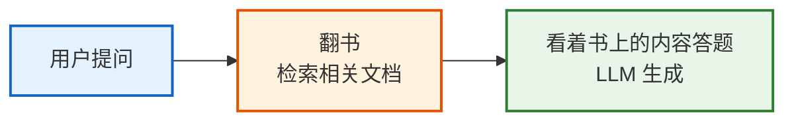
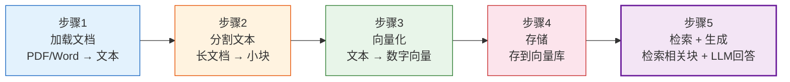
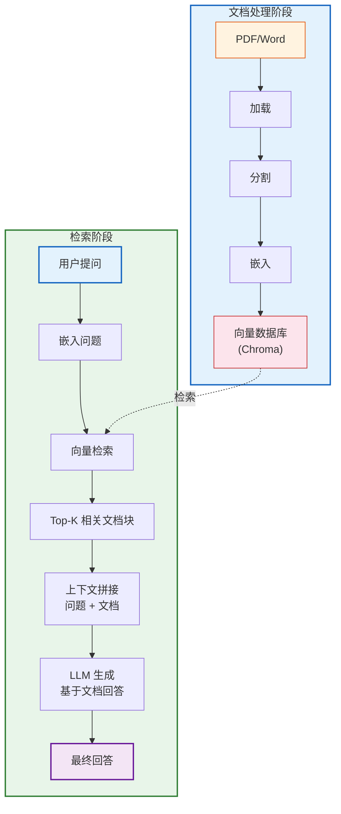

# 第07课：检索增强生成 RAG——让 AI 拥有知识

> **学习目标**：理解 RAG 的原理和完整流程，亲手构建一个基于自己文档的问答系统。

---

## 本课导航

| 小节 | 主题 | 预计时间 |
|------|------|---------|
| 1 | 什么是 RAG | 10 分钟 |
| 2 | RAG 五步流程 | 20 分钟 |
| 3 | 实战：文档问答系统 | 30 分钟 |
| 4 | RAG 优化技巧 | 15 分钟 |

---

## 1. 什么是 RAG

### 生活类比

想象你在考试时遇到不会的题：

**不用 RAG（闭卷考试）**：只靠脑子里的记忆答题——记不清的只能编。

**用 RAG（开卷考试）**：先翻书找到相关内容，再根据书上的内容答题——答案有据可查。



### 为什么需要 RAG

| 场景 | 不用 RAG | 用 RAG |
|------|---------|--------|
| "公司报销流程是什么？" | AI 不知道你的公司流程 | 从公司文档中检索答案 |
| "2026年最新的产品信息？" | AI 训练数据过时 | 从最新文档中检索 |
| "这份合同有什么风险？" | AI 看不到你的合同 | 分析合同原文后回答 |
| "我的代码哪里有bug？" | AI 看不到你的代码 | 从代码中检索分析 |

---

## 2. RAG 五步流程



### 流程图



> **图解说明**：RAG 分两个阶段——文档处理阶段把原始文档加载、分割、嵌入后存入向量数据库；检索阶段把用户问题也嵌入为向量，从数据库中检索最相关的 Top-K 文档块，拼接为上下文后交给 LLM 生成回答。

---

## 3. 实战：文档问答系统

### 3.1 安装依赖

```bash
pip install langchain langchain-openai langchain-community chromadb
```

### 3.2 准备文档

```python
# 先创建一个示例文档文件
sample_text = """
LangChain 是一个用于构建大语言模型应用的开源框架。

LangChain 的六大核心模块：
1. Models（模型层）：封装 LLM 调用，支持 OpenAI、Claude 等。
2. Prompts（提示词层）：管理提示词模板。
3. Chains（链式编排）：组合多个步骤为逻辑管道。
4. Memory（记忆层）：管理对话上下文和记忆。
5. Agents（代理层）：让 LLM 自主决策调用工具。
6. Tools（工具层）：封装可执行操作。

LangChain 的 LCEL 语法使用管道符 | 连接组件。
例如：chain = prompt | model | parser

LangChain v0.3 是当前推荐版本，基于 Pydantic 2.x。
安装方式：pip install langchain langgraph

LangGraph 是 LangChain 团队推出的图结构工作流编排引擎。
它支持循环、状态管理和人机协作。
LangGraph 的核心是 StateGraph，用节点和边构建工作流。
"""

# 写入文件
with open("langchain_intro.txt", "w", encoding="utf-8") as f:
    f.write(sample_text)
```

### 3.3 构建 RAG 系统

```python
from langchain_openai import ChatOpenAI, OpenAIEmbeddings
from langchain_community.document_loaders import TextLoader
from langchain_text_splitters import RecursiveCharacterTextSplitter
from langchain_chroma import Chroma
from langchain_core.prompts import ChatPromptTemplate
from langchain_core.output_parsers import StrOutputParser
from langchain_core.runnables import RunnablePassthrough

# ===== 步骤1: 加载文档 =====
loader = TextLoader("langchain_intro.txt", encoding="utf-8")
docs = loader.load()
print(f"加载了 {len(docs)} 个文档")

# ===== 步骤2: 分割文本 =====
splitter = RecursiveCharacterTextSplitter(
    chunk_size=200,       # 每块最多200字符
    chunk_overlap=50,     # 重叠50字符（保证上下文连续性）
)
chunks = splitter.split_documents(docs)
print(f"分割成 {len(chunks)} 块")

# ===== 步骤3&4: 向量化 + 存储 =====
vectorstore = Chroma.from_documents(
    documents=chunks,
    embedding=OpenAIEmbeddings(model="text-embedding-3-small"),
    persist_directory="./chroma_db",  # 持久化到本地
)
print("向量库创建完成")

# ===== 步骤5: 检索 + 生成 =====
retriever = vectorstore.as_retriever(
    search_type="similarity",
    search_kwargs={"k": 3},  # 每次检索最相关的3块
)

# RAG 提示词
prompt = ChatPromptTemplate.from_template("""
基于以下上下文回答用户问题。如果上下文中没有答案，请说"我没有找到相关信息"。

上下文：
{context}

问题：{question}

回答：""")

model = ChatOpenAI(model="gpt-4o-mini", temperature=0)

# 把检索结果格式化为文本
def format_docs(docs):
    return "\n\n".join(doc.page_content for doc in docs)

# 构建 RAG 链
rag_chain = (
    {"context": retriever | format_docs, "question": RunnablePassthrough()}
    | prompt
    | model
    | StrOutputParser()
)

# ===== 测试问答 =====
questions = [
    "LangChain有哪些核心模块？",
    "LCEL是什么？怎么用？",
    "LangGraph是什么？有什么特点？",
    "怎么安装LangChain？",
    "今天天气怎么样？",  # 文档中没有的信息
]

for q in questions:
    print(f"\n问: {q}")
    answer = rag_chain.invoke(q)
    print(f"答: {answer}")
```

### 3.4 查看检索了哪些内容

```python
# 单独看检索结果
query = "LangChain的核心模块有哪些？"
retrieved_docs = retriever.invoke(query)

for i, doc in enumerate(retrieved_docs):
    print(f"\n--- 检索结果 {i+1} ---")
    print(doc.page_content[:150])
    print(f"来源: {doc.metadata.get('source', '未知')}")
```

---

## 4. RAG 优化技巧

### 4.1 常见问题与优化

| 问题 | 现象 | 优化方案 |
|------|------|---------|
| 检索不准 | 找到的内容跟问题无关 | 调整 chunk_size / 换更好的 Embedding |
| 回答有幻觉 | AI 编造文档中没有的内容 | 强化提示词（"只基于上下文回答"） |
| 遗漏信息 | 该找到的没找到 | 增大 k 值 / 用 Multi-Query 检索 |
| 回答太长 | 输出包含太多无关内容 | 指定输出长度限制 |
| 中文效果差 | 中文检索不准 | 用 bge-large-zh 等中文优化模型 |

### 4.2 chunk_size 调参

```python
# 小 chunk（精确匹配）
splitter = RecursiveCharacterTextSplitter(chunk_size=200, chunk_overlap=50)
# 适合：FAQ问答、关键词查询

# 中 chunk（段落级）
splitter = RecursiveCharacterTextSplitter(chunk_size=500, chunk_overlap=100)
# 适合：技术文档、知识库

# 大 chunk（完整上下文）
splitter = RecursiveCharacterTextSplitter(chunk_size=1500, chunk_overlap=300)
# 适合：长篇报告、法律文档
```

### 4.3 MMR 检索（避免重复）

```python
# 普通检索可能返回多个相似内容
# MMR 检索兼顾相关性和多样性
retriever = vectorstore.as_retriever(
    search_type="mmr",
    search_kwargs={
        "k": 5,
        "fetch_k": 20,        # 先检索20个
        "lambda_mult": 0.5,   # 0=最多样化, 1=最相关
    }
)
```

### 4.4 带来源引用

```python
def format_docs_with_source(docs):
    return "\n\n".join(
        f"[{i+1}] {doc.page_content}"
        for i, doc in enumerate(docs)
    )

prompt = ChatPromptTemplate.from_template("""
基于以下上下文回答问题。引用来源编号（如[1][2]）。

上下文：
{context}

问题：{question}

回答：""")

rag_with_citation = (
    {"context": retriever | format_docs_with_source, "question": RunnablePassthrough()}
    | prompt
    | model
    | StrOutputParser()
)
```

---

## 本课小结

| 你学到了什么 | 一句话总结 |
|-------------|-----------|
| RAG 原理 | 先检索相关文档，再让 LLM 基于文档回答 |
| 五步流程 | 加载→分割→向量化→存储→检索+生成 |
| 核心组件 | Loader + Splitter + Embeddings + VectorStore + Retriever |
| 实战 | 做了完整的文档问答系统 |
| 优化 | 调 chunk_size、用 MMR、加来源引用 |

### 核心代码模板

```python
# RAG 核心模式
rag_chain = (
    {"context": retriever | format_docs, "question": RunnablePassthrough()}
    | prompt
    | model
    | StrOutputParser()
)

answer = rag_chain.invoke("用户问题")
```

### 配套知识库

- 📖 `知识库/03_数据连接与RAG技术手册.md` — RAG 完整技术栈和高级技巧

### 下一课

➡️ **第08课：LangGraph 入门——用图思维编排 AI**——用图结构构建有状态、可循环的复杂工作流。
