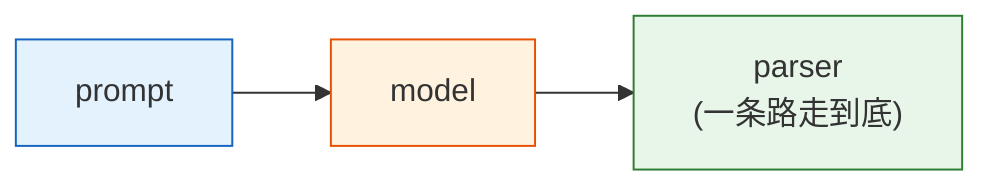
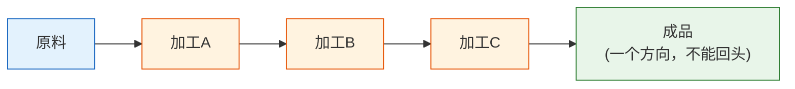
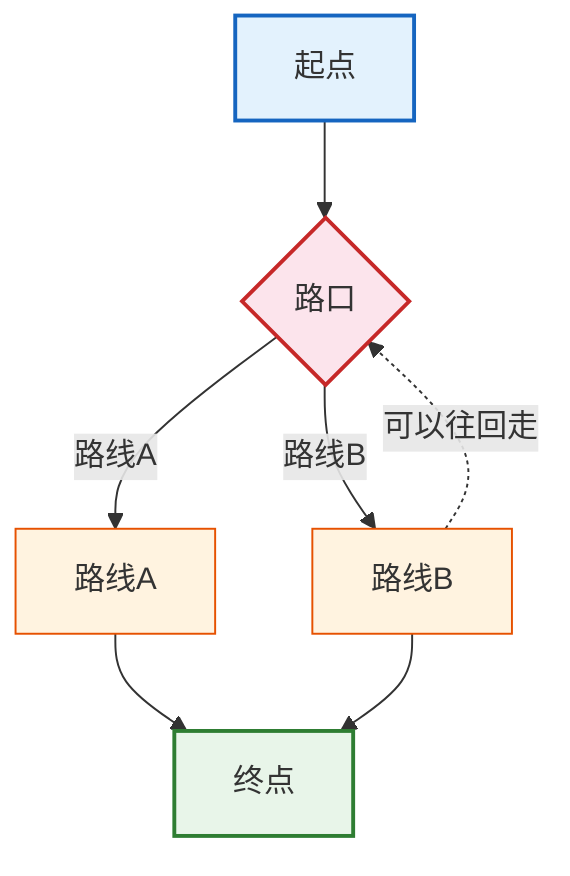
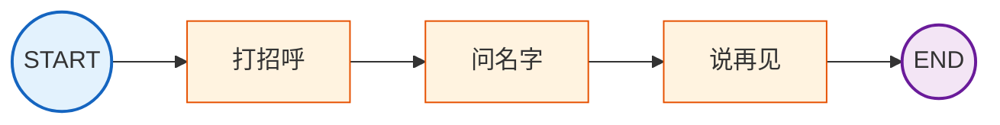
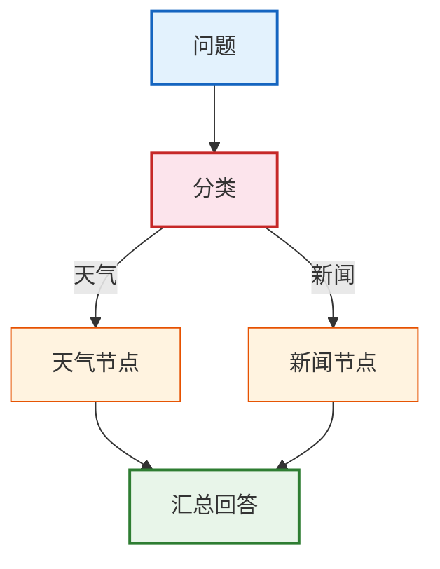
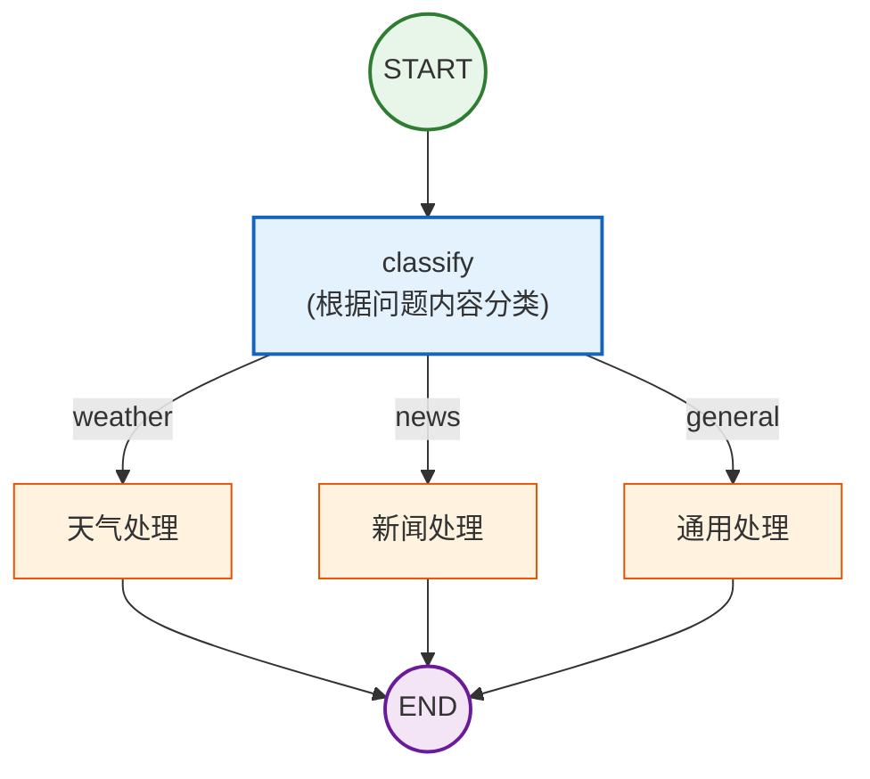
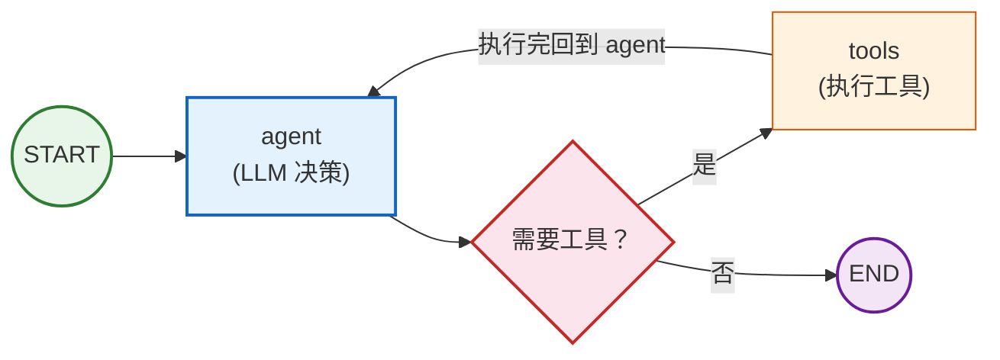

# 第08课：LangGraph 入门——用图思维编排 AI

> **学习目标**：理解 LangGraph 的图式编排思维，掌握 StateGraph、节点、边的用法，构建第一个有状态的图工作流。

---

## 本课导航

| 小节 | 主题 | 预计时间 |
|------|------|---------|
| 1 | 为什么需要 LangGraph | 10 分钟 |
| 2 | 核心概念：图思维 | 15 分钟 |
| 3 | 构建第一个 StateGraph | 25 分钟 |
| 4 | 条件分支与路由 | 20 分钟 |

---

## 1. 为什么需要 LangGraph

### LangChain 链的局限

前面学过的 LCEL 链是**线性的**：



但现实中的 AI 应用往往更复杂：

| 场景 | 为什么线性链搞不定 |
|------|-------------------|
| Agent 循环 | 调用工具→看结果→再决定下一步→可能再调工具（需要循环） |
| 条件分支 | 根据问题类型走不同处理路径（天气问题走天气工具，代码问题走代码工具） |
| 暂停等待人工 | AI 生成草稿→暂停→等人审核→继续执行 |
| 多 Agent 协作 | Agent A 做完交给 Agent B，B 可能退回给 A 修改 |

### 生活类比

**LangChain 链** = 工厂流水线（一个方向，不能回头）



**LangGraph 图** = 有路口的导航系统（可以转弯、回头、暂停）



---

## 2. 核心概念：图思维

### 2.1 图的四要素

| 概念 | 说明 | 类比 |
|------|------|------|
| **State（状态）** | 贯穿全流程的共享数据 | 工单（记录当前所有信息） |
| **Node（节点）** | 处理数据的函数 | 工位（每个工位干一件事） |
| **Edge（边）** | 节点之间的连接 | 传送带（决定下一步去哪） |
| **START/END** | 图的入口和出口 | 进料口/出货口 |

### 2.2 一个简单的图



对应代码思路：

```python
# 1. 定义状态（工单上有什么信息）
class State(TypedDict):
    messages: list    # 对话消息列表

# 2. 定义节点（每个工位做什么）
def greet(state): ...      # 打招呼
def ask_name(state): ...   # 问名字
def say_bye(state): ...    # 说再见

# 3. 连接节点（传送带怎么走）
graph.add_edge(START, "greet")
graph.add_edge("greet", "ask_name")
graph.add_edge("ask_name", "say_bye")
graph.add_edge("say_bye", END)
```

---

## 3. 构建第一个 StateGraph

### 3.1 完整示例：带循环的聊天机器人

```python
from typing import TypedDict, Annotated
from langgraph.graph import StateGraph, START, END
from langgraph.graph.message import add_messages
from langgraph.checkpoint.memory import MemorySaver
from langchain_openai import ChatOpenAI

# Step 1: 定义状态
class State(TypedDict):
    messages: Annotated[list, add_messages]  # 自动追加消息

# Step 2: 定义模型
model = ChatOpenAI(model="gpt-4o-mini", temperature=0.7)

# Step 3: 定义节点函数
def chatbot(state: State) -> dict:
    """聊天节点：调用模型回复"""
    response = model.invoke(state["messages"])
    return {"messages": [response]}  # 返回新消息（自动追加）

# Step 4: 构建图
builder = StateGraph(State)
builder.add_node("chatbot", chatbot)  # 添加节点
builder.add_edge(START, "chatbot")     # START → chatbot
builder.add_edge("chatbot", END)       # chatbot → END

# Step 5: 编译（加记忆）
graph = builder.compile(checkpointer=MemorySaver())

# Step 6: 运行
config = {"configurable": {"thread_id": "user_001"}}

# 多轮对话
result1 = graph.invoke(
    {"messages": [("user", "我叫张三")]},
    config=config,
)
print(result1["messages"][-1].content)

result2 = graph.invoke(
    {"messages": [("user", "我叫什么名字？")]},
    config=config,
)
print(result2["messages"][-1].content)
# AI 记住了你叫张三！
```

### 3.2 逐步解析

```
Step 1: 定义状态
  State 是一个 TypedDict，包含 messages 字段
  Annotated[list, add_messages] 表示新消息会自动追加到列表

Step 2: 定义节点
  节点就是普通函数：接收 State，返回要更新的字段
  chatbot 函数调用 LLM，返回 {"messages": [AI回复]}

Step 3: 构建图
  add_node("名字", 函数) → 注册节点
  add_edge(A, B) → 连接节点

Step 4: 编译
  compile() 把图构建器变成可执行的图
  checkpointer=MemorySaver() 让图有记忆

Step 5: 运行
  invoke(input, config) 执行图
  config 中的 thread_id 用于区分不同对话
```

### 3.3 State 的合并策略

```python
from typing import Annotated
from operator import add
from langgraph.graph.message import add_messages

class State(TypedDict):
    # 追加：节点返回 {"messages": [msg]} → 追加到列表
    messages: Annotated[list, add_messages]
    
    # 累加：节点返回 {"count": 1} → count += 1
    count: Annotated[int, add]
    
    # 覆盖（默认）：节点返回 {"summary": "新值"} → 直接替换
    summary: str

# 重要：节点函数只返回需要更新的字段！
def my_node(state: State) -> dict:
    # 只返回要改的字段，不改的不用返回
    return {"count": 1, "summary": "新摘要"}
    # messages 不会被清空，因为没返回它
```

---

## 4. 条件分支与路由

### 4.1 什么是条件边

普通边是固定的（A→B），条件边是根据状态**动态选择**下一步去哪。



> **图解说明**：条件边让图根据状态动态选择路径——分类节点判断问题类型后，条件边自动路由到对应的处理节点。

### 4.2 完整示例：智能路由

```python
from typing import TypedDict, Annotated
from langgraph.graph import StateGraph, START, END
from langgraph.graph.message import add_messages

# 定义状态
class State(TypedDict):
    messages: Annotated[list, add_messages]
    category: str  # 问题分类

# 节点1: 分类
def classify(state: State) -> dict:
    last_msg = state["messages"][-1]
    content = last_msg.content if hasattr(last_msg, 'content') else str(last_msg)
    
    if "天气" in content:
        return {"category": "weather"}
    elif "新闻" in content:
        return {"category": "news"}
    else:
        return {"category": "general"}

# 节点2: 天气处理
def handle_weather(state: State) -> dict:
    return {"messages": [("ai", "☀️ 今天天气晴朗，适合出行！")]}

# 节点3: 新闻处理
def handle_news(state: State) -> dict:
    return {"messages": [("ai", "📰 今日头条：AI技术持续发展...")]}

# 节点4: 通用处理
def handle_general(state: State) -> dict:
    return {"messages": [("ai", "我收到了你的问题，让我想想...")]}

# 路由函数
def route(state: State) -> str:
    """根据分类结果选择下一个节点"""
    return state["category"]

# 构建图
builder = StateGraph(State)
builder.add_node("classify", classify)
builder.add_node("weather", handle_weather)
builder.add_node("news", handle_news)
builder.add_node("general", handle_general)

# 连接
builder.add_edge(START, "classify")

# 条件边：classify 的结果决定下一步
builder.add_conditional_edges("classify", route)
# route 返回 "weather" → 去 weather 节点
# route 返回 "news" → 去 news 节点
# route 返回 "general" → 去 general 节点

# 各处理节点 → END
builder.add_edge("weather", END)
builder.add_edge("news", END)
builder.add_edge("general", END)

# 编译运行
graph = builder.compile()

# 测试
tests = ["今天天气怎么样？", "最近有什么新闻？", "你好呀"]
for t in tests:
    result = graph.invoke({"messages": [("user", t)]})
    print(f"问: {t}")
    print(f"答: {result['messages'][-1].content}\n")
```

### 4.3 图的可视化理解



> **图解说明**：这是条件分支的完整流程——从 START 进入分类节点，根据问题类型路由到不同的处理节点，最后汇聚到 END。

### 4.4 循环：Agent 工具调用

LangGraph 最强大的能力之一是**循环**：

```python
from langgraph.prebuilt import create_react_agent, ToolNode
from langchain_core.tools import tool

@tool
def search(query: str) -> str:
    """搜索信息"""
    return f"搜索结果: {query}"

@tool
def calculate(expr: str) -> str:
    """计算表达式"""
    try:
        return str(eval(expr))
    except:
        return "无法计算"

# create_react_agent 内部就是一个带循环的图
agent = create_react_agent(
    ChatOpenAI(model="gpt-4o-mini", temperature=0),
    [search, calculate],
)

# 执行时：agent → 选工具 → 执行 → 回到agent → 再选 → ... → END
result = agent.invoke({"messages": [("user", "搜索LangChain然后计算2的10次方")]})
```

循环过程：



> **图解说明**：Agent 循环的核心——LLM 判断是否需要调用工具，需要则执行工具后回到 Agent 继续决策，不需要则直接输出结果。这个循环让 Agent 能多步推理、逐步逼近目标。

---

## 本课小结

| 你学到了什么 | 一句话总结 |
|-------------|-----------|
| LangGraph 定位 | 图结构编排引擎，支持循环/分支/状态管理 |
| 四要素 | State + Node + Edge + START/END |
| StateGraph | 定义状态→添加节点→连接边→编译→运行 |
| 条件分支 | add_conditional_edges 根据状态动态路由 |
| 循环 | 工具调用→回到 Agent→继续决策 |
| 记忆 | Checkpointer 自动持久化对话状态 |

### 核心代码模板

```python
# 1. 定义状态
class State(TypedDict):
    messages: Annotated[list, add_messages]

# 2. 定义节点函数
def my_node(state: State) -> dict:
    return {"messages": [response]}

# 3. 构建图
builder = StateGraph(State)
builder.add_node("my_node", my_node)
builder.add_edge(START, "my_node")
builder.add_edge("my_node", END)

# 4. 编译
graph = builder.compile(checkpointer=MemorySaver())

# 5. 运行
result = graph.invoke({"messages": [("user", "你好")]}, config=config)
```

### 配套知识库

- 📖 `知识库/04_LangGraph技术参考.md` — LangGraph 完整 API 和高级模式

### 下一课

➡️ **第09课：复杂工作流与多 Agent 协作**——构建多 Agent 系统和人机协作工作流。
