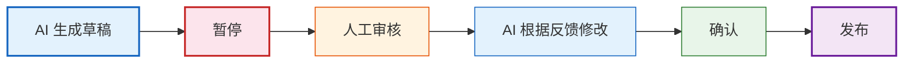
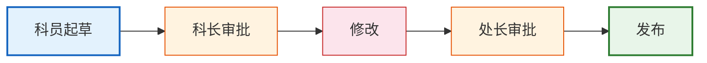
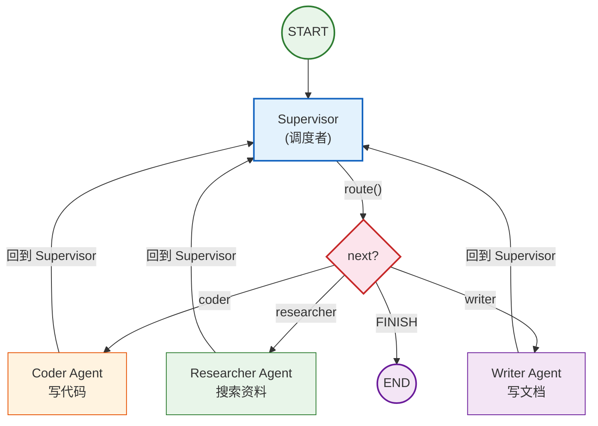

# 第09课：复杂工作流与多 Agent 协作

> **学习目标**：掌握 LangGraph 的高级用法——人机协作（HITL）、多 Agent 架构、流式输出，构建生产级复杂工作流。

---

## 本课导航

| 小节 | 主题 | 预计时间 |
|------|------|---------|
| 1 | 人机协作（HITL） | 20 分钟 |
| 2 | 多 Agent 架构 | 25 分钟 |
| 3 | 流式输出与调试 | 15 分钟 |
| 4 | 综合实战 | 20 分钟 |

---

## 1. 人机协作（HITL）

### 1.1 什么是人机协作

有些任务需要 AI 和人**交替完成**：



> **图解说明**：人机协作的核心是 AI 做完一部分后暂停，等待人工审核或输入，再根据反馈继续执行。`interrupt` 机制让图在指定节点暂停，人工输入后用 `Command(resume=...)` 恢复执行。

### 生活类比

就像公文审批流程：



> **图解说明**：公文审批是多级审核的典型场景——科员写草稿、科长初审、修改后处长终审、最终发布。AI 工作流中的 HITL 机制与此类似。

AI 是科员，你是科长。AI 做好初稿后"暂停"，等你审核，你给反馈后 AI 继续。

### 1.2 用 interrupt 实现

```python
from langgraph.types import interrupt, Command
from langgraph.graph import StateGraph, START, END
from typing import TypedDict, Annotated
from langgraph.graph.message import add_messages
from langgraph.checkpoint.memory import MemorySaver

class State(TypedDict):
    messages: Annotated[list, add_messages]
    draft: str       # AI 草稿
    final: str       # 最终结果

# 节点1: AI 生成草稿
def generate_draft(state: State) -> dict:
    draft = "这是一份AI生成的报告草稿..."
    return {"draft": draft}

# 节点2: 人工审核（暂停点）
def human_review(state: State) -> dict:
    # interrupt 会让图暂停，等待人工输入
    review_result = interrupt({
        "question": "请审核以下草稿：",
        "content": state["draft"],
    })
    # 人工输入后恢复执行
    if "通过" in review_result or "同意" in review_result:
        return {"final": state["draft"]}
    else:
        # 根据反馈修改
        return {"final": f"修改后：{state['draft']}\n（根据反馈：{review_result}）"}

# 节点3: 发布
def publish(state: State) -> dict:
    return {"messages": [("ai", f"已发布：{state['final']}")]}

# 构建图
builder = StateGraph(State)
builder.add_node("draft", generate_draft)
builder.add_node("review", human_review)
builder.add_node("publish", publish)

builder.add_edge(START, "draft")
builder.add_edge("draft", "review")
builder.add_edge("review", "publish")
builder.add_edge("publish", END)

graph = builder.compile(checkpointer=MemorySaver())

# 第一次调用——会在 review 节点暂停
config = {"configurable": {"thread_id": "task_001"}}
result = graph.invoke({"messages": [("user", "生成报告")]}, config=config)
# 此时图暂停在 review 节点，result 包含 interrupt 信息

# 人工审核后恢复——传入审核结果
result = graph.invoke(
    Command(resume="内容不错，但需要补充数据"),
    config=config,
)
print(result["messages"][-1].content)
# 已发布：修改后的报告...
```

### 1.3 HITL 应用场景

| 场景 | AI 的角色 | 人的角色 |
|------|----------|---------|
| 内容审核 | 生成草稿 | 审核修改 |
| 高风险操作 | 准备操作 | 确认执行 |
| 客服转人工 | 先尝试回答 | 复杂问题接手 |
| 代码审查 | 生成代码 | 审查合并 |

---

## 2. 多 Agent 架构

### 2.1 什么是多 Agent

一个 Agent 可能不够用——复杂任务需要**多个专业 Agent 分工合作**。

### 生活类比

就像一个团队：

| 角色 | Agent | 职责 |
|------|-------|------|
| 项目经理 | Supervisor Agent | 分配任务、汇总结果 |
| 程序员 | Coder Agent | 写代码 |
| 研究员 | Researcher Agent | 搜索资料 |
| 写手 | Writer Agent | 写文档 |

### 2.2 Supervisor 模式（最常用）



> **图解说明**：Supervisor 模式就像一个团队——Supervisor 是项目经理，负责分配任务和汇总结果。每个子 Agent 做完自己的工作后回到 Supervisor，由它决定是否结束或继续分发。子 Agent 之间不直接通信，一切通过 Supervisor 协调。

### 2.3 完整示例：多 Agent 团队

```python
from typing import TypedDict, Annotated, Literal
from langgraph.graph import StateGraph, START, END
from langgraph.graph.message import add_messages
from langchain_openai import ChatOpenAI
from langchain_core.tools import tool

# 状态
class State(TypedDict):
    messages: Annotated[list, add_messages]
    next: str  # 下一个交给谁

model = ChatOpenAI(model="gpt-4o-mini", temperature=0)

# Supervisor: 决定下一步交给谁
def supervisor(state: State) -> dict:
    last_msg = state["messages"][-1]
    content = last_msg.content if hasattr(last_msg, 'content') else str(last_msg)
    
    # 简单路由逻辑（实际可用 LLM 决策）
    if any(w in content for w in ["代码", "编程", "函数", "bug"]):
        return {"next": "coder"}
    elif any(w in content for w in ["搜索", "查找", "资料", "最新"]):
        return {"next": "researcher"}
    elif any(w in content for w in ["写", "文档", "报告", "总结"]):
        return {"next": "writer"}
    else:
        return {"next": "FINISH"}

def route_from_supervisor(state: State) -> str:
    nxt = state["next"]
    if nxt == "FINISH":
        return END
    return nxt

# Coder Agent
def coder_agent(state: State) -> dict:
    return {"messages": [("ai", "💻 我是代码专家。这是代码解决方案：\n```python\nprint('Hello World')\n```")]}

# Researcher Agent
def researcher_agent(state: State) -> dict:
    return {"messages": [("ai", "🔍 我是研究专家。根据搜索，这是相关资料...")]}

# Writer Agent
def writer_agent(state: State) -> dict:
    return {"messages": [("ai", "✍️ 我是写作专家。这是整理好的文档...")]}

# 构建多 Agent 图
builder = StateGraph(State)
builder.add_node("supervisor", supervisor)
builder.add_node("coder", coder_agent)
builder.add_node("researcher", researcher_agent)
builder.add_node("writer", writer_agent)

builder.add_edge(START, "supervisor")
builder.add_conditional_edges("supervisor", route_from_supervisor)

# 所有 Agent 完成后回到 Supervisor
builder.add_edge("coder", "supervisor")
builder.add_edge("researcher", "supervisor")
builder.add_edge("writer", "supervisor")

graph = builder.compile()

# 测试
result = graph.invoke({"messages": [("user", "帮我写一个Python爬虫的代码")]})
for msg in result["messages"]:
    if hasattr(msg, 'content') and msg.content:
        print(f"[{msg.__class__.__name__}] {msg.content[:80]}")
```

### 2.4 多 Agent 模式对比

| 模式 | 结构 | 适用场景 | 复杂度 |
|------|------|---------|--------|
| **Supervisor** | 中心调度 | 任务可分解 | ★★☆ |
| **Hierarchical** | 多层嵌套 | 大型项目 | ★★★ |
| **Network** | 互相通信 | 协作探索 | ★★★★ |
| **Handoff** | 传递控制权 | 客服路由 | ★★☆ |

---

## 3. 流式输出与调试

### 3.1 流式输出

```python
# 方式1: values 模式（每步输出完整状态）
for event in graph.stream(
    {"messages": [("user", "你好")]},
    config=config,
    stream_mode="values",
):
    if "messages" in event:
        last = event["messages"][-1]
        if hasattr(last, 'content') and last.content:
            print(f"[更新] {last.content[:50]}")

# 方式2: updates 模式（只输出变更）
for event in graph.stream(
    {"messages": [("user", "你好")]},
    config=config,
    stream_mode="updates",
):
    print(f"节点 {list(event.keys())} 更新了")

# 方式3: messages 模式（逐 token 输出）
for event in graph.stream(
    {"messages": [("user", "写一首诗")]},
    config=config,
    stream_mode="messages",
):
    # 逐 token 输出 LLM 的回复
    print(event[0][0].content if event[0] else "", end="")
```

### 3.2 调试技巧

```python
# 查看图结构
print(graph.get_graph().nodes)
print(graph.get_graph().edges)

# 查看状态历史（时间旅行）
for state in graph.get_state_history(config):
    print(f"步骤: {state.next}, 消息数: {len(state.values.get('messages', []))}")

# 回到历史状态重新执行
states = list(graph.get_state_history(config))
old_state = states[2]
graph.invoke(None, config={
    **config,
    "checkpoint_id": old_state.config["configurable"]["checkpoint_id"]
})
```

---

## 4. 综合实战：智能客服系统

```python
from typing import TypedDict, Annotated
from langgraph.graph import StateGraph, START, END
from langgraph.graph.message import add_messages
from langgraph.checkpoint.memory import MemorySaver
from langgraph.types import interrupt, Command
from langchain_openai import ChatOpenAI

class State(TypedDict):
    messages: Annotated[list, add_messages]
    category: str
    resolved: bool

model = ChatOpenAI(model="gpt-4o-mini", temperature=0)

# 节点1: 分类
def classify(state: State) -> dict:
    last = state["messages"][-1]
    content = last.content if hasattr(last, 'content') else str(last)
    if "退款" in content or "退货" in content:
        return {"category": "refund"}
    elif "咨询" in content or "怎么" in content:
        return {"category": "inquiry"}
    else:
        return {"category": "other"}

# 节点2: 退款处理
def handle_refund(state: State) -> dict:
    return {
        "messages": [("ai", "您的退款申请已收到。退款将在3-5个工作日内到账。")],
        "resolved": True
    }

# 节点3: 咨询处理
def handle_inquiry(state: State) -> dict:
    response = model.invoke(state["messages"])
    return {"messages": [response], "resolved": True}

# 节点4: 转人工
def transfer_human(state: State) -> dict:
    human_input = interrupt({"question": "需要人工客服介入，请描述您的问题："})
    return {"messages": [("ai", f"人工客服回复：{human_input}")], "resolved": True}

# 路由
def route(state: State) -> str:
    cat = state.get("category", "other")
    if cat == "refund":
        return "refund"
    elif cat == "inquiry":
        return "inquiry"
    else:
        return "human"

# 构建图
builder = StateGraph(State)
builder.add_node("classify", classify)
builder.add_node("refund", handle_refund)
builder.add_node("inquiry", handle_inquiry)
builder.add_node("human", transfer_human)

builder.add_edge(START, "classify")
builder.add_conditional_edges("classify", route)
builder.add_edge("refund", END)
builder.add_edge("inquiry", END)
builder.add_edge("human", END)

graph = builder.compile(checkpointer=MemorySaver())

# 测试
config = {"configurable": {"thread_id": "customer_001"}}

# 退款问题（自动处理）
r1 = graph.invoke({"messages": [("user", "我要退款")]}, config=config)
print(r1["messages"][-1].content)
```

---

## 本课小结

| 你学到了什么 | 一句话总结 |
|-------------|-----------|
| 人机协作 | interrupt 暂停等人工，Command 恢复执行 |
| 多 Agent | Supervisor 调度 + 专业 Agent 分工 |
| 流式输出 | stream 方法逐 token/逐步输出 |
| 调试 | 状态历史、时间旅行 |
| 综合实战 | 构建了智能客服系统 |

### 配套知识库

- 📖 `知识库/04_LangGraph技术参考.md` — 多 Agent 和 HITL 完整 API

### 下一课

➡️ **第10课：从开发到部署——LangChain 应用上线实战**——把你的应用部署到生产环境。
