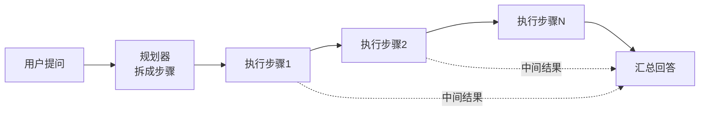
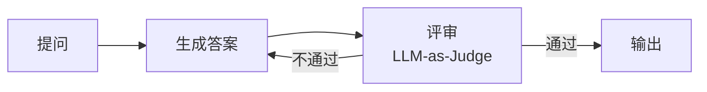
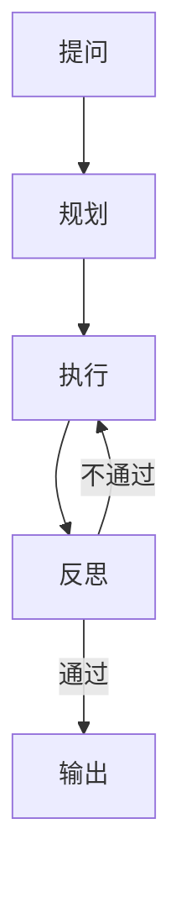

# 第 100 课 Plan-and-Execute 与 Reflection 实战

> 阶段 16·Agent 设计模式大全与实战·第 2 课。本课学两种提升 Agent 质量的模式。

---

## 一、Plan-and-Execute：先规划再执行

### 为什么需要

ReAct 是"走一步看一步"，复杂任务容易跑偏。Plan-and-Execute 先制定完整计划，再逐步执行。



### ReAct vs Plan-and-Execute

| 对比项 | ReAct | Plan-and-Execute |
| --- | --- | --- |
| 思考方式 | 走一步看一步 | 先全局规划 |
| 适合任务 | 简单、2-3步 | 复杂、多步骤 |
| 错误恢复 | 自动纠正 | 需 Replanner |
| Token 消耗 | 少 | 多 |

### 实战代码

```python
from langgraph.graph import StateGraph, END
from langchain_openai import ChatOpenAI
from typing import TypedDict, List

class State(TypedDict):
    question: str
    plan: List[str]
    results: List[str]
    answer: str

llm = ChatOpenAI(model="gpt-4o", temperature=0)

def planner(state: State):
    """规划：把问题拆成步骤"""
    prompt = f"""把以下问题拆成3-5个执行步骤，每步一句话：
    {state['question']}
    用编号列表输出。"""
    response = llm.invoke(prompt)
    steps = [s.strip() for s in response.content.split('\n') if s.strip() and s[0].isdigit()]
    state["plan"] = steps
    state["results"] = []
    return state

def executor(state: State):
    """逐步执行"""
    idx = len(state["results"])
    if idx >= len(state["plan"]):
        return state
    step = state["plan"][idx]
    response = llm.invoke(f"执行以下步骤并给出结果：{step}")
    state["results"].append(response.content)
    return state

def should_continue(state: State) -> str:
    if len(state["results"]) < len(state["plan"]):
        return "executor"
    return "summarize"

def summarize(state: State):
    """汇总所有步骤结果"""
    summary = "\n".join(f"步骤{i+1}：{r}" for i, r in enumerate(state["results"]))
    response = llm.invoke(f"基于以下步骤结果回答用户问题：\n{summary}\n\n问题：{state['question']}")
    state["answer"] = response.content
    return state

g = StateGraph(State)
g.add_node("planner", planner)
g.add_node("executor", executor)
g.add_node("summarize", summarize)
g.set_entry_point("planner")
g.add_edge("planner", "executor")
g.add_conditional_edges("executor", should_continue, {"executor": "executor", "summarize": "summarize"})
g.add_edge("summarize", END)
app = g.compile()
```

---

## 二、Reflection：做完自我检查

### 为什么需要

LLM 有时会出错或答得不好。Reflection 让 Agent 生成答案后再检查一遍，发现问题就重做。



### 实战代码

```python
from langgraph.graph import StateGraph, END
from langchain_openai import ChatOpenAI
from typing import TypedDict

class State(TypedDict):
    question: str
    answer: str
    critique: str
    retry_count: int

llm = ChatOpenAI(model="gpt-4o", temperature=0)

def generator(state: State):
    response = llm.invoke(f"认真回答以下问题：\n{state['question']}\n\n"
                         + (f"上次的评审意见：{state.get('critique','')}" if state.get('retry_count',0)>0 else ""))
    state["answer"] = response.content
    return state

def reflector(state: State):
    prompt = f"""评审以下回答：
    问题：{state['question']}
    回答：{state['answer']}
    评判是否准确、完整。如果不合格，说明问题。合格则只说"通过"。"""
    response = llm.invoke(prompt)
    state["critique"] = response.content
    state["retry_count"] = state.get("retry_count", 0) + 1
    return state

def route(state: State) -> str:
    if "通过" in state.get("critique", "") or state["retry_count"] >= 3:
        return END
    return "generator"

g = StateGraph(State)
g.add_node("generator", generator)
g.add_node("reflector", reflector)
g.set_entry_point("generator")
g.add_edge("generator", "reflector")
g.add_conditional_edges("reflector", route, {"generator": "generator", END: END})
app = g.compile()
```

---

## 三、两种模式可以组合



Plan-and-Execute + Reflection = 先规划执行，再做质量检查，最稳健。

---

## 四、动手任务

1. 用 Plan-and-Execute 模式做一个"研究某个技术"的 Agent；
2. 给 Reflection Agent 一个故意答错的问题，看它能不能纠正；
3. 把两种模式组合起来；
4. 在 LangSmith Trace 中观察两种模式的差异。

---

## 小结

- Plan-and-Execute：先规划再执行，适合复杂任务；
- Reflection：生成→评审→重做，提升质量；
- 两种模式可以组合使用；
- Plan-and-Execute 适合步骤多的任务，Reflection 适合质量要求高的任务。

> 下一课学 Multi-Agent 多智能体协作模式。