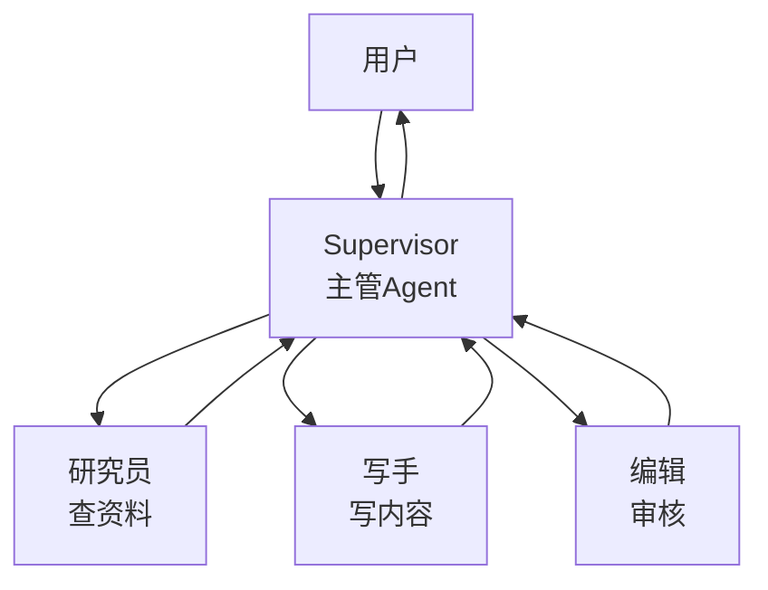
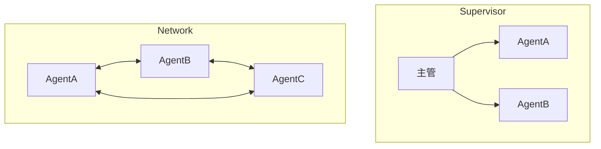
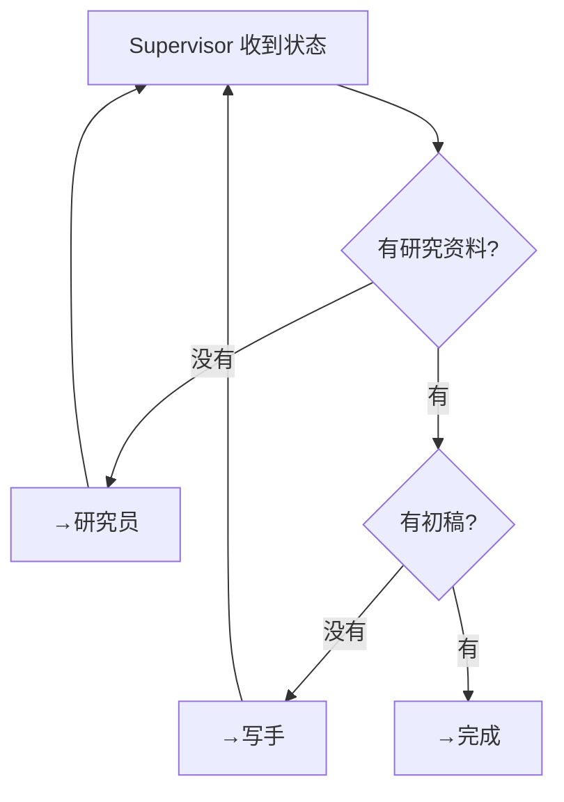
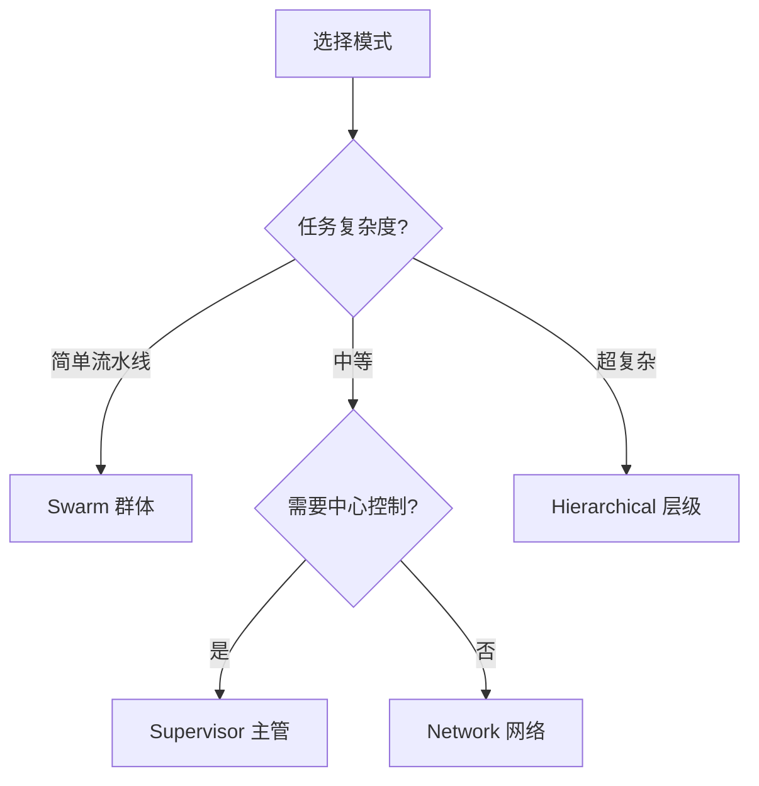

# 第 101 课 Multi-Agent 协作模式实战

> 阶段 16·Agent 设计模式大全与实战·第 3 课。本课学第四种模式：Multi-Agent 多智能体协作。

---

## 一、为什么需要多 Agent

单个 Agent 能力有限，复杂任务需要多个专业 Agent 协作——像公司不同部门分工。



---

## 二、四种协作模式

| 模式 | 结构 | 适合场景 | 复杂度 |
| --- | --- | --- | --- |
| Supervisor 主管 | 一个中心调度 | 大多数场景 | 中 |
| Hierarchical 层级 | 主管下有子主管 | 超大型任务 | 高 |
| Network 网络 | 任意互相通信 | 高度自主 | 高 |
| Swarm 群体 | 轮流接力 | 简单流水线 | 低 |



---

## 三、实战：Supervisor 模式

做一个"写文章"的多 Agent 系统：主管 → 研究员 + 写手。

```python
from langgraph.graph import StateGraph, END
from langchain_openai import ChatOpenAI
from typing import TypedDict, List

class State(TypedDict):
    topic: str
    research: str
    draft: str
    final: str
    next_agent: str

llm = ChatOpenAI(model="gpt-4o", temperature=0)

def supervisor(state: State):
    """主管：决定下一步交给谁"""
    if not state.get("research"):
        state["next_agent"] = "researcher"
    elif not state.get("draft"):
        state["next_agent"] = "writer"
    else:
        state["next_agent"] = "done"
    return state

def researcher(state: State):
    """研究员：查资料"""
    response = llm.invoke(f"作为研究员，列出关于'{state['topic']}'的3个关键信息点。")
    state["research"] = response.content
    return state

def writer(state: State):
    """写手：写文章"""
    response = llm.invoke(f"基于以下资料写一篇200字短文：\n{state['research']}\n主题：{state['topic']}")
    state["draft"] = response.content
    state["final"] = state["draft"]
    return state

def route(state: State) -> str:
    nxt = state.get("next_agent", "done")
    if nxt == "researcher":
        return "researcher"
    elif nxt == "writer":
        return "writer"
    return END

g = StateGraph(State)
g.add_node("supervisor", supervisor)
g.add_node("researcher", researcher)
g.add_node("writer", writer)
g.set_entry_point("supervisor")
g.add_conditional_edges("supervisor", route, {
    "researcher": "researcher", "writer": "writer", END: END
})
g.add_edge("researcher", "supervisor")
g.add_edge("writer", "supervisor")
app = g.compile()

# 测试
result = app.invoke({"topic": "人工智能的未来"})
print(result["final"])
```

---

## 四、Supervisor 的路由逻辑



---

## 五、四种模式怎么选



---

## 六、常见问题与避坑

| 问题 | 原因 | 解决 |
| --- | --- | --- |
| 死循环 | Supervisor 一直派同一个 Agent | 加 retry_count 限制 |
| Agent 踢皮球 | 互相推任务 | Supervisor 强制路由 |
| 上下文丢失 | 各 Agent 独立 | 共享 State |
| 成本爆炸 | 每步都调 LLM | 简单逻辑用代码 |

---

## 七、动手任务

1. 跑本课 Supervisor 代码，观察主管如何调度；
2. 加一个"编辑 Agent"负责审核初稿；
3. 把 Agent 数量从 2 个增加到 4 个，观察效果；
4. 在 LangSmith Trace 中看 Agent 间的消息传递。

---

## 小结

- 多 Agent 协作有四种模式：Supervisor、Hierarchical、Network、Swarm；
- Supervisor 最常用：一个主管调度多个专业 Agent；
- LangGraph 实现：Supervisor 节点 + 条件路由 + 子 Agent 节点；
- 选模式看复杂度：简单→Swarm，中等→Supervisor，复杂→Hierarchical。

> 下一课做设计模式选型总结与全阶段收官。