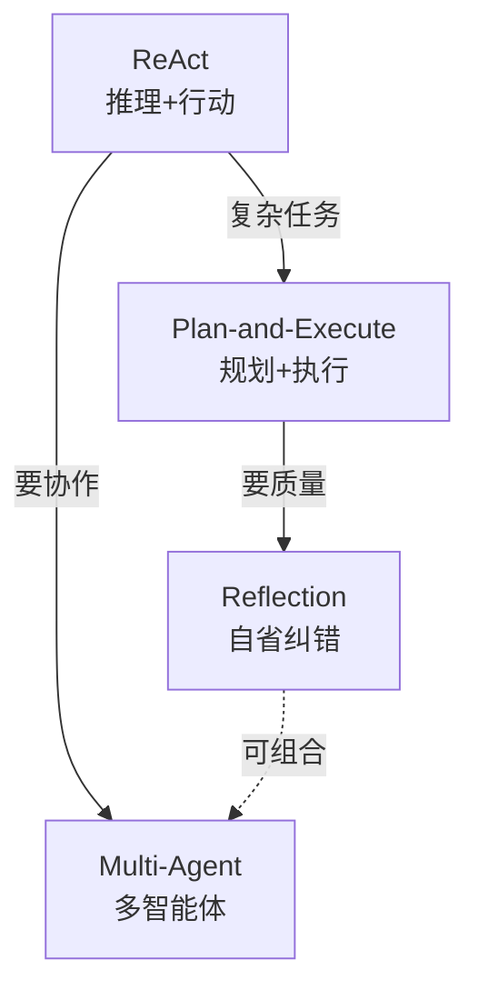
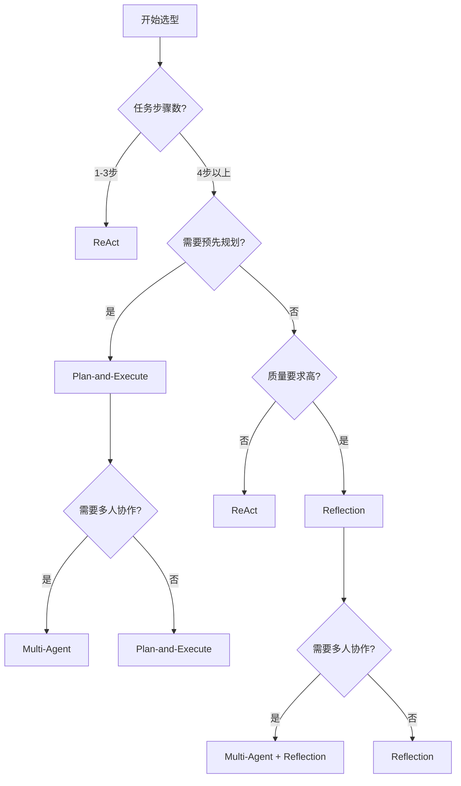
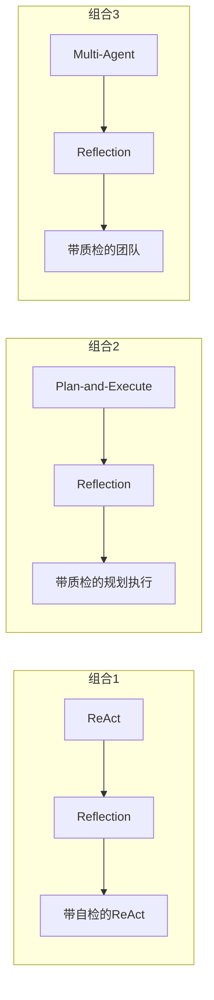
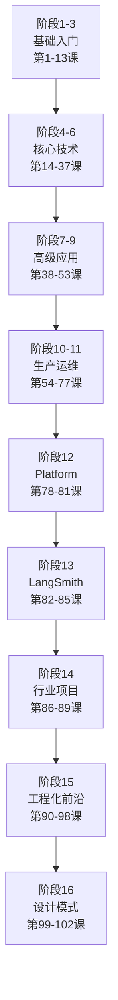

# 第 102 课 设计模式选型与全阶段收官

> 阶段 16·Agent 设计模式大全与实战·第 4 课（全阶段收官课）。总结四种模式的选型方法，完成阶段 16 的学习。

---

## 一、四种模式总览



---

## 二、选型决策树



---

## 三、详细对比表

| 维度 | ReAct | Plan-and-Execute | Reflection | Multi-Agent |
| --- | --- | --- | --- | --- |
| 核心思想 | 边想边做 | 先规划再执行 | 自我检查 | 团队协作 |
| 适合任务 | 简单工具调用 | 复杂多步骤 | 高质量要求 | 多专业领域 |
| Token 消耗 | 低 | 中 | 中高 | 高 |
| 延迟 | 低 | 中 | 中 | 高 |
| 实现难度 | 低 | 中 | 中 | 高 |
| 错误恢复 | 自动 | Replanner | 重做 | Supervisor |
| 典型场景 | 问答+搜索 | 研究报告 | 代码生成 | 内容创作 |

---

## 四、组合使用指南



---

## 五、代码模板速查

### ReAct 模板

```python
# Agent节点 + ToolNode + 条件边循环
g.add_node("agent", agent)
g.add_node("tools", ToolNode(tools))
g.add_conditional_edges("agent", route, {"tools": "tools", END: END})
g.add_edge("tools", "agent")
```

### Plan-and-Execute 模板

```python
# Planner → Executor循环 → Summarize
g.add_node("planner", planner)
g.add_node("executor", executor)
g.add_conditional_edges("executor", should_continue, {"executor": "executor", "summarize": "summarize"})
```

### Reflection 模板

```python
# Generator → Reflector → 条件路由
g.add_node("generator", generator)
g.add_node("reflector", reflector)
g.add_conditional_edges("reflector", route, {"generator": "generator", END: END})
```

### Multi-Agent 模板

```python
# Supervisor → 条件路由 → 子Agent → 回Supervisor
g.add_node("supervisor", supervisor)
g.add_conditional_edges("supervisor", route, {...})
g.add_edge("researcher", "supervisor")
```

---

## 六、全阶段总结

### 阶段 16 学了什么

| 课次 | 主题 | 关键收获 |
| --- | --- | --- |
| 第 99 课 | ReAct 实战 | 推理+行动循环、LangGraph 实现 |
| 第 100 课 | Plan-and-Execute + Reflection | 规划执行、自省纠错 |
| 第 101 课 | Multi-Agent | 四种协作模式、Supervisor 实现 |
| 第 102 课 | 选型与收官 | 决策树、组合使用 |

### 完整 102 课路线回顾



---

## 七、下一步学习建议

1. 选一个模式深入实践：推荐从 ReAct 开始做完整项目；
2. 组合两种模式：ReAct + Reflection 是最实用的组合；
3. 跟踪 LangChain/LangGraph 新版本特性；
4. 阅读相关论文：ReAct、Reflexion、Plan-and-Solve；
5. 实战项目：用 Multi-Agent 做一个完整的内容创作系统。

---

## 小结

- 四种 Agent 设计模式各有适用场景，选型看步骤数、质量要求、协作需求；
- 模式可以组合使用，ReAct + Reflection 和 Plan-and-Execute + Reflection 最实用；
- 全系列 102 课覆盖从零基础到生产部署的完整路径；
- 后续建议从实战项目出发，深化对设计模式的理解。

> 恭喜完成全部 102 课的学习！从零基础到 Agent 设计模式实战，你已经掌握了 LangChain/LangGraph 的完整知识体系。