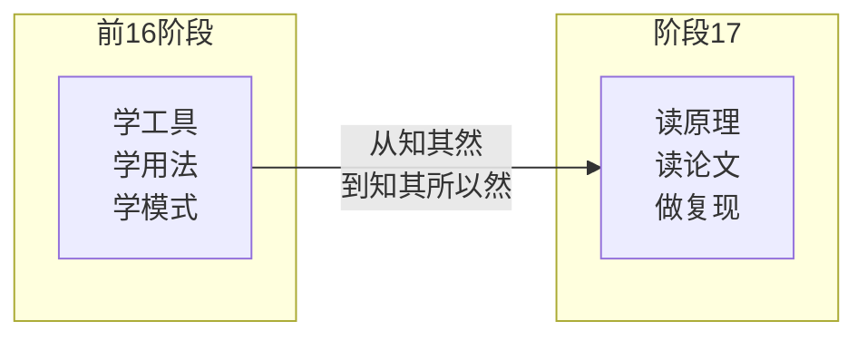
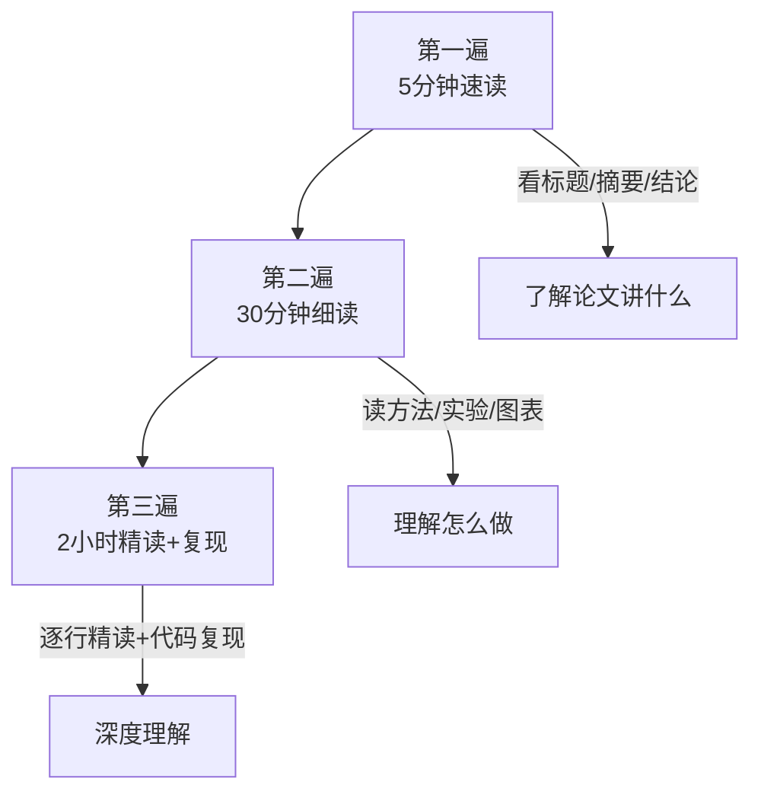
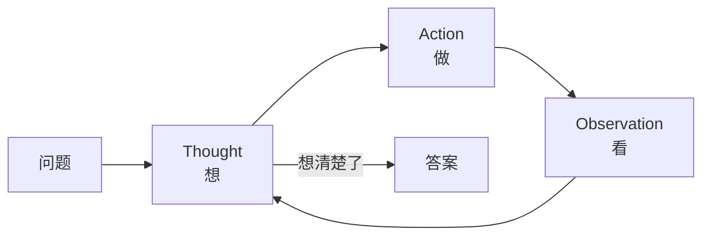
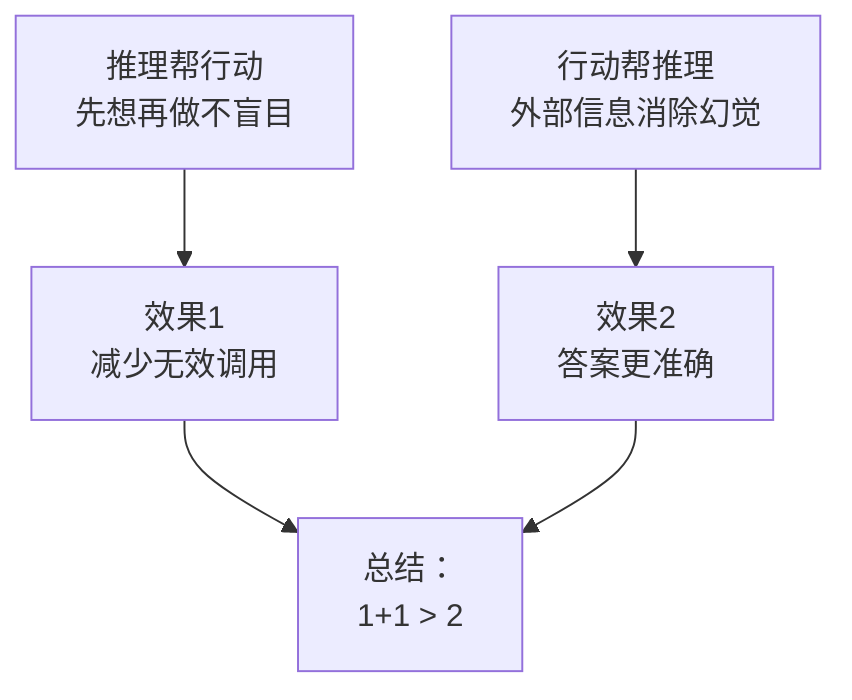
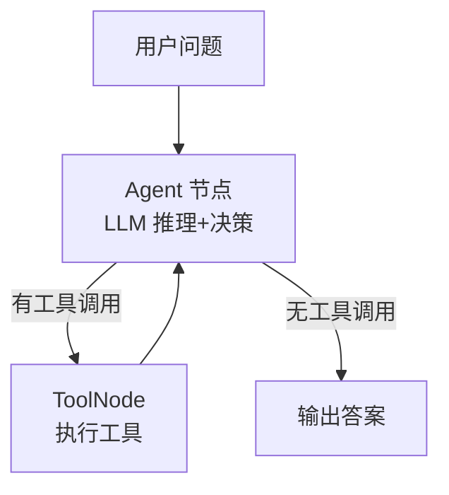
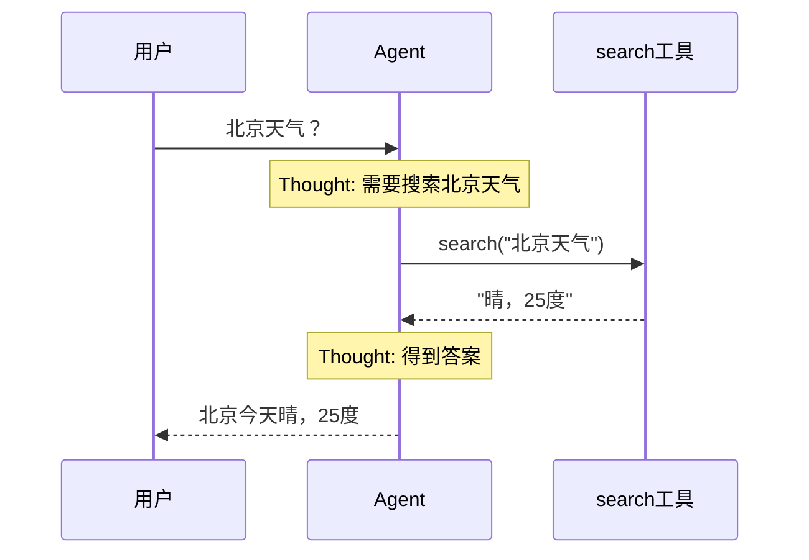

# 第 103 课 论文精读入门与 ReAct 论文复现实战

> 阶段 17·AI Agent 前沿论文精读与代码复现·第 1 课。本课学论文精读方法，并复现 ReAct 论文。

---

## 一、为什么要读论文

前面 16 个阶段学了"怎么做"，现在要学"为什么这么做"——读论文是理解原理的最有效方式。



---

## 二、论文精读方法

### 2.1 三遍阅读法



### 2.2 读论文的四问法

| 问题 | 回答什么 |
| --- | --- |
| What | 论文解决什么问题 |
| How | 用什么方法解决 |
| Why | 为什么这个方法有效 |
| So What | 对我的项目有什么启发 |

### 2.3 论文结构速查

| 部分 | 读什么 | 时间分配 |
| --- | --- | --- |
| Abstract | 一句话了解 | 1 分钟 |
| Introduction | 问题+动机 | 5 分钟 |
| Method | 核心方法（最重要） | 15 分钟 |
| Experiments | 实验设计+结果 | 5 分钟 |
| Conclusion | 贡献总结 | 2 分钟 |

---

## 三、ReAct 论文精读

### 3.1 论文一句话

> 让 LLM 像人一样：想一步→做一步→看结果→再想，推理和行动交替进行。

### 3.2 核心图解



### 3.3 论文里的例子

论文给的示例（简化版）：

```
问题：Apple Remote 第一代能控制多少设备？

Thought 1: 我需要搜索 Apple Remote 的信息
Action 1: Search["Apple Remote"]
Observation 1: Apple Remote 是苹果2005年发布的遥控器...

Thought 2: 我需要查找它能控制多少设备
Action 2: Lookup["number of devices"]
Observation 2: 第一代 Apple Remote 可以控制 Mac、iPod...

Thought 3: 答案是能控制多种设备，我查到了
Action 3: Finish["Apple Remote 可以控制 Mac、iPod 等设备"]
```

### 3.4 为什么 ReAct 有效



---

## 四、用 LangGraph 复现 ReAct

### 4.1 复现架构



### 4.2 最小复现代码

```python
from langgraph.graph import StateGraph, END
from langgraph.prebuilt import ToolNode
from langchain_openai import ChatOpenAI
from langchain_core.tools import tool
from typing import TypedDict, Annotated
from langgraph.graph.message import add_messages

@tool
def search(query: str) -> str:
    """搜索信息"""
    return f"关于'{query}'的信息"

tools = [search]
llm = ChatOpenAI(model="gpt-4o", temperature=0).bind_tools(tools)

class State(TypedDict):
    messages: Annotated[list, add_messages]

def agent(state: State):
    msgs = [{"role": "system", "content": "你是ReAct Agent，用工具回答问题"}] + state["messages"]
    resp = llm.invoke(msgs)
    return {"messages": [resp]}

def route(state: State) -> str:
    last = state["messages"][-1]
    if hasattr(last, "tool_calls") and last.tool_calls:
        return "tools"
    return END

g = StateGraph(State)
g.add_node("agent", agent)
g.add_node("tools", ToolNode(tools))
g.set_entry_point("agent")
g.add_conditional_edges("agent", route, {"tools": "tools", END: END})
g.add_edge("tools", "agent")
app = g.compile()

# 测试
result = app.invoke({"messages": [{"role": "user", "content": "北京今天天气怎么样？"}]})
print(result["messages"][-1].content)
```

### 4.3 观察 Thought 链

在 LangSmith Trace 中可以看到模型的推理过程：



---

## 五、复现要点

| 要点 | 说明 |
| --- | --- |
| 工具描述 | 清晰描述工具功能，模型才能选对 |
| 系统提示词 | 替代论文的 Few-shot 示例 |
| temperature | 0 更稳定 |
| 循环上限 | 防死循环 |
| LangSmith | 观察 Thought 链验证 |

---

## 六、动手任务

1. 跑通本课 ReAct 复现代码，问它"法国首都人口是多少"；
2. 在 LangSmith Trace 中找到 Thought-Action-Observation 循环；
3. 给 Agent 加第二个工具（如计算器）；
4. 把问题改难一点，观察循环次数变化。

---

## 小结

- 论文精读用三遍阅读法+四问法；
- ReAct = 推理+行动交替循环，是现代 Agent 的基石；
- 用 LangGraph 复现：Agent 节点 + ToolNode + 条件边；
- LangSmith Trace 可以观察 Thought 链。

> 下一课复现 Reflexion 和 Tree of Thoughts 两篇论文。