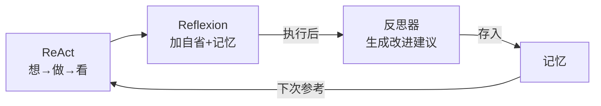
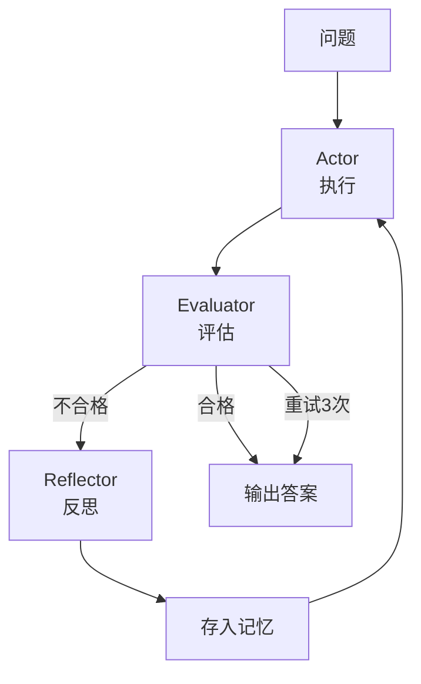
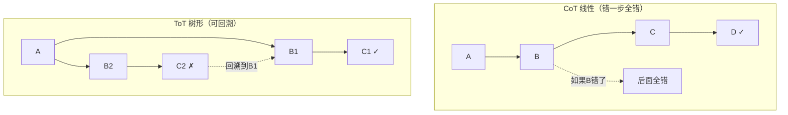
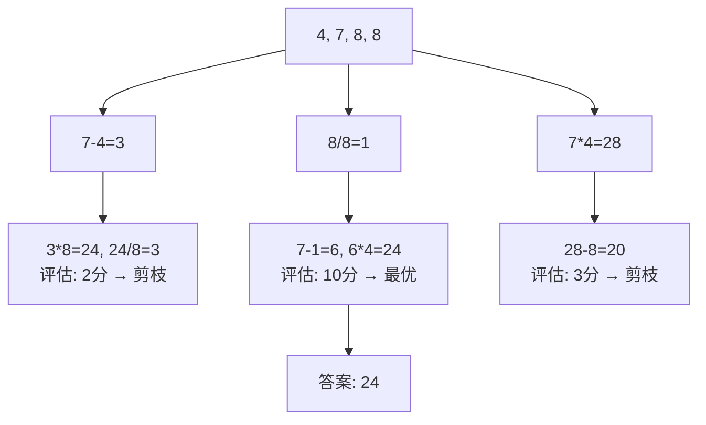
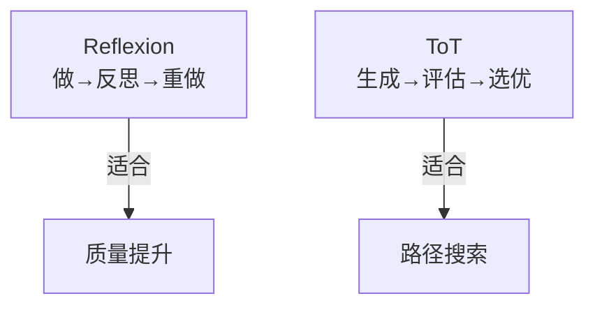

# 第 104 课 Reflexion 与 Tree of Thoughts 复现实战

> 阶段 17·AI Agent 前沿论文精读与代码复现·第 2 课。复现 Reflexion 和 Tree of Thoughts 两篇论文。

---

## 一、Reflexion：从错误中学习

### 1.1 论文一句话

> 让 Agent 执行后自我反思，把"哪里做错了"记下来，下次执行时参考。

### 1.2 与 ReAct 的关系



### 1.3 核心机制



### 1.4 复现代码

```python
from langgraph.graph import StateGraph, END
from langchain_openai import ChatOpenAI
from typing import TypedDict, List

llm = ChatOpenAI(model="gpt-4o", temperature=0)

class State(TypedDict):
    question: str
    answer: str
    critique: str
    reflections: List[str]
    retry_count: int

def actor(state: State):
    refs = ""
    if state.get("reflections"):
        refs = "\n\n参考过往反思改进：\n" + "\n".join(state["reflections"])
    resp = llm.invoke(f"回答问题：{state['question']}{refs}")
    state["answer"] = resp.content
    return state

def evaluator(state: State):
    resp = llm.invoke(f"评估回答：\n问题：{state['question']}\n回答：{state['answer']}\n合格说'通过'，不合格说明问题。")
    state["critique"] = resp.content
    state["retry_count"] = state.get("retry_count", 0) + 1
    return state

def reflector(state: State):
    resp = llm.invoke(f"生成改进建议：\n问题：{state['question']}\n回答：{state['answer']}\n评估：{state['critique']}\n给1-3条简洁建议。")
    refs = state.get("reflections", [])
    refs.append(resp.content)
    state["reflections"] = refs
    return state

def route(state: State) -> str:
    if "通过" in state.get("critique", "") or state["retry_count"] >= 3:
        return END
    return "reflector"

g = StateGraph(State)
g.add_node("actor", actor)
g.add_node("evaluator", evaluator)
g.add_node("reflector", reflector)
g.set_entry_point("actor")
g.add_edge("actor", "evaluator")
g.add_conditional_edges("evaluator", route, {"reflector": "reflector", END: END})
g.add_edge("reflector", "actor")
app = g.compile()

# 测试
result = app.invoke({
    "question": "地球到月球的平均距离是多少？",
    "reflections": [], "retry_count": 0
})
print("答案:", result["answer"])
print(f"反思轮数: {result['retry_count']}")
```

### 1.5 关键实验数据

| 任务 | ReAct | Reflexion | 提升 |
| --- | --- | --- | --- |
| 编程 | 80.1% | 91.0% | +10.9 |
| 推理 | 35.1% | 46.6% | +11.5 |
| 决策 | 77.0% | 91.0% | +14.0 |

---

## 二、Tree of Thoughts：树形搜索推理

### 2.1 论文一句话

> 把思维链从线性变成树形：生成多个方向→评估→选最优→可以回溯。

### 2.2 为什么需要



### 2.3 四个核心操作

| 操作 | 说明 | 类比 |
| --- | --- | --- |
| 生成 | 生成多个候选 | 头脑风暴 |
| 评估 | 给候选打分 | 评委打分 |
| 搜索 | 选最优路径 | 选最优路线 |
| 回溯 | 放弃错误路径 | 走错掉头 |

### 2.4 经典案例：24点

用 4, 7, 8, 8 得到 24：



### 2.5 复现代码

```python
from langgraph.graph import StateGraph, END
from langchain_openai import ChatOpenAI
from typing import TypedDict, List

gen_llm = ChatOpenAI(model="gpt-4o", temperature=0.8)  # 高温=多样性
eval_llm = ChatOpenAI(model="gpt-4o", temperature=0)   # 低温=稳定

class State(TypedDict):
    problem: str
    current_path: List[str]
    candidates: List[str]
    best_score: float
    best_answer: str
    iteration: int

N = 3  # 每步生成候选数
MAX_ITER = 8

def generate(state: State):
    last = state["current_path"][-1] if state["current_path"] else ""
    resp = gen_llm.invoke(f"问题：{state['problem']}\n当前：{last}\n生成{N}个不同下一步，编号列表。")
    lines = [l.strip().lstrip('0123456789.') for l in resp.content.split('\n') if l.strip()]
    state["candidates"] = lines[:N]
    return state

def evaluate(state: State):
    best = state.get("best_score", 0)
    for c in state["candidates"]:
        resp = eval_llm.invoke(f"问题：{state['problem']}\n候选：{c}\n打分1-10，只输出数字。")
        try:
            score = float(resp.content.strip())
        except:
            score = 5.0
        if score > best:
            best = score
            state["best_score"] = score
            state["best_answer"] = c
            state["current_path"].append(c)
    state["iteration"] += 1
    return state

def should_continue(state: State) -> str:
    if state["iteration"] >= MAX_ITER or state.get("best_score", 0) >= 9:
        return "done"
    return "generate"

def finalize(state: State):
    resp = eval_llm.invoke(f"问题：{state['problem']}\n推理：{' -> '.join(state['current_path'])}\n给最终答案。")
    state["best_answer"] = resp.content
    return state

g = StateGraph(State)
g.add_node("generate", generate)
g.add_node("evaluate", evaluate)
g.add_node("done", finalize)
g.set_entry_point("generate")
g.add_edge("generate", "evaluate")
g.add_conditional_edges("evaluate", should_continue, {"generate": "generate", "done": "done"})
g.add_edge("done", END)
app = g.compile()

# 测试
result = app.invoke({
    "problem": "用4,7,8,8通过加减乘除得到24",
    "current_path": [], "candidates": [],
    "best_score": 0, "best_answer": "", "iteration": 0
})
print("答案:", result["best_answer"])
print(f"搜索轮数: {result['iteration']}, 最高分: {result['best_score']}")
```

---

## 三、两种方法对比

| 维度 | Reflexion | ToT |
| --- | --- | --- |
| 改进方式 | 执行后反思 | 执行中搜索 |
| 适用场景 | 质量提升 | 路径搜索 |
| 成本 | 每轮1次调用 | 每轮N次调用 |
| 延迟 | 中 | 高 |
| 适合任务 | 写作/编程 | 24点/填字/规划 |



---

## 四、动手任务

1. 跑通 Reflexion 代码，问它一个需要精确回答的问题；
2. 观察 retry_count 和 reflections 内容；
3. 跑通 ToT 代码，给它一个 24 点题目；
4. 对比两种方法在 LangSmith Trace 中的区别。

---

## 小结

- Reflexion：执行后自省，语言反馈替代数值奖励；
- Tree of Thoughts：线性推理扩展为树形搜索，支持回溯；
- Reflexion 适合质量提升，ToT 适合路径搜索；
- 两者可组合：ToT 搜索 + Reflexion 反思。

> 下一课复现 Self-RAG 和 CRAG 两篇 RAG 改进论文。