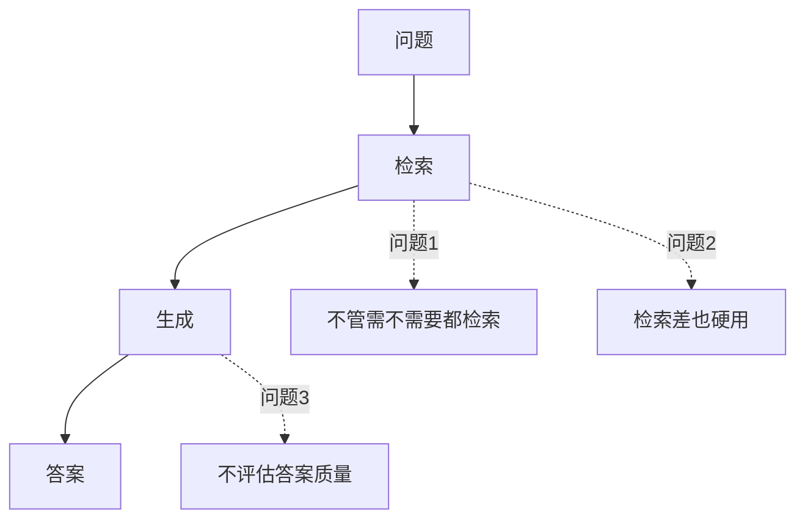
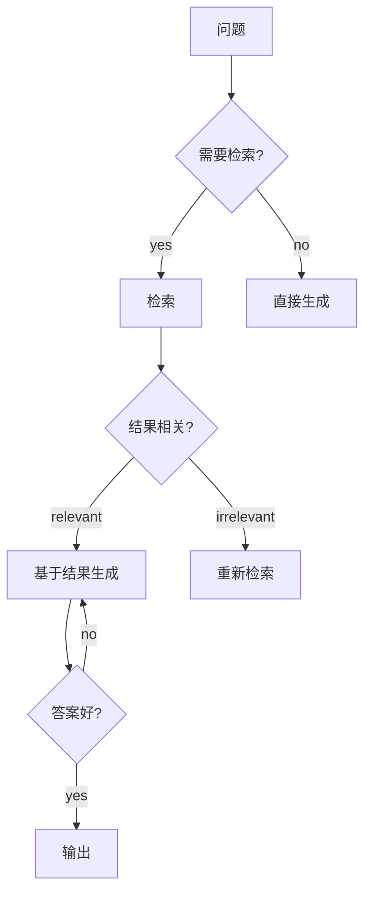
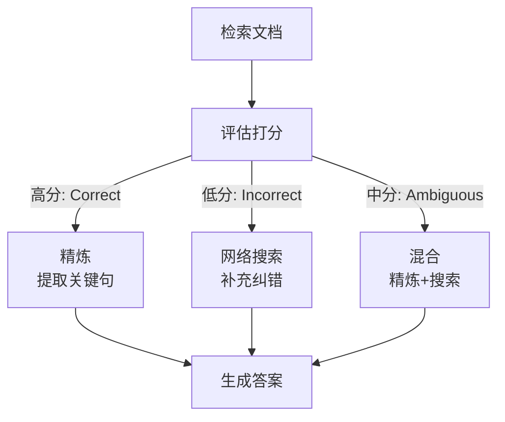
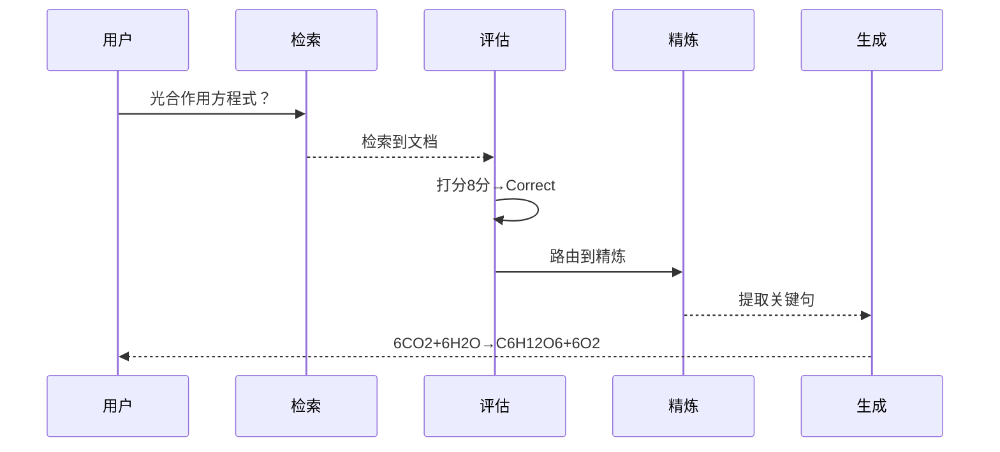
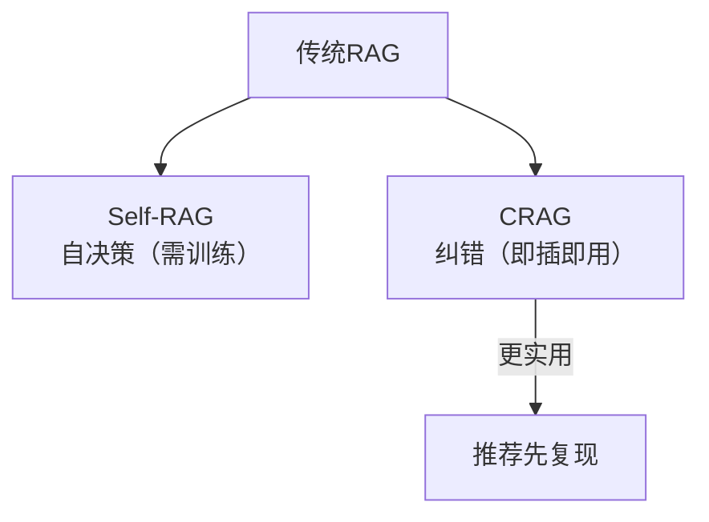

# 第 105 课 Self-RAG 与 CRAG 复现实战

> 阶段 17·AI Agent 前沿论文精读与代码复现·第 3 课。复现 Self-RAG 和 CRAG 两篇 RAG 改进论文。

---

## 一、传统 RAG 的问题



---

## 二、Self-RAG：让模型自决策

### 2.1 论文一句话

> 让 LLM 自己决定：要不要检索？检索结果好不好？生成的答案行不行？

### 2.2 反思标记



| 标记 | 作用 | 取值 |
| --- | --- | --- |
| Retrieve | 要不要检索 | yes/no |
| Relevance | 检索好不好 | relevant/irrelevant |
| Critique | 答案好不好 | yes/no |

### 2.3 局限

Self-RAG 需要微调模型才能输出反思标记，零基础复现较难。我们用 LangGraph 模拟其决策逻辑。

### 2.4 简化复现

```python
from langgraph.graph import StateGraph, END
from langchain_openai import ChatOpenAI
from typing import TypedDict

llm = ChatOpenAI(model="gpt-4o", temperature=0)

class State(TypedDict):
    question: str
    need_retrieve: bool
    retrieved_doc: str
    is_relevant: bool
    answer: str
    is_good: bool

def decide_retrieve(state: State):
    resp = llm.invoke(f"问题：{state['question']}\n这个问题需要查资料吗？回答yes或no。")
    state["need_retrieve"] = "yes" in resp.content.lower()
    return state

def retrieve(state: State):
    if not state["need_retrieve"]:
        return state
    state["retrieved_doc"] = f"关于'{state['question']}'的文档内容"
    return state

def check_relevance(state: State):
    if not state["need_retrieve"]:
        state["is_relevant"] = True
        return state
    resp = llm.invoke(f"文档：{state['retrieved_doc']}\n问题：{state['question']}\n相关吗？回答yes或no。")
    state["is_relevant"] = "yes" in resp.content.lower()
    return state

def generate(state: State):
    if state["need_retrieve"] and state["is_relevant"]:
        resp = llm.invoke(f"基于文档回答：{state['retrieved_doc']}\n问题：{state['question']}")
    else:
        resp = llm.invoke(f"回答问题：{state['question']}")
    state["answer"] = resp.content
    return state

def critique(state: State):
    resp = llm.invoke(f"答案：{state['answer']}\n问题：{state['question']}\n答案好不好？回答yes或no。")
    state["is_good"] = "yes" in resp.content.lower()
    return state

def route(state: State) -> str:
    if state.get("is_good"):
        return END
    return "generate"

g = StateGraph(State)
g.add_node("decide", decide_retrieve)
g.add_node("retrieve", retrieve)
g.add_node("check", check_relevance)
g.add_node("generate", generate)
g.add_node("critique", critique)
g.set_entry_point("decide")
g.add_edge("decide", "retrieve")
g.add_edge("retrieve", "check")
g.add_edge("check", "generate")
g.add_edge("generate", "critique")
g.add_conditional_edges("critique", route, {"generate": "generate", END: END})
app = g.compile()
```

---

## 三、CRAG：检索结果纠错

### 3.1 论文一句话

> 检索结果好不好？不好就丢掉，用网络搜索补充纠错。

### 3.2 三路纠错



### 3.3 复现代码

```python
from langgraph.graph import StateGraph, END
from langchain_openai import ChatOpenAI
from typing import TypedDict, List
import re

llm = ChatOpenAI(model="gpt-4o", temperature=0)

class State(TypedDict):
    question: str
    docs: List[str]
    score: float
    confidence: str  # correct/incorrect/ambiguous
    context: str
    answer: str

def retrieve(state: State):
    state["docs"] = ["文档1", "文档2"]  # 模拟检索
    return state

def evaluate(state: State):
    docs_text = "\n".join(state["docs"])
    resp = llm.invoke(f"文档：{docs_text}\n问题：{state['question']}\n相关度打分1-10，只输出数字。")
    try:
        state["score"] = float(re.search(r'\d+', resp.content).group())
    except:
        state["score"] = 5.0
    if state["score"] >= 7:
        state["confidence"] = "correct"
    elif state["score"] <= 3:
        state["confidence"] = "incorrect"
    else:
        state["confidence"] = "ambiguous"
    return state

def refine(state: State):
    docs_text = "\n".join(state["docs"])
    resp = llm.invoke(f"提取与问题相关的关键句：\n{docs_text}\n问题：{state['question']}")
    state["context"] = resp.content
    return state

def web_search(state: State):
    state["context"] = f"网络搜索结果：关于'{state['question']}'的信息"
    return state

def combine(state: State):
    docs_text = "\n".join(state["docs"])
    state["context"] = f"检索：{docs_text}\n网络搜索：补充信息"
    return state

def generate(state: State):
    resp = llm.invoke(f"基于资料回答：\n{state['context']}\n问题：{state['question']}")
    state["answer"] = resp.content
    return state

def route(state: State) -> str:
    conf = state.get("confidence", "ambiguous")
    return {"correct": "refine", "incorrect": "web_search", "ambiguous": "combine"}.get(conf, "combine")

g = StateGraph(State)
g.add_node("retrieve", retrieve)
g.add_node("evaluate", evaluate)
g.add_node("refine", refine)
g.add_node("web_search", web_search)
g.add_node("combine", combine)
g.add_node("generate", generate)
g.set_entry_point("retrieve")
g.add_edge("retrieve", "evaluate")
g.add_conditional_edges("evaluate", route, {
    "refine": "refine", "web_search": "web_search", "combine": "combine"
})
g.add_edge("refine", "generate")
g.add_edge("web_search", "generate")
g.add_edge("combine", "generate")
g.add_edge("generate", END)
app = g.compile()

# 测试
result = app.invoke({
    "question": "光合作用的化学方程式是什么？",
    "docs": [], "score": 0, "confidence": "",
    "context": "", "answer": ""
})
print("答案:", result["answer"])
print(f"置信度: {result['confidence']} (分数: {result['score']})")
```

### 3.4 运行轨迹



---

## 四、两种方法对比

| 维度 | Self-RAG | CRAG |
| --- | --- | --- |
| 改重点 | 模型自决策 | 检索纠错 |
| 需训练 | 是 | 否 |
| 即插即用 | 否 | 是 |
| 适用 | 微调模型 | 任何 LLM |



---

## 五、实验数据

### Self-RAG

| 任务 | 基线 | Self-RAG |
| --- | --- | --- |
| NQ问答 | 35.0 | 40.4 |
| FEVER | 75.0 | 76.2 |

### CRAG

| 任务 | RAG | CRAG |
| --- | --- | --- |
| PopQA | 51.0 | 57.2 |
| PubHealth | 63.0 | 69.4 |

---

## 六、动手任务

1. 跑通 CRAG 代码，给它一个检索结果不相关的问题；
2. 观察它是否走到 web_search 路径；
3. 跑通 Self-RAG 简化版，观察它何时决定不检索；
4. 对比两种方法在 LangSmith Trace 中的区别。

---

## 小结

- Self-RAG：模型自己决定检索→评估→生成→评判，需训练；
- CRAG：评估检索质量→三路纠错（精炼/搜索/混合），即插即用；
- CRAG 更实用，不需要微调就能用；
- 两者都在传统 RAG 上显著提升准确率。

> 下一课学论文追踪方法并做全阶段收官。