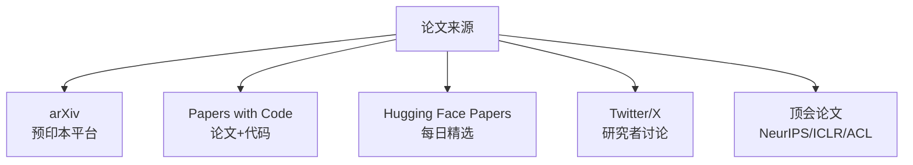
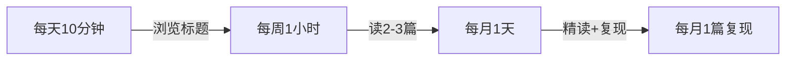
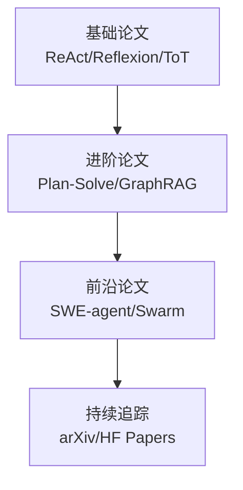
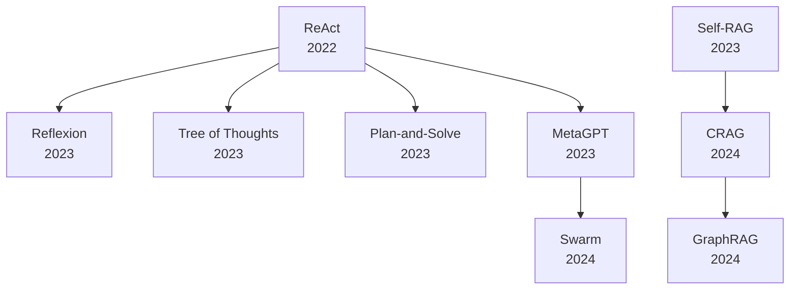
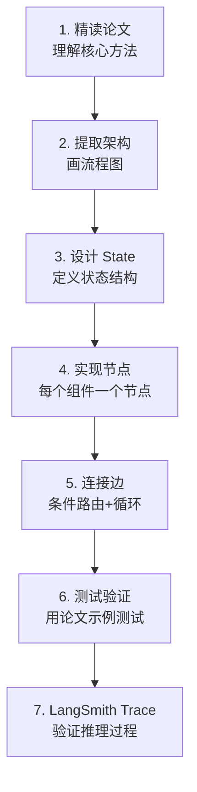
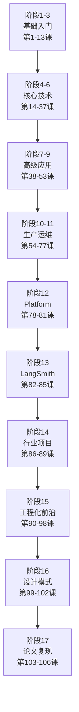
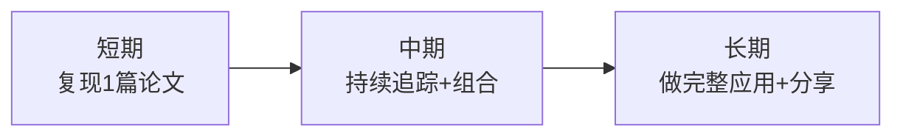
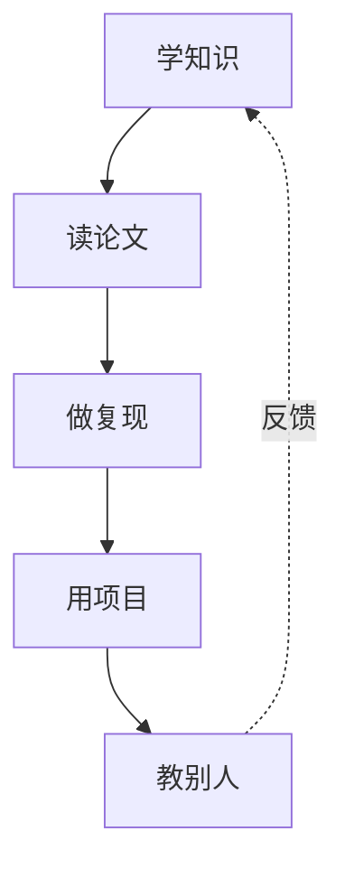

# 第 106 课 前沿论文追踪方法与全阶段收官

> 阶段 17·AI Agent 前沿论文精读与代码复现·第 4 课（全阶段收官课）。学论文追踪方法，回顾全 106 课。

---

## 一、怎么持续追踪前沿论文

### 1.1 论文来源

| 来源 | 用途 | 频率 |
| --- | --- | --- |
| arXiv | 搜索具体论文 | 按需 |
| Papers with Code | 找论文+代码 | 每周 |
| Hugging Face | 看每日热文 | 每天 |
| Twitter/X | 关注研究者 | 每天 |
| 顶会 | 系统浏览 | 每半年 |

### 1.2 筛选论文的 3 个标准

| 标准 | 判断方法 |
| --- | --- |
| 影响力 | 被引数 > 50，有跟进工作 |
| 可复现 | 有代码或详细方法描述 |
| 相关性 | 与你的项目/兴趣相关 |

### 1.3 建立论文阅读习惯

---

## 二、Agent 领域必读论文清单

### 2.1 基础论文（已学）

| 论文 | 年份 | 核心 |
| --- | --- | --- |
| ReAct | 2022 | 推理+行动循环 |
| Reflexion | 2023 | 自省+记忆 |
| Tree of Thoughts | 2023 | 树搜索推理 |
| Self-RAG | 2023 | 模型自决策 RAG |
| CRAG | 2024 | 检索纠错 |

### 2.2 进阶论文推荐

| 论文 | 年份 | 核心 | 难度 |
| --- | --- | --- | --- |
| Plan-and-Solve | 2023 | 先规划再执行 | 低 |
| GraphRAG | 2024 | 图结构 RAG | 中 |
| LLMCompiler | 2023 | 并行函数调用 | 中 |
| MetaGPT | 2023 | 多 Agent 框架 | 中 |
| SWE-agent | 2024 | 代码 Agent | 高 |
| Swarm | 2024 | 轻量多 Agent | 低 |

### 2.3 论文间的关系

---

## 三、论文复现的通用流程

### 复现要点

| 步骤 | 要点 |
| --- | --- |
| 精读 | 重点读 Method 部分的伪代码和图 |
| 架构 | 画 Mermaid 图确认理解 |
| State | 包含所有中间状态 |
| 节点 | 每个论文组件对应一个 LangGraph 节点 |
| 边 | 条件边实现论文中的控制流 |
| 测试 | 用论文的示例数据验证 |
| Trace | LangSmith 验证推理链 |

---

## 四、全阶段 17 回顾

### 4.1 完整路线

### 4.2 阶段 17 学了什么

| 课次 | 主题 | 核心收获 |
| --- | --- | --- |
| 第 103 课 | 论文精读入门 + ReAct 复现 | 三遍阅读法 + ReAct 循环复现 |
| 第 104 课 | Reflexion + ToT 复现 | 自省机制 + 树搜索推理 |
| 第 105 课 | Self-RAG + CRAG 复现 | 模型自决策 + 检索纠错 |
| 第 106 课 | 论文追踪 + 收官 | 追踪方法 + 必读清单 + 通用复现流程 |

### 4.3 全系列统计

| 维度 | 数量 |
| --- | --- |
| 总课程 | 106 课 |
| 总阶段 | 17 阶段 |
| 知识库 | 93 篇 |
| 附录 | 44 篇 |
| Word 文档合集 | 10 篇 |
| Mermaid 图 | 200+ 张 |

---

## 五、下一步学习建议

### 5.1 短期（1-2月）

1. 选 1 篇进阶论文做完整复现（推荐 Plan-and-Solve 或 GraphRAG）；
2. 用 LangSmith Trace 分析复现的推理过程；
3. 把复现的 Agent 用到自己的项目中。

### 5.2 中期（3-6月）

1. 持续追踪前沿论文（每周 1-2 篇）；
2. 尝试组合多种模式（如 ReAct + Reflexion + CRAG）；
3. 参与开源社区，贡献 LangChain/LangGraph 生态。

### 5.3 长期

1. 做一个完整的 Agent 应用（从需求到上线）；
2. 写技术博客分享学习心得；
3. 关注 AI Agent 的最新研究方向。

---

## 六、学习方法总结

| 阶段 | 方法 | 占比 |
| --- | --- | --- |
| 学知识 | 看课程+知识库 | 30% |
| 读论文 | 精读+四问法 | 20% |
| 做复现 | LangGraph 代码复现 | 25% |
| 用项目 | 实际应用 | 20% |
| 教别人 | 写博客/分享 | 5% |

---

## 小结

- 论文追踪：arXiv + Papers with Code + Hugging Face Papers；
- 必读论文：ReAct → Reflexion → ToT → Self-RAG/CRAG → 进阶论文；
- 论文复现通用流程：精读→架构→State→节点→边→测试→Trace；
- 全系列 106 课覆盖从零基础到论文复现的完整路径。

> 恭喜完成全部 106 课！从认识 LangChain 到论文精读与代码复现，你已具备完整的 LLM 应用开发知识体系。