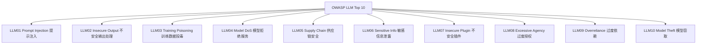
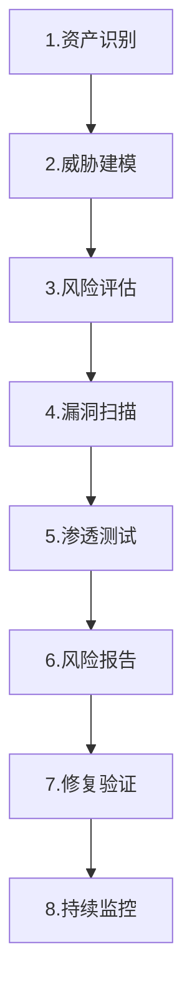

# 第109课：OWASP LLM Top 10 与系统化安全评估实战

> **学习课程** | **阶段：18** | **预计学习时间：60 分钟** | **前置知识：第107-108课**
>
> 本课从全局视角学习 OWASP LLM Top 10 安全风险清单，掌握系统化安全评估方法，并动手实现自动化安全审计。

---

## 本课目标

1. 说出 OWASP LLM Top 10 中的至少 5 个风险类别
2. 理解安全评估的 8 步流程
3. 运行自动化 OWASP 审计脚本
4. 生成一份安全评估报告

---

## 一、OWASP LLM Top 10 速览

### 1.1 十大风险一览



### 1.2 风险等级表

| 编号 | 风险 | 等级 | 一句话理解 |
|------|------|------|-----------|
| 01 | 提示注入 | 严重 | 攻击者在输入中夹带恶意指令 |
| 02 | 不安全输出 | 高 | LLM输出被直接执行引发XSS |
| 03 | 训练投毒 | 高 | 恶意数据让模型学到后门 |
| 04 | 模型DoS | 中 | 超长输入耗尽模型资源 |
| 05 | 供应链 | 高 | 第三方依赖有安全漏洞 |
| 06 | 信息泄露 | 严重 | LLM输出中暴露敏感信息 |
| 07 | 不安全插件 | 高 | Agent工具缺乏输入验证 |
| 08 | 过度授权 | 严重 | Agent权限超出需要范围 |
| 09 | 过度依赖 | 中 | 盲目信任LLM输出不验证 |
| 10 | 模型窃取 | 中 | 通过API调用复制模型 |

---

## 二、安全评估流程

### 2.1 八步流程



### 2.2 每步做什么

| 步骤 | 做什么 | 产出 |
|------|--------|------|
| 资产识别 | 列出所有 LLM 相关资产 | 资产清单 |
| 威胁建模 | 绘制攻击面和威胁路径 | 威胁模型图 |
| 风险评估 | 按 OWASP Top 10 逐条评估 | 风险矩阵 |
| 漏洞扫描 | 自动化扫描已知漏洞 | 扫描报告 |
| 渗透测试 | 模拟真实攻击 | 测试报告 |
| 风险报告 | 汇总风险和建议 | 安全报告 |
| 修复验证 | 确认漏洞已修复 | 修复确认 |
| 持续监控 | LangSmith+日志监控 | 监控仪表盘 |

---

## 三、自动化 OWASP 审计脚本

```python
OWASP_AUDIT = {
    "LLM01": {
        "name": "Prompt Injection",
        "level": "严重",
        "checks": [
            "是否实现了输入过滤？",
            "是否使用了指令隔离？",
            "是否有输出检测？",
            "高危操作是否需要人工确认？",
        ],
    },
    "LLM02": {
        "name": "Insecure Output Handling",
        "level": "高",
        "checks": [
            "LLM输出是否经过HTML转义？",
            "是否检测了脚本标签？",
            "Markdown链接是否验证协议？",
        ],
    },
    "LLM04": {
        "name": "Model DoS",
        "level": "中",
        "checks": [
            "是否有输入长度限制？",
            "是否有请求频率限制？",
            "是否有并发限制？",
        ],
    },
    "LLM06": {
        "name": "Sensitive Info Disclosure",
        "level": "严重",
        "checks": [
            "输出是否检测PII？",
            "是否对敏感信息脱敏？",
            "系统提示词是否可被提取？",
        ],
    },
    "LLM08": {
        "name": "Excessive Agency",
        "level": "严重",
        "checks": [
            "Agent是否只有必需工具？",
            "是否有操作日志？",
            "高危操作是否需要HITL？",
        ],
    },
}

def run_audit():
    """运行 OWASP 审计"""
    print("=" * 50)
    print("OWASP LLM Top 10 安全审计")
    print("=" * 50)

    for risk_id, info in OWASP_AUDIT.items():
        print(f"\n{risk_id} {info['name']} [{info['level']}]")
        for check in info["checks"]:
            print(f"  [ ] {check}")

    print("\n" + "=" * 50)
    print("审计完成。请逐项确认检查结果。")

run_audit()
```

---

## 四、PII 检测实战

### 4.1 检测器实现

```python
import re

class PIIChecker:
    """个人身份信息检测器"""

    PATTERNS = {
        "邮箱": r"[a-zA-Z0-9._%+-]+@[a-zA-Z0-9.-]+\.[a-zA-Z]{2,}",
        "手机号": r"\b1[3-9]\d{9}\b",
        "身份证": r"\b\d{15}|\d{17}[\dXx]\b",
        "API Key": r"sk-[a-zA-Z0-9]{20,}",
        "信用卡": r"\b\d{4}[\s-]?\d{4}[\s-]?\d{4}[\s-]?\d{4}\b",
    }

    def __init__(self):
        self.compiled = {n: re.compile(p) for n, p in self.PATTERNS.items()}

    def detect(self, text: str) -> list:
        findings = []
        for name, pattern in self.compiled.items():
            for m in pattern.finditer(text):
                findings.append({"type": name, "value": m.group()})
        return findings

    def redact(self, text: str) -> str:
        for name, pattern in self.compiled.items():
            text = pattern.sub(f"[{name}已脱敏]", text)
        return text

# 测试
checker = PIIChecker()
text = "联系我：邮箱test@example.com，手机13800138000，卡号4111-1111-1111-1111"

findings = checker.detect(text)
print(f"检测到 {len(findings)} 个PII:")
for f in findings:
    print(f"  类型: {f['type']}, 值: {f['value'][:10]}...")

print(f"\n脱敏后: {checker.redact(text)}")
```

---

## 五、安全评估报告生成

```python
def generate_report(app_name, audit_data):
    """生成安全评估报告"""
    critical = sum(1 for r in audit_data.values() if r["level"] == "严重")
    high = sum(1 for r in audit_data.values() if r["level"] == "高")

    report = f"""
# {app_name} LLM 安全评估报告

## 摘要
- 严重风险: {critical} 项
- 高风险: {high} 项
- 评估标准: OWASP LLM Top 10

## 风险等级矩阵
| 等级 | 数量 | 处置原则 |
|------|------|---------|
| 严重 | {critical} | 上线前必须修复 |
| 高 | {high} | 发布前修复 |

## 建议
1. 优先修复严重风险
2. 接入 LangSmith 持续监控
3. 定期重新评估
"""
    return report

print(generate_report("我的AI助手", OWASP_AUDIT))
```

---

## 六、本课小结

| 要点 | 内容 |
|------|------|
| OWASP Top 10 | 10 大安全风险：注入/输出/投毒/DoS/供应链/泄露/插件/授权/依赖/窃取 |
| 评估流程 | 资产→威胁→风险→扫描→渗透→报告→修复→监控 |
| PII 检测 | 邮箱/手机/身份证/API Key/信用卡 自动检测+脱敏 |
| 报告 | 风险等级矩阵+修复优先级+持续监控建议 |

### 动手任务

1. 运行 OWASP 审计脚本，对照自己的应用逐项检查
2. 实现 PII 检测器，测试不同类型的敏感信息
3. 生成一份安全评估报告

> **下一课**：第110课将进行红队测试实战，从攻击者视角模拟真实攻击，并为全系列 110 课画上句号。

---

> 知识库深度版见 KB96。
