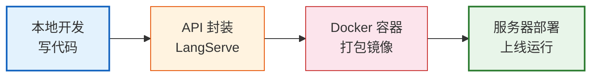
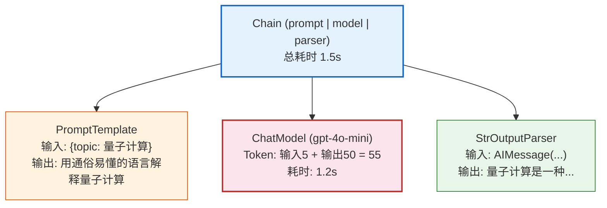

# 第10课：从开发到部署——LangChain 应用上线实战

> **学习目标**：掌握 LangChain 应用的 API 封装、部署上线、可观测性和生产化最佳实践。

---

## 本课导航

| 小节 | 主题 | 预计时间 |
|------|------|---------|
| 1 | 从代码到服务 | 15 分钟 |
| 2 | 用 LangServe 快速部署 API | 20 分钟 |
| 3 | LangSmith 可观测性 | 20 分钟 |
| 4 | 生产化清单 | 15 分钟 |

---

## 1. 从代码到服务

### 1.1 开发 vs 生产的区别

| 维度 | 开发阶段 | 生产阶段 |
|------|---------|---------|
| 调用方式 | Python 脚本直接运行 | API 服务供外部调用 |
| 错误处理 | 报错看日志 | 用户友好的错误响应 |
| 监控 | 打印到控制台 | 结构化日志 + 监控面板 |
| 部署 | 本地运行 | 服务器/Docker/云 |
| 安全 | API Key 写代码里 | 环境变量 + 密钥管理 |

### 1.2 部署路径



> **图解说明**：从开发到上线的四步路径——本地写代码 → 用 LangServe 封装为 API → Docker 打包成镜像 → 部署到服务器运行。

---

## 2. 用 LangServe 快速部署 API

### 2.1 安装

```bash
pip install langserve fastapi uvicorn
```

### 2.2 创建 API 服务

```python
# server.py
from fastapi import FastAPI
from langserve import add_routes
from langchain_openai import ChatOpenAI
from langchain_core.prompts import ChatPromptTemplate
from langchain_core.output_parsers import StrOutputParser

app = FastAPI(title="LangChain 应用 API", version="1.0")

# 创建链
chain = (
    ChatPromptTemplate.from_template("用通俗易懂的语言解释{topic}")
    | ChatOpenAI(model="gpt-4o-mini", temperature=0.7)
    | StrOutputParser()
)

# 添加 API 路由
add_routes(app, chain, path="/explain")

# 健康检查
@app.get("/health")
async def health():
    return {"status": "ok"}

# 启动命令: uvicorn server:app --host 0.0.0.0 --port 8000
```

### 2.3 自动生成的端点

| 端点 | 方法 | 用途 |
|------|------|------|
| `/explain/invoke` | POST | 单次调用 |
| `/explain/stream` | POST | 流式输出 |
| `/explain/batch` | POST | 批量调用 |
| `/playground/` | GET | 交互式测试页面 |
| `/health` | GET | 健康检查 |

### 2.4 调用 API

```bash
# 单次调用
curl -X POST http://localhost:8000/explain/invoke \
  -H "Content-Type: application/json" \
  -d '{"input": {"topic": "量子计算"}}'

# 或用 Python 客户端
from langserve import RemoteRunnable
remote = RemoteRunnable("http://localhost:8000/explain")
result = remote.invoke({"topic": "量子计算"})
```

### 2.5 完整 API 服务示例

```python
# server.py — 完整生产级 API
from fastapi import FastAPI, HTTPException
from pydantic import BaseModel
from langchain_openai import ChatOpenAI
from langchain_core.prompts import ChatPromptTemplate
from langchain_core.output_parsers import StrOutputParser
from fastapi.responses import StreamingResponse
import json

app = FastAPI(title="AI 助手 API")

# 请求/响应模型
class ChatRequest(BaseModel):
    question: str
    style: str = "通俗易懂"

class ChatResponse(BaseModel):
    answer: str
    model: str = "gpt-4o-mini"

# 创建链
chain = (
    ChatPromptTemplate.from_messages([
        ("system", "用{style}的方式回答问题"),
        ("human", "{question}"),
    ])
    | ChatOpenAI(model="gpt-4o-mini", temperature=0.7)
    | StrOutputParser()
)

@app.post("/api/chat", response_model=ChatResponse)
async def chat(request: ChatRequest):
    try:
        answer = await chain.ainvoke({
            "question": request.question,
            "style": request.style,
        })
        return ChatResponse(answer=answer)
    except Exception as e:
        raise HTTPException(status_code=500, detail=str(e))

@app.post("/api/chat/stream")
async def chat_stream(request: ChatRequest):
    async def generate():
        async for chunk in chain.astream({
            "question": request.question,
            "style": request.style,
        }):
            yield f"data: {json.dumps({'chunk': chunk})}\n\n"
        yield f"data: {json.dumps({'done': True})}\n\n"
    
    return StreamingResponse(generate(), media_type="text/event-stream")

@app.get("/health")
async def health():
    return {"status": "ok"}
```

---

## 3. LangSmith 可观测性

### 3.1 什么是 LangSmith

LangSmith 是 LangChain 的**AI 应用可观测性平台**——帮你看到 AI 每一步在干什么。

### 生活类比

没有 LangSmith = **黑箱操作**（只知道最终结果，不知道中间发生了什么）

有 LangSmith = **透明玻璃箱**（每一步的输入、输出、耗时、token 用量都看得见）

### 3.2 配置

```python
import os

# 设置环境变量
os.environ["LANGSMITH_API_KEY"] = "ls-你的密钥"
os.environ["LANGSMITH_TRACING"] = "true"
os.environ["LANGSMITH_PROJECT"] = "my-app"

# 配置后，所有 LangChain 调用自动被追踪！
# 不需要改任何业务代码
chain = prompt | model | parser
result = chain.invoke({"topic": "LangChain"})
# 在 LangSmith 面板可看到完整追踪
```

### 3.3 追踪能看到什么



> **图解说明**：LangSmith 追踪面板把链的每一步拆开——PromptTemplate 的输入输出、ChatModel 的 token 消耗和耗时、Parser 的转换结果，全部可见。

### 3.4 评估

```python
from langsmith import Client

client = Client()

# 创建测试数据集
dataset = client.create_dataset("qa_test", description="问答测试")

# 添加测试用例
client.create_example(
    inputs={"question": "什么是LangChain？"},
    outputs={"answer": "LLM应用开发框架"},
    dataset_id=dataset.id,
)

# 运行评估
from langsmith.evaluation import evaluate

def check_answer(run, example):
    predicted = run.outputs.get("answer", "")
    expected = example.outputs.get("answer", "")
    score = 1 if expected.lower() in predicted.lower() else 0
    return {"key": "correctness", "score": score}

evaluate(
    lambda x: chain.invoke(x),
    data="qa_test",
    evaluators=[check_answer],
)
```

---

## 4. 生产化清单

### 4.1 部署前检查

| 检查项 | 说明 | 状态 |
|--------|------|------|
| API Key 安全 | 使用环境变量，不硬编码 | ☐ |
| 输入验证 | 用 Pydantic 校验请求 | ☐ |
| 错误处理 | try/except + 友好错误信息 | ☐ |
| 超时设置 | model 设置 timeout | ☐ |
| 重试机制 | max_retries 配置 | ☐ |
| 速率限制 | 防止 API 被刷 | ☐ |
| 日志记录 | 记录关键事件 | ☐ |
| 监控告警 | LangSmith + 日志监控 | ☐ |
| 成本控制 | 模型分级 + 缓存 | ☐ |

### 4.2 Docker 部署

```dockerfile
# Dockerfile
FROM python:3.12-slim

WORKDIR /app

COPY requirements.txt .
RUN pip install --no-cache-dir -r requirements.txt

COPY . .

EXPOSE 8000

CMD ["uvicorn", "server:app", "--host", "0.0.0.0", "--port", "8000"]
```

```bash
# 构建镜像
docker build -t langchain-app .

# 运行容器
docker run -d \
  -p 8000:8000 \
  -e OPENAI_API_KEY=$OPENAI_API_KEY \
  --name ai-app \
  langchain-app
```

### 4.3 成本控制策略

```python
# 策略1: 模型分级——简单任务用便宜模型
from langchain_core.runnables import RunnableWithFallbacks

cheap_model = ChatOpenAI(model="gpt-4o-mini", temperature=0)
smart_model = ChatOpenAI(model="gpt-4o", temperature=0)

# 先用便宜模型，失败再用贵的
model = cheap_model.with_fallbacks([smart_model])

# 策略2: 限制输出长度
model = ChatOpenAI(model="gpt-4o-mini", max_tokens=200)

# 策略3: 使用本地模型处理简单任务
from langchain_ollama import ChatOllama
local_model = ChatOllama(model="llama3.1")  # 免费！
```

---

## 课程总回顾

### 10 节课知识地图

| 阶段 | 课程 | 核心能力 |
|------|------|---------|
| 入门 | 第01课 LLM 入门 | 理解 AI 应用开发的全貌 |
| 入门 | 第02课 LangChain 初体验 | 写出第一个可运行程序 |
| 入门 | 第03课 Prompt 工程 | 高效与 AI 沟通 |
| 入门 | 第04课 记忆机制 | 让 AI 记住对话 |
| 进阶 | 第05课 结构化输出 | 获取结构化数据 |
| 进阶 | 第06课 Agent 工具 | 让 AI 自主行动 |
| 进阶 | 第07课 RAG | 让 AI 拥有知识 |
| 高级 | 第08课 LangGraph | 图式编排 |
| 高级 | 第09课 多 Agent | 复杂工作流协作 |
| 高级 | 第10课 部署上线 | 生产化部署 |

### 你现在能做什么

学完 10 节课后，你应该能够：

- ✅ 理解 LangChain/LangGraph 的架构和核心概念
- ✅ 使用 LCEL 构建链式应用
- ✅ 管理提示词模板和对话记忆
- ✅ 获取结构化输出
- ✅ 构建 Agent 让 AI 使用工具
- ✅ 搭建 RAG 知识问答系统
- ✅ 用 LangGraph 构建有状态的复杂工作流
- ✅ 实现多 Agent 协作和人机协作
- ✅ 将应用部署为 API 服务
- ✅ 用 LangSmith 监控和优化应用

### 下一步建议

| 方向 | 建议 |
|------|------|
| 深入实践 | 选择一个真实项目动手做 |
| 关注前沿 | 关注 LangChain/LangGraph 版本更新 |
| 社区参与 | 加入 LangChain Discord/GitHub |
| 扩展技能 | 学习 LangSmith 高级评估功能 |
| 性能优化 | 研究缓存、批量、异步等优化手段 |

---

> 🎉 **恭喜完成全部 10 节课！** 你已经从零基础走到了能部署上线的水平。继续实践，你会越来越熟练。
>
> 📖 查看配套知识库获取更深的技术细节：
> - `知识库/01_LangChain核心架构技术参考.md`
> - `知识库/02_LangChain组件详解技术手册.md`
> - `知识库/03_数据连接与RAG技术手册.md`
> - `知识库/04_LangGraph技术参考.md`
> - `知识库/05_API集成与部署技术参考.md`
> - `知识库/06_生态对比与模型集成数据表.md`
