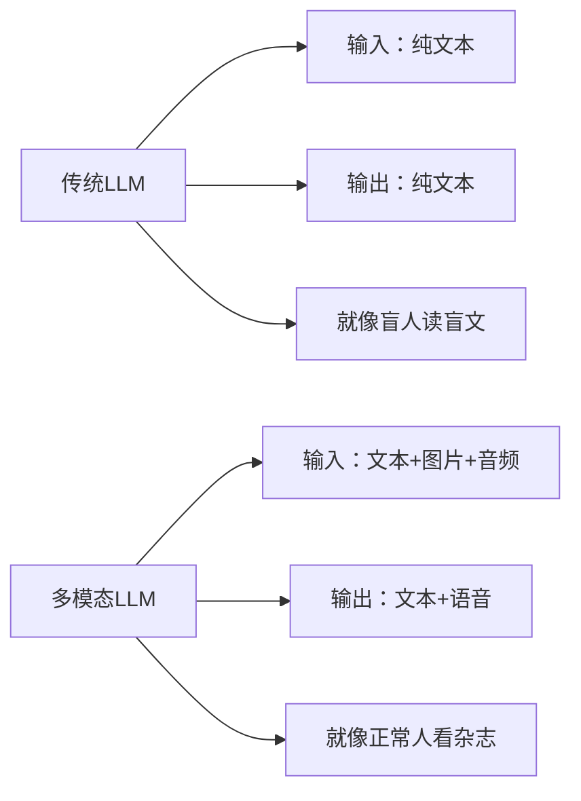
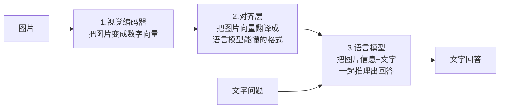
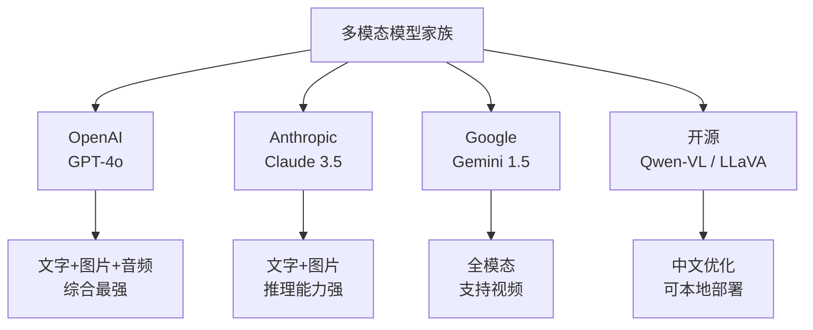
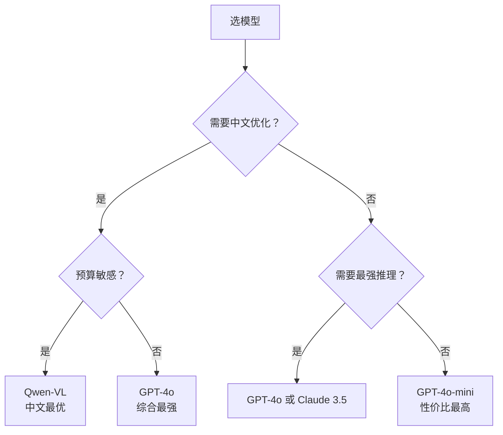
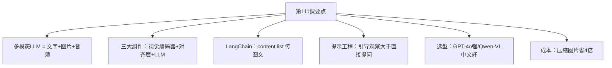

# 第111课：多模态LLM入门与视觉问答实战

> **学习课程** | **阶段：19** | **预计学习时间：60 分钟** | **前置知识：第1-13课（基础入门）、第38-53课（高级应用）**
>
> 欢迎来到阶段 19！本阶段我们进入多模态 LLM 的世界——让 AI 不仅能"读"文字，还能"看"图片、"听"声音。这第一课从最基础的视觉问答开始，带你理解图像和文本如何一起"喂"给大模型。

---

## 本课目标

学完本课，你将能够：
1. 用一句话向别人解释什么是多模态 LLM
2. 说出多模态 LLM 的三大核心组件及其作用
3. 用 LangChain 写一个图片问答程序
4. 对比至少 3 种多模态模型的能力差异

---

## 一、什么是多模态LLM

### 场景引入

想象你在整理一份产品手册，里面有文字说明、架构图、参数表格。你问 AI："这个产品的核心架构是什么？"

如果 AI 只能读文字，它会跳过架构图，可能漏掉最关键的信息。但如果 AI 能"看"图，它就能结合文字和图片给出完整回答。

这就是多模态 LLM 的价值——**让 AI 像人一样同时用文字和图片来理解世界**。

### 一句话定义

> **多模态 LLM = 能同时处理文字、图片、音频等多种输入的大语言模型。**

### 类比理解

把传统 LLM 想象成一个"只能读书的人"——他很聪明但只能看文字。多模态 LLM 就是给他配了一副"眼镜"和"助听器"，让他能看图、听声，理解力大幅提升。

### 多模态 vs 单模态



| 对比项 | 传统LLM | 多模态LLM |
|--------|---------|-----------|
| 输入 | 只能文字 | 文字+图片+音频 |
| 举例 | "翻译这段话" | "这张图里有什么" |
| 能力 | 语言理解 | 跨模态理解 |
| 像什么 | 盲人读盲文 | 正常人看杂志 |

---

## 二、多模态LLM的三大组件

### 2.1 架构图解

多模态 LLM 的工作原理可以拆成三步：



### 2.2 通俗解释三大组件

**1. 视觉编码器（Vision Encoder）**：就像人的视网膜，把图片拆成一个个小格子，每个格子变成一串数字。

**2. 对齐层（Projection Layer）**：就像翻译官，把"图片语言"翻译成"文字语言"，让语言模型能理解。

**3. 语言模型（LLM）**：就是 GPT/Claude 这些你已经熟悉的大模型，它同时接收"翻译后的图片信息"和"文字问题"，一起推理出回答。

### 2.3 主流多模态模型



---

## 三、动手：用LangChain做图片问答

### 3.1 最简单的图片问答

```python
from langchain_openai import ChatOpenAI
from langchain_core.messages import HumanMessage
import base64

# 第1步：把图片编码成Base64
def encode_image(path):
    with open(path, "rb") as f:
        return base64.b64encode(f.read()).decode("utf-8")

img_b64 = encode_image("my_photo.jpg")

# 第2步：创建多模态模型
llm = ChatOpenAI(model="gpt-4o", temperature=0)

# 第3步：构造图文混合消息
message = HumanMessage(content=[
    {"type": "text", "text": "这张图片里有什么？"},
    {
        "type": "image_url",
        "image_url": {"url": f"data:image/png;base64,{img_b64}"},
    },
])

# 第4步：调用模型
response = llm.invoke([message])
print(response.content)
# 输出示例："这张图片中有一只橘色的猫坐在窗台上，窗外是晴朗的天空..."
```

### 3.2 理解消息结构

消息的 `content` 是一个列表，每个元素是一个"块"：

```python
# 文本块
{"type": "text", "text": "你好"}

# 图片块（Base64方式）
{"type": "image_url", "image_url": {"url": "data:image/png;base64,xxxx"}}

# 图片块（URL方式）
{"type": "image_url", "image_url": {"url": "https://example.com/img.jpg"}}
```

**类比**：就像你发微信朋友圈——可以同时发文字和图片，每条消息可以包含多个"块"。

### 3.3 多张图片对比

```python
# 对比两张图片
message = HumanMessage(content=[
    {"type": "text", "text": "请对比这两张设计稿，指出主要差异。"},
    {"type": "image_url", "image_url": {"url": "url_design_v1.jpg"}},
    {"type": "image_url", "image_url": {"url": "url_design_v2.jpg"}},
])
response = llm.invoke([message])
```

---

## 四、视觉问答实战项目

### 4.1 项目：图片问答助手

```python
from langchain_openai import ChatOpenAI
from langchain_core.messages import HumanMessage, SystemMessage
import base64

class ImageQA:
    """图片问答助手"""
    
    def __init__(self, model="gpt-4o"):
        self.llm = ChatOpenAI(model=model, temperature=0)
    
    def ask(self, image_path, question):
        """对图片提问"""
        with open(image_path, "rb") as f:
            img_b64 = base64.b64encode(f.read()).decode("utf-8")
        
        system = SystemMessage(content=(
            "你是视觉问答助手。仔细看图片，准确回答问题。"
            "不确定时说明不确定性。"
        ))
        
        user = HumanMessage(content=[
            {"type": "text", "text": question},
            {"type": "image_url", 
             "image_url": {"url": f"data:image/png;base64,{img_b64}"}},
        ])
        
        response = self.llm.invoke([system, user])
        return response.content
    
    def describe(self, image_path, detail_level="简要"):
        """生成图片描述"""
        prompt_map = {
            "简要": "用一句话描述这张图片。",
            "详细": "详细描述图片中的场景、物体、颜色和氛围。",
            "结构化": "按JSON格式输出：场景、主体、颜色、氛围。",
        }
        return self.ask(image_path, prompt_map[detail_level])

# 使用
qa = ImageQA()
answer = qa.ask("product.jpg", "这个产品的品牌是什么？")
print(answer)

desc = qa.describe("landscape.jpg", "详细")
print(desc)
```

### 4.2 动手任务

> **任务：运行上面的代码，用自己的图片测试。**
> 
> 1. 找一张你手机里的照片
> 2. 用 `qa.ask()` 问它 3 个不同类型的问题：
>    - 计数类："图中有几个人？"
>    - 识别类："这是什么品牌？"
>    - 推理类："这张照片大概在什么季节？为什么？"
> 3. 观察模型的回答质量

---

## 五、提示工程：让模型看得更准

### 5.1 不同的提问策略

| 策略 | 怎么问 | 效果 |
|------|--------|------|
| 直接提问 | "图里有几只猫？" | 简单问题效果好 |
| 引导观察 | "先描述图片，再回答" | 复杂问题更准 |
| 分步推理 | "从左到右逐一扫描" | 计数更精确 |
| 角色设定 | "你是专业设计师" | 专业分析更深 |

### 5.2 引导观察示例

```python
# 不好的提问
bad = "图中有几只猫？"

# 好的提问：引导观察
good = """请按以下步骤分析图片：
1. 描述你看到的整体场景
2. 从左到右逐一列出你看到的动物
3. 确认每只动物的特征
4. 最后回答：图中有几只猫？"""

# 好的提问能减少漏数和误判
```

---

## 六、模型选型指南

### 6.1 怎么选模型



### 6.2 能力对比表

| 模型 | 看图 | 认字 | 数数 | 推理 | 中文 | 价格 |
|------|------|------|------|------|------|------|
| GPT-4o | 优秀 | 优秀 | 优秀 | 优秀 | 良好 | 高 |
| GPT-4o-mini | 良好 | 良好 | 一般 | 良好 | 良好 | 低 |
| Claude 3.5 | 优秀 | 优秀 | 优秀 | 优秀 | 良好 | 高 |
| Gemini 1.5 | 优秀 | 优秀 | 良好 | 优秀 | 良好 | 中 |
| Qwen-VL | 良好 | 优秀 | 良好 | 良好 | 优秀 | 低 |

---

## 七、成本小贴士

### 7.1 图片越大越贵

| 图片处理 | Token消耗 | 相对成本 |
|---------|----------|---------|
| 4K原图直传 | ~2000 | 5倍 |
| 压缩到1024px | ~750 | 1.8倍 |
| 压缩到768px | ~425 | 1倍 |

### 7.2 省钱技巧

```python
from PIL import Image
import io, base64

def shrink_image(path, max_size=768):
    """缩小图片以降低成本"""
    img = Image.open(path)
    if max(img.size) > max_size:
        ratio = max_size / max(img.size)
        img = img.resize(
            tuple(int(d * ratio) for d in img.size),
            Image.LANCZOS
        )
    buf = io.BytesIO()
    img.save(buf, format="JPEG", quality=85)
    return base64.b64encode(buf.getvalue()).decode("utf-8")

# 用缩小后的图片省钱4倍
img_b64 = shrink_image("big_photo.jpg")
```

---

## 八、本课小结

### 关键点回顾



### 一句话总结

> 多模态 LLM 让 AI 从"只能读书"进化到"能看图能听声"，用 LangChain 的 `content` 列表就能轻松实现图文混合问答。

### 下节预告

下一课我们将深入图文混排文档的解析——当你的知识库里有 PDF 报告、扫描件、带表格的文档时，如何用 AI 正确提取内容？
