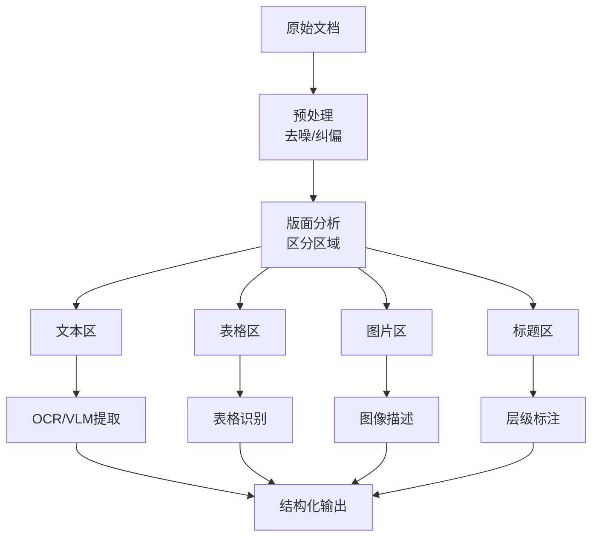
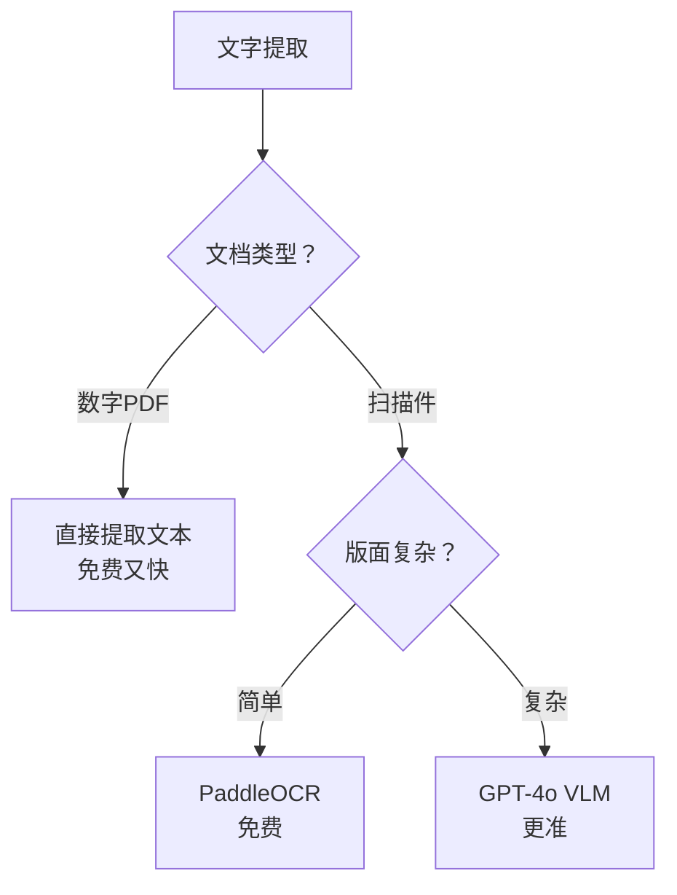
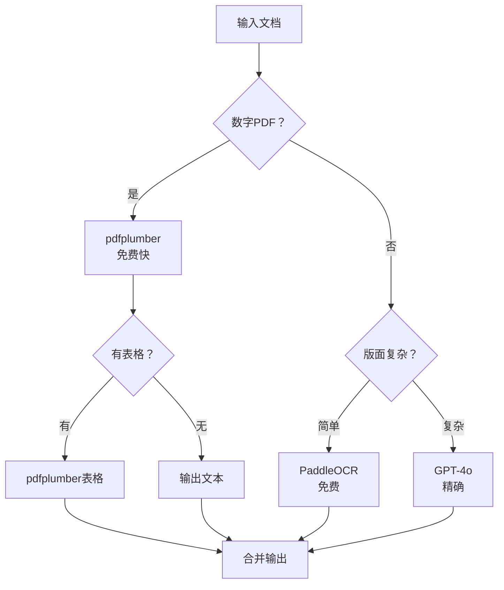
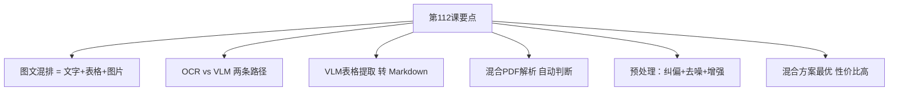

# 第112课：图文混排处理与视觉文档解析实战

> **学习课程** | **阶段：19** | **预计学习时间：60 分钟** | **前置知识：第111课（多模态LLM入门）**
>
> 上一课我们学会了让 AI"看图说话"。这一课我们挑战更复杂的场景——当文档里同时有文字、表格、图片、标题时，如何用 AI 正确提取和结构化？

---

## 本课目标

学完本课，你将能够：
1. 解释什么是图文混排文档及其解析挑战
2. 区分 OCR 和 VLM 两种文字提取路径
3. 用 GPT-4o 从图片中提取表格为 Markdown 格式
4. 实现一个混合 PDF 解析器

---

## 一、图文混排文档的挑战

### 场景引入

想象你收到一份 50 页的年度报告 PDF——每页都有标题、正文段落、数据表格、配图和页眉页脚。你需要提取里面的所有内容做成知识库。

如果用传统方法逐行 OCR，你会得到一堆没有结构的文字，表格变成乱码，段落顺序也乱了。

### 一句话定义

> **图文混排文档解析 = 把复杂的文档页面"拆"成文字、表格、图片等结构化区域，分别提取后还原原始排版。**

### 类比理解

就像拆积木城堡——你不能把所有积木混在一起乱拆，要先分清哪些是城墙（文本）、哪些是塔楼（表格）、哪些是花园（图片），然后分门别类地拆下来整理好。

### 解析流程



---

## 二、OCR vs VLM：两种文字提取路径

### 2.1 两条路线对比

| 维度 | 传统OCR | VLM直接看 |
|------|---------|-----------|
| 原理 | 逐字识别 | 整页理解 |
| 准确率 | 印刷体高 | 整体高 |
| 理解结构 | 不行 | 天然理解 |
| 表格处理 | 需专用工具 | 直接转Markdown |
| 速度 | 快 | 慢 |
| 成本 | 低 | 高 |
| 像什么 | 逐字抄写 | 整页拍照理解 |

### 2.2 选型决策



### 2.3 VLM直接分析

```python
from langchain_openai import ChatOpenAI
from langchain_core.messages import HumanMessage
import base64

def parse_document_with_vlm(image_path):
    """用VLM直接分析文档图片"""
    with open(image_path, "rb") as f:
        img_b64 = base64.b64encode(f.read()).decode("utf-8")
    
    llm = ChatOpenAI(model="gpt-4o", temperature=0)
    
    prompt = """请分析这张文档图片，输出：
1. 文档标题
2. 正文章节（保留层级）
3. 表格（转为Markdown格式）
4. 图片描述
5. 其他元素

请保持原文档的阅读顺序。"""
    
    message = HumanMessage(content=[
        {"type": "text", "text": prompt},
        {"type": "image_url", "image_url": {"url": f"data:image/png;base64,{img_b64}"}},
    ])
    
    response = llm.invoke([message])
    return response.content

# 使用
result = parse_document_with_vlm("report_page.png")
print(result)
```

---

## 三、表格识别实战

### 3.1 表格识别的难点

| 难点 | 说明 | 类比 |
|------|------|------|
| 合并单元格 | 跨行跨列 | 积木粘在一起 |
| 嵌套表格 | 表中有表 | 俄罗斯套娃 |
| 无边框 | 看不出格子 | 看透明玻璃盒 |
| 跨页 | 表格分两页 | 撕断的书页 |

### 3.2 VLM表格提取

```python
from langchain_openai import ChatOpenAI
from langchain_core.messages import HumanMessage, SystemMessage
import base64

def extract_table(image_path):
    """从图片提取表格为Markdown"""
    with open(image_path, "rb") as f:
        img_b64 = base64.b64encode(f.read()).decode("utf-8")
    
    llm = ChatOpenAI(model="gpt-4o", temperature=0)
    
    system = SystemMessage(content=(
        "你是表格识别专家。将图片中的表格转为Markdown格式。"
        "保持原始结构，表头加粗，空单元格用空字符串。"
    ))
    
    user = HumanMessage(content=[
        {"type": "text", "text": "识别这张图片中的所有表格，输出Markdown格式。"},
        {"type": "image_url", "image_url": {"url": f"data:image/png;base64,{img_b64}"}},
    ])
    
    response = llm.invoke([system, user])
    return response.content

# 使用
table_md = extract_table("financial_table.png")
print(table_md)
# 输出示例：
# | 项目 | 2024年Q1 | 2024年Q2 | 同比增长 |
# |------|---------|---------|---------|
# | 营收 | 1200万 | 1500万 | 25.0% |
# | 成本 | 800万 | 950万 | 18.8% |
```

### 3.3 动手任务

> **任务：找一张带表格的图片（财报、产品规格表等），用上面的代码提取表格。**
> 
> 检查点：
> - [ ] Markdown表格行数列数正确
> - [ ] 表头识别正确
> - [ ] 数字无错误
> - [ ] 合并单元格处理合理

---

## 四、混合PDF解析器

### 4.1 数字PDF vs 扫描PDF

| 类型 | 特点 | 怎么判断 |
|------|------|---------|
| 数字PDF | 可以选中文字 | 用pdfplumber能提取到文字 |
| 扫描PDF | 全是图片 | pdfplumber提取不到文字 |
| 混合 | 部分数字部分扫描 | 逐页检查 |

### 4.2 自动判断的解析器

```python
import pdfplumber
from pdf2image import convert_from_path
from langchain_openai import ChatOpenAI
from langchain_core.messages import HumanMessage
import base64, io

class SmartPDFParser:
    """智能PDF解析器：自动判断数字/扫描页"""
    
    def __init__(self, model="gpt-4o"):
        self.llm = ChatOpenAI(model=model, temperature=0)
    
    def parse(self, pdf_path):
        """解析PDF，自动选择最优方案"""
        pages = []
        
        with pdfplumber.open(pdf_path) as pdf:
            for i, page in enumerate(pdf.pages):
                text = page.extract_text()
                
                if text and len(text.strip()) > 50:
                    # 数字PDF：直接提取
                    tables = page.extract_tables()
                    pages.append({
                        "page": i + 1,
                        "type": "digital",
                        "text": text,
                        "tables": tables,
                    })
                    print(f"  第{i+1}页：数字页，直接提取")
                else:
                    # 扫描PDF：转图片用VLM
                    img_b64 = self._to_image(pdf_path, i)
                    content = self._vlm_parse(img_b64, i + 1)
                    pages.append({
                        "page": i + 1,
                        "type": "scanned",
                        "text": content,
                    })
                    print(f"  第{i+1}页：扫描页，VLM识别")
        
        return pages
    
    def _to_image(self, pdf_path, page_num):
        """PDF页转图片"""
        images = convert_from_path(
            pdf_path, 
            first_page=page_num+1, 
            last_page=page_num+1, 
            dpi=200
        )
        buf = io.BytesIO()
        images[0].save(buf, format="PNG")
        return base64.b64encode(buf.getvalue()).decode("utf-8")
    
    def _vlm_parse(self, img_b64, page_num):
        """VLM解析扫描页"""
        prompt = f"这是文档第{page_num}页。请提取全部内容，表格转Markdown，图片位置用[图片]标注。"
        msg = HumanMessage(content=[
            {"type": "text", "text": prompt},
            {"type": "image_url", "image_url": {"url": f"data:image/png;base64,{img_b64}"}},
        ])
        return self.llm.invoke([msg]).content

# 使用
parser = SmartPDFParser()
pages = parser.parse("annual_report.pdf")
for p in pages:
    print(f"\n=== 第{p['page']}页 ({p['type']}) ===")
    print(p['text'][:200])
```

---

## 五、LangChain文档加载器扩展

### 5.1 内置加载器

| 加载器 | 适用 | 特点 |
|--------|------|------|
| PyPDFLoader | PDF | 按页提取 |
| PDFPlumberLoader | PDF | 支持表格 |
| UnstructuredImageLoader | 图片 | OCR提取 |

### 5.2 自定义多模态加载器

```python
from langchain_core.documents import Document

class MultimodalPDFLoader:
    """多模态PDF加载器"""
    
    def __init__(self, model="gpt-4o"):
        self.parser = SmartPDFParser(model=model)
    
    def load(self, file_path):
        """加载PDF，返回Document列表"""
        pages = self.parser.parse(file_path)
        documents = []
        for page in pages:
            doc = Document(
                page_content=page["text"],
                metadata={
                    "source": file_path,
                    "page": page["page"],
                    "type": page["type"],
                }
            )
            documents.append(doc)
        return documents

# 在RAG中使用
from langchain_text_splitters import RecursiveCharacterTextSplitter

loader = MultimodalPDFLoader()
docs = loader.load("scanned_report.pdf")

splitter = RecursiveCharacterTextSplitter(chunk_size=1000, chunk_overlap=200)
chunks = splitter.split_documents(docs)
print(f"共{len(docs)}页，分割为{len(chunks)}个块")
```

---

## 六、扫描件增强处理

### 6.1 为什么要预处理

扫描件常有问题：倾斜、模糊、有阴影。预处理能提升 OCR 准确率 20% 以上。

### 6.2 四步预处理

```python
import cv2
import numpy as np

class DocPreprocessor:
    """文档图像预处理"""
    
    @staticmethod
    def deskew(image):
        """倾斜矫正"""
        gray = cv2.cvtColor(image, cv2.COLOR_BGR2GRAY)
        gray = cv2.bitwise_not(gray)
        coords = np.column_stack(np.where(gray > 0))
        angle = cv2.minAreaRect(coords)[-1]
        if angle < -45:
            angle = -(90 + angle)
        else:
            angle = -angle
        (h, w) = image.shape[:2]
        M = cv2.getRotationMatrix2D((w//2, h//2), angle, 1.0)
        return cv2.warpAffine(image, M, (w, h), 
                              flags=cv2.INTER_CUBIC,
                              borderMode=cv2.BORDER_REPLICATE)
    
    @staticmethod
    def denoise(image):
        """去噪"""
        return cv2.fastNlMeansDenoisingColored(image, None, 10, 10, 7, 21)
    
    @staticmethod
    def enhance(image):
        """对比度增强"""
        lab = cv2.cvtColor(image, cv2.COLOR_BGR2LAB)
        l, a, b = cv2.split(lab)
        clahe = cv2.createCLAHE(clipLimit=3.0, tileGridSize=(8,8))
        l = clahe.apply(l)
        return cv2.cvtColor(cv2.merge((l, a, b)), cv2.COLOR_LAB2BGR)
    
    @staticmethod
    def remove_shadow(image):
        """阴影去除"""
        rgb = cv2.split(image)
        result = []
        for plane in rgb:
            dilated = cv2.dilate(plane, np.ones((7,7), np.uint8))
            bg = cv2.medianBlur(dilated, 21)
            diff = 255 - cv2.absdiff(plane, bg)
            result.append(diff)
        return cv2.merge(result)
    
    def process(self, image_path):
        """完整预处理"""
        img = cv2.imread(image_path)
        img = self.deskew(img)
        img = self.denoise(img)
        img = self.enhance(img)
        img = self.remove_shadow(img)
        return img

# 使用
proc = DocPreprocessor()
clean = proc.process("scan_tilted.png")
cv2.imwrite("scan_clean.png", clean)
```

### 6.3 预处理效果

| 步骤 | 准确率提升 | 适用 |
|------|-----------|------|
| 无处理 | 基准 65% | 清晰扫描 |
| 倾斜矫正 | +10% | 倾斜 |
| 去噪 | +5% | 噪声 |
| 对比度增强 | +8% | 模糊 |
| 阴影去除 | +7% | 拍照 |
| 全流程 | +20% | 复杂 |

---

## 七、方案对比与选型

### 7.1 五大方案对比

| 方案 | 准确率 | 速度(10页) | 成本 | 推荐场景 |
|------|--------|-----------|------|---------|
| pdfplumber | 95%+ | 2秒 | 免费 | 数字PDF |
| PaddleOCR | 90% | 15秒 | 免费 | 扫描批量 |
| GPT-4o VLM | 95%+ | 60秒 | ~$0.5 | 复杂版面 |
| Claude 3.5 | 95%+ | 45秒 | ~$0.4 | 复杂版面 |
| 混合方案 | 97%+ | 20秒 | ~$0.2 | 生产推荐 |

### 7.2 混合方案策略



---

## 八、本课小结

### 关键点回顾



### 一句话总结

> 图文混排文档解析的关键是"先分区、再提取"——用 pdfplumber 处理数字页，用 VLM 处理扫描页，混合方案兼顾速度和精度。

### 下节预告

下一课我们进入多模态 RAG——当你有图文混合的知识库时，如何让 AI 既检索文字又检索图片来回答问题？
