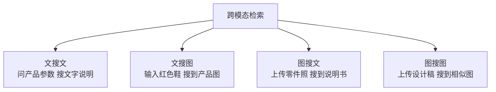
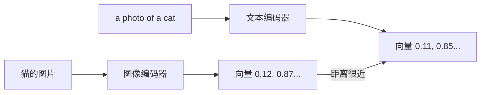
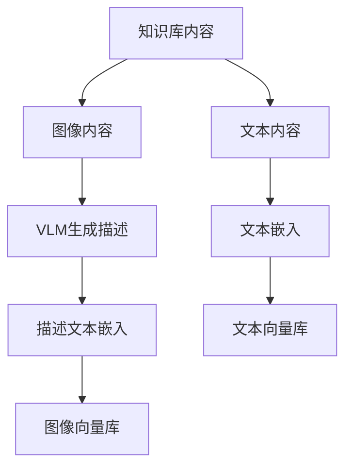
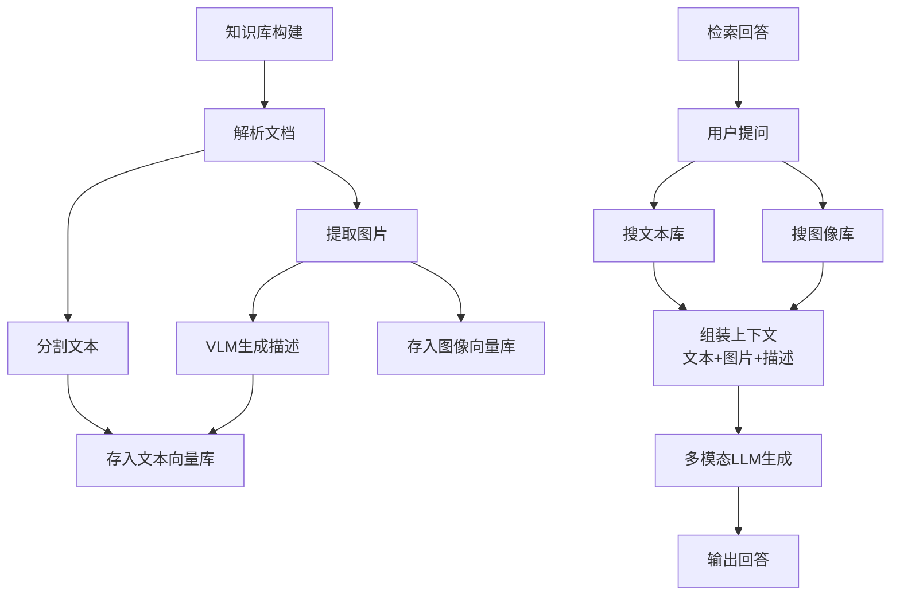
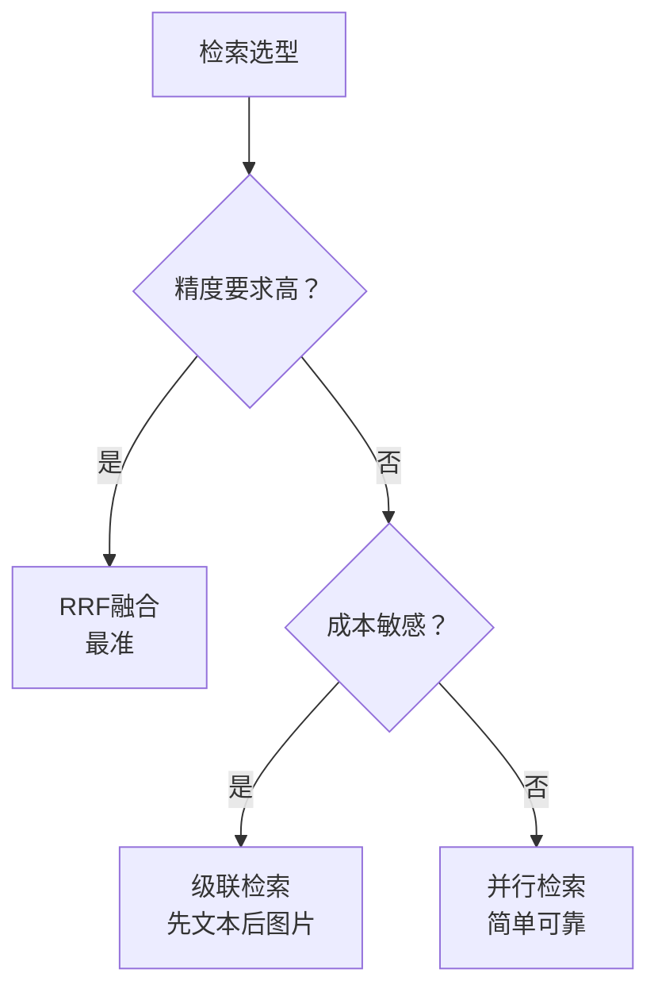
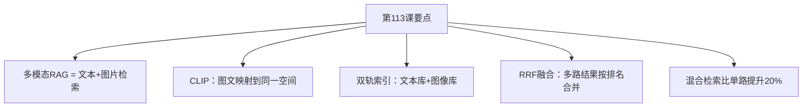

# 第113课：多模态RAG与跨模态检索实战

> **学习课程** | **阶段：19** | **预计学习时间：60 分钟** | **前置知识：第112课（图文混排解析）、第38-53课（高级应用RAG）**
>
> 之前我们学的 RAG 只能搜文字。但现实中的知识库往往图文混合——有说明书、有配图、有表格截图。这一课我们学习"多模态RAG"，让检索系统同时搜文字和图片。

---

## 本课目标

学完本课，你将能够：
1. 解释为什么传统RAG处理不了图文混合知识库
2. 说出CLIP模型的核心原理（用一句话）
3. 实现一个多模态向量数据库
4. 搭建完整的多模态RAG系统

---

## 一、传统RAG的局限

### 场景引入

假设你在做一个"产品技术支持"系统，知识库里有：
- 产品说明文档（文字）
- 产品架构图（图片）
- 常见问题截图（图片+文字）

用户问："这个产品的架构是怎样的？"

传统RAG只搜文字，可能搜到"架构说明在图3"这样的文字描述，但拿不到图3的内容。用户还得自己翻文档找图——体验很差。

### 一句话定义

> **多模态RAG = 同时检索文字和图片的RAG系统，让AI回答时能"看到"相关图片。**

### 类比理解

传统RAG像在"只有文字目录的图书馆"找书——你能找到书名但看不到封面。多模态RAG像在"图文目录的图书馆"——既有书名又有封面缩略图，找起来更直观。

### 四种检索模式



---

## 二、CLIP模型：图文的"翻译官"

### 2.1 核心原理

CLIP 的核心思想很简单：把图片和文字映射到同一个"向量空间"里，让相关的图文距离近，不相关的距离远。

**一句话理解**：CLIP 就像一个"图文翻译官"，把"一只猫的照片"和文字"a photo of a cat"翻译成相同的"密码"（向量），这样搜文字也能找到对应图片。



### 2.2 主流嵌入模型

| 模型 | 维度 | 中文 | 开源 | 特点 |
|------|------|------|------|------|
| CLIP ViT-B/32 | 512 | 一般 | 是 | 基线模型 |
| CLIP ViT-L/14 | 768 | 一般 | 是 | 更精确 |
| Chinese-CLIP | 512/768 | 优秀 | 是 | 中文最优 |
| Jina-CLIP | 768 | 良好 | 是 | 多语言 |

### 2.3 CLIP本地使用

```python
from transformers import CLIPModel, CLIPProcessor, CLIPTokenizer
from PIL import Image
import torch

class CLIPHelper:
    """CLIP嵌入工具"""
    
    def __init__(self):
        self.device = "cuda" if torch.cuda.is_available() else "cpu"
        model_name = "openai/clip-vit-base-patch32"
        self.model = CLIPModel.from_pretrained(model_name).to(self.device)
        self.processor = CLIPProcessor.from_pretrained(model_name)
        self.tokenizer = CLIPTokenizer.from_pretrained(model_name)
    
    def encode_text(self, texts):
        """文字转向量"""
        inputs = self.tokenizer(texts, padding=True, return_tensors="pt").to(self.device)
        with torch.no_grad():
            emb = self.model.get_text_features(**inputs)
        return (emb / emb.norm(dim=-1, keepdim=True)).cpu().numpy()
    
    def encode_image(self, image_paths):
        """图片转向量"""
        images = [Image.open(p) for p in image_paths]
        inputs = self.processor(images=images, return_tensors="pt").to(self.device)
        with torch.no_grad():
            emb = self.model.get_image_features(**inputs)
        return (emb / emb.norm(dim=-1, keepdim=True)).cpu().numpy()

# 使用：计算图文相似度
import numpy as np
clip = CLIPHelper()

text_emb = clip.encode_text(["一只猫", "一只狗"])
img_emb = clip.encode_image(["cat.jpg", "dog.jpg"])

# 看看"一只猫"和哪张图最像
sim = np.dot(text_emb[0], img_emb[0])  # 猫文字 vs 猫图
print(f"'一只猫' vs cat.jpg: {sim:.4f}")  # 高
sim = np.dot(text_emb[0], img_emb[1])  # 猫文字 vs 狗图
print(f"'一只猫' vs dog.jpg: {sim:.4f}")  # 低
```

---

## 三、多模态向量数据库

### 3.1 双轨索引策略

图文混合知识库需要两套索引：
- **文本索引**：用文字嵌入模型索引所有文本
- **图像索引**：用VLM给每张图生成文字描述，再用文字嵌入索引描述



### 3.2 实现

```python
from langchain_chroma import Chroma
from langchain_openai import OpenAIEmbeddings, ChatOpenAI
from langchain_core.documents import Document
from langchain_core.messages import HumanMessage
import base64

class MultiModalVDB:
    """多模态向量数据库"""
    
    def __init__(self, persist_dir="./mm_vdb"):
        self.embedder = OpenAIEmbeddings(model="text-embedding-3-small")
        self.text_store = Chroma(
            collection_name="text", 
            embedding_function=self.embedder,
            persist_directory=persist_dir,
        )
        self.image_store = Chroma(
            collection_name="image",
            embedding_function=self.embedder,
            persist_directory=persist_dir,
        )
    
    def add_text(self, text, source=""):
        """添加文本"""
        self.text_store.add_documents([
            Document(page_content=text, metadata={"type": "text", "source": source})
        ])
    
    def add_image(self, image_path, description, source=""):
        """添加图片（用VLM描述做嵌入）"""
        self.image_store.add_documents([
            Document(
                page_content=description,
                metadata={"type": "image", "image_path": image_path, "source": source}
            )
        ])
    
    def search(self, query, k=3):
        """同时搜文字和图片"""
        text_results = self.text_store.similarity_search(query, k=k)
        image_results = self.image_store.similarity_search(query, k=k)
        return text_results, image_results

# 使用
vdb = MultiModalVDB()
vdb.add_text("Qwen-VL是视觉语言模型", "tech.md")
vdb.add_image("qwen_arch.png", "Qwen-VL架构图", "tech.md")

texts, images = vdb.search("Qwen视觉模型", k=2)
print(f"找到 {len(texts)} 个文本, {len(images)} 张图片")
```

---

## 四、完整多模态RAG系统

### 4.1 架构总览



### 4.2 完整实现

```python
from langchain_openai import ChatOpenAI, OpenAIEmbeddings
from langchain_chroma import Chroma
from langchain_core.documents import Document
from langchain_core.messages import HumanMessage, SystemMessage
from langchain_text_splitters import RecursiveCharacterTextSplitter
import base64

class MultiModalRAG:
    """多模态RAG系统"""
    
    def __init__(self, model="gpt-4o", persist_dir="./mm_rag"):
        self.llm = ChatOpenAI(model=model, temperature=0)
        self.embedder = OpenAIEmbeddings(model="text-embedding-3-small")
        self.splitter = RecursiveCharacterTextSplitter(
            chunk_size=1000, chunk_overlap=200
        )
        self.text_store = Chroma(
            collection_name="rag_text",
            embedding_function=self.embedder,
            persist_directory=persist_dir,
        )
        self.image_store = Chroma(
            collection_name="rag_image",
            embedding_function=self.embedder,
            persist_directory=persist_dir,
        )
    
    def add_documents(self, texts, images):
        """添加知识"""
        # 文本
        chunks = []
        for t in texts:
            for c in self.splitter.split_text(t["text"]):
                chunks.append(Document(page_content=c, 
                    metadata={"source": t.get("source", "")}))
        if chunks:
            self.text_store.add_documents(chunks)
        
        # 图片
        img_docs = [Document(page_content=im["description"],
            metadata={"image_path": im["path"], "source": im.get("source", "")})
            for im in images]
        if img_docs:
            self.image_store.add_documents(img_docs)
        
        print(f"已添加 {len(chunks)} 文本块, {len(img_docs)} 张图片")
    
    def query(self, question, k=3):
        """问答"""
        # 检索
        text_results = self.text_store.similarity_search(question, k=k)
        image_results = self.image_store.similarity_search(question, k=k)
        
        # 组装上下文
        text_ctx = "\n\n".join(d.page_content for d in text_results)
        
        content_parts = [
            {"type": "text", "text": f"检索到的文本:\n{text_ctx}\n\n问题: {question}"}
        ]
        
        # 添加图片
        for d in image_results:
            content_parts.append({
                "type": "text",
                "text": f"[图片描述: {d.page_content}]"
            })
            img_path = d.metadata.get("image_path")
            if img_path:
                with open(img_path, "rb") as f:
                    b64 = base64.b64encode(f.read()).decode("utf-8")
                content_parts.append({
                    "type": "image_url",
                    "image_url": {"url": f"data:image/png;base64,{b64}"}
                })
        
        msg = HumanMessage(content=content_parts)
        sys = SystemMessage(content=(
            "你是多模态知识库助手。基于检索到的文本和图片回答。"
            "标注信息来源。"
        ))
        
        response = self.llm.invoke([sys, msg])
        return {
            "answer": response.content,
            "text_sources": len(text_results),
            "image_sources": len(image_results),
        }

# 使用
rag = MultiModalRAG()
rag.add_documents(
    texts=[{"text": "Qwen-VL支持最大4096分辨率...", "source": "spec.md"}],
    images=[{"path": "qwen_arch.png", "description": "Qwen-VL架构图", "source": "spec.md"}],
)

result = rag.query("Qwen-VL的架构是怎样的？")
print(result["answer"])
```

---

## 五、混合检索策略

### 5.1 为什么需要混合检索

单一检索方式可能遗漏信息。混合检索 = 多种方式并行 + 结果融合。

| 策略 | 描述 | 适用 |
|------|------|------|
| 并行检索 | 文本库+图像库各搜一次 | 通用 |
| RRF融合 | 多路结果按排名融合 | 精度高 |
| 级联检索 | 先搜文本，不够再搜图片 | 省钱 |

### 5.2 RRF融合排序

```python
def rrf_fusion(result_lists, k=60):
    """RRF融合：把多路检索结果按排名融合"""
    scores = {}
    for result_list in result_lists:
        for rank, (doc_id, _) in enumerate(result_list):
            if doc_id not in scores:
                scores[doc_id] = 0
            scores[doc_id] += 1.0 / (k + rank + 1)
    return sorted(scores.items(), key=lambda x: x[1], reverse=True)

# 示例
text_results = [("doc1", 0.9), ("doc2", 0.85)]
image_results = [("doc2", 0.88), ("doc3", 0.82)]

fused = rrf_fusion([text_results, image_results])
# doc2排在最前面：因为它在两路检索中都出现了
```

### 5.3 类比理解

RRF 融合就像"多个人推荐餐厅"——如果3个人都推荐同一家，那家很可能真的不错。即使评分不同，被多个人推荐的排名应该更高。

---

## 六、性能基准

### 6.1 检索质量对比

| 策略 | Recall@5 | MRR | 延迟 |
|---------|---------|-----|------|
| 纯文本 | 0.72 | 0.61 | 50ms |
| 纯图像(CLIP) | 0.65 | 0.52 | 80ms |
| 并行检索 | 0.88 | 0.73 | 90ms |
| RRF融合 | 0.92 | 0.78 | 95ms |
| 级联检索 | 0.85 | 0.70 | 60ms |

### 6.2 选型建议



---

## 七、动手任务

> **任务：搭建一个图文混合知识库**
> 
> 1. 准备 5 段文字 + 3 张图片
> 2. 用VLM为每张图片生成文字描述
> 3. 用 `MultiModalRAG` 添加到向量库
> 4. 提 5 个问题，观察文本和图片的检索效果
> 5. 尝试纯文本RAG和多模态RAG对比

---

## 八、本课小结

### 关键点回顾



### 一句话总结

> 多模态RAG让知识库"既搜文字又搜图片"——用CLIP把图文映射到同一空间，用双轨索引分别存储，用RRF融合多路检索结果。

### 下节预告

最后一课，我们将学习语音ASR/TTS集成与多模态Agent——让AI不仅能看图，还能听你说话、用语音回答！
