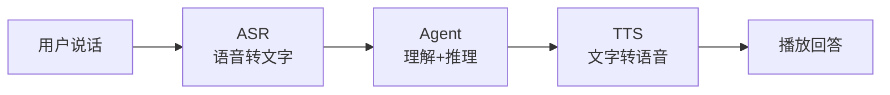
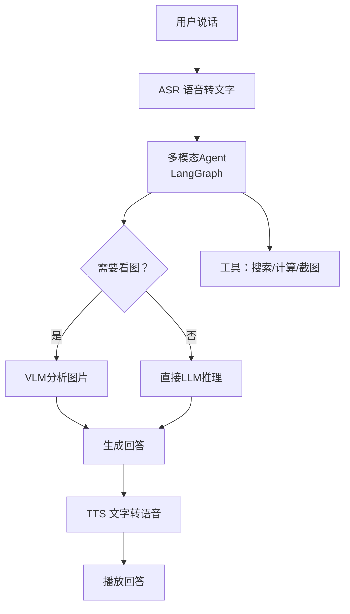
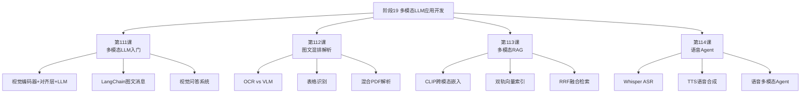
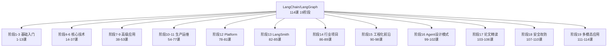
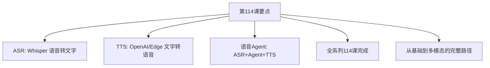

# 第114课：语音集成与多模态Agent实战与全阶段收官

> **学习课程** | **阶段：19** | **预计学习时间：60 分钟** | **前置知识：第111-113课（多模态LLM系列）**
>
> 这是阶段 19 的收官课！我们学习语音 ASR（听）和 TTS（说）的集成，搭一个语音驱动的多模态 Agent——用户说话提问、Agent 看图回答、用语音播放。同时回顾全系列 114 课的学习成果。

---

## 本课目标

学完本课，你将能够：
1. 用一句话解释 ASR 和 TTS 分别做什么
2. 用 Whisper 实现语音转文字
3. 搭建一个"语音输入-语音输出"的多模态Agent
4. 回顾全系列 114 课的知识体系

---

## 一、语音交互：让AI长出"耳朵"和"嘴巴"

### 场景引入

想象你做了一个 AI 助手，但它只能打字交流。你在开车时想问它"前方路口怎么走"，但手不能离开方向盘。如果它能听你说话，再用语音回答，就方便多了。

### 一句话定义

> **ASR = 语音转文字（让AI"听懂"），TTS = 文字转语音（让AI"说话"）。**

### 类比理解

ASR 就像"速记员"——你说什么，它写成什么。TTS 就像"播音员"——给它文字稿，它读出来。

### 语音交互架构



---

## 二、ASR：让AI听懂你说话

### 2.1 Whisper模型

Whisper 是 OpenAI 开源的语音识别模型，支持 99 种语言，中文识别优秀。

| 模型大小 | 准确率 | 速度 | 内存 | 适合 |
|---------|--------|------|------|------|
| tiny | 85% | 5x实时 | 1GB | 快速验证 |
| base | 88% | 3x实时 | 2GB | 日常使用 |
| small | 91% | 1.5x实时 | 5GB | 较高精度 |
| API | ~96% | 快 | 0 | 生产推荐 |

### 2.2 Whisper本地使用

```python
# 安装: pip install openai-whisper
import whisper

class ASRModule:
    """语音识别模块"""
    
    def __init__(self, model_size="base"):
        # tiny/base/small/medium/large
        self.model = whisper.load_model(model_size)
    
    def listen(self, audio_path):
        """听音频，返回文字"""
        result = self.model.transcribe(audio_path, language="zh")
        return result["text"]

# 使用
asr = ASRModule(model_size="base")
text = asr.listen("question.wav")
print(f"你说的是: {text}")
# "多模态大模型是什么？"
```

### 2.3 Whisper API方案

```python
from openai import OpenAI

class ASRAPI:
    """Whisper API"""
    
    def __init__(self):
        self.client = OpenAI()
    
    def listen(self, audio_path):
        with open(audio_path, "rb") as f:
            result = self.client.audio.transcriptions.create(
                model="whisper-1",
                file=f,
                language="zh",
            )
        return result.text

# 使用
asr = ASRAPI()
text = asr.listen("question.wav")
print(f"识别结果: {text}")
```

---

## 三、TTS：让AI开口说话

### 3.1 TTS方案对比

| 方案 | 自然度 | 成本 | 中文 | 适合 |
|------|--------|------|------|------|
| OpenAI TTS | 4.2/5 | $0.015/1K字 | 优秀 | 通用 |
| Edge TTS | 3.8/5 | 免费 | 优秀 | 免费/快速 |
| 百度TTS | 4.0/5 | 低 | 优秀 | 中文场景 |
| ChatTTS | 4.3/5 | 免费 | 优秀 | 本地部署 |

### 3.2 OpenAI TTS

```python
from openai import OpenAI

class TTSModule:
    """语音合成模块"""
    
    VOICES = {
        "alloy": "中性女声",
        "echo": "温和男声",
        "nova": "年轻女声",
        "shimmer": "温柔女声",
    }
    
    def __init__(self):
        self.client = OpenAI()
    
    def speak(self, text, voice="nova"):
        """文字转语音"""
        response = self.client.audio.speech.create(
            model="tts-1",
            voice=voice,
            input=text,
        )
        path = "answer.mp3"
        response.write_to_file(path)
        return path

# 使用
tts = TTSModule()
audio_path = tts.speak("多模态大模型能同时处理文字和图片。")
print(f"语音已保存: {audio_path}")
```

### 3.3 Edge TTS免费方案

```python
# 安装: pip install edge-tts
import edge_tts, asyncio

class EdgeTTS:
    """免费语音合成"""
    
    VOICES = {
        "zh-CN-XiaoxiaoNeural": "女声-晓晓（自然）",
        "zh-CN-YunxiNeural": "男声-云希（自然）",
    }
    
    async def _synthesize(self, text, voice):
        comm = edge_tts.Communicate(text, voice)
        path = "edge_output.mp3"
        await comm.save(path)
        return path
    
    def speak(self, text, voice="zh-CN-XiaoxiaoNeural"):
        return asyncio.run(self._synthesize(text, voice))

# 使用
tts = EdgeTTS()
path = tts.speak("你好，我是语音AI助手。", "zh-CN-XiaoxiaoNeural")
```

---

## 四、语音多模态Agent

### 4.1 完整架构



### 4.2 完整实现

```python
from langchain_openai import ChatOpenAI
from langchain_core.messages import HumanMessage, SystemMessage
from langchain_core.tools import tool
from langgraph.prebuilt import create_react_agent
from openai import OpenAI
import whisper, base64

# ASR模块
class ASRModule:
    def __init__(self, model_size="base"):
        self.model = whisper.load_model(model_size)
    def listen(self, audio_path):
        result = self.model.transcribe(audio_path, language="zh")
        return result["text"]

# TTS模块
class TTSModule:
    def __init__(self):
        self.client = OpenAI()
    def speak(self, text, voice="nova"):
        resp = self.client.audio.speech.create(
            model="tts-1", voice=voice, input=text
        )
        path = "agent_response.mp3"
        resp.write_to_file(path)
        return path

# 工具
@tool
def analyze_image(image_path: str, question: str) -> str:
    """分析图片内容并回答问题。"""
    with open(image_path, "rb") as f:
        b64 = base64.b64encode(f.read()).decode("utf-8")
    llm = ChatOpenAI(model="gpt-4o", temperature=0)
    msg = HumanMessage(content=[
        {"type": "text", "text": question},
        {"type": "image_url", "image_url": {"url": f"data:image/png;base64,{b64}"}},
    ])
    return llm.invoke([msg]).content

@tool
def calculate(expression: str) -> str:
    """数学计算。"""
    try:
        return str(eval(expression))
    except:
        return "无法计算"

# 语音Agent
class VoiceAgent:
    """语音多模态Agent"""
    
    def __init__(self):
        self.asr = ASRModule()
        self.tts = TTSModule()
        self.llm = ChatOpenAI(model="gpt-4o", temperature=0)
        self.agent = create_react_agent(
            self.llm, [analyze_image, calculate]
        )
    
    def chat(self, audio_path=None, text=None, image_path=None):
        # 1. 听
        if audio_path:
            user_text = self.asr.listen(audio_path)
            print(f"[听到] {user_text}")
        else:
            user_text = text
        
        # 2. 想
        if image_path:
            user_text += f"\n(参考图片: {image_path})"
        
        result = self.agent.invoke({
            "messages": [
                SystemMessage(content=(
                    "你是语音交互助手。回答简洁口语化，"
                    "适合语音播放，每段不超过3句。"
                )),
                HumanMessage(content=user_text),
            ]
        })
        answer = result["messages"][-1].content
        print(f"[回答] {answer}")
        
        # 3. 说
        audio = self.tts.speak(answer)
        print(f"[语音] {audio}")
        
        return {"user_text": user_text, "answer": answer, "audio": audio}

# 使用
agent = VoiceAgent()

# 纯语音
r1 = agent.chat(text="3.14乘以100等于多少？")

# 语音+图片
r2 = agent.chat(
    text="帮我看看这张图里有什么",
    image_path="photo.png"
)
```

### 4.3 动手任务

> **任务：搭一个语音问答助手**
> 
> 1. 录一段中文语音（用手机录音即可）
> 2. 用 Whisper 转成文字
> 3. 用 GPT-4o 生成回答
> 4. 用 TTS 把回答转成语音
> 5. 检查端到端延迟和质量

---

## 五、实时交互进阶

### 5.1 流式TTS

```python
class StreamingTTS:
    """流式TTS：边生成边播放"""
    
    def __init__(self):
        self.client = OpenAI()
    
    def speak_stream(self, text, voice="nova"):
        import re
        # 按句子分段
        sentences = re.split(r'(?<=[。！？.!?])', text)
        for sent in sentences:
            if not sent.strip():
                continue
            resp = self.client.audio.speech.create(
                model="tts-1", voice=voice, input=sent
            )
            yield sent, resp.content

# 使用：边生成边播放
tts = StreamingTTS()
for sentence, audio_data in tts.speak_stream(
    "多模态大模型能看图。它能听声音。它还能说话。"
):
    print(f"合成: {sentence}")
    # 这里可以播放audio_data
```

### 5.2 VAD语音端点检测

VAD（Voice Activity Detection）用于检测"用户什么时候说完了"：

```python
# 安装: pip install webrtcvad
import webrtcvad

class VoiceDetector:
    """语音端点检测"""
    
    def __init__(self):
        self.vad = webrtcvad.Vad(3)  # 0-3, 越高越严格
    
    def is_speech(self, audio_frame, sample_rate=16000):
        """检测音频帧中是否有语音"""
        return self.vad.is_speech(audio_frame, sample_rate)

# 使用：实时检测语音开始和结束
detector = VoiceDetector()
# 持续采集音频帧，检测到语音时开始录制，
# 检测到静音时停止录制并交给ASR
```

---

## 六、成本与延迟分析

### 6.1 端到端延迟

| 环节 | 延迟(本地Whisper) | 延迟(API) |
|------|-------------------|-----------|
| ASR | 800ms | 300ms |
| Agent推理 | 1500ms | 1500ms |
| TTS | 300ms | 300ms |
| 总计 | 2600ms | 2100ms |

### 6.2 成本

| 组件 | 单价 | 每次对话 |
|------|------|---------|
| Whisper API | $0.006/分钟 | $0.006 |
| GPT-4o | ~$0.02/次 | $0.02 |
| TTS API | $0.015/1K字 | $0.008 |
| **每次对话** | - | **~$0.034** |

### 6.3 省钱技巧

| 方法 | 效果 |
|------|------|
| Whisper本地部署 | ASR $0 |
| Edge TTS | TTS $0 |
| 缓存相同问题 | 省掉LLM调用 |
| 用GPT-4o-mini | 省70% LLM |

---

## 七、全阶段19收官：回顾与展望

### 7.1 阶段19学习成果



### 7.2 全系列114课知识地图



### 7.3 学习路径建议

| 阶段 | 关键技能 | 里程碑 |
|------|---------|--------|
| 1-3 | LLM基础、Prompt工程 | 能做聊天机器人 |
| 4-6 | RAG、向量库、Agent | 能做知识库问答 |
| 7-9 | 高级RAG、多步推理 | 能做复杂推理系统 |
| 10-11 | 部署、监控、运维 | 能上线生产 |
| 12-13 | 平台、评估 | 能用平台工具 |
| 14-15 | 行业项目、工程化 | 能做完整项目 |
| 16-17 | Agent模式、论文 | 能创新和优化 |
| 18 | 安全攻防 | 能防护系统 |
| 19 | 多模态应用 | 能处理图文语音 |

### 7.4 下一步学习方向

- **深入实践**：用所学知识搭建一个完整的端到端项目
- **社区跟进**：关注 LangChain/LangGraph 更新和新特性
- **论文阅读**：阅读多模态、Agent等方向的最新论文
- **开源贡献**：参与开源项目，提升工程能力

---

## 八、本课小结

### 关键点回顾



### 一句话总结

> 语音Agent = ASR听 + Agent想 + TTS说，让用户用说话的方式与多模态AI交互。

### 全阶段收官语

恭喜你完成了阶段 19！从第 1 课的"什么是 LangChain"到第 114 课的"语音多模态Agent"，你已经走过了完整的 LangChain/LangGraph 学习之旅。从基础入门、核心技术、高级应用、生产运维、行业项目到前沿论文和安全攻防，再到多模态应用——你已经掌握了从零到一的完整能力。

**继续前行，用所学构建改变世界的产品！**
