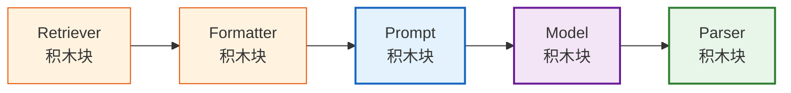
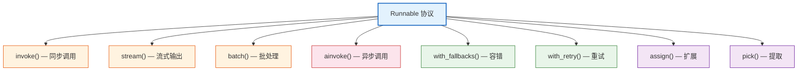
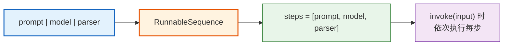
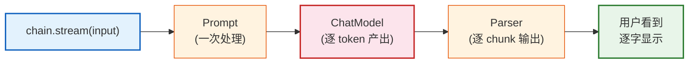
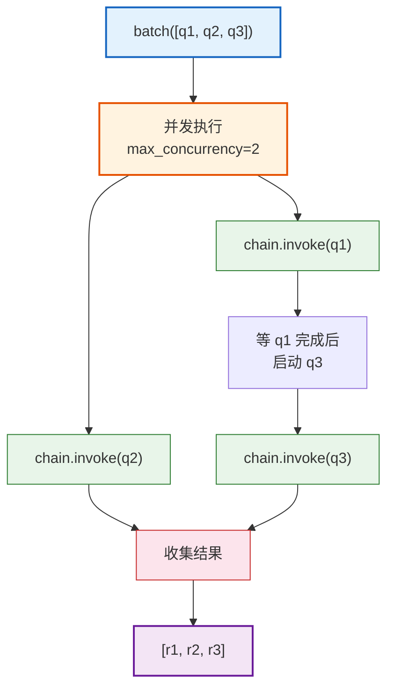
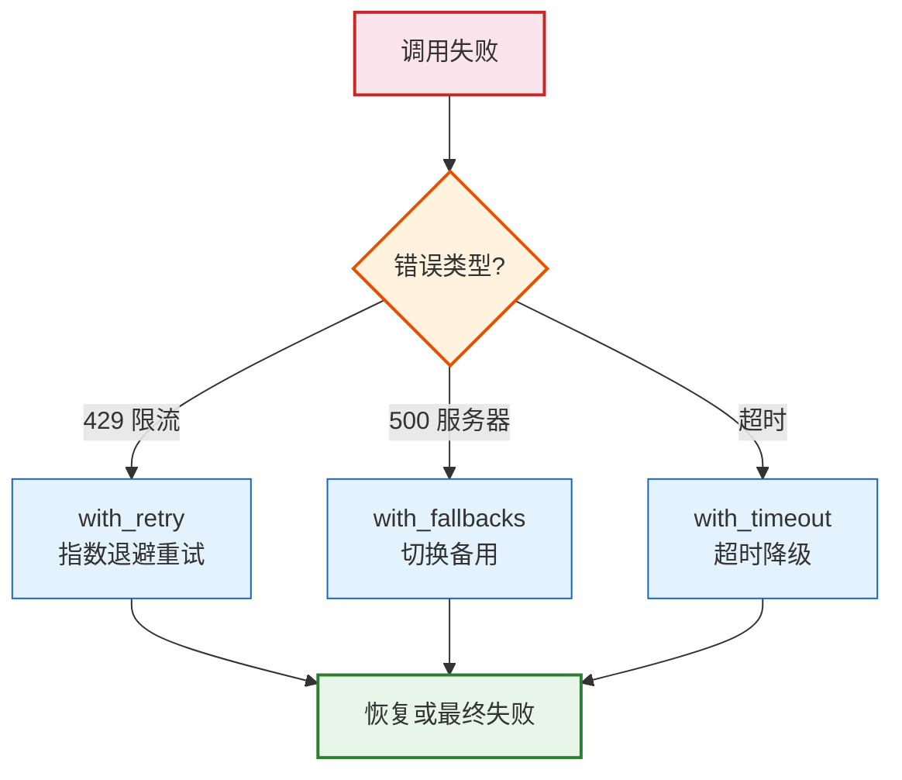

# 第11课：LCEL 深入——管道运算符与流式输出

> **学习目标**：深入理解 LCEL 的设计理念，掌握 Runnable 协议、管道运算符原理、流式输出、异步处理和批处理，学会容错与降级。

> **配套知识库**：`知识库/07_LCEL表达式语言深入技术参考.md`

---

## 本课导航

| 小节 | 主题 | 预计时间 |
|------|------|---------|
| 1 | LCEL 是什么 | 10 分钟 |
| 2 | Runnable 协议 | 15 分钟 |
| 3 | 管道运算符 | 15 分钟 |
| 4 | 流式输出 | 15 分钟 |
| 5 | 异步与批处理 | 10 分钟 |
| 6 | 容错与降级 | 10 分钟 |

---

## 1. LCEL 是什么

### 生活类比

把 LCEL 想象成**乐高积木**——每块积木都有标准的接口（凸起和凹槽），可以自由拼接。



> **图解说明**：LCEL 就像乐高——每个组件是标准积木块，用 `|` 拼接。Retriever → Formatter → Prompt → Model → Parser 是一条完整的数据流。

### 核心语法

```python
# 一行代码串联三个组件
chain = prompt | model | parser

# 等价于
chain = RunnableSequence(first=prompt, middle=[model], last=parser)
```

---

## 2. Runnable 协议

### 什么是 Runnable

Runnable 是所有 LCEL 组件的**统一接口**——只要实现了 Runnable，就能用 `|` 参与管道。



> **图解说明**：Runnable 是一张"能力清单"——实现了 Runnable 的组件自动获得同步调用、流式输出、批处理、异步、容错、重试等 8 大能力。你不需要额外编码。

### 三个核心 Runnable

```python
from langchain_core.runnables import RunnablePassthrough, RunnableLambda, RunnableParallel

# 1. RunnablePassthrough —— 透传输入
passthrough = RunnablePassthrough()
assert passthrough.invoke("hello") == "hello"

# 2. RunnableLambda —— 包装普通函数
upper = RunnableLambda(lambda x: x.upper())
assert upper.invoke("hello") == "HELLO"

# 3. RunnableParallel —— 并行执行
parallel = RunnableParallel(
    a=RunnableLambda(lambda x: x * 2),
    b=RunnableLambda(lambda x: x + 1),
)
result = parallel.invoke(5)
# {"a": 10, "b": 6}
```

### 生活类比

| Runnable | 生活类比 | 做什么 |
|----------|---------|--------|
| `RunnablePassthrough` | **传声筒** | 原样传递，不改内容 |
| `RunnableLambda` | **翻译官** | 把普通函数变成标准接口 |
| `RunnableParallel` | **多车道** | 同时走多条路，最后汇总 |

---

## 3. 管道运算符

### `|` 的原理

Python 的 `|` 运算符被 LCEL 重载了：

```python
# 底层代码（简化版）
class Runnable:
    def __or__(self, other):
        return RunnableSequence(first=self, last=other)
```

当你写 `prompt | model`，实际调用了 `prompt.__or__(model)`，返回一个新的 `RunnableSequence`。



> **图解说明**：`|` 运算符把多个 Runnable 组合成一个 RunnableSequence。调用 invoke 时，输入依次流过每一步，前一步的输出是后一步的输入。

### 实战示例

```python
from langchain_openai import ChatOpenAI
from langchain_core.prompts import ChatPromptTemplate
from langchain_core.output_parsers import StrOutputParser
from langchain_core.runnables import RunnablePassthrough, RunnableLambda

# 组合使用
chain = ({
    "context": retriever,                      # 检索相关文档
    "question": RunnablePassthrough(),          # 保留原始问题
} | ChatPromptTemplate.from_messages([
    ("system", "根据上下文回答:\n{context}"),
    ("human", "{question}"),
]) | ChatOpenAI(model="gpt-4o-mini") | StrOutputParser())

result = chain.invoke("LangChain 的核心组件有哪些?")
```

---

## 4. 流式输出

### 为什么需要流式

| 非流式 | 流式 |
|--------|------|
| 等待 5 秒后一次性返回 | 每 0.1 秒返回一小段 |
| 用户盯着空白屏幕 | 用户看到文字逐字出现 |
| 体验差 | 体验好（像 ChatGPT） |



> **图解说明**：流式输出的关键是 ChatModel 逐 token 产出——LCEL 的 stream 方法自动把这种逐 token 的输出透传到最终结果，用户看到的是逐字出现的效果。

### 代码

```python
# 同步流式
for chunk in chain.stream({"question": "什么是量子计算"}):
    print(chunk, end="", flush=True)
# 输出: 量 子 计 算 是 一 种 ...

# 异步流式（FastAPI 中使用）
async def stream_response(question: str):
    async for chunk in chain.astream({"question": question}):
        yield f"data: {chunk}\n\n"
```

### astream_events（细粒度）

```python
# 看到每一步的输入输出——适合调试
async for event in chain.astream_events({"question": "量子计算"}, version="v2"):
    if event["event"] == "on_chat_model_stream":
        print(event["data"]["chunk"].content, end="", flush=True)
    elif event["event"] == "on_chain_start":
        print(f"\n[{event['name']}] 开始")
    elif event["event"] == "on_chain_end":
        print(f"\n[{event['name']}] 完成")
```

---

## 5. 异步与批处理

### 异步

```python
import asyncio

async def main():
    # 异步单次调用
    result = await chain.ainvoke({"question": "量子计算"})

    # 异步流式
    async for chunk in chain.astream({"question": "量子计算"}):
        print(chunk, end="")

asyncio.run(main())
```

### 批处理

```python
# 一次处理多个输入
inputs = [
    {"question": "什么是量子计算"},
    {"question": "什么是深度学习"},
    {"question": "什么是区块链"},
]
results = chain.batch(inputs)
# 返回 ["量子计算是...", "深度学习是...", "区块链是..."]

# 异步批量 + 控制并发
results = await chain.abatch(inputs, config={"max_concurrency": 2})
```



> **图解说明**：batch 用线程池并发处理多个输入。`max_concurrency=2` 限制同时只处理 2 个，等一个完成后再启动下一个。这样既能并行加速，又不会触发 API 限流。

---

## 6. 容错与降级

### with_fallbacks

```python
# 主模型失败 → 自动切换备用模型
model = ChatOpenAI(model="gpt-4o").with_fallbacks([
    ChatOpenAI(model="gpt-4o-mini"),
    ChatOpenAI(model="gpt-3.5-turbo"),
])

chain = prompt | model | parser
# gpt-4o 挂了？自动切 gpt-4o-mini。又挂了？切 gpt-3.5-turbo
```

### with_retry

```python
# 自动重试（适合 Rate Limit 错误）
model = ChatOpenAI(model="gpt-4o-mini").with_retry(
    stop_after_attempt=3,       # 最多 3 次
    wait_exponential_jitter=True,  # 指数退避
)
```



> **图解说明**：容错策略根据错误类型选择——速率限制用重试（过一会儿就好了）、服务器错误用降级（换一个模型）、超时用硬限制（超时就用备选方案）。

---

## 本课小结

| 你学到了什么 | 一句话总结 |
|-------------|-----------|
| LCEL 定位 | 用管道符 `|` 声明式组合组件 |
| Runnable 协议 | 统一接口，8 大能力开箱即用 |
| 管道运算符 | `__or__` 重载，生成 RunnableSequence |
| 流式输出 | `stream()` 逐 token 返回，体验好 |
| 异步批处理 | `ainvoke()` / `batch()` 并发加速 |
| 容错降级 | `with_fallbacks()` / `with_retry()` |

### 核心代码模板

```python
# 生产级 LCEL 链模板
chain = ({
    "context": retriever,
    "question": RunnablePassthrough(),
} | prompt | model.with_fallbacks([
    ChatOpenAI(model="gpt-4o-mini"),
]).with_retry(stop_after_attempt=3) | StrOutputParser())

# 同步/异步/流式/批量，全部支持
result = chain.invoke("问题")
async for chunk in chain.astream("问题"): ...
results = chain.batch(["问题1", "问题2"])
```

### 配套知识库

- 📖 `知识库/07_LCEL表达式语言深入技术参考.md`

### 下一课

➡️ **第12课：高级 RAG 技术——让检索更精准**——学会多查询检索、重排序、上下文压缩等高级 RAG 策略。
