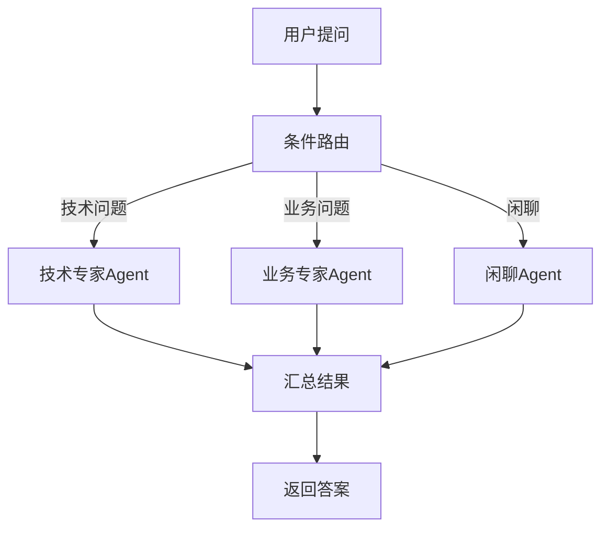
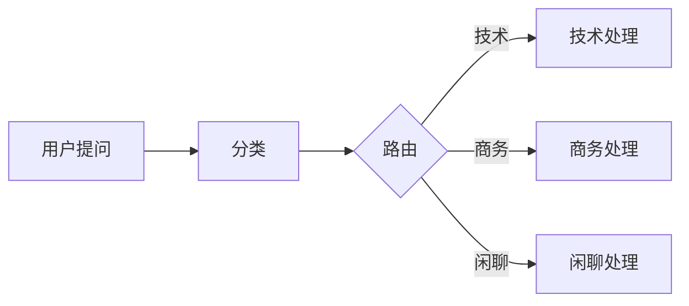
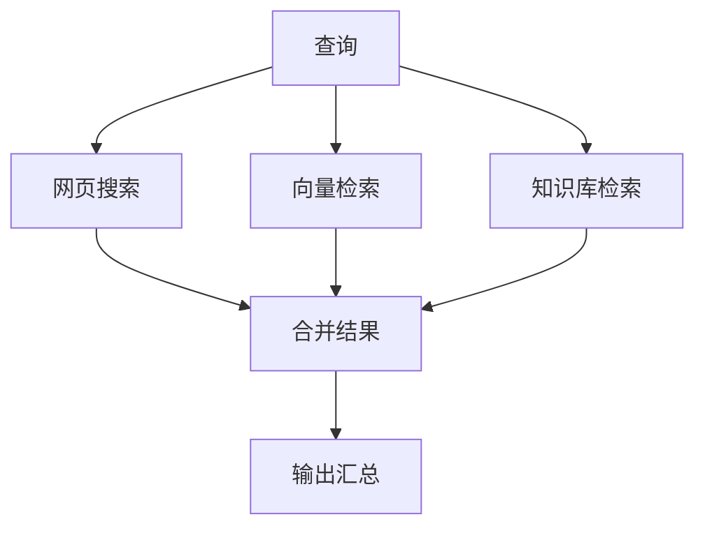
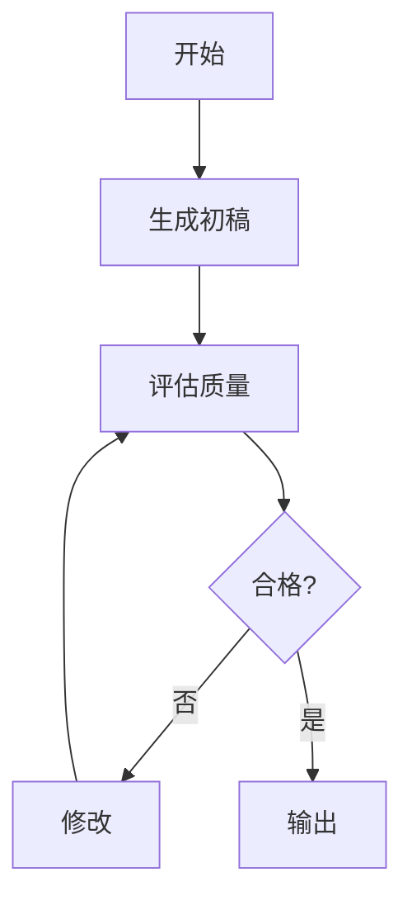

# 第123课：LangGraph 高级编排模式入门实战

> **课程编号：第123课** | **阶段：22** | **时长：45分钟**
>
> 本课带你从零掌握 LangGraph 的高级编排模式，用生活类比搞懂条件路由、并行执行和循环迭代。

---

## 本课目标

- 用类比理解"为什么要编排"
- 掌握三种核心编排模式
- 动手实现一个条件路由 Agent

---

## 1. 什么是编排？

**类比：Agent 编排就像"餐厅后厨管理"**

想象一家餐厅后厨：
- **线性流水线** = "自助餐"：客人排队，一个厨师依次做
- **条件分支** = "点单系统"：根据客人点的菜分配给不同厨师
- **并行执行** = "同时炒菜"：多个厨师同时做不同的菜
- **循环迭代** = "试菜调整"：厨师做好后尝一口，不够好就改进



---

## 2. 条件分支：像"智能客服路由"

### 2.1 基本概念

**类比**：条件分支就像银行的取号机——你选"个人业务"或"对公业务"，系统把你分到不同窗口。

```python
from langgraph.graph import StateGraph, END, START
from typing import TypedDict

class State(TypedDict):
    query: str
    category: str
    answer: str

def classify(state: State) -> dict:
    """分类节点: 判断问题类型"""
    q = state["query"].lower()
    if any(kw in q for kw in ["代码", "编程", "bug", "api"]):
        return {"category": "technical"}
    elif any(kw in q for kw in ["价格", "合同", "商务"]):
        return {"category": "business"}
    else:
        return {"category": "casual"}

def route(state: State) -> str:
    """路由函数: 返回下一个节点名"""
    return f"{state['category']}_handler"

def handle_technical(state: State) -> dict:
    return {"answer": f"技术解答: {state['query']}"}

def handle_business(state: State) -> dict:
    return {"answer": f"商务回复: {state['query']}"}

def handle_casual(state: State) -> dict:
    return {"answer": f"闲聊: {state['query']}"}

# 构建图
g = StateGraph(State)
g.add_node("classify", classify)
g.add_node("technical_handler", handle_technical)
g.add_node("business_handler", handle_business)
g.add_node("casual_handler", handle_casual)

g.add_edge(START, "classify")
g.add_conditional_edges("classify", route, {
    "technical_handler": "technical_handler",
    "business_handler": "business_handler",
    "casual_handler": "casual_handler",
})
g.add_edge("technical_handler", END)
g.add_edge("business_handler", END)
g.add_edge("casual_handler", END)

app = g.compile()
```

### 2.2 路由流程



---

## 3. 并行执行：像"多线程做菜"

**类比**：并行执行就像你同时煮饭、炒菜、烧汤——三件事一起做，比一件件做快得多。

```python
import asyncio
from typing import TypedDict, Annotated, List
from operator import add

class SearchState(TypedDict):
    query: str
    results: Annotated[List[str], add]  # 结果自动累加
    summary: str

async def web_search(state: SearchState) -> dict:
    await asyncio.sleep(0.3)  # 模拟搜索
    return {"results": [f"网页: {state['query']}"]}

async def vector_search(state: SearchState) -> dict:
    await asyncio.sleep(0.2)
    return {"results": [f"向量: {state['query']}"]}

async def kb_search(state: SearchState) -> dict:
    await asyncio.sleep(0.4)
    return {"results": [f"知识库: {state['query']}"]}

def merge(state: SearchState) -> dict:
    count = len(state.get("results", []))
    return {"summary": f"共找到 {count} 条结果"}

g = StateGraph(SearchState)
g.add_node("web", web_search)
g.add_node("vector", vector_search)
g.add_node("kb", kb_search)
g.add_node("merge", merge)

# Fan-out: 三个搜索并行启动
g.add_edge(START, "web")
g.add_edge(START, "vector")
g.add_edge(START, "kb")

# Fan-in: 三个结果汇聚到merge
g.add_edge("web", "merge")
g.add_edge("vector", "merge")
g.add_edge("kb", "merge")
g.add_edge("merge", END)

app = g.compile()
```

### 并行架构



---

## 4. 循环迭代：像"写作文反复修改"

**类比**：循环迭代就像写作文——写初稿→老师批改→修改→再批改→直到合格。

```python
class RefineState(TypedDict):
    query: str
    draft: str
    feedback: str
    iterations: int
    final: str

MAX_ITER = 3

def generate(state: RefineState) -> dict:
    return {"draft": f"关于{state['query']}的初步回答", "iterations": 0}

def evaluate(state: RefineState) -> dict:
    it = state.get("iterations", 0)
    if it >= MAX_ITER:
        return {"feedback": "达标"}
    if it < 2:
        return {"feedback": "需要改进", "iterations": it + 1}
    return {"feedback": "达标", "iterations": it + 1}

def refine(state: RefineState) -> dict:
    return {"draft": f"改进版: {state['draft']}"}

def should_continue(state: RefineState) -> str:
    if state.get("feedback") == "达标":
        return "done"
    return "refine"

def finalize(state: RefineState) -> dict:
    return {"final": state.get("draft", "")}

g = StateGraph(RefineState)
g.add_node("generate", generate)
g.add_node("evaluate", evaluate)
g.add_node("refine", refine)
g.add_node("finalize", finalize)

g.add_edge(START, "generate")
g.add_edge("generate", "evaluate")
g.add_conditional_edges("evaluate", should_continue, {"refine": "refine", "done": "finalize"})
g.add_edge("refine", "evaluate")
g.add_edge("finalize", END)

app = g.compile()
```

### 循环流程



---

## 5. 子图嵌套：像"公司部门协作"

**类比**：子图嵌套就像公司——总经理（主图）把任务交给研发部（子图），研发部内部有自己的流程，完成后向总经理汇报。

```python
from langgraph.graph import StateGraph, END, START
from typing import TypedDict

# === 子图: 研究部门 ===
class ResearchState(TypedDict):
    topic: str
    findings: list
    report: str

def research(state: ResearchState) -> dict:
    return {"findings": [f"发现: {state['topic']}"]}

def analyze(state: ResearchState) -> dict:
    return {"report": f"基于{len(state['findings'])}条发现"}

research_g = StateGraph(ResearchState)
research_g.add_node("research", research)
research_g.add_node("analyze", analyze)
research_g.add_edge(START, "research")
research_g.add_edge("research", "analyze")
research_g.add_edge("analyze", END)
research_app = research_g.compile()

# === 主图: 总经理 ===
class MainState(TypedDict):
    query: str
    research_report: str
    answer: str

def call_research(state: MainState) -> dict:
    result = research_app.invoke({"topic": state["query"]})
    return {"research_report": result["report"]}

def generate_answer(state: MainState) -> dict:
    return {"answer": f"最终回答: {state['research_report']}"}

main_g = StateGraph(MainState)
main_g.add_node("research", call_research)
main_g.add_node("answer", generate_answer)
main_g.add_edge(START, "research")
main_g.add_edge("research", "answer")
main_g.add_edge("answer", END)

app = main_g.compile()
```

---

## 6. 本课小结

| 模式 | 类比 | 关键API | 适用场景 |
|------|------|---------|---------|
| 条件分支 | 银行取号 | `add_conditional_edges` | 分类处理 |
| 并行执行 | 同时做菜 | Fan-out/Fan-in | 多源检索 |
| 循环迭代 | 反复改作文 | 条件边+计数器 | 质量优化 |
| 子图嵌套 | 部门协作 | 子图compile() | 复杂系统 |

---

## 课后练习

1. 实现一个三路条件分支的客服Agent
2. 构建一个并行三路检索的RAG系统
3. 实现一个最多迭代5次的自我修正Agent

下节课学习 Human-in-the-loop 人工介入与审批工作流。
