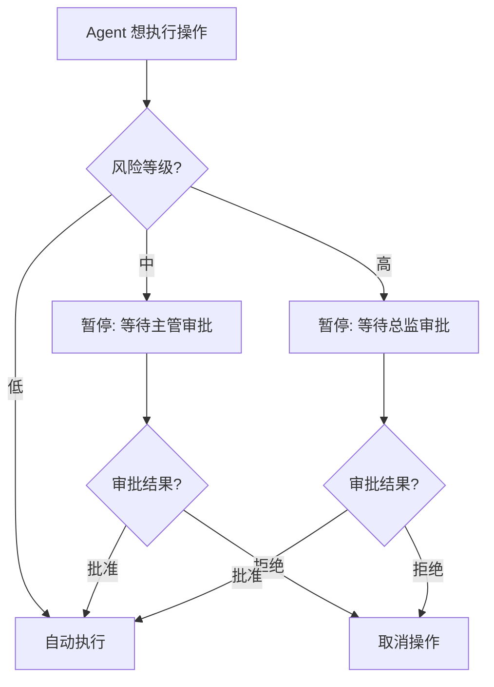
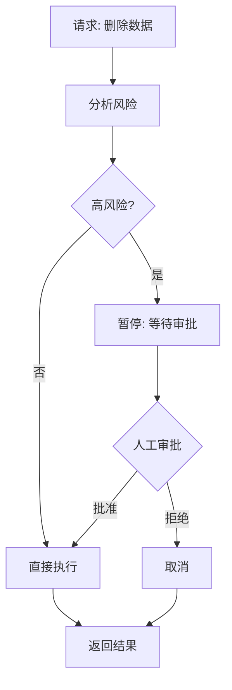
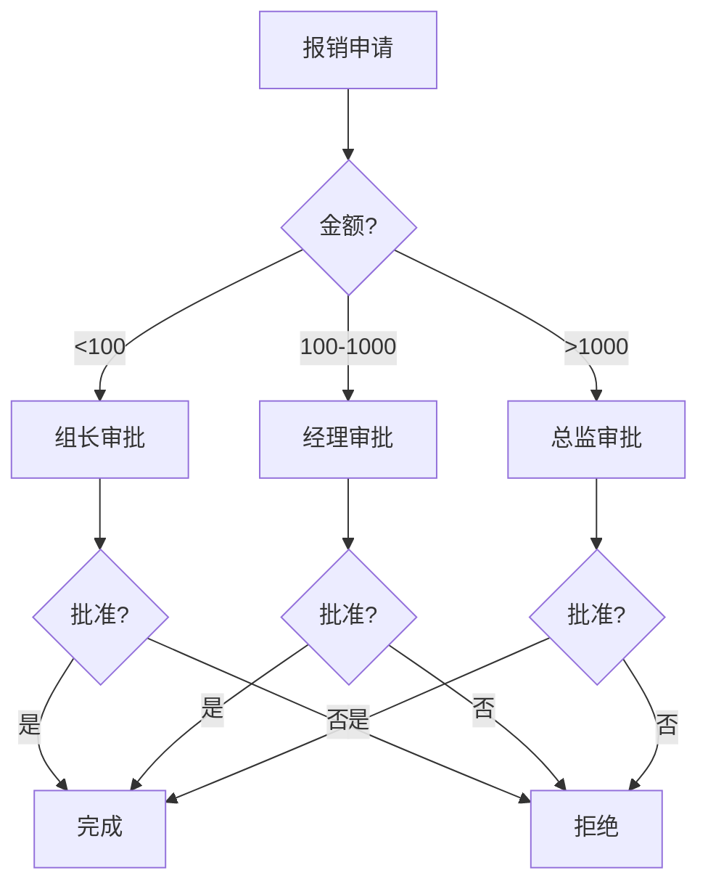

# 第124课：Human-in-the-loop 人工介入实战

> **课程编号：第124课** | **阶段：22** | **时长：45分钟**
>
> 本课从零开始，用 LangGraph 实现人工审批、人工修正和动态中断，让 Agent 学会"请示人类"。

---

## 本课目标

- 理解人工介入的必要性
- 实现审批工作流
- 掌握动态中断与恢复

---

## 1. 为什么需要人工介入？

**类比：Agent 就像"实习生"**

一个实习生（Agent）在工作中：
- **写邮件** = 低风险，直接发
- **提交报销** = 中风险，需要主管签字
- **删除数据库** = 高风险，必须总监审批



---

## 2. 基本审批流程

### 2.1 用 interrupt_before 实现审批

```python
from langgraph.graph import StateGraph, END, START
from langgraph.checkpoint.memory import MemorySaver
from typing import TypedDict

class ApprovalState(TypedDict):
    request: str
    risk_level: str
    approval_status: str
    result: str

def analyze(state: ApprovalState) -> dict:
    """分析请求风险"""
    request = state["request"]
    high_risk = any(kw in request for kw in ["删除", "发送", "执行"])
    risk = "high" if high_risk else "low"
    return {"risk_level": risk, "approval_status": "pending"}

def execute(state: ApprovalState) -> dict:
    """执行操作"""
    return {"result": f"已执行: {state['request']}"}

def route_by_risk(state: ApprovalState) -> str:
    """根据风险路由"""
    if state["risk_level"] == "high":
        return "wait_approval"
    return "execute"

def wait_approval(state: ApprovalState) -> dict:
    """等待审批（会被中断）"""
    return {}

g = StateGraph(ApprovalState)
g.add_node("analyze", analyze)
g.add_node("wait_approval", wait_approval)
g.add_node("execute", execute)

g.add_edge(START, "analyze")
g.add_conditional_edges("analyze", route_by_risk, {
    "wait_approval": "wait_approval",
    "execute": "execute"
})
g.add_conditional_edges("wait_approval", lambda s: 
    "execute" if s.get("approval_status") == "approved" else END,
    {"execute": "execute", END: END})
g.add_edge("execute", END)

# 关键: 在 wait_approval 前中断
app = g.compile(
    checkpointer=MemorySaver(),
    interrupt_before=["wait_approval"]
)
```

### 2.2 执行审批交互

```python
# 步骤1: 发起请求（到 wait_approval 前暂停）
config = {"configurable": {"thread_id": "approval-001"}}

result = app.invoke(
    {"request": "删除用户ID为1001的数据"},
    config=config
)
print(f"风险: {result['risk_level']}")  # high
print(f"状态: {result['approval_status']}")  # pending

# 步骤2: 人工审批（注入结果）
app.update_state(
    config,
    {"approval_status": "approved"},
    as_node="wait_approval"
)

# 步骤3: 继续执行
result = app.invoke(None, config=config)
print(f"结果: {result['result']}")  # 已执行: 删除用户ID为1001的数据
```

### 2.3 审批流程



---

## 3. 人工修正模式

**类比**：就像老师批改作业——Agent 写答案，人工检查修改。

```python
class ReviewState(TypedDict):
    query: str
    agent_answer: str
    human_correction: str
    final_answer: str

def agent_respond(state: ReviewState) -> dict:
    """Agent生成回答"""
    return {"agent_answer": f"Agent的回答: {state['query']}"}

def human_review(state: ReviewState) -> dict:
    """人工审核（中断点）"""
    correction = state.get("human_correction", "")
    if correction:
        return {"final_answer": correction}
    return {"final_answer": state["agent_answer"]}

g = StateGraph(ReviewState)
g.add_node("respond", agent_respond)
g.add_node("review", human_review)
g.add_edge(START, "respond")
g.add_edge("respond", "review")
g.add_edge("review", END)

review_app = g.compile(
    checkpointer=MemorySaver(),
    interrupt_before=["review"]
)

# 使用
config = {"configurable": {"thread_id": "review-001"}}

# Agent回答（到review前暂停）
result = review_app.invoke({"query": "什么是RAG?"}, config=config)
print(f"Agent回答: {result['agent_answer']}")

# 人工注入修正
review_app.update_state(
    config,
    {"human_correction": "RAG是检索增强生成，结合检索和生成"},
    as_node="review"
)

# 继续执行
result = review_app.invoke(None, config=config)
print(f"最终回答: {result['final_answer']}")
```

---

## 4. 动态中断

### 4.1 基于条件的中断

```python
from langgraph.errors import GraphInterrupt

def safe_execute(state) -> dict:
    """检测到高风险时自动中断"""
    action = state.get("request", "")
    
    dangerous = ["DROP", "DELETE FROM", "rm -rf", "format"]
    if any(d.lower() in action.lower() for d in dangerous):
        raise GraphInterrupt({
            "reason": "检测到高危操作",
            "action": action,
        })
    
    return {"result": "执行成功"}
```

**类比**：就像汽车安全气囊——平时不触发，检测到危险时立即弹出。

---

## 5. 多级审批

**类比**：多级审批就像公司报销——100元组长批，1000元经理批，10000元总监批。



```python
class MultiState(TypedDict):
    request: str
    amount: float
    level1: str
    level2: str
    result: str

def level1_review(state: MultiState) -> dict:
    return {"level1": "pending"}

def level2_review(state: MultiState) -> dict:
    return {"level2": "pending"}

def route_l1(state: MultiState) -> str:
    if state.get("level1") == "approved":
        if state.get("amount", 0) > 1000:
            return "level2_review"
        return "done"
    return "rejected"

g = StateGraph(MultiState)
g.add_node("level1_review", level1_review)
g.add_node("level2_review", level2_review)
g.add_node("done", lambda s: {"result": "通过"})
g.add_node("rejected", lambda s: {"result": "拒绝"})

g.add_edge(START, "level1_review")
g.add_conditional_edges("level1_review", route_l1, {
    "level2_review": "level2_review",
    "done": "done",
    "rejected": "rejected"
})
g.add_conditional_edges("level2_review",
    lambda s: "done" if s.get("level2") == "approved" else "rejected",
    {"done": "done", "rejected": "rejected"})
g.add_edge("done", END)
g.add_edge("rejected", END)

multi_app = g.compile(
    checkpointer=MemorySaver(),
    interrupt_before=["level1_review", "level2_review"]
)
```

---

## 6. 会话管理

**类比**：会话管理就像"多窗口银行"——每个客户一个独立窗口，互不干扰。

```python
# 不同用户用不同 thread_id
config_a = {"configurable": {"thread_id": "user-a"}}
config_b = {"configurable": {"thread_id": "user-b"}}

# 用户A的审批
app.invoke({"request": "用户A申请"}, config=config_a)

# 用户B的审批
app.invoke({"request": "用户B申请"}, config=config_b)

# 分别恢复
app.update_state(config_a, {"approval_status": "approved"}, as_node="wait_approval")
result_a = app.invoke(None, config=config_a)

app.update_state(config_b, {"approval_status": "rejected"}, as_node="wait_approval")
result_b = app.invoke(None, config=config_b)
```

---

## 7. 本课小结

| 概念 | 类比 | 关键API |
|------|------|---------|
| 审批中断 | 实习生请示 | `interrupt_before` |
| 人工修正 | 老师批改 | `update_state` |
| 动态中断 | 安全气囊 | `GraphInterrupt` |
| 多级审批 | 公司报销 | 多个 interrupt 节点 |
| 会话管理 | 多窗口银行 | `thread_id` |

---

## 课后练习

1. 实现一个带审批的邮件发送Agent
2. 构建一个两级的审批工作流
3. 实现人工修正Agent回答的功能

下节课学习 Agent 批处理与异步任务编排。
