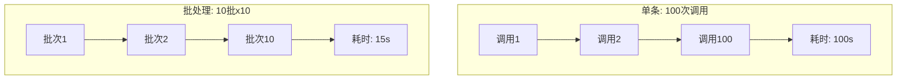
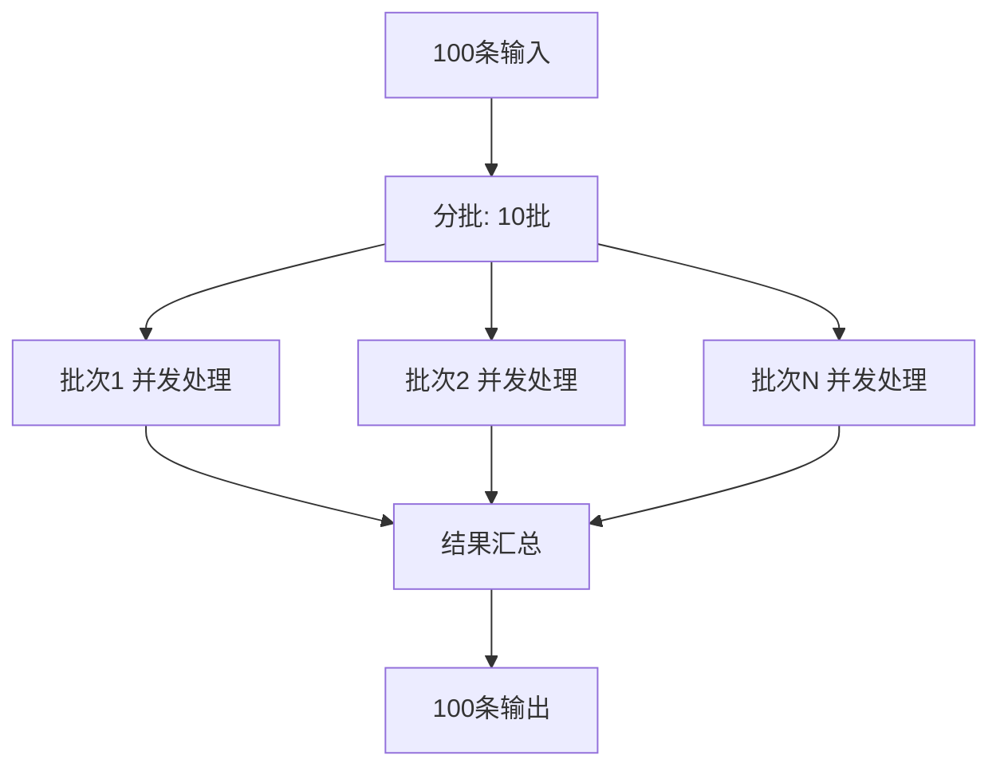
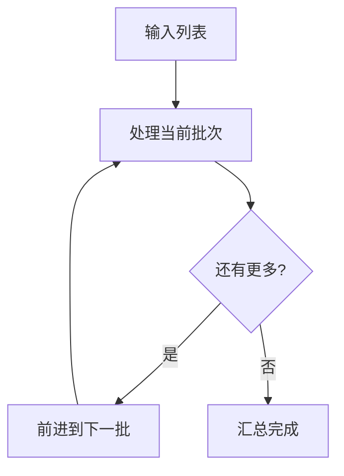
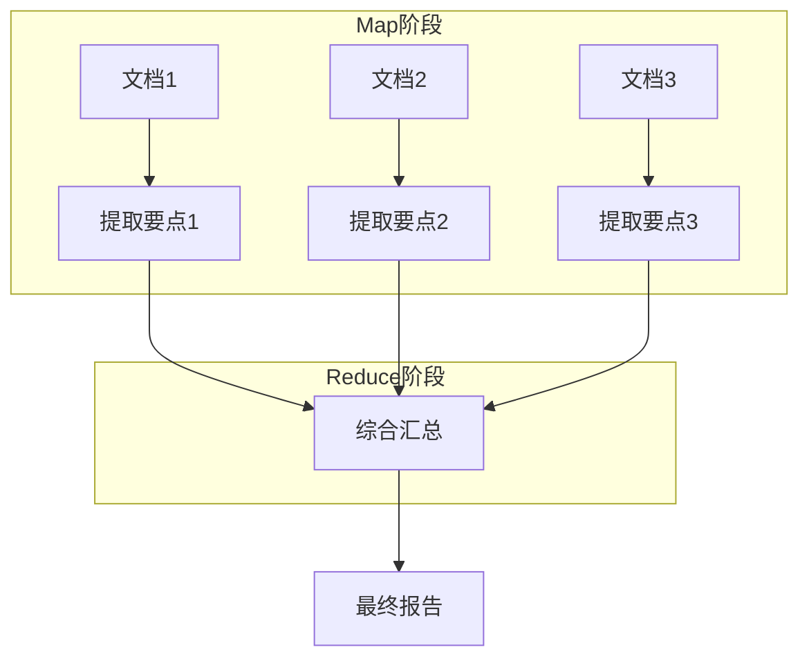
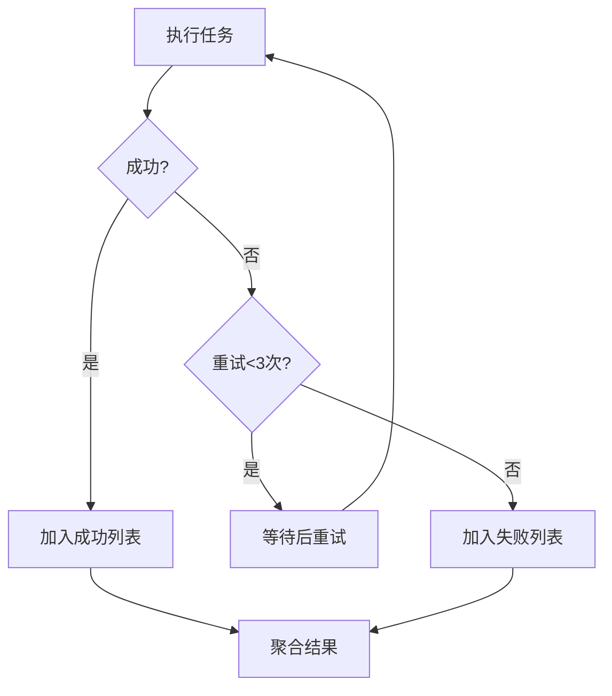

# 第125课：Agent 批处理与异步编排实战

> **课程编号：第125课** | **阶段：22** | **时长：45分钟**
>
> 本课从零开始，用 LangGraph 实现批量推理、异步队列和 MapReduce 模式。

---

## 本课目标

- 理解批处理的必要性
- 实现批量推理和并发控制
- 构建批处理工作流

---

## 1. 为什么需要批处理？

**类比：批处理就像"食堂做饭"**

- **单条处理** = "单点小炒"：一个一个炒，味道好但慢
- **批处理** = "食堂大锅饭"：一批一起做，速度快效率高
- **并发** = "多个灶台"：同时开几个锅



---

## 2. 批量推理

### 2.1 基本并发调用

```python
import asyncio
from typing import List
from langchain_openai import ChatOpenAI
from langchain_core.messages import HumanMessage

llm = ChatOpenAI(model="gpt-4o-mini", temperature=0)

async def batch_generate(prompts: List[str], concurrency: int = 3) -> List[str]:
    """并发批量生成"""
    semaphore = asyncio.Semaphore(concurrency)  # 限制并发数
    
    async def process_one(prompt: str) -> str:
        async with semaphore:  # 获取许可
            resp = await llm.ainvoke([HumanMessage(content=prompt)])
            return resp.content
    
    # 并发执行所有任务
    tasks = [process_one(p) for p in prompts]
    return await asyncio.gather(*tasks)

# 使用
prompts = [
    "用一句话解释RAG",
    "用一句话解释Agent",
    "用一句话解释LangChain",
    "用一句话解释向量数据库",
    "用一句话解释MCP",
]

results = asyncio.run(batch_generate(prompts, concurrency=3))
for p, r in zip(prompts, results):
    print(f"Q: {p}")
    print(f"A: {r}\n")
```

**类比**：`Semaphore(3)` 就像餐厅只有3个灶台——最多同时做3道菜，其他的排队等。

### 2.2 批量推理流程



---

## 3. 批处理工作流

### 3.1 用 LangGraph 实现批处理

```python
from langgraph.graph import StateGraph, END, START
from typing import TypedDict, List, Annotated
from operator import add

class BatchState(TypedDict):
    items: List[str]              # 待处理列表
    batch_size: int              # 每批大小
    current_idx: int             # 当前位置
    results: Annotated[List[str], add]  # 结果累加
    total_done: int              # 完成数

def process_batch(state: BatchState) -> dict:
    """处理当前批次"""
    items = state["items"]
    bs = state["batch_size"]
    idx = state["current_idx"]
    
    batch = items[idx:idx + bs]
    
    # 模拟批量处理
    batch_results = [f"结果: {item}" for item in batch]
    
    return {
        "results": batch_results,
        "total_done": state["total_done"] + len(batch),
    }

def advance(state: BatchState) -> dict:
    """前进到下一批"""
    return {"current_idx": state["current_idx"] + state["batch_size"]}

def should_continue(state: BatchState) -> str:
    """还有更多批次吗"""
    if state["current_idx"] < len(state["items"]):
        return "process"
    return "done"

g = StateGraph(BatchState)
g.add_node("process", process_batch)
g.add_node("advance", advance)
g.add_node("done", lambda s: {"results": s.get("results", [])})

g.add_edge(START, "process")
g.add_conditional_edges("process", should_continue, {
    "process": "advance",
    "done": "done"
})
g.add_edge("advance", "process")
g.add_edge("done", END)

batch_app = g.compile()

# 使用
result = batch_app.invoke({
    "items": [f"文档{i}" for i in range(25)],
    "batch_size": 5,
    "current_idx": 0,
    "results": [],
    "total_done": 0,
})
print(f"处理完成: {result['total_done']}条")
print(f"结果数: {len(result['results'])}")
```

### 3.2 批处理流程



---

## 4. MapReduce 模式

**类比**：MapReduce 就像"分组讨论"——

- **Map** = "小组讨论"：每组各自提取要点
- **Reduce** = "全班汇总"：把所有小组的要点合并

```python
class MapReduceState(TypedDict):
    documents: List[str]
    mapped: Annotated[List[str], add]
    reduced: str

async def map_stage(state: MapReduceState) -> dict:
    """Map: 并行处理每个文档"""
    async def process_doc(doc: str) -> str:
        resp = await llm.ainvoke([
            HumanMessage(content=f"提取关键点: {doc[:200]}")
        ])
        return resp.content
    
    tasks = [process_doc(doc) for doc in state["documents"]]
    results = await asyncio.gather(*tasks)
    
    return {"mapped": results}

async def reduce_stage(state: MapReduceState) -> dict:
    """Reduce: 汇总所有结果"""
    all_points = "\n".join(f"- {m}" for m in state["mapped"])
    
    resp = await llm.ainvoke([
        HumanMessage(content=f"基于以下要点生成综合报告:\n{all_points}")
    ])
    
    return {"reduced": resp.content}

g = StateGraph(MapReduceState)
g.add_node("map", map_stage)
g.add_node("reduce", reduce_stage)
g.add_edge(START, "map")
g.add_edge("map", "reduce")
g.add_edge("reduce", END)

mr_app = g.compile()
```

### MapReduce 流程



---

## 5. 错误处理与重试

**类比**：就像快递配送——送失败就重试，重试3次还失败就标记"退回"。

```python
class BatchProcessor:
    """带重试的批处理器"""
    
    def __init__(self, max_retries=3):
        self.max_retries = max_retries
    
    async def process_one(self, func, item):
        """带重试的单条处理"""
        for attempt in range(self.max_retries):
            try:
                result = await func(item)
                return result, "success"
            except Exception as e:
                if attempt < self.max_retries - 1:
                    await asyncio.sleep(1 * (attempt + 1))  # 递增等待
                else:
                    return {"error": str(e)}, "failed"
    
    async def process_batch(self, items, func, concurrency=5):
        """批量处理"""
        semaphore = asyncio.Semaphore(concurrency)
        
        async def limited(item):
            async with semaphore:
                return await self.process_one(func, item)
        
        results = await asyncio.gather(*[limited(item) for item in items])
        
        success = [r for r, s in results if s == "success"]
        failed = [r for r, s in results if s == "failed"]
        
        return {
            "total": len(items),
            "success": len(success),
            "failed": len(failed),
            "results": success,
            "failures": failed,
        }
```

### 错误处理流程



---

## 6. 性能优化

### 6.1 找最优批次大小

```python
import time

def benchmark_batch_sizes(items, func, sizes=[1, 5, 10, 20]):
    """测试不同批次大小的性能"""
    results = {}
    
    for size in sizes:
        start = time.time()
        asyncio.run(BatchProcessor().process_batch(
            items[:50], func, concurrency=size
        ))
        elapsed = time.time() - start
        results[size] = elapsed
    
    best = min(results, key=results.get)
    return {"best_concurrency": best, "details": results}
```

**类比**：就像找最优灶台数——1个太慢，100个太乱，通常5-10个刚好。

---

## 7. 本课小结

| 概念 | 类比 | 关键代码 |
|------|------|---------|
| 批量推理 | 食堂大锅饭 | `asyncio.gather` |
| 并发控制 | 灶台数量 | `Semaphore` |
| 批处理工作流 | 逐批处理 | LangGraph循环 |
| MapReduce | 分组讨论 | map→reduce |
| 错误重试 | 快递重投 | 递增重试 |
| 性能优化 | 找最优灶台数 | benchmark |

---

## 课后练习

1. 用批量推理处理20个文档摘要，对比单条和批处理的耗时
2. 实现一个MapReduce工作流，对5篇文档提取要点并汇总
3. 实现带重试的批处理器，测试3次重试的容错效果

下节课学习 Agent 产品化与工程化最佳实践。
