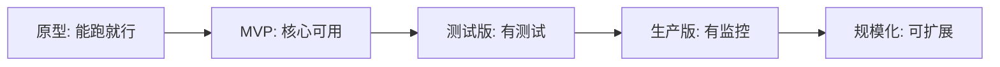
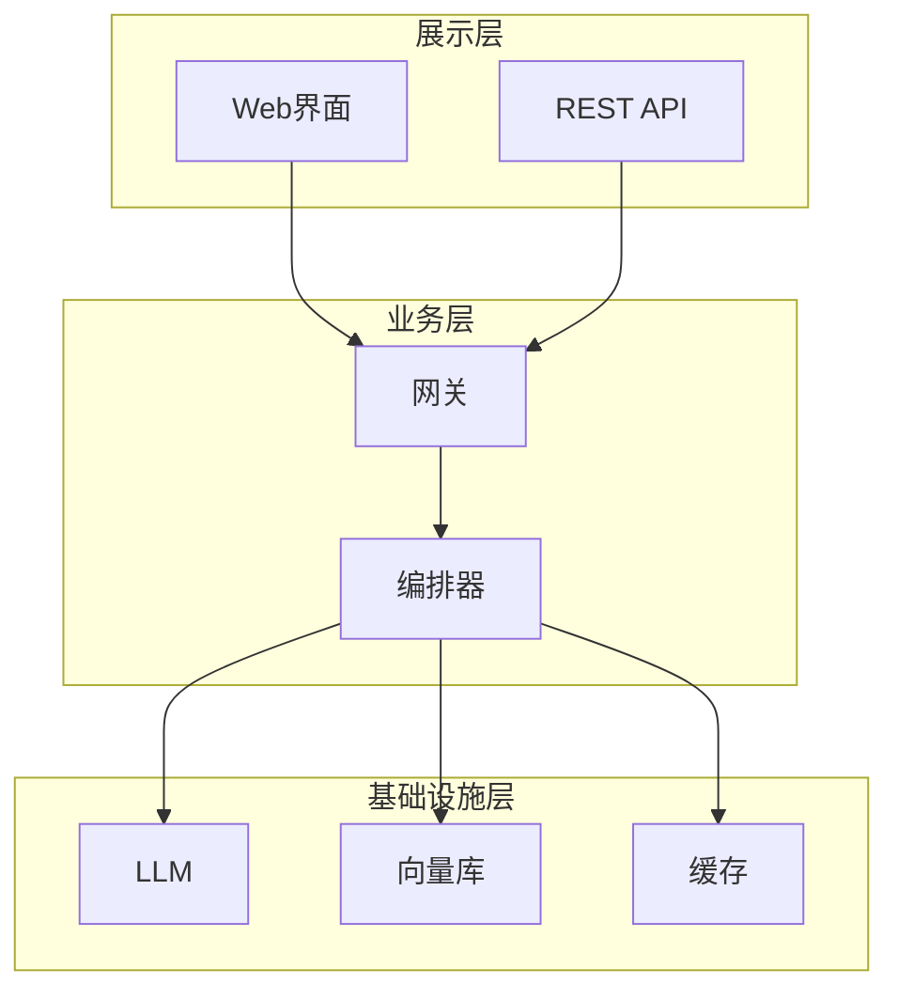
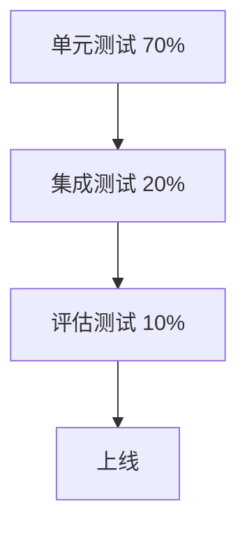
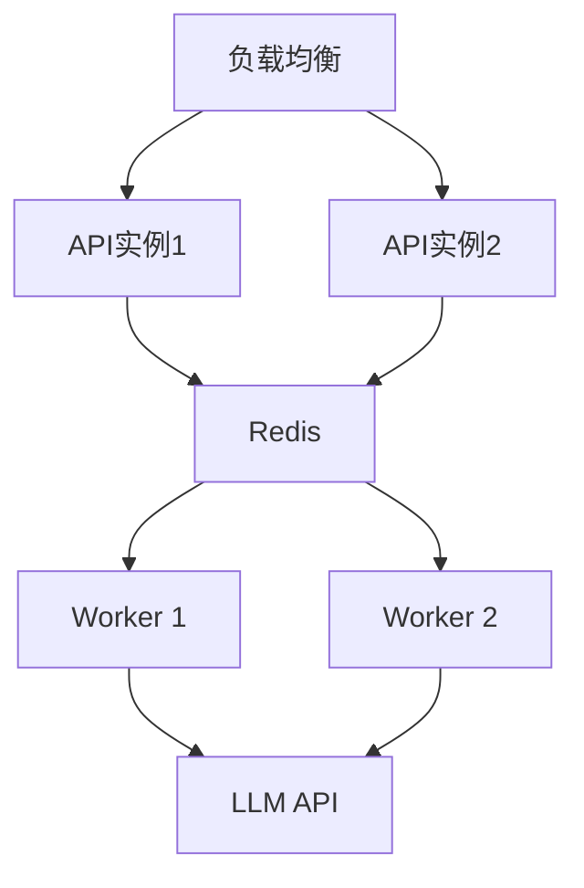
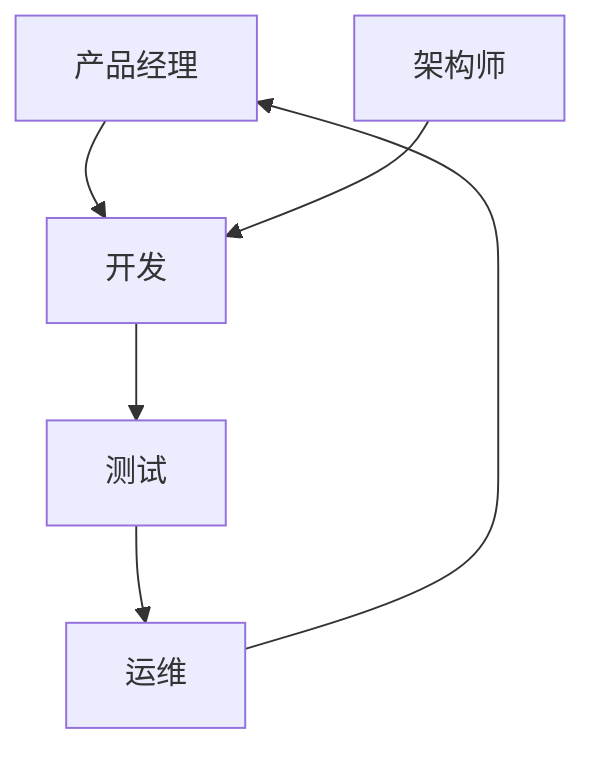
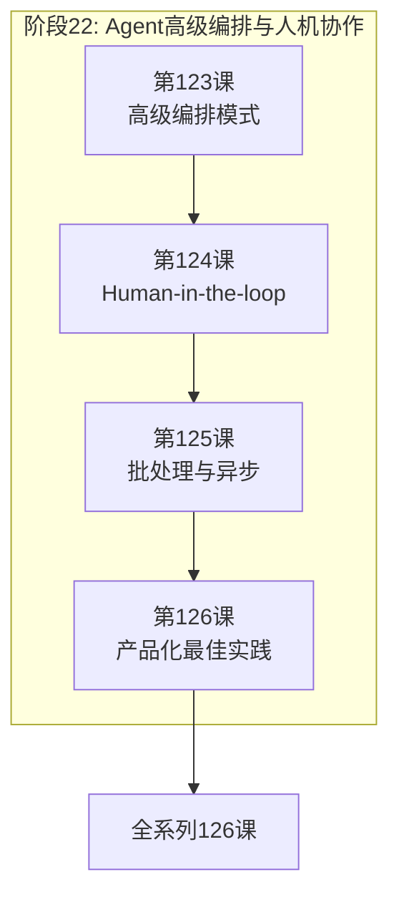

# 第126课：Agent 产品化与工程化最佳实践

> **课程编号：第126课** | **阶段：22** | **时长：45分钟**
>
> 本课是阶段 22 的收官课，从原型到产品——如何让 Agent 稳定上线、团队协作、持续迭代。

---

## 本课目标

- 理解从原型到产品的差距
- 掌握分层架构设计
- 编写上线检查清单

---

## 1. 从原型到产品的鸿沟

**类比：原型到产品就像"家庭作坊到工厂"**

| 维度 | 家庭作坊（原型） | 工厂（产品） |
|------|----------------|------------|
| 质量 | 偶尔出次品 | 99.9%合格 |
| 速度 | 手工慢 | 流水线快 |
| 成本 | 不算账 | 精确核算 |
| 安全 | 无防护 | 全面安检 |
| 管理 | 一人搞定 | 分工协作 |
| 文档 | 全靠记忆 | 操作手册 |



---

## 2. 分层架构

**类比**：分层架构就像"公司组织架构"——

- **展示层** = "前台接待"：和客户打交道
- **业务层** = "业务部门"：核心业务逻辑
- **基础设施层** = "后勤部门"：提供支撑服务

```python
# === 展示层 ===
class AgentAPI:
    """API入口"""
    async def handle(self, query: str, user_id: str):
        request = UserRequest(query=query, user_id=user_id)
        return await self.gateway.handle(request)

# === 业务层 ===
class AgentOrchestrator:
    """Agent编排器"""
    async def execute(self, request):
        result = await self.graph.ainvoke({"query": request.query})
        return AgentResponse(answer=result["answer"])

# === 基础设施层 ===
class LLMProvider:
    """LLM抽象"""
    async def generate(self, prompt: str) -> str:
        # 统一调用接口
        pass
```

### 分层架构图



---

## 3. 代码组织

### 3.1 项目结构

```
agent_project/
├── src/
│   ├── agents/          # Agent定义
│   ├── graphs/           # LangGraph工作流
│   ├── tools/            # 工具
│   ├── providers/        # 基础设施
│   └── middleware/       # 中间件
├── tests/                # 测试
├── config/               # 配置
└── scripts/              # 脚本
```

**类比**：就像厨房布局——生食区、烹饪区、备餐区分开，各司其职。

### 3.2 配置管理

```python
from pydantic import BaseModel

class AgentConfig(BaseModel):
    """统一配置"""
    llm_model: str = "gpt-4o-mini"
    temperature: float = 0.0
    max_tokens: int = 2000
    retrieval_top_k: int = 5
    max_iterations: int = 10
    timeout_seconds: int = 60
    enable_tracing: bool = True

# 使用
config = AgentConfig(llm_model="gpt-4o")
print(f"模型: {config.llm_model}")
```

---

## 4. 测试策略

**类比**：测试就像"产品质检"——

- **单元测试** = "零件检验"：每个零件单独检查
- **集成测试** = "组装检验"：零件组装后检查
- **评估测试** = "用户验收"：最终产品是否达标



### 4.1 单元测试示例

```python
import pytest
from unittest.mock import AsyncMock

class TestRAGAgent:
    
    @pytest.mark.asyncio
    async def test_retrieve(self):
        """测试检索"""
        mock_vs = AsyncMock()
        mock_vs.asimilarity_search = AsyncMock(return_value=["doc1"])
        
        docs = await mock_vs.asimilarity_search("test", k=3)
        assert len(docs) == 1
    
    @pytest.mark.asyncio
    async def test_response_latency(self):
        """测试延迟"""
        import time
        start = time.time()
        # 调用Agent
        elapsed = time.time() - start
        assert elapsed < 5.0, f"超时: {elapsed:.2f}s"
    
    def test_no_hallucination(self):
        """测试无幻觉"""
        answer = "Python由Guido van Rossum创建"
        assert "Guido" in answer
```

---

## 5. 部署

### 5.1 Docker部署

```dockerfile
FROM python:3.11-slim
WORKDIR /app
COPY requirements.txt .
RUN pip install -r requirements.txt
COPY src/ ./src/
COPY config/ ./config/
EXPOSE 8000
CMD ["python", "-m", "src.server"]
```

### 5.2 部署架构



---

## 6. 监控

**类比**：监控就像"汽车仪表盘"——

- **健康检查** = "发动机灯"
- **延迟监控** = "速度表"
- **错误率** = "故障灯"
- **成本监控** = "油表"

```python
class HealthCheck:
    """健康检查"""
    
    async def check(self) -> dict:
        return {
            "status": "healthy",
            "latency_p95_ms": 2100,
            "error_rate": 0.003,
            "daily_cost": 45.2,
            "quality_score": 0.87,
        }
```

---

## 7. 上线检查清单

```
## 上线前检查

### 代码质量
- [ ] 代码审查通过
- [ ] 单元测试覆盖率>80%
- [ ] 评估测试达标(>0.85)

### 部署就绪
- [ ] Docker镜像构建成功
- [ ] 环境变量配置完成
- [ ] 健康检查端点正常

### 监控告警
- [ ] 日志收集正常
- [ ] 告警规则已配置
- [ ] 值班排班已安排

### 安全
- [ ] 输入验证已启用
- [ ] 审计日志已开启

### 回滚准备
- [ ] 上一版本可用
- [ ] 回滚脚本已测试
```

---

## 8. 团队协作



**角色分工**：
- 产品经理：定义需求、优先级
- 架构师：技术选型、架构设计
- 开发：实现功能、写测试
- 测试：质量保障、评估
- 运维：部署、监控、排障

---

## 9. 阶段22总结



| 课次 | 主题 | 核心技能 |
|------|------|---------|
| 123 | 高级编排 | 条件路由、并行、循环、子图 |
| 124 | HITL | 审批、修正、动态中断 |
| 125 | 批处理 | 批量推理、MapReduce、重试 |
| 126 | 产品化 | 分层架构、测试、部署、上线 |

---

## 课后练习

1. 为你的Agent设计分层架构，明确各层职责
2. 编写完整的上线检查清单
3. 实现一个Docker部署配置

---

## 全系列学习路径回顾

恭喜完成全部 **126 课**！你走过的路：

```
阶段1-5:   基础概念 → Prompt → Chain → Memory → RAG
阶段6-10:  Agent → LangGraph → 工具 → 多Agent → 对话
阶段11-15: RAG进阶 → 部署 → 安全 → 性能 → 调试
阶段16-20: 多模态 → 安全攻防 → 多模态开发 → Deep Agents → MCP
阶段21:    Agent评估与质量保障
阶段22:    Agent高级编排与人机协作  ← 你在这里
```

**下一步建议**：
- 综合运用所学知识，构建完整项目
- 参与开源社区，贡献代码
- 关注 LangChain/LangGraph 最新动态
