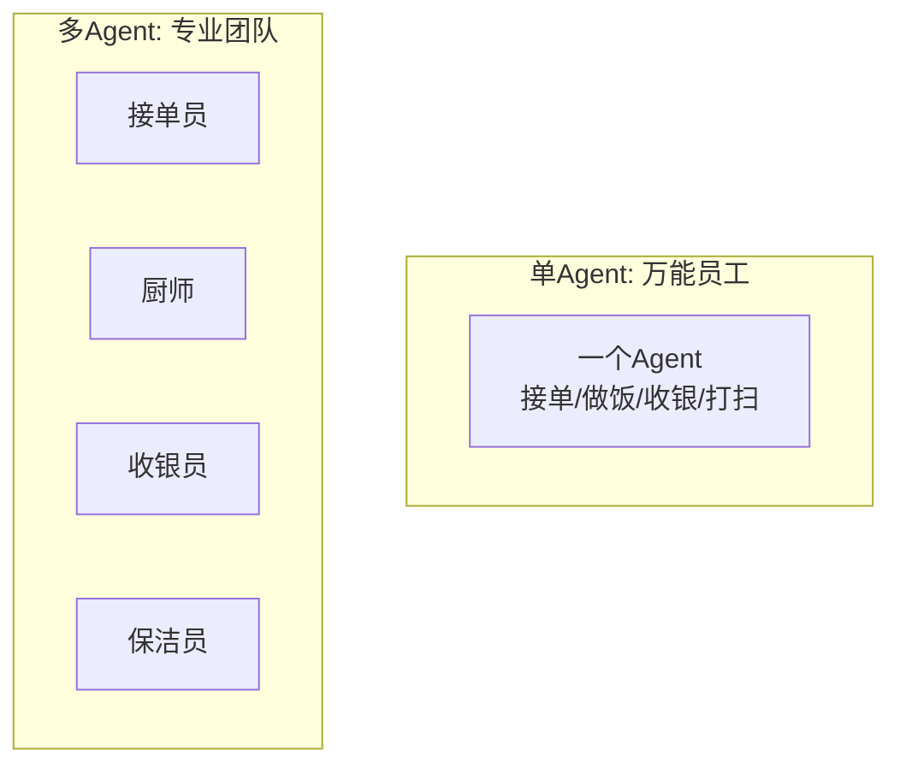
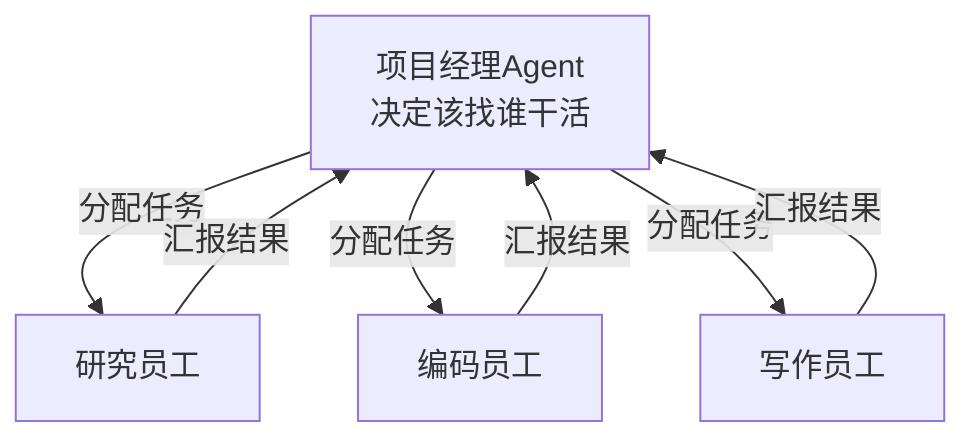
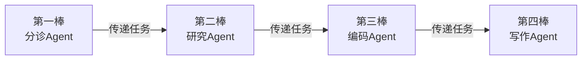
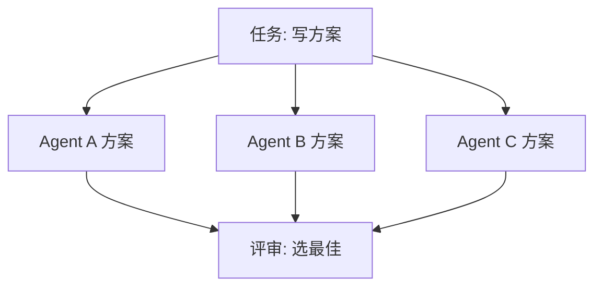
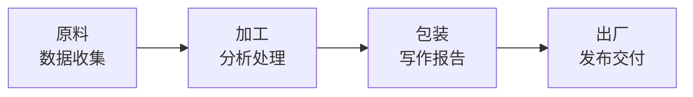
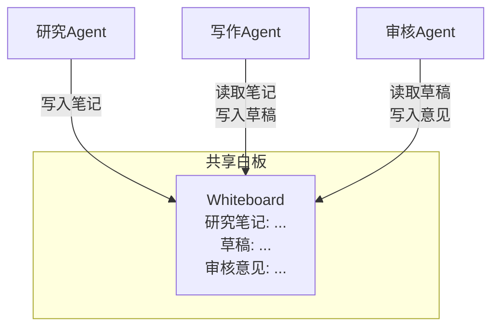
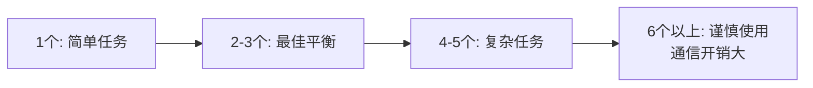

# 第127课：多 Agent 系统入门——从单兵到团队

> **阶段 23 | 第1课 | 方向一：多 Agent 系统架构与通信协议**
> 面向零基础初学者，用生活类比理解多 Agent 系统

---

## 本课目标

学完本课，你将理解：
- 为什么一个 Agent 不够用
- 多 Agent 系统是什么
- Agent 之间如何"对话"
- 四种常见协作方式

---

## 1 从"单打独斗"到"团队作战"

### 生活类比：一个人的餐厅

想象一家餐厅只有你一个人：你要接单、做饭、收银、打扫。你确实能完成所有工作，但：

- **效率低**：做一件事时其他事都得停
- **容易出错**：一心多用难免顾此失彼
- **无法扩展**：客人多了你一个人忙不过来

这就是**单 Agent 系统**的困境：一个 Agent 试图做所有事情，上下文塞满信息，提示词越来越长，效果越来越差。

### 生活类比：专业团队

现在换一个思路：你雇了一个厨师、一个服务员、一个收银员。每个人专注自己的事，效率大幅提升。

这就是**多 Agent 系统**的核心思想：



---

## 2 多 Agent 系统是什么

**多 Agent 系统** = 多个 AI Agent，各司其职，通过消息传递协同完成任务。

每个 Agent 只做自己最擅长的事：
- 研究 Agent：负责信息收集
- 编码 Agent：负责写代码
- 写作 Agent：负责写文档
- 审核 Agent：负责检查质量

### 为什么不用一个大 Agent 做所有事？

| 问题 | 单 Agent | 多 Agent |
|------|---------|---------|
| 上下文窗口 | 塞满所有信息 | 每个 Agent 只看自己需要的 |
| 提示词复杂度 | 一个超长提示词 | 每个提示词简短精准 |
| 出错影响 | 全局受影响 | 只影响一个 Agent |
| 并行能力 | 只能串行 | 多个 Agent 同时工作 |

---

## 3 四种协作方式

### 方式一：主管模式（Supervisor）

就像公司里有一个**项目经理**：



**类比**：你向项目经理说"帮我做一份竞品分析报告"，项目经理会：
1. 先让研究员工收集资料
2. 再让写作员工整理成报告
3. 最后审核一下交付给你

### 方式二：接力模式（Swarm）

就像**田径接力赛**：



**类比**：第一棒跑完把接力棒交给第二棒，没有项目经理指挥，每个 Agent 自己决定下一步交给谁。

### 方式三：竞争模式（Competitive）

就像**方案竞标**：



**类比**：三家公司同时提交方案，评审后选最好的一个。

### 方式四：流水线模式（Pipeline）

就像**工厂流水线**：



**类比**：每个工序按固定顺序串联，上一个的输出是下一个的输入。

---

## 4 Agent 之间怎么"对话"

### 消息的基本结构

Agent 之间的消息就像**邮件**一样，需要有：

```python
# Agent间的"邮件"格式
message = {
    "from": "研究Agent",      # 发件人
    "to": "写作Agent",         # 收件人
    "type": "研究结果",        # 邮件类型
    "content": "我发现...",    # 正文
    "timestamp": "12:30:00"   # 时间戳
}
```

### LangGraph 中的通信方式

在 LangGraph 中，Agent 之间通过**共享状态（State）**通信，就像团队共用一块**白板**：



**类比**：所有 Agent 围着一块白板工作，每个人都能看到白板上的内容，也能在上面写新信息。

### 简单代码示例

```python
from langgraph.graph import StateGraph, END
from typing import TypedDict

# 定义"白板"上有什么
class TeamState(TypedDict):
    topic: str        # 讨论主题
    research: str     # 研究笔记
    draft: str        # 草稿

# 研究Agent：在白板上写研究笔记
def research_agent(state: TeamState):
    return {"research": f"关于{state['topic']}的研究结果..."}

# 写作Agent：读取研究笔记，写草稿
def writer_agent(state: TeamState):
    draft = f"基于研究({state['research']})写的草稿..."
    return {"draft": draft}

# 组装团队
g = StateGraph(TeamState)
g.add_node("researcher", research_agent)
g.add_node("writer", writer_agent)
g.set_entry_point("researcher")
g.add_edge("researcher", "writer")
g.add_edge("writer", END)

team = g.compile()

# 让团队开始工作
result = team.invoke({"topic": "LangGraph", "research": "", "draft": ""})
print(result["draft"])
```

---

## 5 选择建议

### 什么时候用多 Agent

| 场景 | 推荐 | 理由 |
|------|------|------|
| 简单问答 | 单 Agent | 杀鸡不用牛刀 |
| 写一篇文章 | 2-3个Agent | 研究+写作+审核 |
| 开发软件功能 | 4-5个Agent | 需求+编码+测试+审查+文档 |
| 竞品分析报告 | 3-4个Agent | 采集+分析+写作+校对 |

### Agent 数量建议



---

## 本课小结

- 多 Agent 系统就像专业团队，每个 Agent 专注一个角色
- 四种协作模式：主管、接力、竞争、流水线
- Agent 间通过共享状态（白板）通信
- 从 2-3 个 Agent 起步，不要一开始就追求大团队

下节课我们将学习 LangGraph 的三种多 Agent 编排模式。

---

## 课后练习

1. **概念理解**：列举一个生活中的"多 Agent 系统"例子（不限AI领域）
2. **模式匹配**：一个"需求分析→编码→测试→审查"的软件开发流程，适合用哪种协作模式？
3. **动手尝试**：修改上面的简单代码示例，增加一个"审核Agent"节点

---

> **下节预告**：第128课将深入 Supervisor 和 Swarm 两种编排模式的实战。
