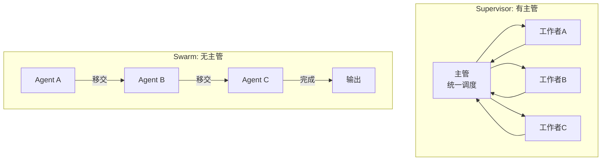
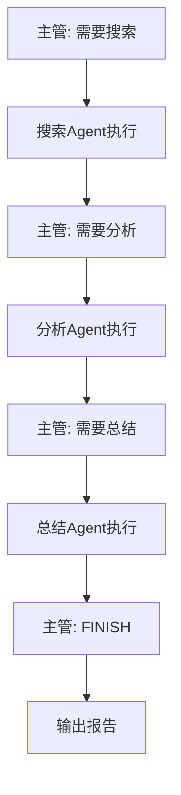
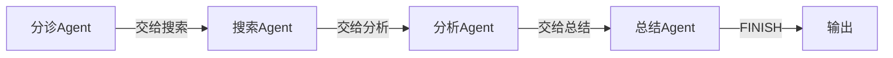
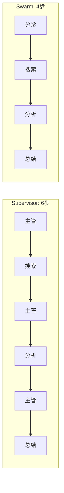

# 第128课：Supervisor 与 Swarm 编排模式实战

> **阶段 23 | 第2课 | 方向二：LangGraph 多 Agent 编排模式**
> 面向零基础初学者，动手实现两种核心编排模式

---

## 本课目标

学完本课，你将：
- 理解 Supervisor 和 Swarm 两种模式的核心区别
- 动手实现一个 Supervisor 模式的多 Agent 系统
- 动手实现一个 Swarm 模式的多 Agent 系统
- 知道什么时候用哪种模式

---

## 1 两种模式回顾



### 一句话区分

- **Supervisor**：有个"老板"统一指挥，所有结果都回到老板这里
- **Swarm**：没有老板，每个 Agent 干完自己的活就把任务"递"给下一个

---

## 2 Supervisor 模式实战

### 场景：研究助手团队

我们要做一个"研究助手团队"：
1. **主管 Agent**：分析请求，决定调用谁
2. **搜索 Agent**：负责信息搜索
3. **分析 Agent**：负责深度分析
4. **总结 Agent**：负责写报告

### 完整代码

```python
from langgraph.graph import StateGraph, END, START
from langchain_openai import ChatOpenAI
from langchain_core.messages import HumanMessage, SystemMessage
from typing import TypedDict, Annotated
from langgraph.graph.message import add_messages

llm = ChatOpenAI(model="gpt-4o-mini", temperature=0)

# 第1步：定义共享状态（团队白板）
class TeamState(TypedDict):
    messages: Annotated[list, add_messages]
    query: str            # 用户问题
    search_result: str    # 搜索结果
    analysis_result: str  # 分析结果
    summary: str          # 最终报告
    next: str             # 下一步调用谁

# 第2步：定义主管Agent
def supervisor(state: TeamState):
    """主管：决定下一步调用谁"""
    response = llm.invoke([
        SystemMessage(content="""你是团队主管。根据用户问题和当前进度，决定下一步:
- "searcher": 需要搜索信息
- "analyzer": 需要分析已有信息
- "summarizer": 需要写总结报告
- "FINISH": 任务完成
只返回名称。"""),
        HumanMessage(content=f"问题: {state['query']}\n搜索: {state.get('search_result', '无')}\n分析: {state.get('analysis_result', '无')}")
    ])
    return {"next": response.content.strip()}

# 第3步：定义工作者Agents
def searcher(state: TeamState):
    """搜索Agent"""
    response = llm.invoke([
        SystemMessage(content="你是搜索助手，提供简洁准确的信息。"),
        HumanMessage(content=f"搜索: {state['query']}")
    ])
    return {"search_result": response.content}

def analyzer(state: TeamState):
    """分析Agent"""
    response = llm.invoke([
        SystemMessage(content="你是分析助手，对搜索结果进行深度分析。"),
        HumanMessage(content=f"分析: {state.get('search_result', '')}")
    ])
    return {"analysis_result": response.content}

def summarizer(state: TeamState):
    """总结Agent"""
    response = llm.invoke([
        SystemMessage(content="你是报告撰写者，整合所有信息写出简洁报告。"),
        HumanMessage(content=f"问题: {state['query']}\n搜索: {state.get('search_result', '')}\n分析: {state.get('analysis_result', '')}")
    ])
    return {"summary": response.content, "next": "FINISH"}

# 第4步：定义路由
def route(state: TeamState):
    nxt = state.get("next", "")
    if nxt == "FINISH":
        return END
    return nxt

# 第5步：组装图
g = StateGraph(TeamState)
g.add_node("supervisor", supervisor)
g.add_node("searcher", searcher)
g.add_node("analyzer", analyzer)
g.add_node("summarizer", summarizer)

g.set_entry_point("supervisor")
g.add_conditional_edges("supervisor", route, {
    "searcher": "searcher",
    "analyzer": "analyzer",
    "summarizer": "summarizer",
    END: END
})
# 每个工作者完成后回到主管
g.add_edge("searcher", "supervisor")
g.add_edge("analyzer", "supervisor")
g.add_edge("summarizer", "supervisor")

app = g.compile()

# 第6步：运行
result = app.invoke({
    "messages": [HumanMessage(content="分析LangGraph多Agent系统")],
    "query": "分析LangGraph多Agent系统",
    "search_result": "",
    "analysis_result": "",
    "summary": "",
    "next": ""
})
print(result["summary"])
```

### 执行流程



---

## 3 Swarm 模式实战

### 同样场景，不同架构

这次没有主管，每个 Agent 自己决定下一步交给谁：

```python
from langgraph.graph import StateGraph, END, START
from langchain_openai import ChatOpenAI
from langchain_core.messages import HumanMessage, SystemMessage
from typing import TypedDict, Annotated
from langgraph.graph.message import add_messages

llm = ChatOpenAI(model="gpt-4o-mini", temperature=0)

class SwarmState(TypedDict):
    messages: Annotated[list, add_messages]
    query: str
    search_result: str
    analysis_result: str
    summary: str
    current: str  # 当前该谁工作

# 分诊Agent：第一个接手，决定交给谁
def triage(state: SwarmState):
    """分诊Agent：判断交给谁"""
    response = llm.invoke([
        SystemMessage(content="你是分诊Agent。决定交给谁: 'searcher'或直接'FINISH'。只返回名称。"),
        HumanMessage(content=f"问题: {state['query']}")
    ])
    return {"current": response.content.strip()}

# 搜索Agent：搜索后决定交给分析Agent
def searcher_swarm(state: SwarmState):
    response = llm.invoke([
        SystemMessage(content="你是搜索助手。搜索后返回结果。"),
        HumanMessage(content=f"搜索: {state['query']}")
    ])
    return {"search_result": response.content, "current": "analyzer"}

# 分析Agent：分析后决定交给总结Agent
def analyzer_swarm(state: SwarmState):
    response = llm.invoke([
        SystemMessage(content="你是分析助手。"),
        HumanMessage(content=f"分析: {state.get('search_result', '')}")
    ])
    return {"analysis_result": response.content, "current": "summarizer"}

# 总结Agent：最终输出
def summarizer_swarm(state: SwarmState):
    response = llm.invoke([
        SystemMessage(content="你是报告撰写者。"),
        HumanMessage(content=f"搜索: {state.get('search_result', '')}\n分析: {state.get('analysis_result', '')}")
    ])
    return {"summary": response.content, "current": "FINISH"}

def route_swarm(state: SwarmState):
    curr = state.get("current", "triage")
    if curr == "FINISH":
        return END
    return curr

# 组装Swarm图
g = StateGraph(SwarmState)
g.add_node("triage", triage)
g.add_node("searcher", searcher_swarm)
g.add_node("analyzer", analyzer_swarm)
g.add_node("summarizer", summarizer_swarm)

g.set_entry_point("triage")
g.add_conditional_edges("triage", route_swarm)
g.add_conditional_edges("searcher", route_swarm)
g.add_conditional_edges("analyzer", route_swarm)

app = g.compile()

# 运行
result = app.invoke({
    "messages": [HumanMessage(content="分析LangGraph")],
    "query": "分析LangGraph",
    "search_result": "", "analysis_result": "", "summary": "", "current": "triage"
})
print(result["summary"])
```

### 执行流程



---

## 4 两种模式对比

### 生活类比

| 维度 | Supervisor | Swarm |
|------|-----------|-------|
| 比喻 | 公司有老板 | 接力赛跑 |
| 决策者 | 主管 | 每个Agent自己 |
| 每步LLM调用 | 2次（主管+工作者） | 1次（当前Agent） |
| 调试难度 | 容易（看主管决策） | 较难（路径不固定） |
| 成本 | 较高 | 较低 |

### 性能对比



Supervisor 每步多一次主管决策，但全局控制更强。

---

## 5 选择建议

### 用 Supervisor 当...

- 任务有明确的分工和顺序
- 需要全局视角决定下一步
- Agent 数量多（4个以上）
- 需要精确控制流程

### 用 Swarm 当...

- 任务在不同 Agent 间自然流转
- 每个 Agent 能自己判断下一步
- Agent 数量少（2-3个）
- 追求更快的执行速度

---

## 本课小结

- Supervisor 模式：主管统一调度，每个工作者完成后回到主管，适合有明确分工的场景
- Swarm 模式：Agent 间直接移交，没有主管，适合任务自然流转的场景
- Supervisor 更可控但成本更高，Swarm 更快但调试较难
- 实际项目可以混合使用

---

## 课后练习

1. **模式选择**：一个"翻译→校对→排版"的任务，用哪种模式更好？为什么？
2. **代码修改**：在 Supervisor 示例中增加一个"审核Agent"，在总结之前检查分析质量
3. **对比思考**：如果 Agent 数量增加到 6 个，Supervisor 和 Swarm 各有什么问题？

---

> **下节预告**：第129课将学习如何将 Agent 部署为独立的远程服务。
