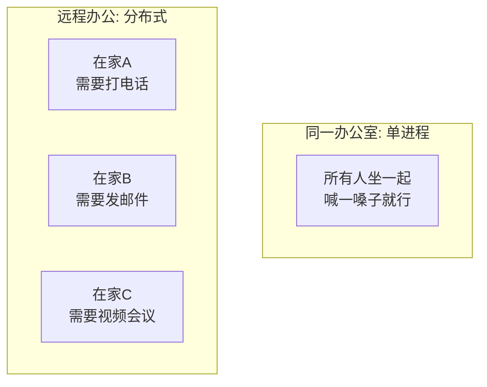
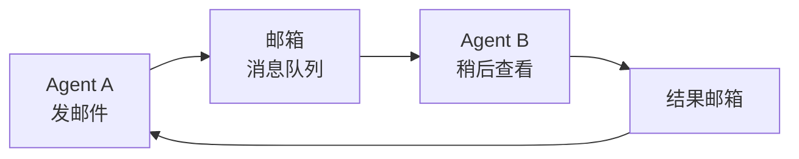
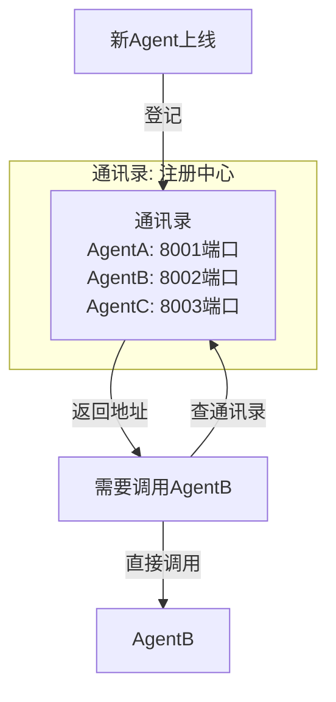
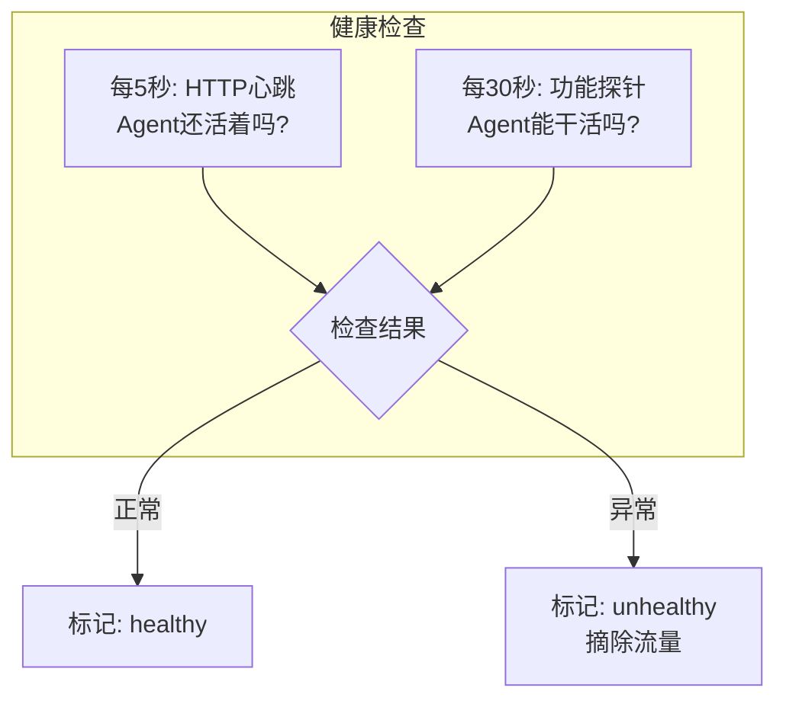
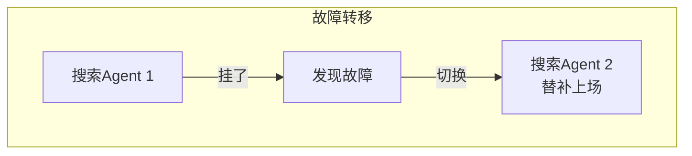

# 第129课：分布式 Agent 部署入门实战

> **阶段 23 | 第3课 | 方向三：分布式 Agent 部署与远程通信**
> 面向零基础初学者，理解为什么要"分开部署"Agent

---

## 本课目标

学完本课，你将：
- 理解为什么要把 Agent "分开部署"
- 知道 Agent 远程通信的基本方式
- 了解注册中心和健康检查的概念
- 看懂一个简单的分布式 Agent 示例

---

## 1 为什么要"分开部署"

### 生活类比

想象你的团队从"同一个办公室"搬到了"远程办公"：



**同一进程的好处**：简单，直接调用函数
**同一进程的问题**：
- 一人崩溃全员陪葬（进程崩溃）
- 只能用一种语言（比如Python）
- 无法独立扩容

**分布式部署的好处**：
- 每个 Agent 独立运行，互不影响
- 可以用不同语言（Python、Go、JavaScript）
- 可以单独扩容（搜索Agent忙了就多部署几个）

---

## 2 Agent 怎么远程通信

### 方式一：HTTP API（最常用）

就像"打电话"：

```python
# Agent A 拨打电话给 Agent B
import httpx

async def call_remote_agent():
    async with httpx.AsyncClient() as client:
        # 拨号：发送请求
        response = await client.post(
            "http://localhost:8001/research",
            json={"topic": "LangGraph"}
        )
        # 接听：收到回复
        return response.json()
```

### 方式二：消息队列（异步）

就像"发邮件"：



### 方式对比

| 方式 | 比喻 | 速度 | 复杂度 |
|------|------|------|--------|
| HTTP API | 打电话 | 快 | 低 |
| gRPC | 专线电话 | 很快 | 中 |
| 消息队列 | 发邮件 | 慢 | 高 |
| MCP | 标准化工具箱 | 中 | 低 |

---

## 3 注册中心：Agent的"通讯录"

### 生活类比

你搬到了新办公室，同事怎么知道你的电话？需要一个**通讯录**。



### 注册中心做什么

1. **登记**：Agent 上线时报告自己的地址和能力
2. **查询**：需要调用 Agent 时查通讯录
3. **心跳**：定期检查 Agent 是否还活着
4. **清理**：挂掉的 Agent 从通讯录移除

---

## 4 简单示例

### 创建一个远程研究Agent

```python
# research_agent.py - 一个独立的Agent服务
from fastapi import FastAPI
from pydantic import BaseModel
from langchain_openai import ChatOpenAI

app = FastAPI(title="Research Agent")
llm = ChatOpenAI(model="gpt-4o-mini", temperature=0)

class Request(BaseModel):
    topic: str

class Response(BaseModel):
    topic: str
    result: str

@app.post("/research", response_model=Response)
async def research(req: Request):
    """研究Agent的HTTP接口"""
    result = llm.invoke([
        {"role": "system", "content": "你是研究助手，简洁回答。"},
        {"role": "user", "content": f"研究: {req.topic}"}
    ])
    return Response(topic=req.topic, result=result.content)

@app.get("/health")
async def health():
    """健康检查"""
    return {"status": "ok"}

# 启动: uvicorn research_agent:app --port 8001
```

### 在 LangGraph 中调用远程Agent

```python
# orchestrator.py - 编排器调用远程Agent
import httpx
from langgraph.graph import StateGraph, END
from typing import TypedDict

class State(TypedDict):
    topic: str
    research: str
    final: str

async def call_remote_research(topic: str) -> str:
    """调用远程研究Agent"""
    async with httpx.AsyncClient(timeout=30) as client:
        resp = await client.post(
            "http://localhost:8001/research",
            json={"topic": topic}
        )
        return resp.json()["result"]

async def research_node(state: State):
    """在LangGraph中调用远程Agent"""
    result = await call_remote_research(state["topic"])
    return {"research": result}

def final_node(state: State):
    return {"final": f"基于研究: {state['research']}"}

# 组装
g = StateGraph(State)
g.add_node("research", research_node)
g.add_node("finalize", final_node)
g.set_entry_point("research")
g.add_edge("research", "finalize")
g.add_edge("finalize", END)
app = g.compile()
```

---

## 5 健康检查：Agent 的"打卡"

### 生活类比

公司要求员工每天打卡，确保人在线。Agent 也需要"打卡"：



### 简单的健康检查代码

```python
import httpx
import asyncio

async def check_agent_health(url: str) -> bool:
    """检查Agent是否健康"""
    try:
        async with httpx.AsyncClient(timeout=5) as client:
            resp = await client.get(f"{url}/health")
            return resp.status_code == 200
    except Exception:
        return False

async def periodic_check(url: str, interval: int = 30):
    """定期检查"""
    while True:
        ok = await check_agent_health(url)
        status = "healthy" if ok else "unhealthy"
        print(f"Agent {url}: {status}")
        await asyncio.sleep(interval)

# asyncio.run(periodic_check("http://localhost:8001"))
```

---

## 6 故障转移：Agent 的"替补"

### 生活类比

如果负责搜索的 Agent 挂了怎么办？需要有替补：



### 简单实现

```python
async def call_with_failover(urls: list, request: dict) -> dict:
    """带故障转移的调用：依次尝试多个Agent"""
    for url in urls:
        try:
            async with httpx.AsyncClient(timeout=10) as client:
                resp = await client.post(f"{url}/research", json=request)
                if resp.status_code == 200:
                    return resp.json()
        except Exception as e:
            print(f"Agent {url} failed: {e}")
    
    raise Exception("所有Agent都不可用")

# 部署了3个搜索Agent，一个挂了还有备用
# await call_with_failover([
#     "http://localhost:8001",  # 主力
#     "http://localhost:8002",  # 备用1
#     "http://localhost:8003",  # 备用2
# ], {"topic": "LangGraph"})
```

---

## 7 部署方式速览

### Docker Compose（最简单）

```yaml
# docker-compose.yml
version: "3.8"
services:
  research-agent:
    build: ./agents/research
    ports: ["8001:8001"]
    environment:
      - OPENAI_API_KEY=${OPENAI_API_KEY}
    deploy:
      replicas: 2  # 部署2个副本

  code-agent:
    build: ./agents/code
    ports: ["8002:8002"]
    environment:
      - OPENAI_API_KEY=${OPENAI_API_KEY}
```

**类比**：就像一份"开店计划"，指定开几家店、每家店用什么配置。

---

## 本课小结

- 分布式部署 = 每个 Agent 独立运行，互不影响
- Agent 间通信：HTTP API 最常用，消息队列适合异步
- 注册中心 = Agent 的通讯录，负责发现和健康检查
- 故障转移 = 有替补 Agent 顶上，提高可靠性
- Docker Compose 是最简单的部署方式

---

## 课后练习

1. **概念理解**：用你自己的话解释"分布式 Agent"和"单进程多 Agent"的区别
2. **方案选择**：一个需要 7×24 小时运行的客服 Agent 系统，应该用单进程还是分布式？为什么？
3. **动手尝试**：运行本课的 FastAPI 示例，看看能不能成功启动一个远程 Agent

---

> **下节预告**：第130课将通过完整案例，把多 Agent 系统的所有知识串起来。
